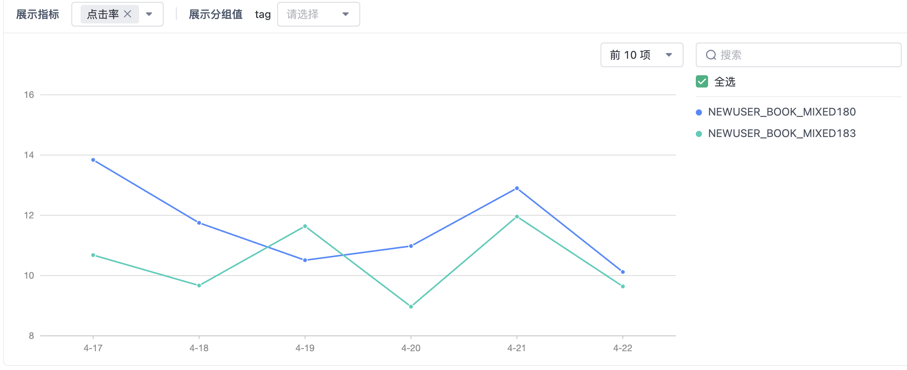
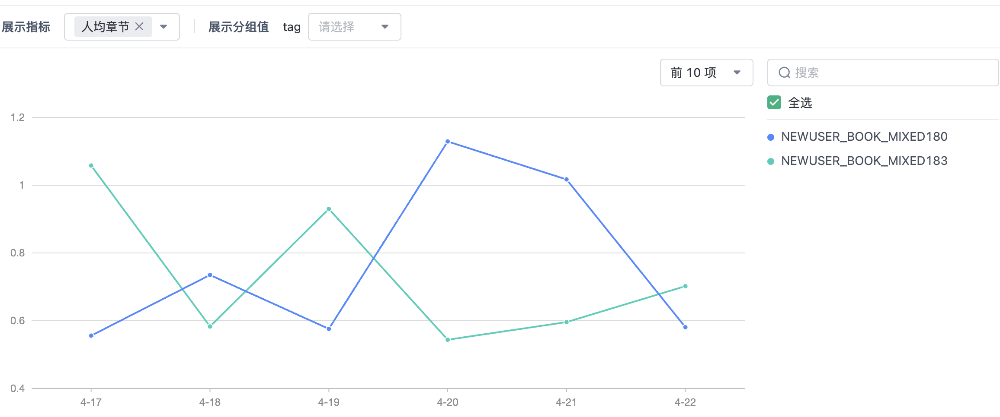

# Rankmixer

## 新用户属性

```
uid = 133377285
usepackageid =
usechannel =
age = 0
gender = 0
register_days = 0
country =
province =
city =
os =
manufacturer =
model =
likemarks =
dislikemarks =
searchwords =
applist =
readbooks =
deep_read_books =
shallow_read_books =
readpunch =
collect_books =
is_bind_user = 0
user_level = 0
is_member = 0
readbooks_count = 0
deep_read_books_count = 0
shallow_read_books_count = 0
likemarks_count = 0
readpunch_count = 0
appVersion =
deviceId =
firstLikeMarks =
lastLoginTime = 0
memberEndTime =
networkType =
top_read_books =
all_read_books =
read_search_keywords_books_day_last =
read_mark_search_books_day_last =
read_mark_recommend_books_day_last =
read_books_day_last =
read_search_keywords_books_day_7 =
read_mark_search_books_day_7 =
read_mark_recommend_books_day_7 =
read_books_day_7 =
read_search_keywords_books_day_30 =
read_mark_search_books_day_30 =
read_mark_recommend_books_day_30 =
read_books_day_30 =
readbooks_cc =
top_readbooks_cc =
```

```
uid = 133375596
usepackageid =
usechannel =
age = 0
gender = 2
register_days = 0
country =
province =
city =
os =
manufacturer =
model =
likemarks = UNK
dislikemarks =
searchwords = 朱苏
applist = UNK
readbooks = 14219991,13525362,13792881,14047749,14244164,14223594,13468817
deep_read_books = 14219991,14244164,14223594,13792881,13525362
shallow_read_books =
readpunch = UNK
collect_books = 14219991,14244164,14223594,13468817
is_bind_user = 0
user_level = 0
is_member = 0
readbooks_count = 7
deep_read_books_count = 0
shallow_read_books_count = 0
likemarks_count = 0
readpunch_count = 0
appVersion =
deviceId =
firstLikeMarks =
lastLoginTime = 0
memberEndTime =
networkType =
top_read_books =
all_read_books =
read_search_keywords_books_day_last = 朱苏:13468817:1,
read_mark_search_books_day_last =
read_mark_recommend_books_day_last =
read_books_day_last = 14219991:47,13525362:4,13792881:14,14047749:2,14244164:28,14223594:24,13468817:1
read_search_keywords_books_day_7 =
read_mark_search_books_day_7 =
read_mark_recommend_books_day_7 =
read_books_day_7 =
read_search_keywords_books_day_30 =
read_mark_search_books_day_30 =
read_mark_recommend_books_day_30 =
read_books_day_30 =
readbooks_cc = 14219991:43,13525362:4,13792881:13,14047749:2,14244164:24,14223594:22,13468817:1
top_readbooks_cc = 14219991:43,14244164:24,14223594:22,13792881:13,13525362:4,14047749:2,13468817:1
```


## 第一版

在新用户场景下开发rankmixer，替换原先的DCNV2（DCNv2+FM组合模型），tokens数量为8，特征数量为12，特征维度选择64，最初实现的版本中不包括MoE，未使用用户兴趣建模只是简单的平均。

线上分20%的流量测试了一周，点击率明显提升：**11.148%**->**11.964%** ，0.8%，数值的提升较为稳定；人均章节有所波动，基本持平： **0.856** ->**0.862**


## 第二版

增加特征wordcount分桶处理，删除无用的bookword特征。

人均章节有所提升：**0.73**->**0.82** ；但是点击率下降 **10.675%** ->**10.479%**


## 第三版

在第二版的基础上使用Din模块对用户兴趣建模，离线指标AUC大幅上升：**0.7513（第一版）->0.8501**

在线测试4天点击率下降**11.683%**->**10.427%**，人均章节下降**0.766**->**0.736**，与离线测试不符。






检查线上部分，发现有问题

1. readbooks特征读成read_books导致返回默认值，导致字段为全0。

2. 线上bookname与bookinfo未使用jieba进行分词（之前遗留Bug），而训练时用的是分词后的结果
3. 线上用户历史序列处理有误，likemarks  raw : UNK，processed: ['U', 'N', 'K', 'UNK', 'UNK', 'UNK', 'UNK', 'UNK']；raw : 宋亚轩白切黑，processed: ['宋', '亚', '轩', '白', '切', '黑', 'UNK', 'UNK']                                                                                                 
4. 线上实时部分有误，用户当日的点击和搜索没有进入readbooks和searchwords，这里手动合并。


修复后效果仍然很差，大概是因为新用户场景下，用户的历史行为十分稀疏，大部分用户能利用到的信息只有uid，Din模块反而引入了噪声。

## 第四版

在第二版的基础上引入了更多的特征，包括用户特征和物品统计特征，总用22个特征，其他部分不变。

与第三版存在同样的线上问题。

在做特征工程的时候发现，wordcount字段的分桶如果按照impression_wordcount和negative_wordconut单独计算四分位数，离线指标比用全量的书的wordcount计算四分位数要好很多。（**0.9061** VS **0.7584**）


人均章节：**0.728->0.748 **；点击率 **11.302% ->12.328%**，点击率有较大的提升，上线

## 第4.1版

在第四版的基础上参数的扩大一倍，效果下降

人均章节：**1.075**->**1.049** ；点击率 **12.109%** ->**11.724%**


## 第五版

在第四版的基础上做多任务，增加一个头预测人均章节，使用Grandnorm算法调整两个损失的权重，排序得分以CTR为主，用人均章节调整——score = ctr_prob * (1.0 + lambda_chapter * chapter_log)。

实际上效果很差，但是可以瞎编，一开始人均章节有所提升，但是点击率下降，因此调整了一下lambda_chapter参数，后来点击率涨回来了。

人均章节：**1.075**->**0.861** ；点击率 **12.109%** ->**11.529%**


