# 话本小说实习

能自由支配的流量在新用户（注册日期<=3），老用户的流量在mentor手上

公司有自己的后台调配模型，切换策略；使用神策看数据；云效跑流水线，模型天级更新，一次大概需要9个小时，从凌晨2点开始；GPU是租的腾讯的4090；

主要工作是：开发模型，修改模型结构（模型中有一些不完善的设计），修改损失函数，往模型里加特征，修改样本构建策略，产品侧的需求（修改内容池子，看某个指标深度阅读之类的）

## 第一周

- 熟悉代码，环境，配置，基本操作

- 在dcnv2（新用户推荐排序模型）中删除uid特征，短期内人均点击章节提升0.1，点击率提升0.5%，长期观察效果波动。效果略有下降，下线。

- 在graphfmv3（老用户推荐模型）中删除uid特征，效果不好，有所下降，下线。

## 第二周

- 尝试在graphfmv3中使用Din模型对用户序列建模，出现过拟合问题，使用dropout+正则化提升了离线正确率0.6，但是依然达不到原模型指标0.8
- 将tptv模型中embedding拼接方式（book chapter word）从加和改为用全连接层拼接，效果有明显好转，人均章节：**16.041->17.225**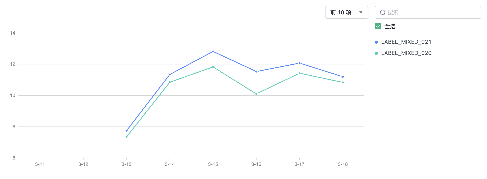
- 修改双塔模型负采样策略，从全局简单负采样->3成曝光未点击:7成全局随机负采样，效果不好

## 第三周

- 修改双塔模型负样本采样策略，从全局简单负采样->热度分布，流量不够，暂缓测试

- 修改双塔模型损失函数（与上面划分了两个版本），从batch内负采样与现实负样本混合->纯batch负采样，流量不够，暂缓测试

- 新用户召回模型增加week特征，点击率下降较大，人均章节略有提升，流量不够，下线。

- 排序模型dcn修改负采样策略，全局随机抽样->曝光未点击，离线指标下降（负样本变困难），在线指标明显提升。点击率有所提升，但是人均章节波动明显并且与对照模型呈现相反的趋势。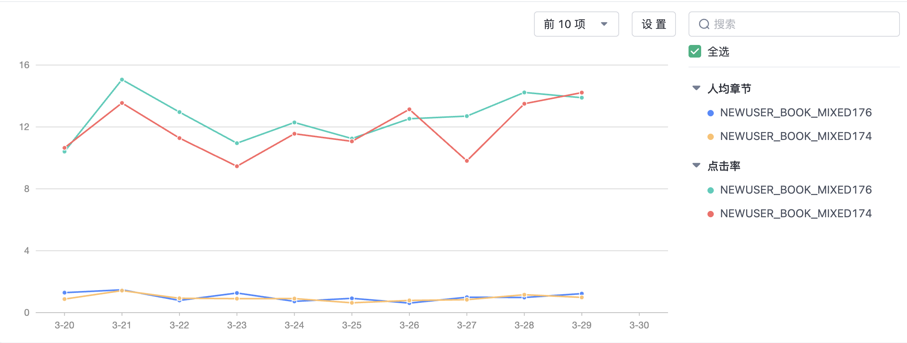 人均章节 **0.98**->**1.036**  点击率 **12.27%**->**13.04%** 人均章节波动诡异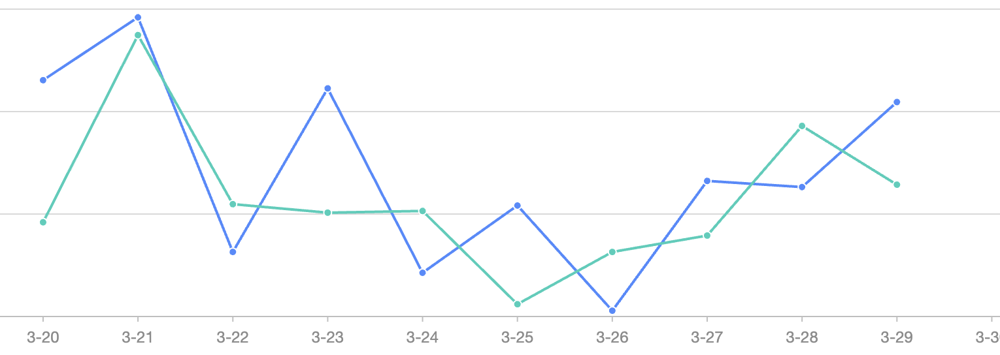

  

- 三塔模型修改损失函数，改为纯bpr_loss，用户-书，用户-标签，标签-书的损失原先是简单相加，这里手动设置0.7,0.1,0.2的权重，在线指标提升明显。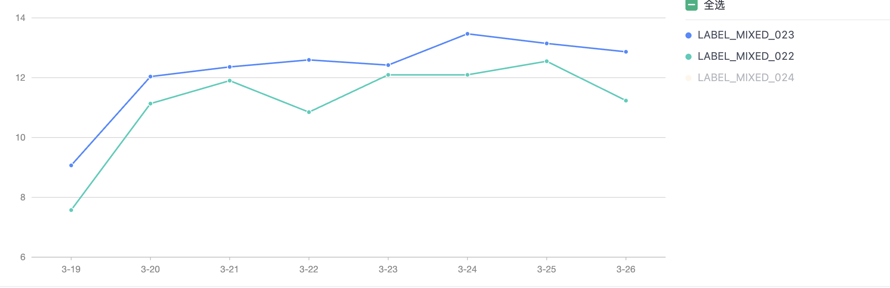 人均章节：**19.398**-> **20.828**

## 第四周

+ 三塔模型损失函数权重添加自学习版本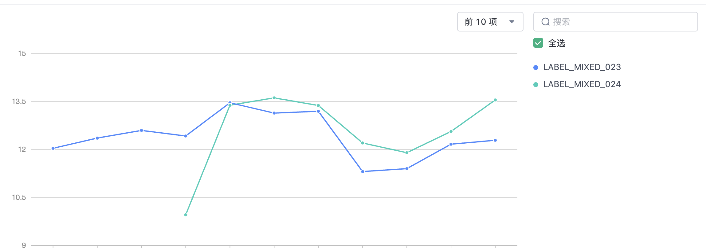 人均章节 **20.669**->**21.563** 上线

+ 开发MGDIN排序模型，结果不好，实际上这个模型的离线指标也不如dcnv2b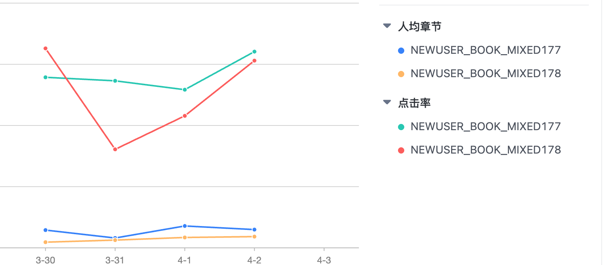人均章节 **1.111**->**0.559** 点击率 **11.39%**->**9.42%**，这个模型未开源，只能自己实现，可能是实现的问题，也可能是模型不适用于当前场景（本身也是略微优于dcn)

+ 修改graphfmv3损失函数以及负采样策略，在标签推荐上测试，指标下降？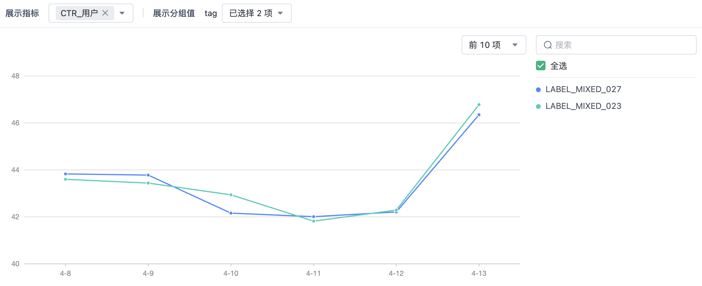点击率下降了**1%**不到

+ 参考ttv21修改ttv14new模型结构(新书推荐, ttv15new，用户塔加入transformer encoder) 提升明显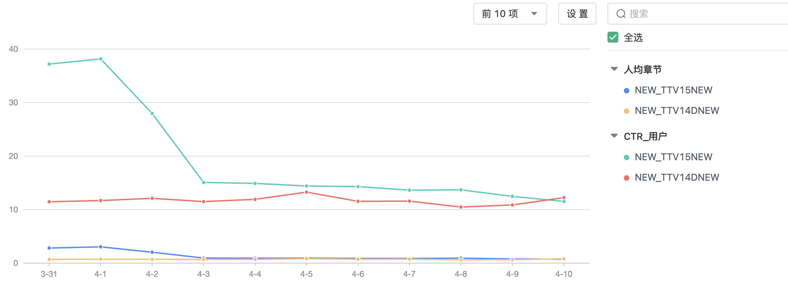人均章节 **2.26-**>**3.47** 点击率 **22.17%**>**29.85%**

  

## 第五周

+ 三塔模型参考ttv21引入transfomers，效果波动，平均指标有所下降，下线

+ 新用户模型引入UIE尝试优化冷启动，实现有误，下线

+ 开发rankmixer，最基础的版本，没有Din，没有MoE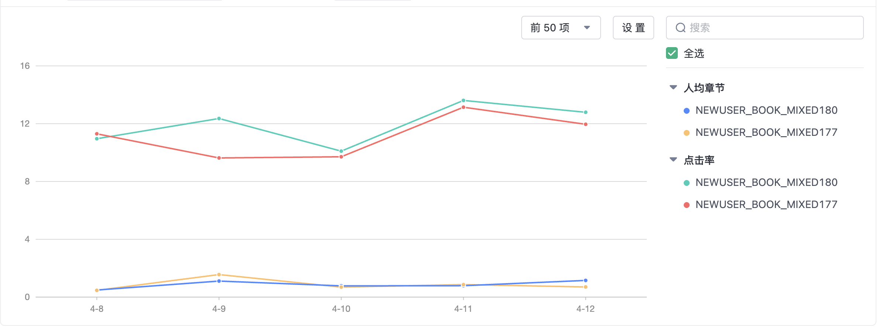点击率明显提升：**11.148%**->**11.964%** ；人均章节波动，基本持平： **0.856** ->**0.862**

  

## 第六周

+ 修改newusermind模型物品向量构建，原先只由ID得到物品向量，现在组合多个物品特征经过物品塔，效果非常不好，点击率**18.63%%**->**16.318%** ；人均章节：**2.091** ->**1.895**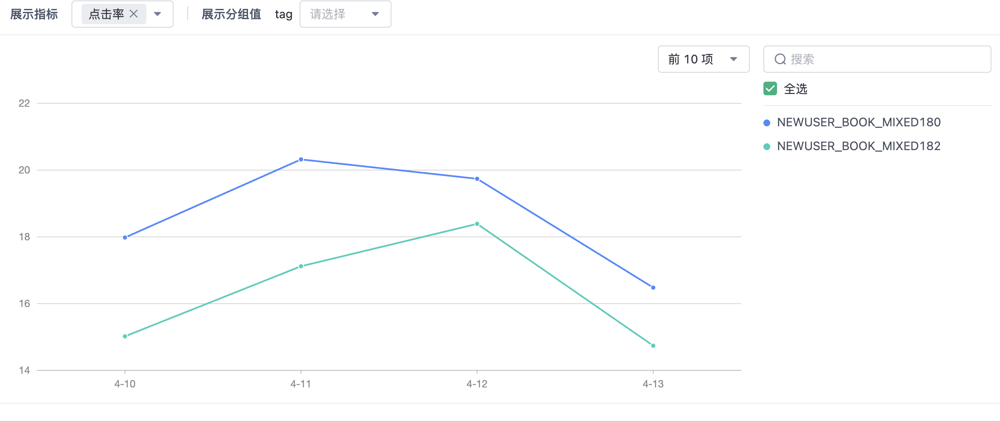

+ 调优rankmixer模型，删除无用特征bookword，加入wordcount，register_time修复（原先没正确加入，被全0补充）。人均章节有所提升：**0.738->0.82 **；但是点击率下降 **10.675% ->10.479%**。

  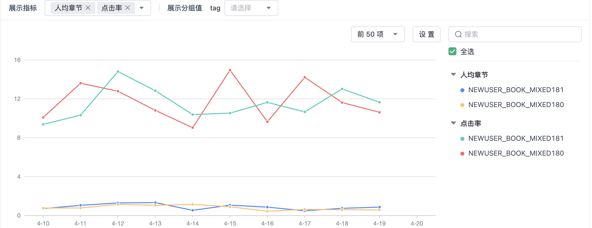

  

## 第七周

+ 新书推荐引入jina向量，训练开销太大，放弃
+ 修复新用户线上特征构造的错误
+ 新用户排序模型特征工程，使用更多的特征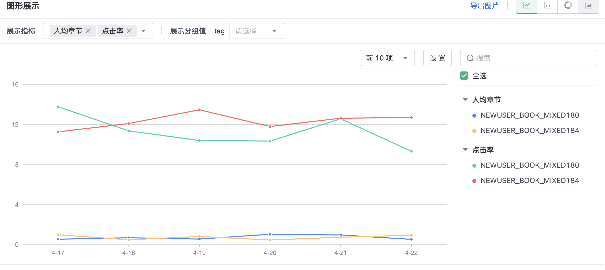人均章节：**0.728->0.748 **；点击率 **11.302% ->12.328%**。
+ 尝试构建AutoInt模型

## 第八周

+ 修复排序模型线上服务bug
+ 优化新书推荐模型，去除了聚类向量，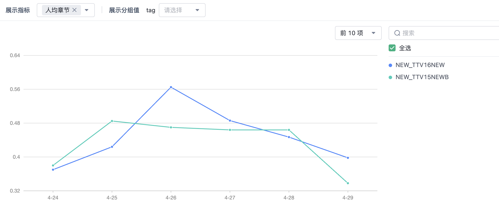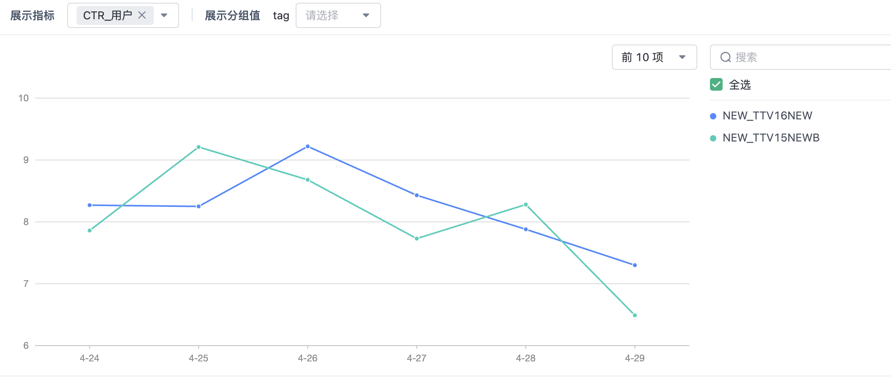人均章节：**0.434->0.448 **；点击率 **8.042% ->8.225%**，结果证明 聚类向量的用户不大，而且会延长训练时间(1H)

## 第九周

+ 摸鱼
+ 新用户排序模型做多任务，尝试提升人均章节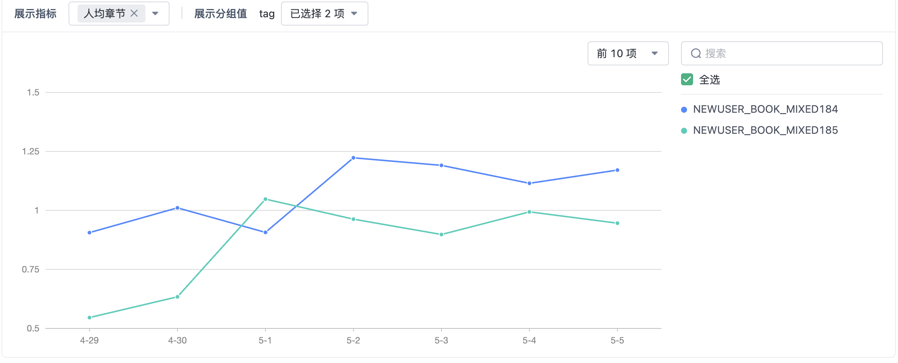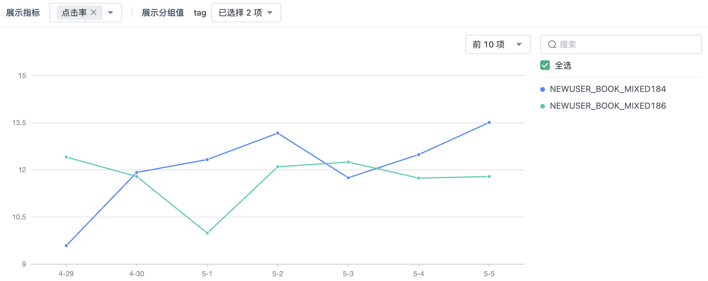人均章节：**1.075**->**0.861** ；点击率 **12.109%** ->**11.529%**，效果非常差
+ 新用户排序模型参数的扩大一倍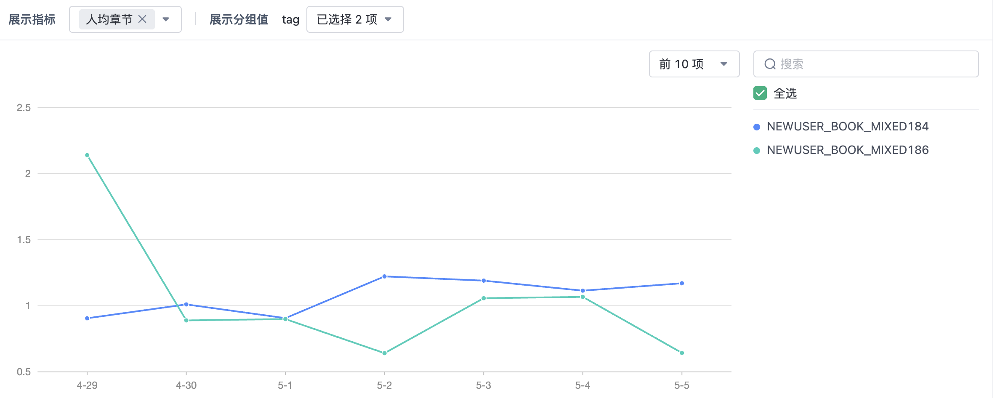人均章节：**1.075**->**1.049** ；点击率 **12.109%** ->**11.724%**，效果下降

## 第十周

+ 召回双塔采样策略修改，按照石塔西的帖子实现：正样本中对热门物品降采样，负样本中过采样。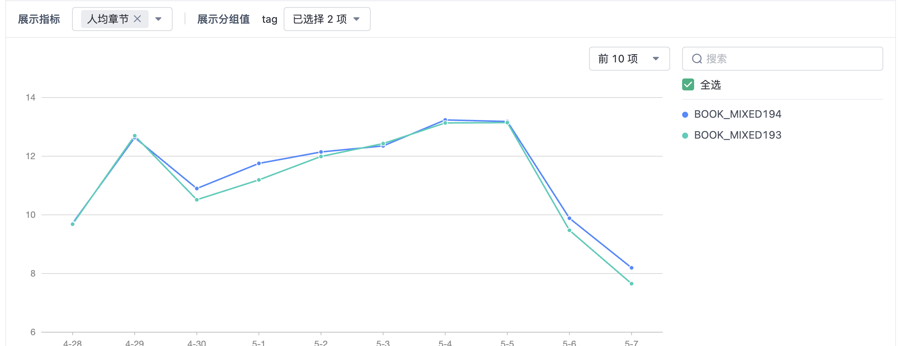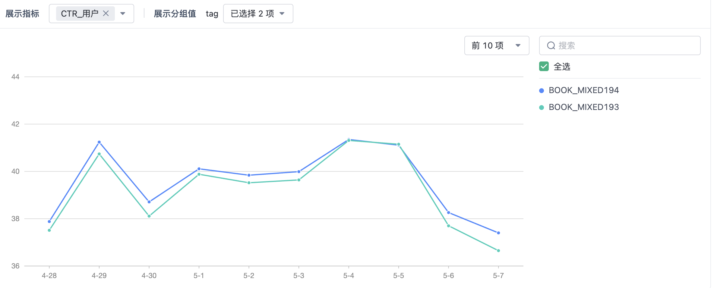人均章节：**11.582**->**11.753** ；点击率 **39.497%** ->**39.823%**，两个指标均有所提升，点击率的提升较为稳定，上线。
+ 新用户参考MMOE结构（专家使用Rankmixer block）做多任务学习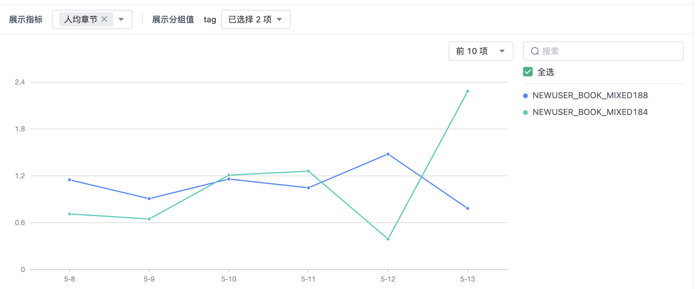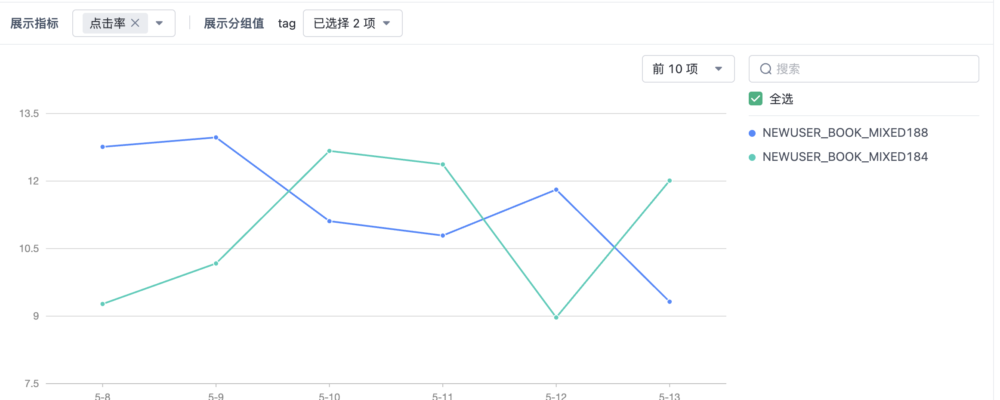
+ 新书推荐物品侧增加更多的可用特征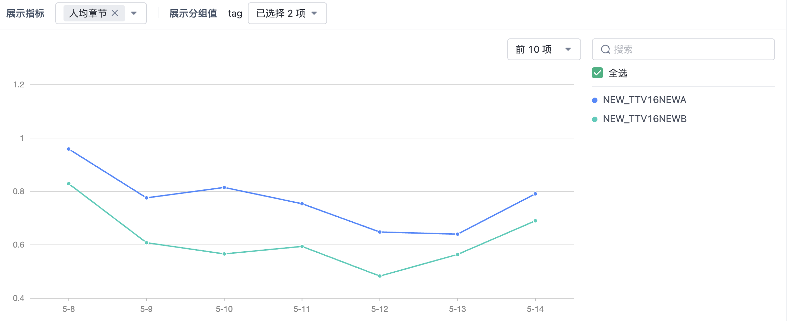人均章节：**0.619**->**0.769** ；点击率 **10.601%** ->**12.24%**，有稳定的提升
+ 新用户和标签推荐加入ai_mark和ip特征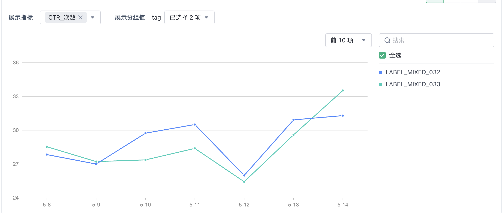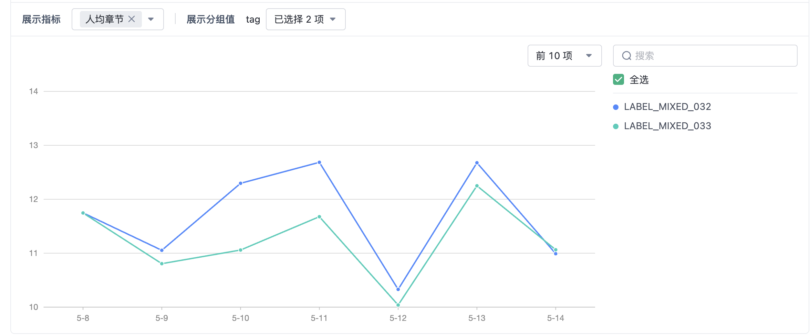标签推荐效果不好，新用户侧没有流量测试

## 第十一周

+ 模型收尾
+ 摸鱼写毕设PPT
