#  概要

## 定义

推荐系统可以被定义为：**对于某个用户，在特定的场景下，针对海量的物品信息构建一个函数，函数预测用户对特定候选物品的喜好程度，再根据喜好程度对所有物品进行排序，生成推荐列表。**

推荐系统是一个应用属性很强的领域，需要使用各种各样的技术，**推荐模型只是推荐系统中的一个模块**，而非全部，为了让模型能够正常运行，发挥作用，推荐系统中需要以下众多模块协同工作：

1. 日志系统收集用户反馈，为推荐系统提供原始数据；
2. 大数据系统、流式计算系统从原始数据中提取信息，将它们加工成模型所需的形式
3. 在线学习系统及时更新模型
4. 监控系统让我们观察模型运行是否正常，并且能够自动报警
5. A/B实验系统评估模型效果，并且能够动态配置、改变推荐系统的运行方式

## 推荐系统指标

**北极星指标**

- 用户规模：**日活用户数DAU**——一天内多次使用只算一次日活，**月活用户数MAU**——一月内登录多次使用只算一次月活。
- 消费：**人均使用推荐的时长，人均阅读笔记的数量**
- 发布：**发布渗透率，人均发布量**


**日活用户和留存**是最核心的指标，**UGC**的应用会将**发布量和发布渗透率**也作为核心指标。


工业界常用**LT7和LT30**衡量留存，LT7指的是用户在某一天登陆了应用，**包括这一天的未来一周内的登录次数/7**就是用户这一天的LT7值。所有**用户LT7值的平均**就是系统某一天的LT7结果。


## 实验流程


离线实验：收集**历史数据**，在历史数据上做**训练，测试**。**算法没有部署到产品中，没有跟用户交互。**

小流量AB实验：把**算法部署到实际产品**中，用户实际跟算法做**交互**。用户分为**实验组和对照组，实验组用新策略，对照组用旧策略**，比较实验组是否**优于**对照组，如果优于则可以**加大流量最终推全。**


## 推荐系统的链路


- 召回：用多条通道，取回几千篇笔记
- 粗排：用小规模神经网络给笔记打分，选出分数最高的几百篇
- 精排：用大规模神经网络，给几百篇笔记打分
- 重排：做多样性抽样，规则打散，插入广告和运营笔记


## 大数据架构


以视频推荐为例，为了让模型了解每个视频的受欢迎程度，需要计算每个视频的点击率CTR。计算CTR有3方面的难点

1. 为了保证统计结果的**有效性**，需要将统计窗口拉大，比例统计过去一周每个视频的CTR，**但是要回溯的历史越长，所涉及到的计算量就越大**。
2. 此外线上做预测的**时间非常紧张**，留给所有特征的准备时间不会超过10ms。
3. 由于Hadoop分布式文件系统(HDFS)**只支持批量数据读写**，因此**有许多即时的用户行为还没来得及组成用户日志或落盘到HDFS**，导致出现冷热数据的时间差，只能用到**过时的数据**。


为了应对大数据系统的复杂性，lambda架构应运而生

+ **将数据请划分为分别针对冷热数据的两个子请求**
+ **针对冷数据的请求，由离线曾批量完成计算，其结果由近线层缓存并提供快速查询**
+ **针对热数据的请求，由在线层基于流式算法进行处理**
+ **汇总冷热数据的结果，一般是将两个指标都喂给模型，使模型具备不同时间维度的视角**


离线层：**启动小时级的定时任务，每个小时都向前回溯一周的用户行为日志，统计数据。**

近线层：**将离线层计算后的结果导入键值型数据库，加速访问。**

在线层：**使用Flink，Storm等流式计算框架，对接用户的行为数据流，不等数据落地就直接进行分析，计算结果也缓存到键值数据库中。**


## 推广搜

推广搜是互联网业务的三驾马车，其中推荐与搜索负责**留住用户，生产流量**，而广告负责**将流量变现**。


三者的共同点如下

1. 在功能架构上，三者都遵循**”先召回粗筛，再由排序精挑细选“**
2. 在数据架构上，三者都遵循**Lambda架构**
3. **许多算法和技术在三个领域是互通的**
4. 推广搜都需要**高度个性化**，搜索不能单纯的返回关键词相关的物料，还要考虑用户画像；广告不能满足用户的需求只会浪费金钱。


推荐和搜索最大的差异在于**用户表达其意图的方式不同**，搜索中，用户通过输入查询语句显示表达其意图

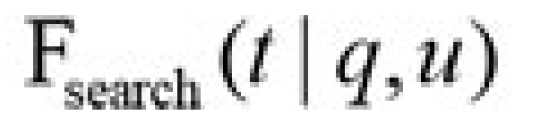

其中，**t是物料，q是查询语句，u是用户**，模型衡量物料对用户输入的查询的匹配程度，这里考虑了用户信息，因此**不同的用户使用相同的查询语句得到的结果是不同的**。


而推荐系统中用户无需现实表达其意图，推荐系统通过自己的长期观察，猜测用户意图，完成推荐。

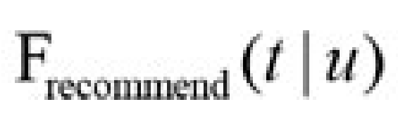


此外，**搜索对推结果的准确性要求更加严格**，例如对多个查询条件搜索时，需要考虑标签的并集


在推荐中，系统会对结果扩展


广告是为了流量变现，需要兼顾**用户，广告主，平台**三方的利益，参与方更多更复杂，优化难度更高。

广告关注的目标是**更深层次的转化**，它的**转换链很长**，例如对于电商app广告，一次完成的转化包括：用户点击广告、下载安装App、注册、成功下单。**这会带来严重的延迟反馈问题，能成功转换的样本较为稀疏，建模难度高**。

此外，**广告对指标的精度要求高**，因为广告费用的计算与指标相关，微小的误差会带来损失，而推搜中只要求**相对准确性**——能排名即可。

最后，**广告的候选集会小很多**，因为投放广告存在一定的技术和财力上的门槛。


# 特征工程

现如今的深度学习网络(DNN)，被认为可以当作**万能函数模拟器**，包括但不限于自动模拟特征工程。但越来越多的实践证明DNN的**局限性**——在现实的训练中会出现梯度爆炸，梯度消失，**不同特征受训机会不均衡等问题**，同时DNN会带来**时间上的代价**，因此用**DNN取代特征工程为之过早**。

## 特征提取

物料包括的特征有

+ **物料属性**，在物料入库时就能获取到，在大型推荐系统中，**物料的ID也是重要的特征**
+ **物料的类别和标签，不依赖用户反馈，只通过分析物料内容就能得到，一般由专门的算法获取**
+ **基于内容的Embedding**，用模型（CNN或BERT）的某一层输出作为物料特征
+ **物料的动态画像**，即后验统计数据，按照时间（全生命周期、过去一周）或对象（CTR、平均播放进度、排名）划分
+ **用户给物料反向打标签，将消费过某个物料的用户身上的标签传递并积累到物料上**


用户的特征有

+ 用户的**人口属性**
+ **对用户的行为序列建模**
+ **交叉特征**，交叉的方式有笛卡尔积交叉和内积交叉
+ **偏差特征**，一些推荐的物品由于推荐位置**靠后**使得没有被点击从而被当作负样本，这种误差会诱导模型。一种解决方案是从数据入手，比如**更严格地定义正负样本**，以**Above Click**为例，**只有位于被点击物料上方的未点击物料才会被作为负样本**，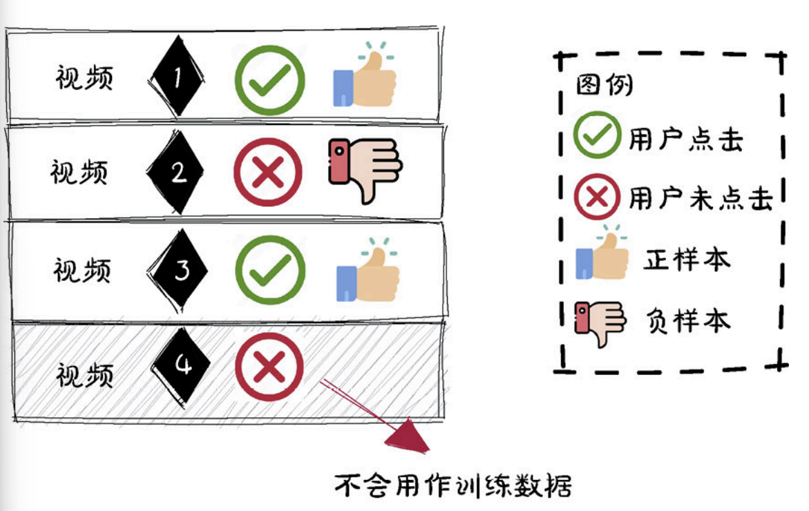另一种解决方案是从模型入手，让模型学习到负样本是位置原因带来的，在模型中**将偏差作为特征**，**训练时使用真实偏差，预测时将偏差设为一个统一的值**，也被称为伪特征。为了**保证不同的偏差值在预测时不会影响到模型**，偏差特征要**通过一个线性层接入模型，而绝不能和其他正常特征一起喂入DNN**。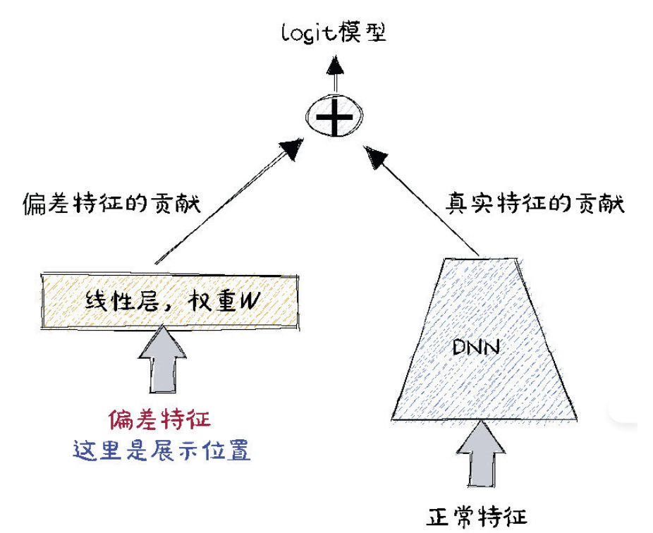


## 数据特征的处理

### 处理缺失值

处理缺失值最常规的做法是用**所有样本的均值或中位数**，也可以更**精细**一点，按照**类别划分子样本**取值。


另一种做法是**训练模型预测缺失值**。


如果对**数值特征离散化**，在分桶时，为每个特征增加一个未知的桶，专门存储缺失值。


### 标准化

标准化是为了将不同量纲，不同取值范围的数值特征都压缩到一个数值范围内，使他们具有可比性。最常用的是z-score标准化

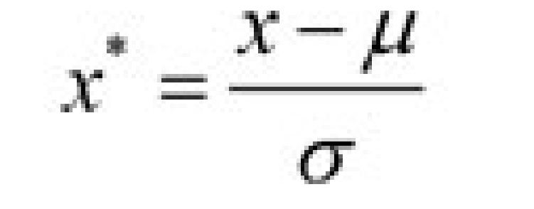


长尾分布的特征需要先变换为正态分布再进行标准化，否则统计的均值和方差会被带偏。

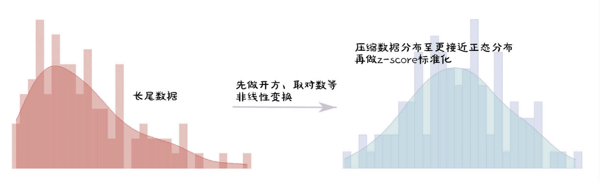


### 数据平滑和消偏

推荐系统中会遇到**样本太少**的情况，导致计算结果不可信，例如一个物品只被曝光了一次并被购买，由此计算出的购买率是100%，这显然是不对的。为了**消除小样本的负面影响**，提高计算结果的置信水平，可以采用**威尔逊区间平滑**

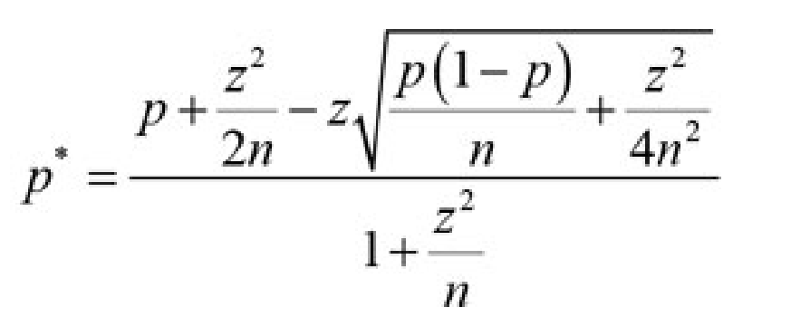

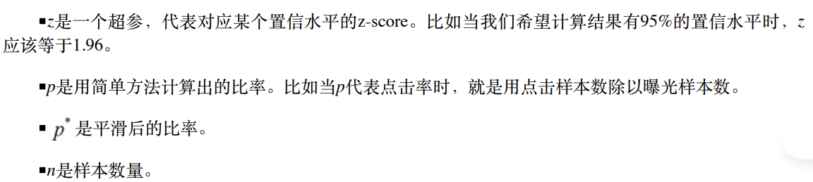

威尔逊区间平滑对简单计算出的比率修正，样本数量越大，修正后的比率越接近远比率。


此外，为抹平不同细分领域天然存在的偏差引入**消偏**。

以点击率为例，A的点击率优于B，但A处于更显眼的位置，因此点击率不能代表A的内容更出色。为了消除影响可以使用之前提及过的特征工程的技巧，或者采用CoEC消偏。

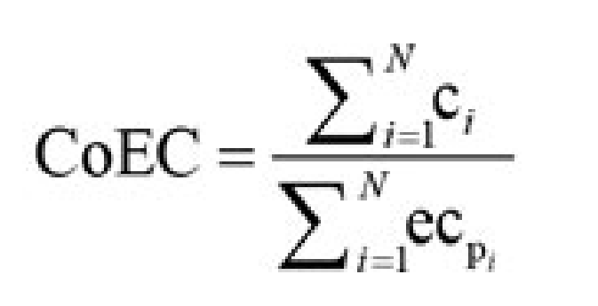


### 分桶离散化

分桶有三种方法：

+ **等宽分桶，将特征值域平均划分为N等份**
+ **等频分桶，用N个分位数作为各桶的边界**
+ **模型分桶**，是**简单决策树**拟合特征与目标值，在分桶时，用特征落到的**叶子节点的编号**作为离散化结果


### 类别特征

推荐系统的特征空间主要由**高维的稀疏的类别特征构成**（系统中包含几万个标签，但是每个物品只包含数个）。线上工程中，类别特征可以**减小计算开销**，提升在线预测与预测的实时性。


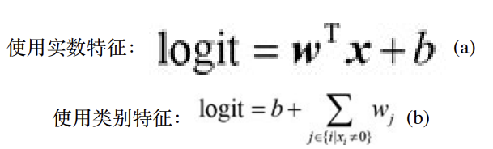

以上述公式为例，对于类别特征**只需将非零特征对应的权重相加即可**，省去了乘法运算。


类别特征的维度特别高，再加上实数特征分桶，多维特征交叉，特征空间的维度非常容易上亿，为此出现了**Parameter Server**架构**分散了参数存储和检索的压力**。


推荐系统中类别特征一般通过**Embedding和多特征交叉**增强表达能力。


类别特征中的字符串一般通过**索引表或哈希函数映射到Embedding矩阵，对应一个embedding向**量。

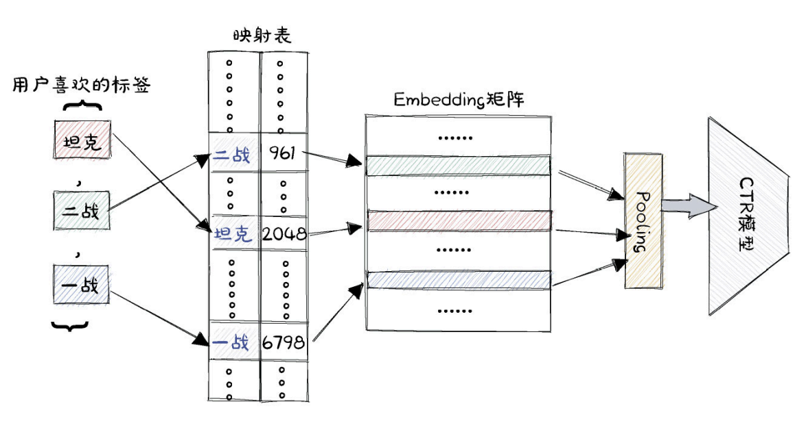


# Embedding层

## 概述

Embedding层负责将**稀疏的类别特征映射成一个稠密向量**。

Embedding层还能**概念拆解为特征向量**，目的是**提升推荐算法的扩展能力**，从而能够自动挖掘出那些低频、长尾、小众的模式。将概念拆开，使得推荐算法**从精准匹配转化为模糊查找**。


下述代码展示了如何用库实现简单的Embedding层

```python
import tensorflow as tf
import tensorflow.keras as keras

# 词表
unq_categories=['music','movie','finance','game','military','history']
id_mapping_layer=keras.layers.StringLookup(vocabulary=unq_categories) # 字符拆拿到整数

# Embedding层，六维压缩到四维，多一用于处理不在词表中的单词
emb_layer=keras.layers.Embedding(input_dim=len(unq_categories)+1,output_dim=4)

# 输入
cate_input=tf.constant(['music','movie','finance','game','military','history','None'],dtype=tf.string)
cate_ids=id_mapping_layer(cate_input)

# 得到Embedding后的结果
cate_embeddings=emb_layer(cate_ids)
```


## 共享or独占

共享Embedding是指**同一套Embedding喂入模型的多个地方，发挥多个作用**。例如，双塔模型中用户行为序列特征与物料共享Embedding，


在交叉特征时，FM算法也会用到。


显而易见，共享Embedding可以**节省存储空间**，因为Embedding矩阵一般都很大。

另一个好处是，共享可以**缓解由于数据不足导致的训练不充分**，对于数据较少的Field可以与邻近的Field共享一个Embedding。


使用独占Embedding有两种情况，**一种是避免干扰，另一种是为了更好的进行特征交叉**。


# 召回策略

召回是推荐系统的第一个环节，它面对的候选集一般要达到**百万级规模**，所以召回模块的第一要务就是`快`，**为此它可以牺牲一部分精度，只要能找到与用户兴趣比较匹配的物料就可以，而不一定是最匹配的**

为了**弥补**精度上的不足，召回模块一般采用`多路召回`的方式，以`数量弥补质量`，每路召回只关注用户或物料信息的一个侧面。

注意，**排序模型并不是删除了交叉信息就能作为召回模型**，二者的应用领域不同，召回是为了**筛选掉不感兴趣的物料**。


## 模型架构

召回大致分为**传统召回算法（协同过滤等）和向量化召回**，其中向量化召回就是将**召回问题建模成向量空间内的近邻搜索问题**。


向量化召回建模框架由四个维度构成

+ **如何定义正样本**
+ **如何定义负样本**
+ **如何将用户和物料映射为Embedding**
+ **如何定义优化目标**


### 正负样本

正样本的选取很简单，**使用曝光且有点击的物品**即可，需要**平衡**冷门物品和热门物品，对**前者过采样对后者降采样（减少对正样本集合的绑架）**。

训练embedding时，需要**降采样**防止训练被热门物品主导；点击预测时要**过采样**，模拟真实分布。


负样本的来源有：没有被召回，被召回但是被排序截断，被曝光但是没有被点击。

**Easy Negative** 指的是**用户不怎么感兴趣，模型很容易区分的负样本**。

**Hard negative** 指的是那些**错误类别中最难区分、最接近正样本（以用户很感兴趣）的负样本**，在推荐系统中是**被排序淘汰的物品**。

训练时**混合两种样本，对半开**


**被曝光但是没有被点击不应该作为负样本**，它会导致模型效果下降。

对喂入召回模型的样本的要求是**，既要让模型见过最匹配的组合，也要让模型见过最不靠谱的组合**，这样才能让模型达到“**开眼界、见世面**”的目的，能被曝光的物品已经属于**用户比较感兴趣的物品了**，甚至可以用作**正样本**，它不能让模型学习到用户不喜欢的模式。

### 优化目标

召回的损失函数主要考虑的是**排序的相对准确性**

#### NCE loss

假设模型输出 logits 向量
$$
z = [z_1, z_2, \dots, z_K]
$$
其中 $K$ 是类别数。**Softmax** 将 logits 转成概率分布：
$$
p_i = \frac{e^{z_i}}{\sum_{j=1}^{K} e^{z_j}}
$$
二分类交叉熵损失定义为：
$$
\mathcal{L} = -\frac{1}{N}\sum_{i=1}^{N} \left[ y_i \log(\hat{y}_i) + (1 - y_i)\log(1 - \hat{y}_i) \right]
$$
其中
$y_i \in (0,1)$ 为真实标签，$\hat{y}_i \in (0,1)$ 为模型预测为正类的概率，通常由sigmoid得到:$\hat{y}_i = \sigma(z_i) = \frac{1}{1 + e^{-z_i}}$


召回中用到的**CrossEntropyLoss**，是将Softmax和交叉熵结合
$$
L_{\text{Softmax}} = -\frac{1}{|B|} \sum_{(u_i, t_i) \in B} \log \frac{\exp\left(u_i \cdot t_i\right)}{\sum_{j \in T} \exp\left(u_i \cdot t_j\right)}
$$
(u,t)：第i个**真实匹配对**，T：当前用于做softmax的**候选集合**


可以观察到。分母中要计算**用户向量与所有的物料向量**的点积，而物料的大小属于百万甚至千万，计算量十分惊人。


Noise Contrastive Estimation(NCE)是一种**简化分母**的思路，NCE Loss定义，对每个正样本**随机采样负样本**（推荐系统中不会传入负样本），将问题转换为判断**样本是否来自于噪声的二分类问题**
$$
\begin{align*}
L_{\text{NCE}} &= \frac{-1}{|B|} \sum_{(u_i, t_i) \in B} \left[ \log\left(\sigma\left(G(u_i, t_i)\right)\right) + \sum_{j \in S_i} \log\left(1 - \sigma\left(G(u_i, t_j)\right)\right) \right] \\
&= \frac{1}{|B|} \sum_{(u_i, t_i) \in B} \left[ \log\left(1 + \exp\left(-G(u_i, t_i)\right)\right) + \sum_{j \in S_i} \log\left(1 + \exp\left(G(u_i, t_j)\right)\right) \right]
\end{align*}
$$
其中$\sigma$为**Sigmoid**函数,Si表示**第i个正样本对应的负样本集合**，**G(u,t)**为模型对样本的**得分**（如点积）。


其中
$$
    G(u, t) = \boldsymbol{u} \cdot \boldsymbol{t} - \log Q(t | u)
$$
$ \log Q(t | u)$是为了**修正热门物品被过度惩罚**，因为**负样本主要由热门物料组成**，会对热门物料进行了过度打压，可能**导致推荐结果过于小众**。$ \log Q(t | u)$是一个和**物料热度正相关的函数**。


如果不考虑修正，就得到了**NEG loss**，优点是**计算简便**，但不像NCE loss有**非常强的理论保障**。
$$
L_{\text{NEG}} = \frac{1}{|B|} \sum_{(u_i, t_i) \in B} \left[ \log\left(1 + \exp\left(-u_i \cdot t_i\right)\right) + \sum_{j \in S_i} \log\left(1 + \exp\left(u_i \cdot t_j\right)\right) \right]
$$

#### Sampled Softmax

Sampled Softmax的核心思想是**采样近似**，仍然是多分类问题。

1. **对每个训练样本，保留正确的类别**
2. **从所有的类别中随机采样N个负样本**
3. **仅在这个N+1个类别上计算Softmax loss**

$$
L_{\text{SampledSoftmax}} = -\frac{1}{|B|} \sum_{(u_i, t_i) \in B} \log \frac{\exp\left(G(u_i, t_i)\right)}{\exp\left(G(u_i, t_i)\right) + \sum_{j \in S_i} \exp\left(G(u_i, t_j)\right)}
$$

#### Pointwise

单点法，为单个物品计算得分，将问题转换为回归或分类


#### Pairwise

配对法，关注物品对，可以直接优化排序关系，但是样本量爆炸，**无法区分好一点和好很多**。

一个样本是由：**用户，交互过的正向物料，随机采样的负向物料**组成的**三元组**，优化目标是，**针对同一个用户u，正向物料与他的匹配程度要远远高于负向物料**。


一种损失函数是**Marginal Hinge Loss**，其中m是超参数


$$
L_{\text{Hinge}} = \frac{1}{|B|} \sum_{(u_i, t_{i+}, t_{i-}) \in B} \max\left(0, m - \boldsymbol{u}_i \cdot \boldsymbol{t}_{i+} + \boldsymbol{u}_i \cdot \boldsymbol{t}_{i-}\right)
$$


另一种是**Bayesian Personalized Ranking Loss (BPR Loss)**，它的思想是，针对用户的排序，**正样本在负样本之前的概率$$P_{\text{CorrectOrder}} = \text{sigmoid}(\boldsymbol{u}_i \cdot \boldsymbol{t}_{i+} - \boldsymbol{u}_i \cdot \boldsymbol{t}_{i-})$$要最大化**。
$$
\begin{align*} L_{\text{BPR}} &= \frac{1}{|B|} \sum_{(u_i, t_{i+}, t_{i-}) \in B} -\log\left(P_{\text{CorrectOrder}}^{(i)}\right) \\ &= \frac{1}{|B|} \sum_{(u_i, t_{i+}, t_{i-}) \in B} \log\left(1 + \exp\left(\boldsymbol{u}_i \cdot \boldsymbol{t}_{i-} - \boldsymbol{u}_i \cdot \boldsymbol{t}_{i+}\right)\right) \end{align*}
$$


### Listwise

以整个列表为训练单位，考虑全局相对结构。

缺点是训练难，不好收敛。


## 基于物品的协同过滤 **Itemcf**

### 原理

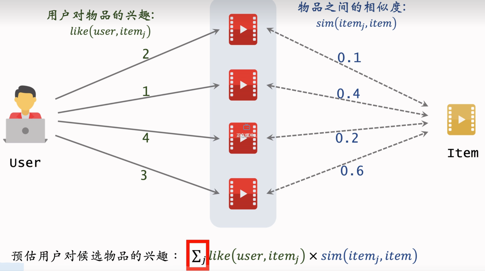


物品之间的相似度基于物品的**重叠受众 **


如果考虑用户对物品的喜欢程度

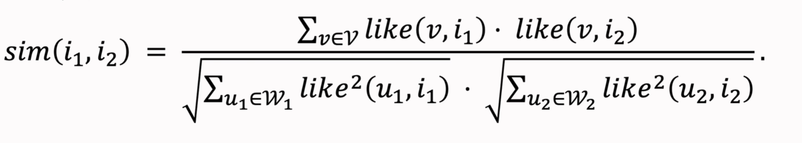

### 流程

事先做离线计算

- **建立用户->物品的索引**
  - 记录每个用户最近点击，交互过的物品ID
  - 给定用户ID可与找出他近期感兴趣的物品
- **建立物品->物品的ID**
  - 计算物品之间的相似度
  - 对每个物品，索引其最相似的K个物品


线上做交互

1. **给定用户ID，通过用户->物品索引，找到用户最感兴趣的物品列表(last-n)。**
2. **对于last-n列表中每个物品，通过物品->物品的索引，找到top-k相似物品。**
3. **对于取回的nk个相似物品，用公式预估用户对物品的兴趣分数。**
4. **返回分数最高的100个物品，作为该召回通道的推荐结果。**


使用索引，离线计算量大，但是线上计算量小。

## Swing 召回

Swing是ItemCF的**变体**，ItemCF是基于用户重叠来计算相似度的，但是如果用户在一个**小圈子**中(微信群)，圈子中分享的物品被点击或点赞并非出于感兴趣，因此**两个不相干的物品会被错误的认为相似**。

Swing**给用户设置权重**，用户喜欢的物品重叠越多，越说明他们出于一个圈子，依次防止出现小圈子问题。


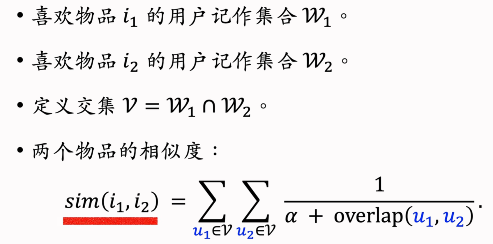


## 基于用户的协同过滤 UserCF

### 原理


计算用户间的相似度，**越热门的物品对计算相似度帮助不大，不能反映出用户的兴趣**，因此需要对物品按照**热度**赋予一个权重。

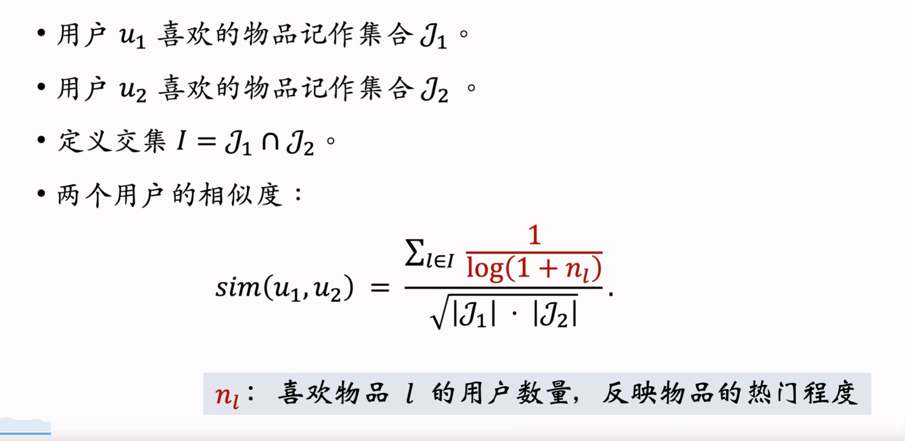


### 流程

事先做离线计算

- **建立用户->物品的索引**
  - 记录每个用户最近点击，交互过的物品ID
  - 给定用户ID可与找出他近期感兴趣的物品
- **建立用户->用户的ID**
  - 计算用户之间的相似度
  - 对每个用户，索引其最相似的K个用户


线上做交互

1. **给定用户ID，通过用户->用户索引，找到最相似的k个用户top-k。**
2. **对于top-k列表中的用户，通过用户->物品的索引，找到last-n。**
3. **对于取回的nk个相似物品，用公式预估用户对物品的兴趣分数。**
4. **返回分数最高的100个物品，作为该召回通道的推荐结果。**


## 矩阵分解

### 原理

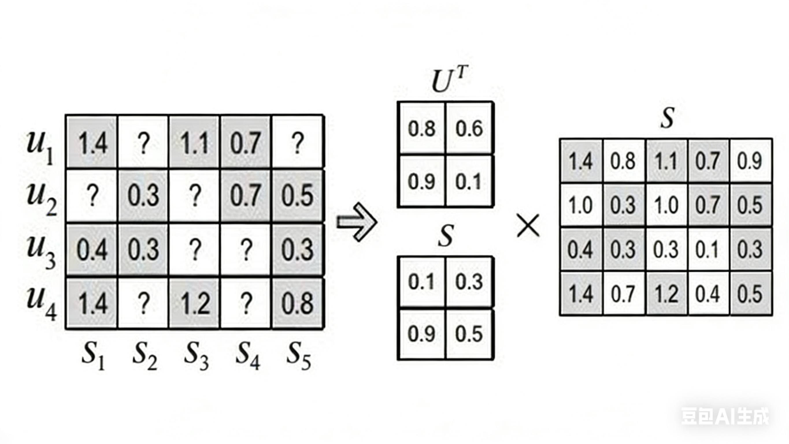


如上图所示，U代表用户，S代表物品，矩阵中的数字是用户对物品的打分，?代表用户没有给物品打过分。实践中，矩阵一般十分稀疏，矩阵分解是将将$ m\times n $维的矩阵R分解为$m \times k$的用户矩阵和$k \times n$维的物品矩阵相乘的形式，其中k为隐向量的维度。


常用的训练方法是，通过**梯度下降**让相乘得到的评分矩阵与原始矩阵尽可能拟合。


矩阵补充的实践效果并不好

1. **没有利用物品和用户的属性**
2. **负样本的选取方式不对**
3. **做训练的方法不好，如损失的计算，使用内积**


### 线上召回

1. 训练得到的Embedding矩阵A和B，A中每一列是用户，B中每一列是物品。
2. 把矩阵A的列存储到**字典**中，B用**其他方式**存储。
3. 把**用户ID**作为key查找得到**用户向量a**
4. 第i号物品的embedding记作$b_i$，**返回能使内积<a,$b_i$>最大的k个物品**


最后一步中，如果枚举所有物品，**时间复杂度会正比于物品数量**，工业中一般采用**近似最近邻查找**，**最近邻的标准有欧氏距离，向量内积，余弦相似度**。


首先将物品**按照最近邻划分为多个区域**，每个区域用一个**向量**表示，同时**建立区域内点到向量的映射**。


接下来计算**用户向量与区域向量的距离**（取决于最近邻的标准），找出**最近**的向量；再计算该向量**区域内所有点与用户向量的距离**，得到最近的K个。

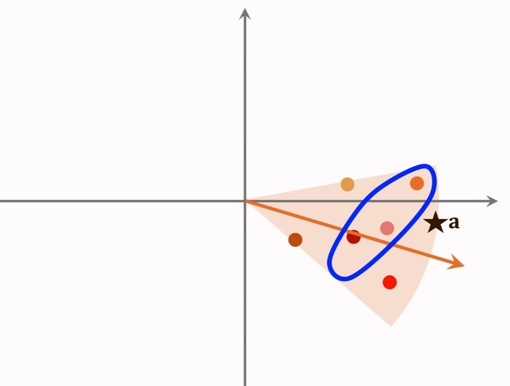


这些改进大大减小了枚举的次数。


## Word2Vec

### Item2Vec

**Item2Vec**借鉴了**NLP**领域的**Word2Vec**，Word2Vec的目标是**将每个单词转换为能表征其语义的稠密向量**，学习方法是**给定一个中心词w**，**预测哪些词能够出现在w的上下文中**，与w搭配使用。比如给定一句话`“The quick brown fox jumps over the lazy dog”`，当我们选中`fox`当中心词，并且取宽度为1的窗口作为上下文的范围，Word2Vec的训练目标就 是使`“fox, brown”`和`“fox, jump”`这样的单词组合出现的概率越大越好。


理论上的损失函数就是
$$
L_{\text{word2vec}} = -\frac{1}{|B|} \sum_{(w_i, c_i) \in B} \log \frac{\exp\left(\boldsymbol{w}_i \cdot \boldsymbol{c}_i\right)}{\sum_{j \in V} \exp\left(\boldsymbol{w}_i \cdot \boldsymbol{c}_j\right)}
$$
为了简化计算量，使用**NEG**技巧
$$
L_{\text{word2vec}} = \frac{1}{|B|} \sum_{(w_i, c_i) \in B} \left[ \log\left(1 + \exp\left(-\boldsymbol{w}_i \cdot \boldsymbol{c}_i\right)\right) + \sum_{j \in S_i} \log\left(1 + \exp\left(\boldsymbol{w}_i \cdot \boldsymbol{c}_j\right)\right) \right]
$$
**Item2Vec**则是将用户的某一个**行为序列**当成一个句子，序列中的每个**Item ID**当成一个单词，按照以上方式收集完数据后，直接套用Word2Vec训练，训练完成后，就能得到每个物料的Embedding使用。


### Airbnb召回算法

Item2Vec直接套用Word2Vec尽管简单方便，但是忽略了**推荐领域与NLP领域的许多差异之处**，例如，用户的行为序列中，**第一个点击的物品和最后一个点击的物品非常有可能相似**，但是**NLP中只会认为一个词于它左右的词是相关的**。

Airbnb就此，针对民宿中介的业务特点，对Word2Vec进行了若干改造。


I2I召回中

1. **正样本**定义为**窗口内的邻近房屋**，同时如果有房屋被预定了，那么额外增加一批正样本，**由被预定房屋与其他房屋组成**。
2. **负样本**的**主力是随机采样**得到的，同时考虑到房屋的固有属性——随机采样得到的样本大多是异地的，要为**每个房屋从与其同城的其他房屋中采样一部分作为Hard Negative**
3. 损失函数与Word2Vec一样采用**NEG Loss**，但增加了**额外的正负样本**


U2I召回中，Airbnb从**对业务更重要的预定数据**入手，虽然预定数据**十分有限**，但Airbnb根据属性和人工规则**将用户和房屋分类**，这样单个用户与单个房屋的预定记录是稀疏的，而某类用户对某类房屋的预定就吩咐多了，这里要学习的则是**类别的Embedding**，有助于**冷启**。

1. 正样本，如果某用户预定过某房屋，那么用户所属的类别与房屋的类别应该是相似的
2. 负样本的主力是随机采样
3. 损失函数与Word2Vec一样采用**NEG Loss**


### 阿里巴巴的EGES召回

EGES认为“`只有被同一个用户在同一个session内交互过的两个物料才有相似性`”太过于**局限**，EGES考虑**跨用户，跨session的相似性**，以提高模型的扩展性，同时**有助于冷启**。

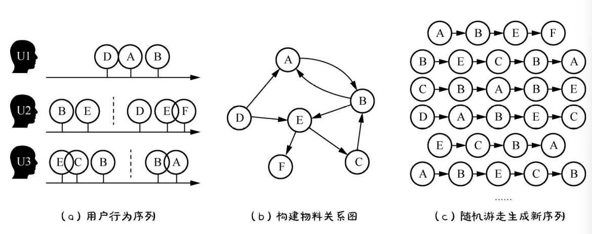


+ 根据**用户行为序列建立物料关系图**，图中每一个节点代表一个物料，每一条边代表两个物料被**顺序交互过**，比如，图5-3(a)中的用户U1先点击过物料D，再点击 过物料A，那么在图5-3(b)上就有一条边由D指向A。节点i,j之间的**权重**等于数据集中“`先点击i再点击j`”的**次数**。
+ 根据物料关系图，**生产一批新的序列**，由节点i到节点j的**转移概率**$$P(v_j | v_i) = \frac{M_{ij}}{\sum_{j \in N_v(M)} M_{ij}}$$，$M_{ij}$是i到j的边权，$$N_+(v_i)$$是i的邻居个数
+ 在这些新序列上**套用Word2Vec方法**，定义滑窗，窗口内的两个物料是相似的，成为正样本


负样本的选取**照搬Word2Vec中的随机负采样方法**。


Embedding时，EGES还引入了**物料的属性信息**，将ID embedding属性与其他属性**合成新的Embedding**。EGES定义了**1（ID）+N（属性）个Embedding矩阵**。


合并可以按照**Average Pooling**，$$H_v = \frac{1}{n+1} \sum_{s=0}^n W_v^s$$

或者定义一个**待学习的权重矩阵**$$A \in \mathbf{R}^{|V| \times (1+n)}$$（|V|是所有物料数），**按照权重合并属性**，$$H_v = \frac{\sum_{j=0}^n \exp\left(a_v^j\right) W_v^j}{\sum_{j=0}^n \exp\left(a_v^j\right)}$$

损失函数**套用了Word2Vec中的NEG Loss**


## FM召回

FM，因子分解机，通过**两两特征组合**，引入所有的**二阶交叉项特征**，对高维特征引入**隐向量**（矩阵分解，维度为(n特征数,k超参数)）完成对特征的参数估计。
$$
\hat{y}(\mathbf{x}) = w_0 + \sum_{i=1}^n w_i x_i + \sum_{i=1}^n \sum_{j=i+1}^n \langle v_i, v_j \rangle x_i x_j 
\\
\langle v_i, v_j \rangle = \sum_{f=1}^k v_{i,f} \cdot v_{j,f}
$$
公式中的二阶部分时间复杂度为$O(N^2)$，FM通过公式推导将时间复杂度降为了$O(KN)$
$$
\begin{aligned}
\sum_{i=1}^n \sum_{j=i+1}^n \langle v_i, v_j \rangle x_i x_j &= \frac{1}{2} \left[ \sum_{i=1}^n \sum_{j=1}^n \langle v_i, v_j \rangle x_i x_j - \sum_{i=1}^n \langle v_i, v_i \rangle x_i x_i \right] \\
&= \frac{1}{2} \left( \sum_{i=1}^n \sum_{j=1}^n \sum_{f=1}^k v_{i,f} \cdot v_{j,f} x_i x_j - \sum_{i=1}^n \sum_{f=1}^k v_{i,f} \cdot v_{i,f} x_i x_i \right) \\
&= \frac{1}{2} \sum_{f=1}^k \left( \left( \sum_{i=1}^n v_{i,f} x_i \right) \left( \sum_{j=1}^n v_{j,f} x_j \right) - \sum_{i=1}^n v_{i,f}^2 x_i^2 \right) \\
&= \frac{1}{2} \sum_{f=1}^k \left( \left( \sum_{i=1}^n v_{i,f} x_i \right)^2 - \sum_{i=1}^n v_{i,f}^2 x_i^2 \right)
\end{aligned}
$$


**召回时，在线实时计算$E_u$，$E_t$提前离线计算好。**


注意上述公式只针对**预测**，因为要保证**实时性**，在**训练**时没必要把用户特征和物料特征拆开。
$$
\text{FM}(u, t) = b + \sum_{i \in I(u,t)} w_i + \frac{1}{2} \text{reducesum} \left[ \left( \sum_{i \in I(u,t)} \boldsymbol{v}_i \right)^2 - \sum_{i \in I(u,t)} \boldsymbol{v}_i^2 \right]
$$

## youtubeDNN召回

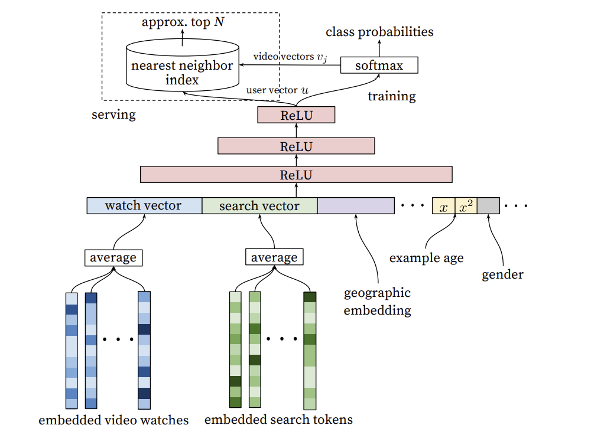


youtubeDNN召回的目标是**预测用户下一个观看的视频**，即给定用户U，上下文C和整个视频语料库V，预测用户在时刻t观看的视频$w_t$的可能，是一个多分类模型


$$
P(w_t = i|U, C) = \frac{e^{v_i u}}{\sum_{j \in V} e^{v_j u}} 
$$
显然对于分母是不可能每次都遍历的，youtubeDNN通过为每个正样本**负采样**数千个正样本来加速softmax的效率。


模型训练时，将用户**完整**的看完了一个视频，选取正样本。虽然youtube提供点赞或点踩功能，因为其**反馈太过稀疏**，用户很少给小众视频点这种显示反馈。样本来源**不限于推荐结果**，**而是平台上所有视频的观看**，这样有助于新内容的发现。模型会为每个用户选取**固定数量的样本**，防止**活跃用户主导模型**。


模型接受的特征有：

+ **用户的观看历史**，由可变长的视频ID组成，每个视频ID做**embedding**，再对它们取平均。
+ **用户搜索历史**，和观看历史一样，对每个token做embedding然后取平均，搜索历史会**丢弃顺序信息**以防模型窥探到未来的信息。
+ **人口统计特征**，用户的地理位置和设备做embedding，与上述两个embedding**拼接**在一起。
+ 其他**简单的二值特征和连续特征**，**归一化**到[0,1]后输入网络。
+ **视频的年龄特征**，用训练时间减去视频的点击时间。工程师们观察到用户喜欢新视频，并且推荐新视频有助于冷启动，线上预测时置为**0**确保预测时处于训练的最后一刻。


经过三层ReLU全连接层，得到**用户向量和物品向量**，其中物品属性固定，其向量可以**存储到向量数据库**中后续用于线上搜索。


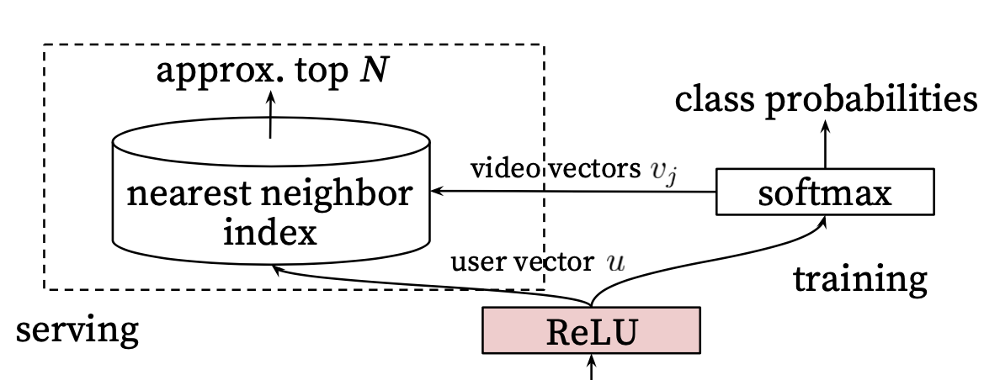


用户向量来自最后一层隐藏层的输出

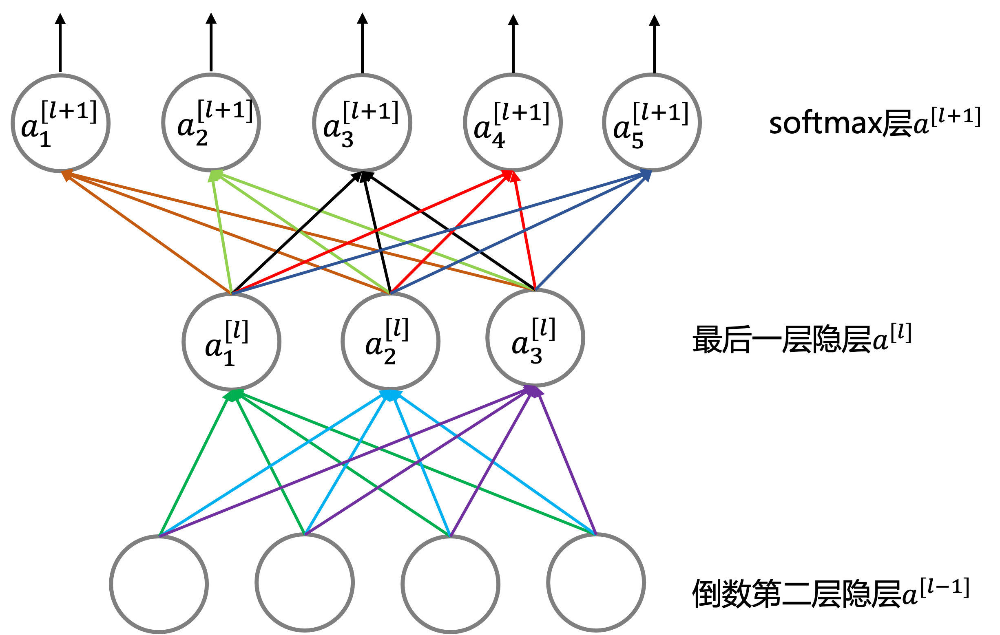


视频向量是最后一层隐藏层与softmax层的权重，例如
$$
\begin{align*}
\mathbf{a}^{[l+1]} &= \sigma\left( \mathbf{w}^{[l+1]} \mathbf{a}^{[l]} + \mathbf{b}^{[l+1]} \right) \\
&= \sigma\left( \begin{bmatrix}
\mathbf{w}_{10}^{[l+1]} & \mathbf{w}_{11}^{[l+1]} & \mathbf{w}_{12}^{[l+1]} \\
\mathbf{w}_{20}^{[l+1]} & \mathbf{w}_{21}^{[l+1]} & \mathbf{w}_{22}^{[l+1]} \\
\mathbf{w}_{30}^{[l+1]} & \mathbf{w}_{31}^{[l+1]} & \mathbf{w}_{32}^{[l+1]} \\
\mathbf{w}_{40}^{[l+1]} & \mathbf{w}_{41}^{[l+1]} & \mathbf{w}_{42}^{[l+1]} \\
\mathbf{w}_{50}^{[l+1]} & \mathbf{w}_{51}^{[l+1]} & \mathbf{w}_{52}^{[l+1]}
\end{bmatrix} \cdot \begin{bmatrix}
\mathbf{a}_1^{[l]} \\
\mathbf{a}_2^{[l]} \\
\mathbf{a}_3^{[l]}
\end{bmatrix} + \begin{bmatrix}
\mathbf{b}_1^{[l]} \\
\mathbf{b}_2^{[l]} \\
\mathbf{b}_3^{[l]}
\end{bmatrix} \right)
\end{align*}
$$
$[\mathbf{w}_{10}^{[l+1]}, \mathbf{w}_{11}^{[l+1]}, \mathbf{w}_{12}^{[l+1]} ]$即为视频id为1的向量，这里**softmax层是一个单独的模块**，它的**权重随着每一次训练收敛**，在**所有的训练结束后取权重最后物品向量**，这就相当于**离线计算好了**，**用户向量在线生成**，只是最后不用在过一遍softmax层，而是直接做**最近邻查找**。


最后，经过softmax层，得到每个视频的观看概率。


## 双塔模型

### 正样本

+ U2I：**一个用户与其交互过的物料相互匹配**，构成一对正样本
+ I2I：**一个用户在一个session交互过的两个物料应该具备相似性**，可以成为一对正样本
+ U2U：**一个用户的一半行为历史与其另一半行为历史应该彼此相似**，可以组成一对正样本

### 负样本

常见做法是 **batch 内负采样（in-batch negatives）**。以点击场景的 U2I 召回为例，在一个 batch $$B$$ 中，第 $$i$$ 条正样本由用户 $$u_i$$ 和与其发生交互的物品 $$t_i$$ 组成，即正样本对 $$(u_i, t_i)$$。

batch 内负采样指：对同一用户 $$u_i$$，batch 中除 $$t_i$$ 之外的其它样本的正物品都作为它的负样本，即：
$$
(u_i, t_j), \quad \forall j \in B,; j \ne i
$$
因此，第$i$个样本对应的负样本集合为：
$$
S_i^- = {, t_j \mid j \in B,; j \ne i ,}
$$


缺点在于：负样本都来自于**其他用户的点击**，而其他用户的点击大多都是**热门物品**(hard negative 用户喜欢热门物品)，**缺少easy negative**，存在**SSB**；对**Batch Size**高度依赖，太小了负样本数量受限，太多了带来显存压力。


为了解决样本偏差的问题，在batch内负采样的基础上发展了**混合负采样**，其建立了**一个额外的向量缓存**，存储物料塔中训练得到的**最新物料向量**，在训练每个batch时，先进行batch内负采样，**再额外从向量缓存中采样一些物料向量作为Easy Negative**。

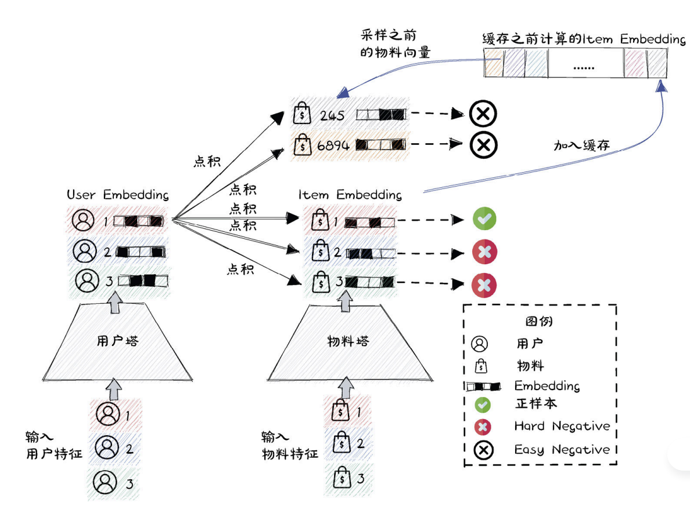

### 原理

召回的应用场景规定，`复杂的结构可以出现在一个塔的内部，但绝对不允许出现在两塔之间`。


双塔模型可以看作是矩阵补充模型的**升级**版，双塔指的是**用户塔和物品塔**


整体结构如下

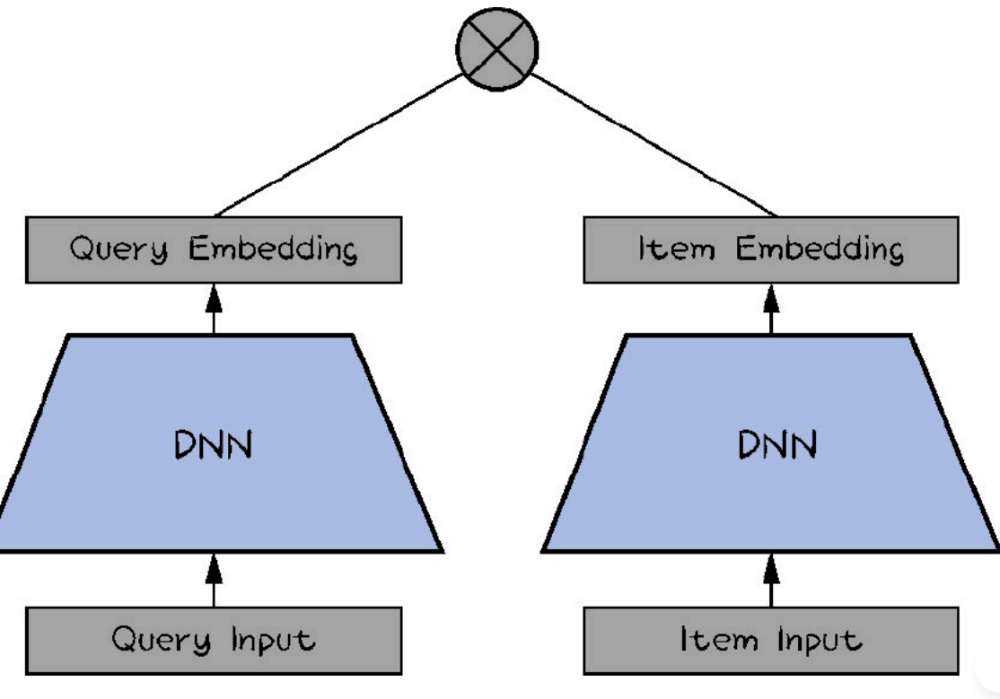


单个塔如下，双塔**能喂入的特征非常丰富**


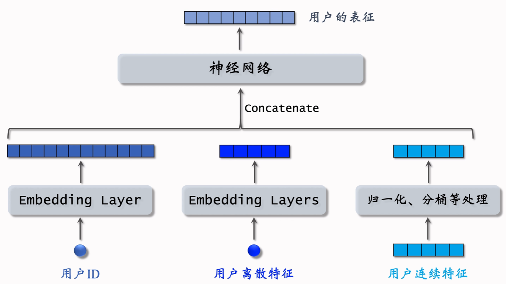


双塔要求**两塔之间绝对独立、解耦**，只允许在生成最终的用户向量和物料向量之后才点积交叉一次，在此之前，用户/物料信息只能沿着塔向上流动，**绝对不允许出现跨塔的信息交流**。


在训练好神经网络参数后，**物品表征**事先存储在**向量数据库**中，**线上不做推理**，因为物品特征较为**稳定**。**用户特征**只需做一次**线上推理**。


双塔模型属于**后期融合**——顶层之前不对物品和用户特征做融合，线上计算量小。


### 损失函数

双塔模型比较常用的是**基于Batch内负采样的Sampled Softmax Loss**
$$
\begin{align*} G(u, t) &= \frac{\boldsymbol{u} \cdot \boldsymbol{t}}{\tau} - \log Q(t) \\ L_{\text{Tower}} &= -\frac{1}{|B|} \sum_{(u_i, t_i) \in B} \log \frac{\exp\left(G(u_i, t_i)\right)}{\exp\left(G(u_i, t_i)\right) + \sum_{j \in B, j \neq i} \exp\left(G(u_i, t_j)\right)} \end{align*}
$$
对u和t，一个常见的技巧是**除以它们各自的L2 Norm**，转换为**长度为1的向量**（长度指的是范数——平方和开根号），这样**做点积就等价于用cosine(u,t)计算匹配度**，实践证明，**用cosine的效果要更好**。

**$\tau$是温度系数**，如果设置的很**小**，模型**对错误的放大功能就会很强**，能保证推荐结果的**精度**，但是对用户**潜在兴趣覆盖得不够**；反之，对错误的放大功能就会**很弱**，实现了**推荐结果的多样性**，但是**有损用户体验**。


$$Q(t)$$等于**物料t在所有点击样本中的占比**。


如果采用**混合负采样**，损失函数会**引入额外的$B^`$，**代表生成的物料向量的缓存。
$$
L_{\text{Tower}} = -\frac{1}{|B|} \sum_{(u_i, t_i) \in B} \log \frac{\exp\left(G(u_i, t_i)\right)}{\exp\left(G(u_i, t_i)\right) + \sum_{j \in B+B', j \neq i} \exp\left(G(u_i, t_j)\right)}
$$
因为现在负采样来自两种采样策略，所以$$Q(t)$$是一个**组合概率**
$$
Q(t) = \frac{|B|}{|B| + |B'|} Q_{\text{in-batch}}(t) + \frac{|B'|}{|B| + |B'|} Q_{\text{cache}}(t)
$$
$Q_{\text{in-batch}}(t)$定义同上，$Q_{\text{cache}}$是物料在向量缓存中采样到物料t的概率。


### 模型更新

全量更新：在今天凌晨，用**昨天的数据在昨天的模型参数基础上做训练**，并更新**物品向量**。

增量更新：每隔**几十分钟**更新模型参数（**只更新ID Embedding参数**），需要**实时收集线上数据**。


一般系统会**结合使用**两种更新方式。


## GCN召回

GCN，图卷积神经网络。根据用户的交互行为构建为一张图，各种实体作为图的顶点，各种互动关系构成了图的边。

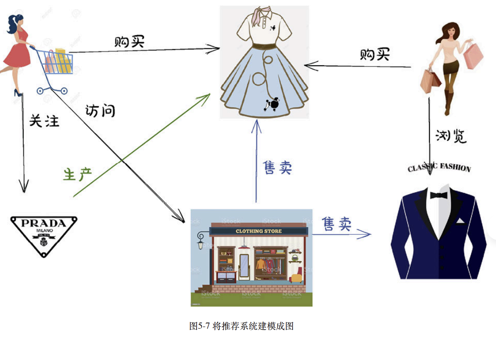

GCN的基本思想是通过**在图结构上平滑节点特征来学习节点表示**，图结构上往往假设相连的节点在语义或标签上**更相似**，GCN让**一个节点的表示向其邻居表示靠拢**，从而消除噪声，增强局部一致性。公式如下
$$
\mathbf{e}_u^{(k+1)} = \text{AGG}(\mathbf{e}_u^{(k)}, \{\mathbf{e}_i^{(k)} : i \in \mathcal{N}_u\})
$$
**AGG**用于**综合目标节点和邻居节点在第K层的表示**。


GCN最初是为**带属性图上的节点分类任务**提出的，其中每个节点都有丰富的属性特征作为输入，但是在推荐系统的大部分场景中下节点通常仅有一个id作为特征，因此gcn在推荐系统中效果并**不好**。模型中的**特征变化和非线性激活**对对推荐系统结果的影响微乎其微，甚至于更坏。

### lightGCN

**lightGCN**是将GCN用于推荐系统的改进，作者认为，GCN原有的**特征转换**与**非线性激活**两部分对于推荐任务来说比较冗余，因此作者去掉了它们并只保留最关键的**邻居聚合**。

lightgcn通过在用户-物品交互图对二者的embedding上进行**线性传播**来学习其表示，并将各层学习到的embedding加权求和。

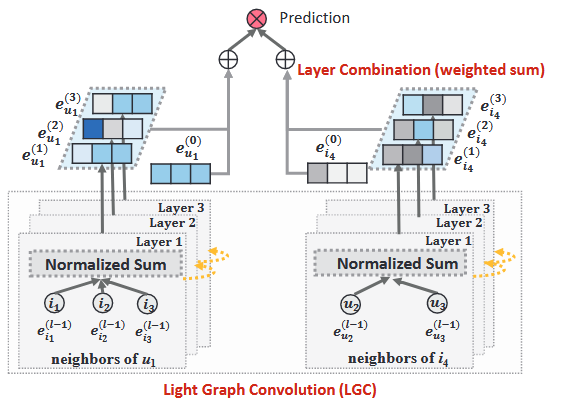

lightgcn中AGG函数使用了**简单的加权求和，完全舍弃了特征变换和非线性激活**，公式如下
$$
\mathbf{e}_u^{(k+1)} = \sum_{i \in \mathcal{N}_u} \frac{1}{\sqrt{|\mathcal{N}_u|} \sqrt{|\mathcal{N}_i|}} \mathbf{e}_i^{(k)}\\

\mathbf{e}_i^{(k+1)} = \sum_{u \in \mathcal{N}_i} \frac{1}{\sqrt{|\mathcal{N}_i|} \sqrt{|\mathcal{N}_u|}} \mathbf{e}_u^{(k)}
$$


与大多数现有的图卷积方法不同，lightgcn中没有使用**自连接**(把自己也当作自己的一个邻居，因为自身的特征也十分重要，如果没有自连接的话，节点会越来越像邻居，导致最后难以区分)，但是后续的**层间组合**操作效果等价于自连接。


最后将每一层的结果加权求和
$$
\mathbf{e}_u = \sum_{k=0}^{K} a_k \mathbf{e}_u^{(k)} ;\ \mathbf{e}_i = \sum_{k=0}^{K} a_k \mathbf{e}_i^{(k)}
$$


这里权重可以**手动调整或用模型训练**，但是为了保证lightgcn的**简洁**，模型中没有**单独设置模块来调整权重**，论文中实验发现用**1/(k+1)**作为权重效果最好，注意实际上就是取**均值**，这里的K是固定值。


lightgcn选择使用三层图卷积，(1)**再多的话会过渡平滑** (2)**每一层都能学习到不同的语义** (3)**对不同层的embedding加权求和，相当于实现了带自连接的图卷积效果，因为第0层就是节点原始的embedding**。

以用户为例，用户u的embedding的二阶表示本质上**是与u相连的所有用户v的加权和**，
$$
\mathbf{e}_u^{(2)} = \sum_{i \in \mathcal{N}_u} \frac{1}{\sqrt{|\mathcal{N}_u|} \sqrt{|\mathcal{N}_i|}} \mathbf{e}_i^{(1)} = \sum_{i \in \mathcal{N}_u} \frac{1}{\sqrt{|\mathcal{N}_i|}} \sum_{v \in \mathcal{N}_i} \frac{1}{\sqrt{|\mathcal{N}_u|} \sqrt{|\mathcal{N}_v|}} \mathbf{e}_v^{(0)}
$$
用户v对u的影响可以用平滑系数表示
$$
c_{v \rightarrow u} = \frac{1}{\sqrt{|\mathcal{N}_u| \sqrt{|\mathcal{N}_v|}}} \sum_{i \in \mathcal{N}_u \cap \mathcal{N}_v} \frac{1}{|\mathcal{N}_i|}
$$
可以看出（1）**二者交互的共同物品越多，用户兴趣越相似（2）交互物品越流行，影响越小（3）用户v交互物品越少，影响越大**；这正是**协同过滤**的思想的体现。物品侧也是同样的。


最后使用**内积**作为得分：
$$
\hat{y}_{ui} = \mathbf{e}_u^\top \mathbf{e}_i
$$


模型使用**BPR loss**
$$
L_{\text{BPR}} = -\frac{1}{M} \sum_{u=1}^{M} \sum_{i \in \mathcal{N}_u} \sum_{j \notin \mathcal{N}_u} \ln \sigma(\hat{y}_{ui} - \hat{y}_{uj}) + \lambda \|\mathbf{E}^{(0)}\|^2
$$
使用的是**简单的负采样**，用**Adam**作为优化器，**小批量**进行训练，因为没有特征变化，所以**引入正则化没有选择dropout**。


lightGCN的优点在于：结构极简，计算高效，易于大规模训练，但是无法利用内容特征（文本图像），冷启动能力弱。


### GraphSAGE

GraphSAGE是GCN的一种实现思想，在GraphSAGE出现之前，GCN的实现都是直推式的——预测与训练只能使用相同的图，对于未曾竖线在训练图上的节点，传统GCN无法给出它们的向量表示。GraphSAGE并不直接学习图上节点的向量表示，而是学习出一个转换函数——只要输入节点特征和连接关系就能返回该节点的向量表示。所以，GraphSAGE是归纳式的，适合推荐系统——大型推荐系统构造出的图通常包含上亿个节点，不可能因新来一个实体就重新建图。


GraphSAGE的思路如下所示
$$
\begin{align*} \boldsymbol{h}_v^0 &= \boldsymbol{x}_v \\ \boldsymbol{h}_v^k &= \sigma\left( W_k \sum_{u \in N(v)} \frac{\boldsymbol{h}_u^{k-1}}{|N(v)|} + B_k \boldsymbol{h}_v^{k-1} \right),\ \forall k > 0 \\ \boldsymbol{z}_v &= \boldsymbol{h}_v^{\text{last}} \end{align*}
$$

+ ${h}_v^0$第节点v第0层卷积的结果
+ ${h}_v^{last}$第节点v最后一层卷积的结果
+ ${h}_v^k$代表第\(k\)层卷积，由两部分组成。\( W_k\sum_{u \in N(v)}\frac{h_u^{k-1}}{|N(v)|} \)代表聚合节点\( v \)的**所有邻居**（即\( N(v) \)）向量，再用权重\( W_k \)线性映射。\( B_kh_v^{k-1} \)表示对节点\( v \)的上一层的输出\( h_v^{k-1} \)，用权重\( B_k \)线性映射。第\(k\)层的卷积结果是将以上两部分之和**用函数\(\sigma\)非线性激活**。


卷积过程如下所示，图中的 AGG 表示聚合操作，PROJB 对应公式中的\( B_k \)，PROJW 对应公式中的\( W_k \)

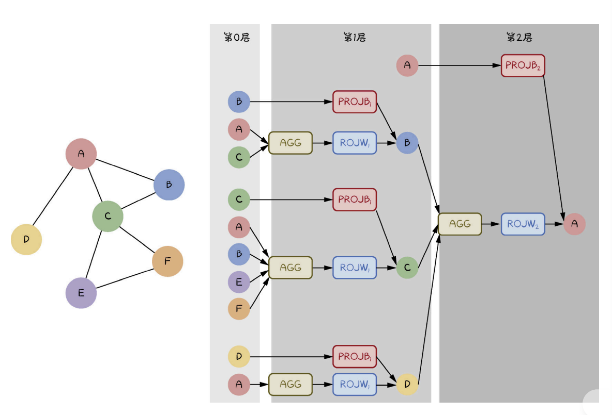

可以看到，随着卷积的深入，**节点用到的邻居所包含的信息越来越丰富**，相当于扩大了单个节点的感受野。


## Mind

Mind，Multi-Interest Network with Dynamic Routing for Recommendation at Tmall 来自淘宝的召回模型

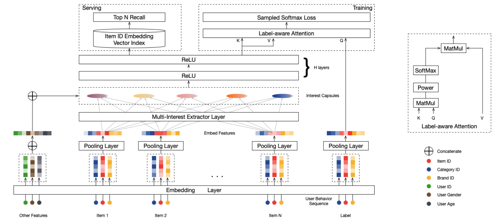

以往的召回模型，计算得到用户兴趣向量，然后与所有item向量进行最近邻搜索，召回最相关的n个。

**但一个用户兴趣向量很难捕捉用户多方面的兴趣，并且当模型计算的用户兴趣向量不准的话，那召回的item可能全是与用户兴趣偏移的**。


Mind，**能够提取多个用户兴趣向量，更好地捕捉用户多方面的兴趣**


### 问题定义

每个样本可以表示为一个三元组：
$$
(I_u, P_u, F_i)
$$

+ 其中 $I_u$ 表示用户 $u$ 交互过的物品集合（也称为用户行为序列）
+ $P_u$ 表示用户 $u$ 的基本画像信息（例如性别、年龄等）
+ $F_i$ 表示目标物品 $i$ 的特征（例如 item id、category id 等）


MIND 的核心任务是学习一个函数，**通过用户行为和用户基础属性，计算用户的k个兴趣向量**（当k=1时，与YoutubeDnn类似）：
$$
V_u = f_{\text{user}}(I_u, P_u)
$$
其中
$$
V_u = (\vec{v}_u^{1}, \ldots, \vec{v}_u^{K}) \in \mathbb{R}^{d \times K}
$$
表示用户 $u$ 的表示向量集合，其中 $d$ 表示向量维度，$K$ 表示用户表示向量的数量。


目标物品 $i$ 的表示向量由多种属性的embedding进行average pooling得到：
$$
\vec{e}_i= f_{item}(F_i)
$$


当用户表示向量与物品表示向量学习完成后，k个用户兴趣向量都可以用来召回item：
$$
f_{\text{score}}(V_u, \vec{e}*i) =
\max*{1 \le k \le K}
\vec{e}_i^{T}\vec{v}_u^{k}
$$
其中 $N$ 表示匹配阶段需要召回的候选物品数量，系统根据该评分函数选择 Top-$N$ 个物品作为候选集合。


### Embedding & Pooling Layer

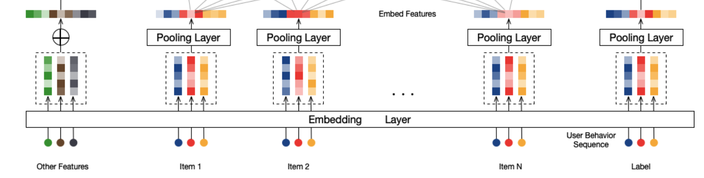

MIND 的输入由三部分组成：用户画像 $P_u$、用户行为 $I_u$ 和标签物品 $F_i$。每一部分都包含若干类别型 ID 特征，且这些 ID 特征维度极高。例如，物品 ID 的数量可达数十亿，因此采用广泛使用的嵌入技术，将这些 ID 特征映射为低维稠密向量（即嵌入向量），从而显著减少参数数量并简化学习过程。

对于来自用户画像 $P_u$ 的 ID 特征（性别、年龄等），将其对应的嵌入向量进行**拼接**，构成用户画像嵌入向量 $\overrightarrow{p}_u$

对于来自标签物品 $F_i$ 的物品 ID 以及其他类别 ID（品牌 ID、店铺 ID 等），将其对应的嵌入向量输入**平均池化**层，得到标签物品嵌入向量 $\overrightarrow{e}_i$。

最后，对用户行为 $I_u$ 中的物品，收集其对应的物品嵌入向量，构成用户行为嵌入集合 $E_u = {\overrightarrow{e}_j \mid j \in I_u}$。


### Multi-Interest Extractor Layer

多兴趣提取层，用于对历史行为进行聚类，并为聚类结果推导出相应的表示向量。

动态路由算法 

### capsule network

Mind借鉴capsule network 胶囊神经网络，提取用户兴趣向量。

capsule network由low_level和尬high_level的胶囊组成，

- low-level capsule： $\vec{c}_i^l \in \mathbb{R}^{N_l \times 1},\ i \in \{1, \dots, m\}$，$N_l$是胶囊向量的维度
- high-level capsule： $\vec{c}_i^l \in \mathbb{R}^{N_H \times 1},\ i \in \{1, \dots, N\}$
- routing logit： $b_{ij} = (\vec{c}_j^h)^T S_{ij} \vec{c}_i^l$

其中$S_{ij} \in \mathbb{R}^{N_h \times N_l}$为双线性映射矩阵，是需要学习的参数

接着，可以得到high-level capsule的候选向量：$\vec{z}_j^h = \sum_{i=1}^m w_{ij} S_{ij} \vec{c}_i^l$

$w_{i.j}$是连接high-level capsule和low-level capsule的权重：$w_{ij} = \frac{\exp b_{ij}}{\sum_{i=1}^m \exp b_{ij}}$ 

最后，通过非线性的squash函数得到high-level capsule的向量，即capsule network的输出（目标产物），可作为下一层网络层的输入
$$
\vec{c}_j^h = \text{squash}(\vec{z}_j^h) = \frac{\left\|\vec{z}_j^h\right\|^2}{1 + \left\|\vec{z}_j^h\right\|^2} \cdot \frac{\vec{z}_j^h}{\left\|\vec{z}_j^h\right\|}
$$

1. $b_{ij}$ 一般是初设化为 0； 
2. 整个动态路由过程一般重复3次，即以上由low-level capsule 得到 high-level capsule的过程；
3. 由于 high-level capsule 是 capsule network 的输出，初始的输入只有 low-level capsule，所以第一次 routing 无法计算得到 $b_{ij}$，才需要将 $b_{ij}$ 初设化为0；
4. 借由第一次 routing 过程计算得到的 high-level capsule，就可以给到后面的routing过程中。


### B2I Dynamic Routing

论文对经典的胶囊网络做了修改，Behavior-to-Interest (B2I) dynamic routing，即通过用户行为再由动态路由的方法得到用户兴趣向量。

**在这个场景下，low-level capsule对应用户的行为，即用户发生过交互的item向量。high-level capsule对应用户的多个兴趣capsule。**

调整的部分如下：

+ 使用共享双线性映射矩阵S
+ **Randomly initialized routing logits**：将 $b_{ij}$ 初设化修改为高斯分布 $\mathcal{N}(0, \delta^2)$

+ **Dynamic interest number**：不同的用户设置不同的兴趣capsule数量，这主要是为了节省计算资源，$K_u' = \max\left(1,\ \min\left(K,\ \log_2\left(|I_u|\right)\right)\right)$

### Label-aware Attention Layer

在提取得到K个兴趣capsule后，与用户基础属性embedding拼接，然后输入到H层relu全连接神经网络，得到K个最终能够表征用户兴趣的向量$V_u$。

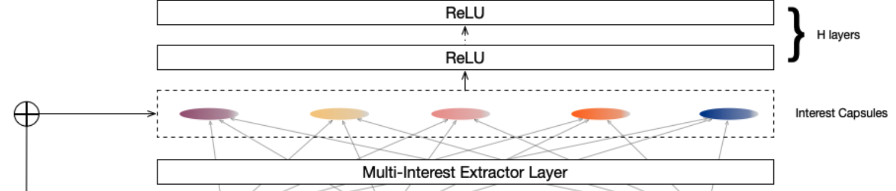

随后送入注意力机制中，用target item赋予k个用户兴趣向量不同的重要性，下图中K和V均为用户兴趣向量，Q为target item。

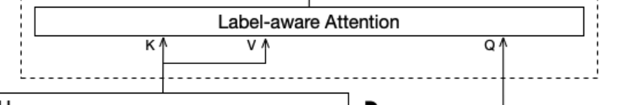

公式如下：
$$
\vec{\boldsymbol{v}}_u = \text{Attention}\left(\vec{\boldsymbol{e}}_i, \mathrm{V}_u, \mathrm{V}_u\right) = \mathrm{V}_u \mathrm{softmax}\left(\text{pow}\left(\mathrm{V}_u^T \vec{\boldsymbol{e}}_i, p\right)\right)
$$
其中p是控制注意力分布的，p=0时，每个兴趣向量趋于相同的注意力权重，当p大于1，$V_u^T \vec{e}_i$越大的会接接收越大的注意力，当p趋于无穷大时，只有最大的兴趣向量起作用，其他的兴趣向量几乎被忽略。


## 其他召回

**Geohash召回**，根据用户的**地理位置**召回，取回该地点**最新的K篇优质笔记**，**不考虑个性化**。


Geohash将**二维的经纬度坐标**转换为带有**前缀性质索引性质的一维坐标**。在一定程度上可以保证，两个Geohash的**公共前缀**越长，其所对应的区域就越近。


首先对经度纬度**二分**

- 第一轮：经度范围为 -180°~180°，可以拆分成 -180°~0° 以及 0°~180° 两部分，如果经度从属于前者，则令首个 bit 位取 0，否则令首个 bit 位取 1；
- 第二轮：-180°~0° 可以拆分为 -180°~-90° 和 -90°~0°，如果经度从属于前者，则令第二个 bit 位取 0，否则令第二个 [bit 位](https://zhida.zhihu.com/search?content_id=231481591&content_type=Article&match_order=4&q=bit+位&zhida_source=entity)取 1；0°~180° 可以拆分为 0°~90° 和 90°~180°，前者令第二个 bit 位取 0，后者令第二个 bit 位取 1
- 第 3 ~ N 轮：重复上述步骤的思路，最终递归二分，将经度表示成一个由二进制数字组成的字符串


将转换后的经纬度按照**经度字符串+纬度字符串依次交错排列**的形式组合，最后按照**5个一组划分**按**base32**规则映射，得到最后的字符编码。


**同城召回**，按照**城市**召回最新的K篇优质笔记，**不考虑个性化**。


**缓存召回**，**复用前n次推荐精排的结果**，因为缓存**有限**，需要**退场**机制。


此外还有作者召回。

### 曝光过滤&Bloom Filter

如果用户**看过**某个物品，则不再把该物品**曝光**给该用户。对于**每个用户记录曝光给他的物品(一定时间内)**，对于每个被召回的物品，判断它是否已经给该用户曝光过，**排除掉曾经曝光过**的物品。


**暴力对比**召回的物品是否在曝光记录中，会带来较大的**计算开销**。


Bloom Filter是一种**数据结构**，**判断一个物品ID是否在已曝光的物品集合中**。返回结果为**No**，那么**一定不在**；返回结果为**Yes**，该物品**可能在集合中**(有概率误判)。因此使用Bloom Filter**一定能过滤掉已曝光的物品，但是会导致未曝光的物品被剔除**。该结构的缺点在于，**不支持删除物品**。


Bloom Filter将**物品映射为m维向量**，使用**k个哈希函数**。初始化时，将**已曝光物品**使用**哈希函数**映射到m位上的k个位置，将这些位置设置为**1**，被**重复**映射的位置**忽略**。对被召回的同样使用k个哈希函数映射，如果**全部位置都为1**，说明该物品**被曝光**，反之未被曝光。


曝光物品集合大小为**n**，二进制向量维度为**m**，使用**k**个哈希函数	


人为设定可容忍的误伤概率后，有

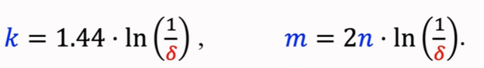


# 排序


**粗排**：从召回通道召回的物料中再次筛选，用于**快速过滤低质量候选**。

**精排**：精排的任务是从层层筛选出的千级规模的比较符合用户兴趣的物料中，挑选出几十个最合用户品味的物料。精排的侧重点是**提升预测精度**，看重**物料信息和用户信息的交叉特征**。

## 排序特征

- 用户画像：用户ID，人口统计学属性，账号信息，感兴趣的类目
- 物品画像：物品ID，发布时间，内容信息，类目，关键词
- 用户统计特征：用户不同时间段的/对不同类目的统计量
- 物品统计特征：物品不同时间段/按用户特征划分的统计量，发布者统计特征
- 场景特征：用户位置，当前时间，登录设备


物品特征**稳定**，用户特征**较为稳定**，统计特征**动态变化**。


## 粗排双塔模型

### 粗排双塔与召回双塔的异同

**双塔模型在粗排中仍是主力**，与召回的双塔相比，二者的相似之处在于

+ 训练时，都需要**用户塔和物料塔隔离，解耦建模**。
+ 部署时，面对一次用户请求，**用户向量只需要生成一遍**，**物料向量可以离线生成好**，缓存起来，被不同的用户请求。

不同点在于

+ 因为**候选集大小不同**，粗排中无需使用**向量数据库**，物料向量直接**存入内存缓存起来**，在线预测时，**线性遍历**与唯一的用户向量计算粗排得分。
+ 对于负样本，召回绝对不能只拿“曝光未点击”作为负样本，负样本的主力必须由随机负采样组成。**粗排可以和精排一样，拿“”曝光未点击“做负样本**，但是这里存在**选择偏差（SSB）**——训练时用的都是曝光后的数据，预测时面对的只是召回后的结果，质量远不如曝光数据，纠正这个偏差是业界的一个改进方向。
+ 使用的样本不同，那么**损失函数**自然也不一样，粗排的损失函数是BCE
+ 召回中，用户向量和物料向量的交叉只能通过点积实现，因为需要调用ANN算法；粗排中，**两个向量可以喂入一个DNN做更复杂的交叉**。

### 双塔改进的技术主线

双塔模型最大的**缺点**在于，**用户侧信息与物料侧信息交叉得太晚**，只有得到最后的用户向量与物料向量后才能通过点积进行唯一一次交叉，但此时两个向量已经是**高度压缩**的了，一些**细粒度的信息已经在塔中损失了**，永远**失去了与对侧信息交叉的机会**。


因此改进双塔模型的一条技术主线是：**如何在每个塔最终输出的向量中保留更多的信息，从而有机会与对侧塔得到的向量交叉。**


一种思路是，要想在双塔输出的最终向量中**保留更多有用、细粒度的信息**，**就要从源头上减少噪声信息的输入，否则噪声信息会污染细粒度信息，使其无法幸存到与对侧信息交叉的那一刻**。

这种思路体现为用**SENet动态调整输入信息**

**SENet**是**Squeeze-and-Excitation Network**的缩写。假设某一侧的信息在喂入塔之前一共有$f $个Field，其中第$i $个Field的Embedding是$ \boldsymbol{e}_i$)。SENet分为以下三个步骤组成,，如下所示


1. **Squeeze**（压缩），**将每个Field Embedding压缩成一个代表数字**，压缩函数用$F_{eq}$表示，例如Average Pooling，压缩后得到$ \boldsymbol{Z} = \left[ z_1, z_2, \cdots, z_f \right] $ 
   $$
   z_i = \text{F}_{\text{sq}} \left( \boldsymbol{e}_i \right) = \frac{1}{k} \sum_{j=0}^{k-1} \boldsymbol{e}_i \left[ j \right]
   $$

2. **Excitation**，**将压缩得到的向量喂入一个小网络$F_{ex}$​**，比如一个两层的全连接网络，
   $$
   \boldsymbol{A} = \text{F}_{\text{ex}} \left( \boldsymbol{Z} \right) = \sigma_2 \left( W_2 \sigma_1 \left( W_1 \boldsymbol{Z} \right) \right) 
   $$
   第一层相当于让所有的Field Embedding相互交叉，第二层将输出映射回f维向量，得到的A反映了每个Field Embedding的**重要程度**。

3. **Reweight**，将**权重向量A与原始输入相乘代替原始特征**。


在**用户侧和物料侧各放置一个SENet**，使**信息在流进塔之前先被增强或过滤**。

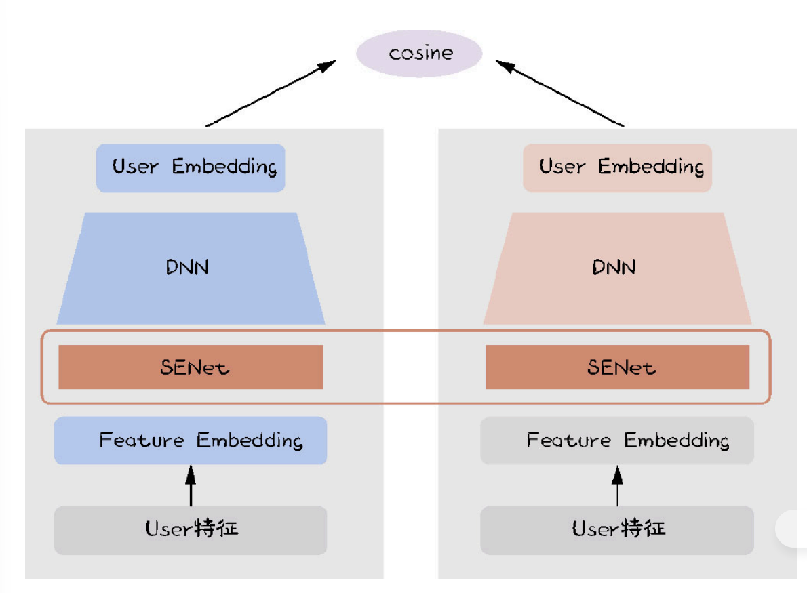


另一种思路考虑到**信息在塔中向上流动的过程是一个信息被压缩的过程，不可避免地会带来信息的损失，因此可以让重要的信息抄近路走捷径，直接送到离最终点积交叉更近的位置**。

抄近路的一个方案是**把每个中间层的的输入都送到最后一层，与最后一层的输出拼接为一个大向量，再经过一层FC压缩得到最后的用户/物料向量**。

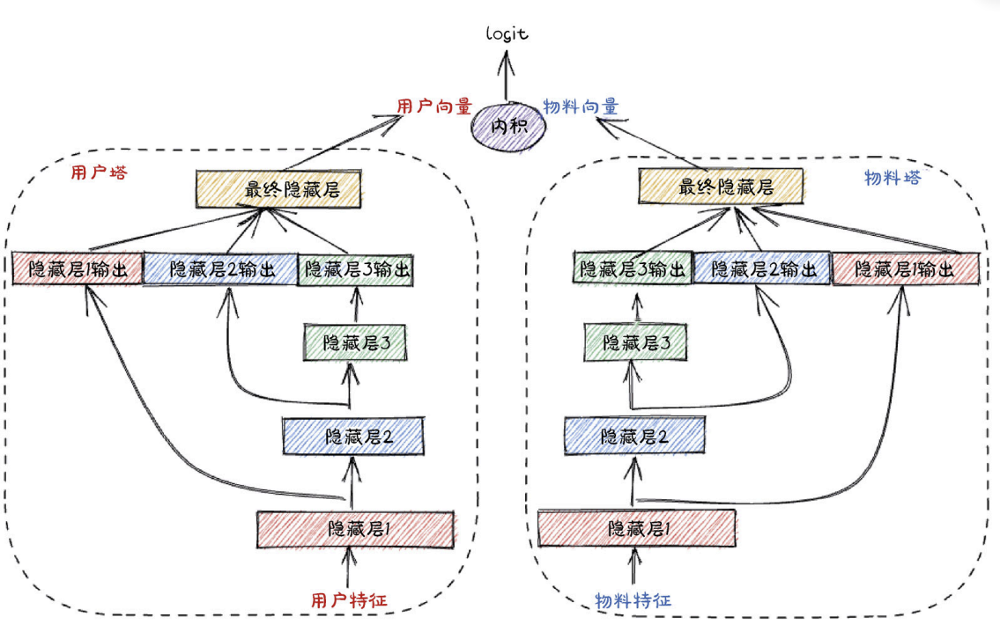

另一个方案是**将重要信息不仅接入最后一层还要插入各个中间层，这样重要信息就不会因为在塔中的传播路径太长而损失**。


抄近路也有**缺点**，**额外接入的信息会导致该层需要训练存储更多的参数**。


最后一种思路，**对信息可以通过多种通道向上流动，不必执着于DNN，最后将各通道得到的Embedding聚合**。


《深度粗排在天猫新品中的实践》一文中提出一种**“双塔+FM”**的并联结构，如下所示


$$
\text{logit}_{\text{tower}} = \boldsymbol{UE}_{\text{tower}} \cdot \boldsymbol{TE}_{\text{tower}} \\

 \text{logit}_{\text{FM}} = \boldsymbol{E}_{ht_1} \cdot \boldsymbol{E}_{ct} + \cdots + \boldsymbol{E}_{ht_N} \cdot \boldsymbol{E}_{ct} = \left( \sum_{i=1}^{N} \boldsymbol{E}_{ht_i} \right) \cdot \boldsymbol{E}_{ct} = \boldsymbol{UE}_{\text{FM}} \cdot \boldsymbol{TE}_{\text{FM}} \\

\text{logit} = w_{\text{tower}} \text{logit}_{\text{tower}} + w_{\text{FM}} \text{logit}_{\text{FM}} \\
$$


为了方便预测把公式拆解为两个向量点积的形式
$$
\boldsymbol{UE} = \text{concat} \left( w_{\text{tower}} \boldsymbol{UE}_{\text{tower}}, w_{FM} \boldsymbol{UE}_{\text{FM}} \right) \\
 \boldsymbol{TE} = \text{concat} \left( \boldsymbol{TE}_{\text{tower}}, \boldsymbol{TE}_{\text{FM}} \right) \\

 \text{logit} = \boldsymbol{UE} \cdot \boldsymbol{TE} \\
$$
当**信息传递的通道越来越多**，这种**简单的拼接**会导致**聚合后的向量非常长**，给**计算**、**存储**带来较大的压力，一种常见的做法是，将拼接后的向量**再经过一层FC**，映射成一个**较短的向量**。此外还有一种**Attention Fusion**的方法。


## 蒸馏

精排可以通过**知识蒸馏**的方式向粗排传道授业，**提升粗排模型的表达能力**。


知识蒸馏涉及**两个模型**

+ 一个模型拥有**相对复杂的结构**，**喂入了更多的特征**，表达能力也能强，称为**Teacher**模型，用$\text{F}_\text{t}(X; W_\text{t})$表示。因为**消耗的计算资源太大**，**无法满足在线预测的实时性要求**，或者**用到了在线根本无法拿到的特征，导致上线困难**。
+ 另一个模型**结构相对简单，特征也少**，称为**Student**模型，用 $\text{F}_\text{s}(X; W_\text{s}) $表示，**模型易于上线，实时性也好，但是能力不足**。


**知识蒸馏**可以**缓解Student模型能力不足的缺点**。


Student模型的**损失函数**由两部分组成

+ **拟合真实目标y**，表示为$ L_s(y, \text{F}_s(X; W_s))$
+ **拟合Teacher模型的输出**，表示为$ L_d(\text{F}_\text{t}(X; W_\text{t}), \text{F}_\text{s}(X; W_\text{s})) $

最后Student模型的优化目标是，**最小化以上两种损失的加权平均**
$$
\min_{W_s} (1-\lambda) \times L_s(y, \text{F}_s(X; W_s)) + \lambda \times L_d(\text{F}_t(X; W_t), \text{F}_s(X; W_s))
$$
训练完毕后，**只将Student模型部署上线**。


推荐系统中，**粗排作为Student，精排作为Teacher**，知识蒸馏除了能**提升粗排模型的表达能力**，还能**增强粗排、精排的一致性**。毕竟粗排的下游就是精排，如果挑选出的物料不符合精排的口味，那么粗排的努力就白费了。


一种在粗排实现知识蒸馏的方法是让**粗排、精排联合训练**，优化目标如下
$$
\min_{W_t, W_s} (1-\lambda) L_s(y, \text{F}_s(X; W_s)) + \lambda L_d(\text{F}_t(X, X^*; W_t), \text{F}_s(X; W_s)) + L_t(y, \text{F}_t(X, X^*; W_t)) 
$$

+ $\text{F}_\text{s}(X; W_s)$ 代表Student，也就是粗排模型。
+  $\text{F}_\text{t}(X, X^*; W_t) $代表Teacher，也就是精排模型。$X^* $ 是粗排模型不能用、只能为精排模型所用的那部分交叉特征。 
+ $L_s $ 和 $ L_t$ 代表普通的损失，让粗精排模型去拟合用户的真实反馈。 
+ $L_d $ 代表蒸馏损失，要最小化粗精排得分的差距。


这种联合训练实现起来有以下困难：

+ 联合训练的模型**包括粗排和精排的参数**，**非常庞大**，**无法保证两个目标在更新同一参数时不会相互干扰**。
+ **粗排精排耦合在一起，维护更新时牵一发而动全身，不能灵活应对业务目标**。


联合训练的方式一般只适合**小团队**，大厂实际用的是**两阶段蒸馏法**——**线上有了正在运行的精排模型，而且精排模型的打分早已被记录在日志中，让粗排去拟合就好了**。
$$
L = \frac{1}{|B|} \sum_{(X_i, s_i, y_i) \in B} (1-\lambda) L_{\text{CTR}} \left( y_i, \text{F}_{\text{pr}}(X_i) \right) + \lambda L_{\text{Distill}} \left( s_i, \text{F}_{\text{pr}}(X_i) \right) 
$$

+ $B $ 代表一个Batch，每条样本由输入特征向量 $X_i $、用户反馈 $ y_i $ 和精排打分 $ s_i $ 组成。
+  $\text{F}_{\text{pr}} $ 代表粗排模型。 $ L_{\text{CTR}} \left( y_i, \text{F}_{\text{pr}}(X_i) \right) $ 代表主损失函数，让粗排打分去拟合用户真实反馈 $y_i$ 
+  $ L_{\text{Distill}} \left( s_i, \text{F}_{\text{pr}}(X_i) \right) $ 代表蒸馏损失函数，让粗排打分去拟合精排打分$ s_i $。


## 粗排纠正曝光

**传统的粗排模型**的**样本选择策略**与**精排**一致，用**点击过的物品当正样本**，**“曝光未点击”的物品做负样本**。这种策略下，**所有的样本都来自于曝光数据**，粗排**没有真正见识过**“**低质量**”物料，因此造成了**样本选择性偏差（SSB）**


为此，需要在**被精排排在后面，没有曝光机会的物料中选择一部分作为粗排的负样本**，步骤如下

1. 精排排序后，选择若干头部物品和尾部物品组成$S_{top}与S_{bottom}$
2. 将$S_{top}与S_{bottom}$中的物料俩俩配对，与当前用户u，组成一系列三元组$ T = \{(u_p, t_p, t_n)\}, \forall t_p \in S_{\text{top}}, \forall t_n \in S_{\text{bottom}} $
3. 损失函数使用Pairwise，目标是$ \text{F}_{\text{pr}}(u, t_p) \gg \text{F}_{\text{pr}}(u, t_n) $
4. 实践中，可以对$S_{top}$增加BCE loss


损失函数如下
$$
L_{\text{pr}} = \frac{1}{|T|} \sum_{(u, t_p, t_n) \in T} L_{\text{LTR}} \left( \text{F}_{\text{pr}}(u, t_p), \text{F}_{\text{pr}}(u, t_n) \right) + \frac{\lambda}{|S_{\text{top}}|} \sum_{(u, t, y) \in S_{\text{top}}} L_{\text{CTR}} \left( \text{F}_{\text{pr}}(u, t), y \right)
$$

+ $ \text{F}_{\text{pr}}(u, t) $ 是粗排模型对用户$ u $和物料$ t $之间匹配程度的打分。 
+  $ T $ 是按照上面介绍的步骤组成的三元组。 $ L_{\text{LTR}} \left( \text{F}_{\text{pr}}(u, t_p), \text{F}_{\text{pr}}(u, t_n) \right) $ 是用Pairwise Loss建模精排结果的偏序关系。
+  $ S_{\text{top}} $ 是包含精排结果中的头部物料的那部分样本，它们得到了曝光机会，从而拥有用户真实反馈$y$。 
+ $ L_{\text{CTR}} \left( \text{F}_{\text{pr}}(u, t), y \right) $ 就是普通的CTR预估，让粗排打分拟合用户的真实反馈。


## 多目标排序模型

多目标排序属于**前期融合**，比后期融合准确度高，**线上做推理的代价大**，有n个物品就要做n次推理。


目标是点击/点赞/收藏/转发，如果有对应的行为，那么值就是1，反之为0。使用**交叉熵**计算每个指标的损失，最后汇总起来，做梯度下降。

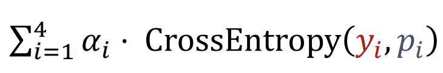


模型中以**样本是否被点击过**来判断正负样本，系统中负样本的数量会**远远大于**正样本的数量，模型不应该把大量的时间花费到学习无用的负样本上，因此会对负样本做**降采样**——保留一小部分负样本，让两类样本数量平衡。


由于负样本减少，**预估出的点击率会大于真实点击率**，因此需要做预估值校准


**真实点击率：**
$$
p_{\text{true}} = \frac{n_+}{n_+ + n_-}
$$
**预估点击率：**
$$
p_{\text{pred}} = \frac{n_+}{n_+ + \alpha n_-}
$$
**校准公式：**
$$
p_{\text{true}} = \frac{\alpha \, p_{\text{pred}}}{(1 - p_{\text{pred}}) + \alpha \, p_{\text{pred}}}
$$

​	


## 视频播放建模

视频排序的依据额外包括**播放时长和完播率**。


实践证明，**直接用回归拟合播放时长的效果不好**，设关于播放时长的**全连接层**的输出为**z**，播放时长为**t**，定义$p = \frac{\exp(z)}{1 + \exp(z)}，y = \frac{t}{1 + t}$，**损失函数为 $CE(y, p) = y \cdot \log p + (1 - y) \cdot \log(1 - p)$。**在**预测**时输出**exp(z)**作为播放时长的指标。

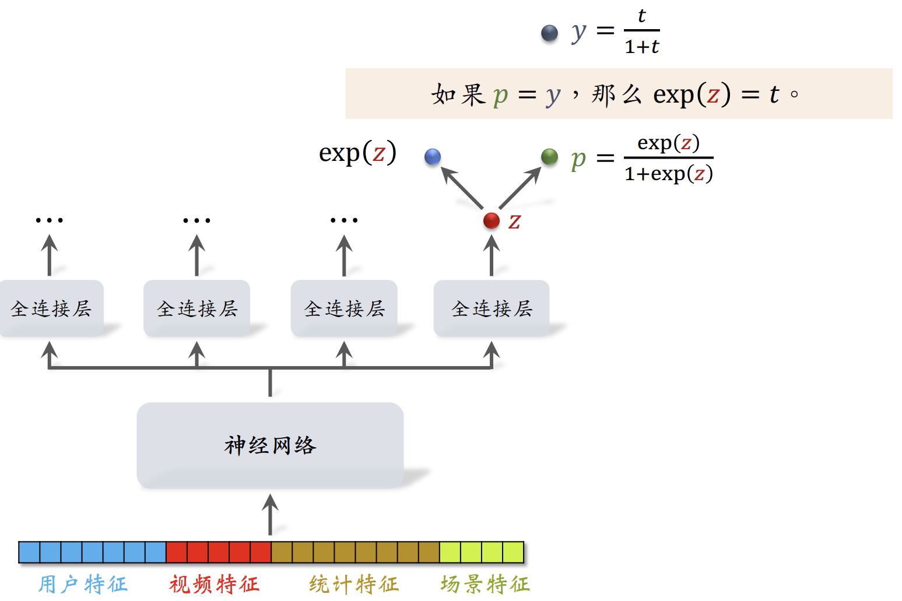


完播率可以用**回归或者分类**方法求解。回归方法：如果视频长度为10mins，播放了6mins，那么完播率就是0.6，使用交叉熵函数拟合；分类，工程师**自定义**正负样本，如播放时间大于80%记为正样本。


得到**完播率后不能直接用于融分公式**，因为**长视频**的完播率显然低于**短视频**，需要做**调整**保证公平。

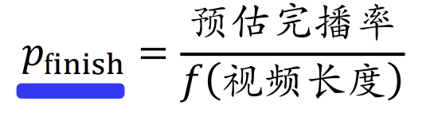


## 粗排三塔模型

**计算开销介于双塔模型和精排模型之间。**


- 用户塔很大，线上只做一次计算。
- 物品塔较大，系统会**缓存**物品塔的输出，因此物品塔可以**避免大部分推理**。
- 交叉他较小，用于计算统计特征和交叉特征，有n个物品就要做n次推理。

模型的主要开销集中在**上层**


粗排阶段也考虑多样性，首先会将**兴趣分数最高**的200个物品送入精排，随后对剩下的物品计算多样性分数，取出其中**兴趣分数+多样性分数最高**的300个送入到精排。


# 交叉结构

要实现特征交叉，只依靠DNN这种**隐式交叉**是远远不够的，还应该加上**指定阶数**的显示交叉作为补充。

1. Wide & Deep就是用**一阶LR**作为Deep侧的补充。 
2. DeepFM用FM实现**二阶交叉**作为Deep侧的补充。 
3. DCN可以指定**任意阶数**的显式交叉，作为Deep侧的补充。


## Factorized Machine FM

传统的线性模型中只能表示单个特征对目标的影响


$$
\hat{y} = w_0 + \sum_i w_i x_i
$$
如果加入**特征交互项**会带来巨大的计算量和存储开销，因为交叉特征矩阵是对称矩阵，所以FM将其拆解为**两个向量的内积**：
$$
\hat{y} = w_0 + \sum_i w_i x_i + \sum_{i<j} w_{ij} x_i x_j
$$
向量的每一项对应一个特征的Embedding

$$
w_{ij} = \langle v_i, v_j \rangle = \sum_{f=1}^{k} v_{i,f} v_{j,f}
$$
公式化简

$$
\begin{align*}
&\sum_{i=1}^n \sum_{j=i+1}^n \langle v_i, v_j \rangle x_i x_j（实际上是一个上三角矩阵） \\
=&\frac{1}{2} \sum_{i=1}^n \sum_{j=1}^n \langle v_i, v_j \rangle x_i x_j - \frac{1}{2} \sum_{i=1}^n \langle v_i, v_i \rangle x_i^2 （所有的特征和减去对角线后除二） \\
=&\frac{1}{2} \left( \sum_{i=1}^n \sum_{j=1}^n \sum_{f=1}^k v_{i,f} v_{j,f} x_i x_j - \sum_{i=1}^n \sum_{f=1}^k v_{i,f}^2 x_i^2 \right) \\
=&\frac{1}{2} \sum_{f=1}^k \left( \left( \sum_{i=1}^n v_{i,f} x_i \right) \left( \sum_{j=1}^n v_{j,f} x_j \right) - \sum_{i=1}^n v_{i,f}^2 x_i^2 \right) \\
=&\frac{1}{2}\sum_f \Big[(\sum_i v_{if}x_i)^2 - \sum_i v_{if}^2 x_i^2\Big]
\end{align*}
$$

注意$v_i和v_j$是**同一个矩阵**的转置，使用向量内积大大**减小了参数的数量**，从$O(n^2)$到$O(nk)$，k是自定义的向量维度


## Wide & Deep

Wide & Deep用于解决**记忆能力和泛化能力**的矛盾，网络由**浅层网络Wide与深层网络Deep**两部分组成，前者负责记住**共现规则**，后者负责学习**低维稠密表示的组合泛化**。


Deep侧遵循推荐模型的经典设计凡是：**Embedding+DNN**，将稀疏特征映射为稠密向量，再拼接为一个大向量输入到DNN中

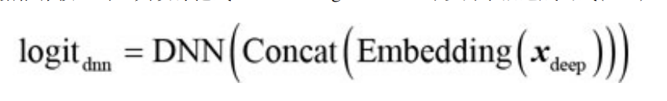


**Deep侧对特征使用Embedding扩展它们的内涵，再加上DNN对特征进行高阶隐式求导，大大增强了模型的扩展性和推荐系统的多样性，有利于满足低频，小众，个性化的用户需求**。Deep侧接受的都是手动设计以外的特征。


Wide侧实际就是一个**LR**


Wide侧发挥LR“**强于记忆**“的优势，把那些在训练数据中**高频大众**的模式牢牢记住，同时也用于**防止Deep侧过度扩展而影响预测精度**，起到了类似**正则化**的作用(当Deep侧因为**泛化**而试图给出不切实际的高分时，**wide侧会根据历史记忆，发现这个特征组合在过去表现很差，因此产生负向得分拉低最终的估值**)。Wide侧的LR不必像单独使用时大而全，喂入其中的都是一些被先验知识认定为**非常重要的精华特征**，主要是一些人工设计的交叉，还有一些影响推荐系统的偏差特征。


模型最终的预测结果是两部分相加再过sigmoid

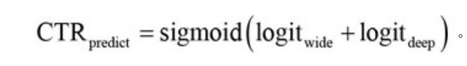


## DeepFM

Wide & Deep 中Wide侧主要喂入一些**手工设计的交叉特征**，**耗费精力并严重依赖工程师的经验**，为了解决这一问题，将**Wide侧替换为FM**，自动进行二阶特征交叉。


DeepFM中原始特征共享embedding层(有助于加速网络训练，使embedding学习的更充分)，得到**embedding拼接后送入到Deep侧，FM侧送入稀疏特征以及它的embedding**.

$$y_{FM} = \langle w, x \rangle + \sum_{i=1}^d \sum_{j=i+1}^d \langle V_i, V_j \rangle x_i \cdot x_j$$， $$\hat{y} = sigmoid(y_{FM} + y_{DNN})$$


## 深度交叉网络 DCN

DCN解决FM和DeepFM的FM部分只能处理**二阶交叉**的问题，同时使用更少的参数。

整体结构 = Embedding 层 + Cross Network + Deep Network + 输出层


模型简化图如下

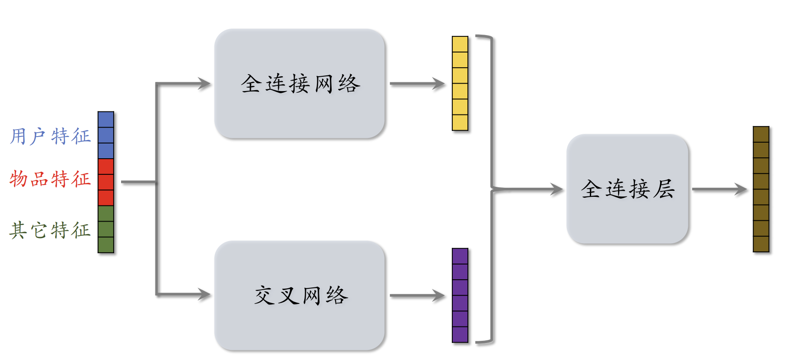


**Embedding and stacking layer**：对特征进行embedding然后拼接。


**Cross Network**：$$x_{l+1} = x_0 x_l^T w_l + b_l + x_l = f(x_l, w_l, b_l) + x_l$$，其中l是层数，$x_0$是第一层输入。**每一层将阶数提升一，L层最多可以得到L+1阶显示多项式交叉，参数量O(Ld)远小于全连接高阶组合，类似于残差连接的计算方式可以使其累加多层也不会产生梯度消失的问题**


**Combination Layer**：需要先将 Cross Network 与 Deep Network 的结果进行 **Concatenation**, 输入到 LR 模型, 从而得到预测概率。

## SENet

SENet对**特征加权**

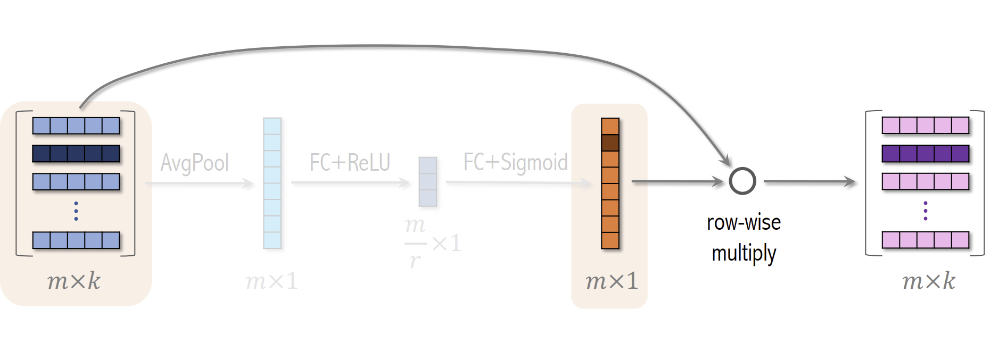


假设有m个特征，经过**Embedding**后得到m个k维向量（**向量的大小可以不同**），经过平均池化，全连接+ReLU，全连接+Sigmoid后得到m维的**权重向量**，将权重向量的值**乘到[m,k]的输入对应行的每个元素上**得到加权后的结果。


## FiBiNet

FiBiNet是结合了**Bilinear Interaction和SENet**，核心是让**重要的特征**参与到特征交叉计算中，而不是默认等权。

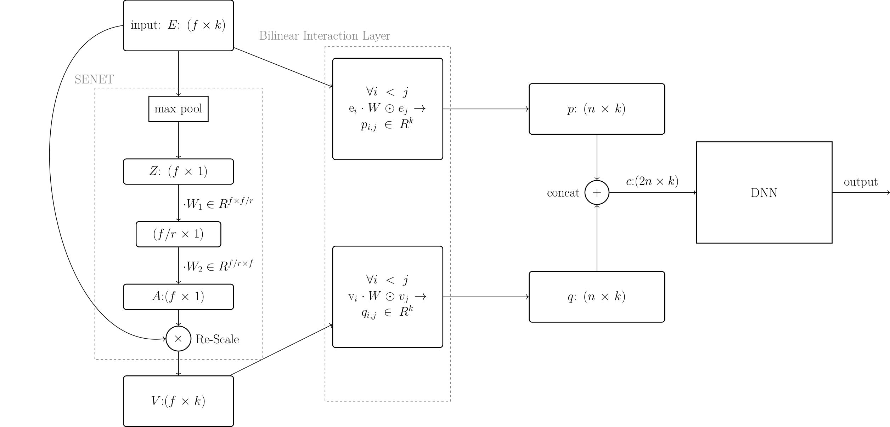


传统的特征交叉的方法使用**内积和Hadamard乘积（逐元素相乘，不求和）**，两种方式在**稀疏数据**上很难有效对特征交叉进行建模

 


**Bilinear Cross是一种更先进的特征交叉方法，在上述两种方式上引入了额外的参数矩阵**，在保持二阶结构的前提下，**提高特征交叉的表达能力**，同时仍可控。

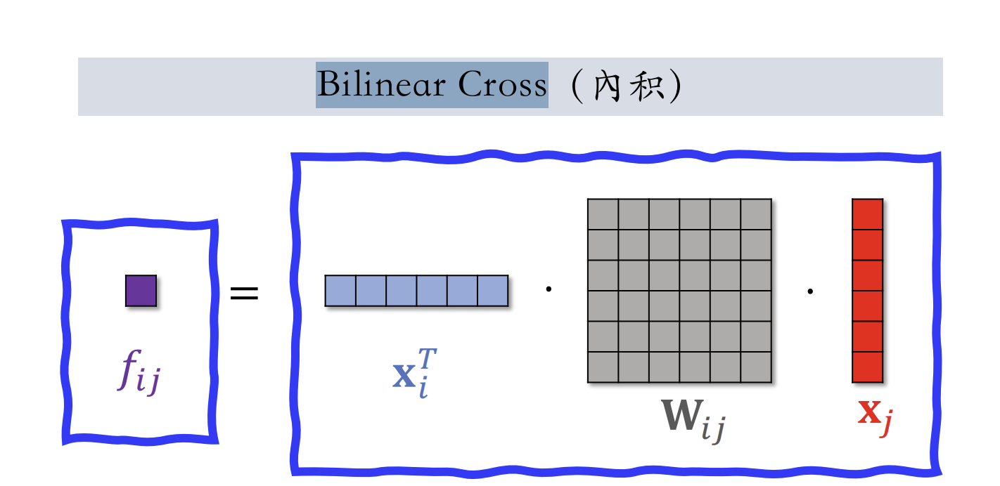

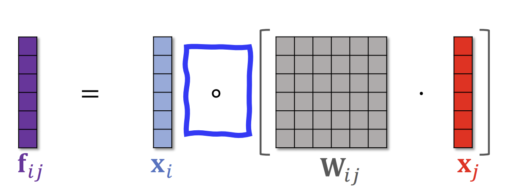


模型的输入经过embedding后会走两条路线，**一条送入到SENet中得到加权后的结果，之后使用Bilinear interaction做特征交叉，一条直接做Bilinear interaction**，最终将两部分输出的结果**拼接**起来送入到一个**DNN**得到最后的结果。


# 用户行为序列建模

## LastN特征

LastN特征是**用户特征**中的一种：**把用户最近交互过的N个物品ID做Embedding得到n个向量后取平均**。


适用于**双塔模型，三塔模型，精排模型**，简单Pooling提取出的兴趣是固定的，**不能够随着候选物料的变化而变化**。

## Din模型

Din模型将**attention机制引入到了用户兴趣建模上**，传统推荐模型（如 Wide&Deep、DeepFM）通常将用户历史行为（商品向量、商铺向量、商品类别向量）直接**平均池化**，对不同的item使用了相同的user embedding。

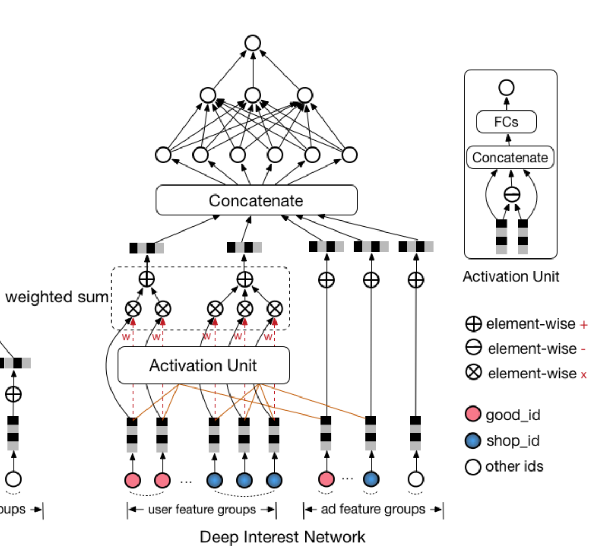

DIN使用 **Attention机制**，根据 **候选商品** 动态计算用户历史行为的重要性。

每个历史行为（包括购买的商品、浏览的店铺、购买的商品类别），候选商品也会有**对应的**三个向量，在注意力模块中历史购买商品只与候选商品交互、历史浏览店铺只与候选商品的店铺交互、历史购买的商品类别只与候选商品类别交互，得到对应的历史行为的权重，每个行为都会得到一个权重。

DIN网络核心模块**Activation unit**，**为序列中每个历史item计算与当前候选物品的相关性权重**。

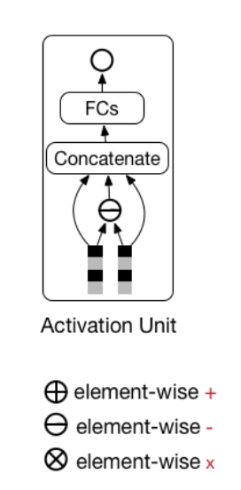

先构造特征匹配$$\mathbf{z}_i = [\mathbf{e}_i,\ \mathbf{e}_a,\ \mathbf{e}_i - \mathbf{e}_a,\ \mathbf{e}_i \odot \mathbf{e}_a]$$，$$\mathbf{e}_i \in \mathbb{R}^d$$（某个历史行为特征的embedding），$$\mathbf{e}_a \in \mathbb{R}^d$$（候选物品特征的embedding），能让模型学习到差异和细粒度信息。


Din的一个缺点在于忽略了**行为序列内部各元素之间的依赖关系**，目前较为常用的对用户行为序列建模的方法是采用双层Attention。

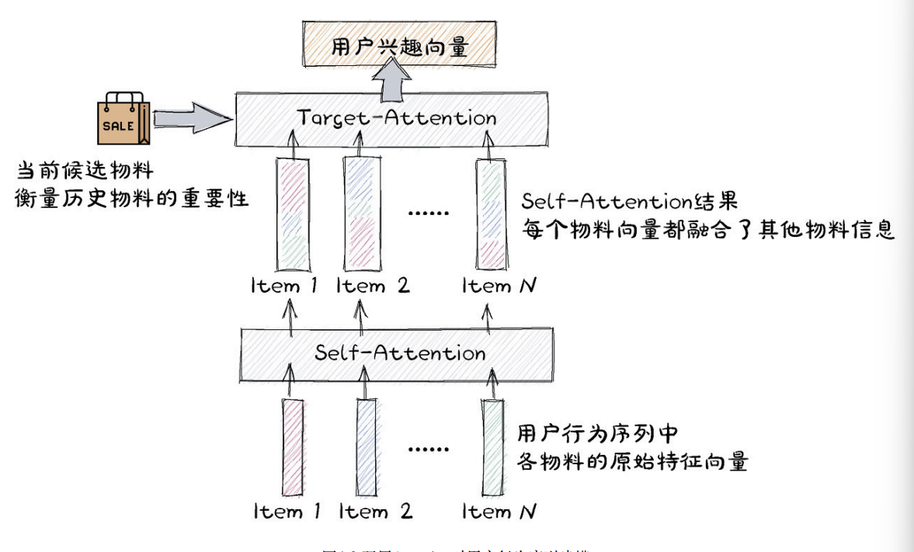

第一层attention得到的每个新元素都**融合了原始序列中其他物料的信息**，然后进入到Din模型

## SIM模型

DIN模型的计算量与**N的大小**有关，因此只会保留最近的**几百个物品**，只会导致模型**关注短期兴趣，遗忘长期兴趣**。


SIM模型在DIN模型的基础上**保留更大的N**，计算时**快速排除**掉与**候选物品无关**的LastN物品，**降低计算量**。


SIM模型第一步做**查找**

+ **Hard Search，根据候选物品的类目，保留类目相同的即可，简单快速无需训练。**查找时不可能为每个候选物料把用户全部历史都遍历一遍，为了加速这一过程，阿里巴巴设计了了**User Behavior Tree**（UBT）数据库，**将每个用户的长期行为序列分门别类地缓存起来**。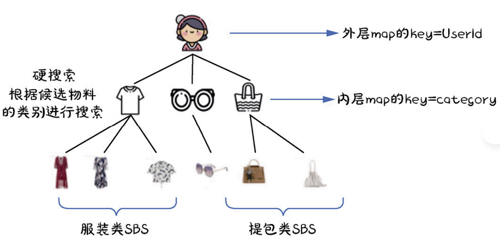
+ **Soft Search，物品做Embedding，把候选物品做query，使用K近邻查找。效果更好，但是实现更复杂。**


接下来**计算相似度做加权平均**。


对历史物品拼接一个**时间间隔**(历史行为发生时间与当前候选物品曝光时间之间的差值)，用于**建模兴趣随时间衰减**，随后使用多头注意力机制计算权重


# 重排

重排的主要目的不是过滤和筛选， 而是**调整精排结果的顺序**，将**相似内容打散**，以保证用户在一屏之内看到的推荐结果丰富而多样。

## 多样性的度量

基于**物品属性**标签。

- 类目、品牌、关键词……，以类目为例，计算出多级类目的**相似度后做加权和**，权重按照**经验**设置


基于物**品向量**表征。

- **用召回的双塔模型学到的物品向量（不好）**，由于物品具有**长尾特征**，**物品塔不能很好的学到物品的表征**。
- **基于内容的向量表征（好）**。使用**CV和NLP**的技术提取**物品内容**的特征与其他物品计算相似度，但是这一过程**缺少标注数据**无法训练网络。目前主要通过**CLIP**预训练方法——**对于图片和文本的二元组，预测图文是否匹配**。

​                           

多样性算法用在**排序的后处理**中，精排的后处理称为**重排**。


## 基于启发式规则重排

**小型推荐系统**没有必要采用**复杂**的重排模型，只需要实现一些**打散规则**，这些规则的输入是按照**精排打分降序排列的物料序列**，输出序列需满足：

+ **避免相似物料排在一起，最大化整个或局部序列的多样性**。
+ **对于原始精排序列的改动要尽可能小**，仍然要确保整个或局部序列与用户的相关性。


一种常见的打散规则称为“**滑窗打散**“，即**在一个长度为K的滑动窗口内，相似物料最多出现n次**。

另一种常见的规则是”**分桶打散**“，比如在电商场景下，精排模型以最大化成交额为优化目标，因此排在前面的往往都是价格较贵的物料，而我们希望最终展示的结果在价格上呈现多样性。因此，按照价格高低划分三个桶，将精排结果按照价格区间插入到对应的桶中，**每个桶内按照精排分数降序排列**。最后，按序取出各桶内的头部物料，排列成最终结果。

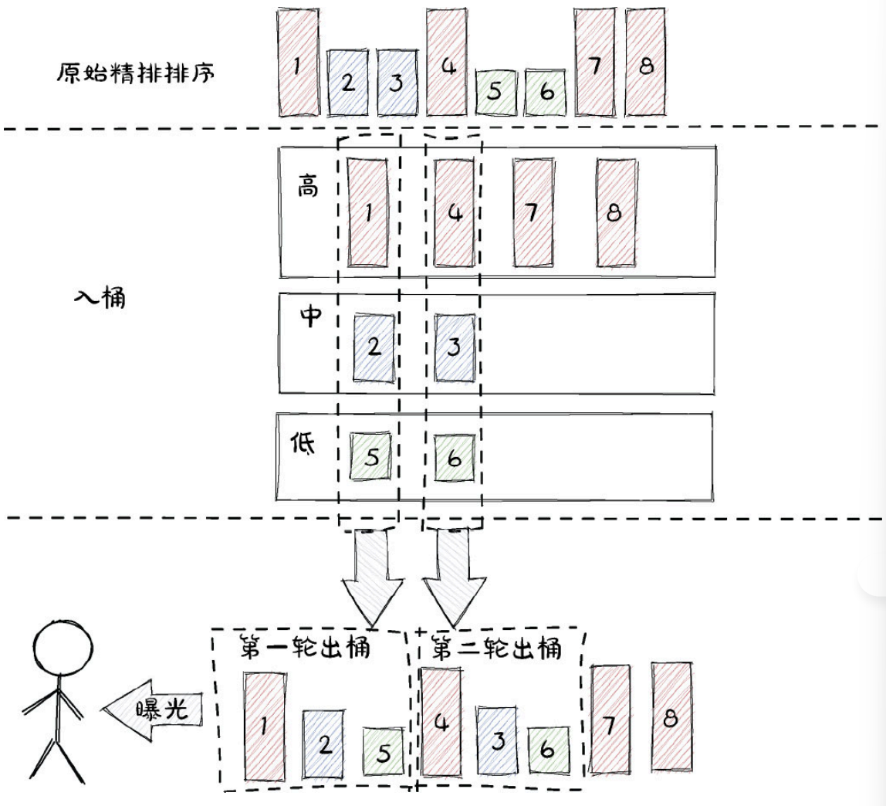


还有一类算法将**相关性和多样性量化，并基于贪心算法实现**。其中最著名的是**Maximal Marginal Relevance** （**MMR**，最大边界相关），从精排的物品中选出**具有多样性的k个物品**，那么既要考虑**精排分数**也要考虑**相似度分数**。


MMR定义公式

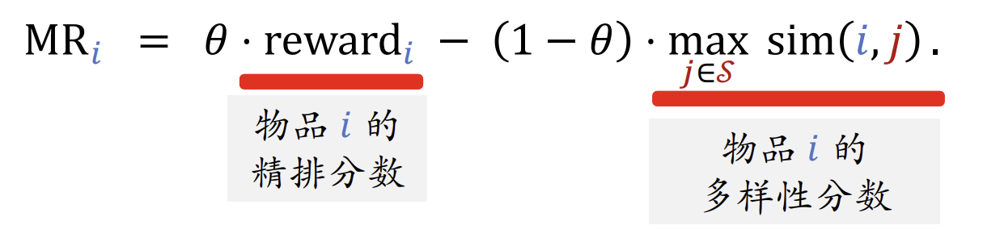

其中S是**重排结果集**，每一轮在**精排结果集/重排结果集**中取出**MR分数最大**的物品作为已选物品，相似度的计算可以用物料的Embedding做点积。


Airbnb在MMR的基础上进行改进，提出了MLR，其核心思想是：**后插入重排结果集的物料，其显示位置也靠后，对整个集合的相关性和多样性的影响也大大削弱了**。公式中引入了**位置p**，具体如下

$$
 \text{MLR}(u, S, t, p) = \lambda \text{c}(p)\text{Sim}_1(u, t) - (1-\lambda) \text{d}(p)\text{Sim}_2(S, t) 
$$

+ c(p)是在位置p上对相关性打的折扣，用后验CTR表示
+ d(p)是在位置p上对多样性打的折扣，用1/p表示


基于规则的重排算法，其优点是**无需训练模型，易于实现**。缺点是，**在刻画多样性时，只考虑了两个物料之间的相似**。


## 基于行列式点过程 DPP

一组向量 **$\mathbf{v}_1, \cdots, \mathbf{v}_k \in \mathbb{R}^d$** 可以确定一个 **$k$ 维超平行体**（二维中是平行四边形，三位中是平行六面体）：
$$
\mathcal{P}(\mathbf{v}_1, \cdots, \mathbf{v}_k) = \{ a_1 \mathbf{v}_1 + \cdots + a_k \mathbf{v}_k \mid 0 \le a_1, \cdots, a_k \le 1 \}.
$$
要求**k<=d**，因为三维空间中可以有二维超平形体，但反过来不行。


如果向量之间**线性相关**，那么超平形体的体积为**0**。把**物品表征为向量**，它们形成的**超平形体的体积**可用于**衡量多样性**——**体积越大，多样性越好**。


将向量组成**矩阵**，那么**体积可以用矩阵的行列式**表示：$\det(V^{T}V) = \operatorname{vol}(\mathcal{P}(\mathbf{v}_1, \cdots, \mathbf{v}_k))^2.$


**DPP**，行列式点过程，在候选集中选出**相似度不高**的子集
$$
\underset{S: |S| = k}{\text{argmax}} \log \det(V_S^T V_S)
$$


Hulu将DPP应用到推荐系统中
$$
\underset{S: |S| = k}{\text{argmax}} \theta \cdot (\sum_{j \in S} \text{ reward}_j) + (1 - \theta) \cdot \log \det(A_S)
$$
设A为$k \times k$的矩阵，它的$(i,j)$元素为$a_{ij} = \boldsymbol{v}_i^T \boldsymbol{v}_j$，给定k个d维的向量，计算矩阵A需要**O($k^2d$)**的时间。


想要找出**集合S**是一个**NP-hard**的问题，只能通过**贪心算法**近似求解，**每一轮从未选物品中找出一个分值最大的物品作为已选物品**，候选物品添加到矩阵A中就是**多出一行和一列**。
$$
\underset{i \in \mathcal{R}}{\text{argmax}} \ \theta \cdot \text{reward}_i + (1 - \theta) \cdot \log \det(\boldsymbol{A}_{\mathcal{S} \cup \{i\}})
$$
上述公式中，**计算行列式需要O($n^3$)**，一轮要遍历R个物品，一共要选出K个，那么时间复杂度近似
$$
O(|\mathcal{S}|^3 \cdot |\mathcal{R}| \cdot k) = O(nk^4)
$$


最后总的时间复杂度为**$$O(n^2d + nk^4)$$**


推荐系统的重排时间一般只有10ms，对于上述系统的时间复杂度显然**超出**，Hulu提出利用**Cholesky分解**加速计算，仅需 **$O(n^{2}d + nk^{2})$** 的时间。Cholesky分解**$\boldsymbol{A}_{\mathcal{S}} = \boldsymbol{L}\boldsymbol{L}^T$**，其中 $\boldsymbol{L}$ 是**下三角矩阵**。$\boldsymbol{A}_{\mathcal{S}}$ 的行列式为 **$\det(\boldsymbol{A}_{\mathcal{S}}) = \det(\boldsymbol{L})^2 = \prod_i l_{ii}^2$**，添加一个物品的变换可以**快速反应**在$\boldsymbol{L}$上。


DPP也使用**滑动窗口**并可以**结合规则**使用。


## 基于上下文感知的排序学习

这种重排方法是**训练并使用专门的重排模型**，重排模型接受精排筛选后的物料作为输入，再次筛选并调整物料顺序后，输出展示给用户。


与其他阶段的模型不同，它将**整个候选集都喂入模型**，候选集中的物料**不再独立**，模型评估的是**某个物料在候选集中其他物料（即上下文）的影响下，被用户选择互动的概率有多大？能带来多大的收益？**


对于重排模型，优化目标如下：
$$
\min \frac{1}{|B|} \sum_{(S,Y) \in B} \sum_{i \in [1,|S|]} \text{Loss} \left( Y_i, \text{F}_{\pi} \left( S_i, \text{Context}(S,i) \right) \right) 
$$

+ $(S,Y)$ 是Batch中的一条样本。$S$是某次曝光的物料序列，$Y$是用户对$S$的反馈组成的序列。 
+  $S_i$ 是曝光序列中第$i$个位置上的物料，$Y_i$是用户对$S_i$的反馈（比如是否点击、是否购买）。 
+  $\text{F}_\pi$ 就是重排模型，预测$S_i$被用户交互的概率。可以看到，它与$S_i$本身有关，还与第$i$个位置的上下文$\text{Context}(S,i)$有关。 
+  Loss可以是普通的交叉熵损失函数。


物料$S_i $ 除了包括常规的物料ID，分类，标签等物料画像信息，还有两类重要信息

+ **用户针对$ S_i $ 的个性化信息**
+ **$ S_i $ 在整个候选集中的排名、位置信息**


上述的训练过程都要**依赖\(** S \) 这样一个**顺序已知的序列**，这个序列在训练时是已知的，但是在线预测时无法作为输入。最笨的方法是全枚举，不过这种方式无法上线，实践中常用**贪心搜索**。


基于上下文感知的排序学习在业界有一些经典实现


阿里巴巴的**miRNN模型**，**使用RNN对某物料在上下文影响下的购买概率进行建模**。
$$
p(S_i \mid S_1, \cdots, S_{i-1}) = \text{sigmoid}(W_h h_i) \\
 h_i = \text{RNN}(h_{i-1}, \text{F}_e(S_i))
$$

+ $ h_{i-1}$是RNN将序列 $[S_1, \cdots, S_{i-1}]$压缩成一个向量，就是 $S_i$的上下文。
+ $F_{e}$是提取物料特征的函数，不仅包括物料本身的属性，还包括了物料在关键指标上的排名信息


miRNN在搜索最优序列时，**使用Beam Search取代了贪心搜索**

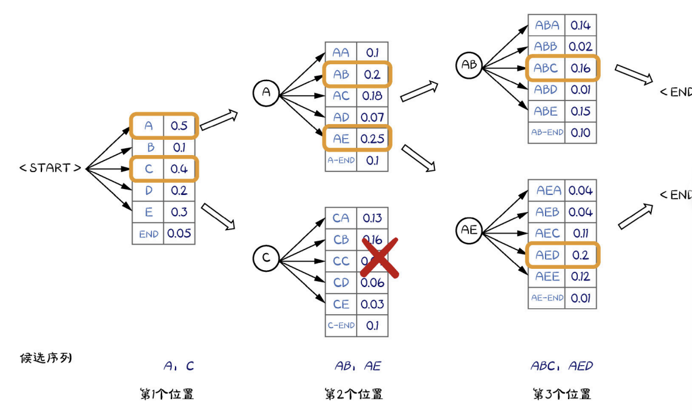


阿里巴巴的**PRM**模型**用Transformer取代RNN**，对候选集中物料的相互关系建模。

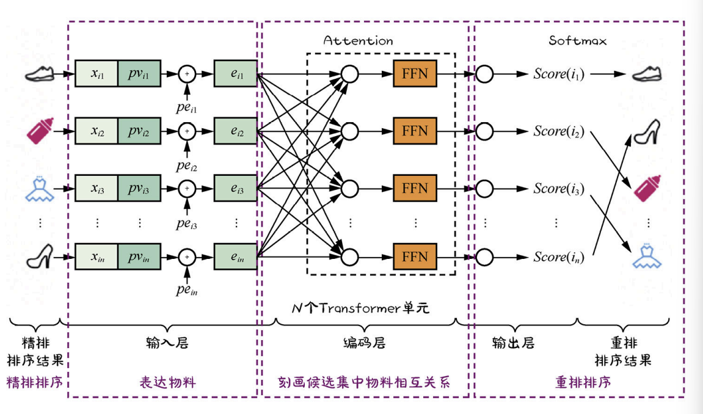


PRM有三个关键步骤，**第一步是表达物料$ S_{i} $**
$$
 E_{S_i} = \text{concat}(X_i, PV_i) + PE_i
$$

+ $X_i $ 是物料自身属性组成的特征向量，比如Item ID映射成的Embedding。 
+  **$PV_i$包含用户对物料$ i $的个性化信息**。为了保证重排模型的精简，**PRM取精排模型倒数第二层的输出向量作为PV**。 
+  $PE_i$ 是物料$i$在精排中排名的Embedding，体现物料$i $与候选集中其他物料的相对位置关系，对于提高模型表达能力至关重要。


**第二步使用Transformer对候选集中物料的相互关系建模**。

- Transformer能使物料i的**上下文不再局限于排在i之前的物料，还包括i之后的**。
- Transformer的**建模能力不会随着序列变长而下降**。
- Transformer可以**在各个位置上并发执行**，而RNN只能从前往后顺序执行。


**最后一步是对Transformer的结果排序**，PRM为每个物品计算一个**分数**，**降序**作为重排的输出。
$$
 \text{Scores} = \text{Softmax} \left( \boldsymbol{F}^{(N_x)} \boldsymbol{W}_F + \boldsymbol{b}_F \right) 
$$

# 多任务与多场景

## 多任务推荐

**多任务建模**，也称**多目标建模**，例如同时建模三个目标：从曝光到点击的（CTR），从点击到购买（CVR），从曝光到购买（CTCVR）。


推荐系统中**不能对每个目标单独建模**，这会对**内存和算力**带来巨大的消耗。另一个原因是：**用户转化是一个链条** ，比如先点击，再加入购物车最后购买，这个**链条中越靠后的环节价值越大，但是可用的正样本也越少，单独训练会带来较大的误差**。

此外，推荐系统也不能**只对终极目标建模**，例如CTCVR，**只考虑CTCVR能带来短期利益，但是不利于提高用户粘性和长期销售额**（只推荐购买能力之内的中低价物品）；此外，**其他的指标也能带来价值**，不可忽略。

### 并发建模

这种模式下**为每个目标独立建模，忽略目标间的因果关系**。


并发建模最直接的实现方式就是**共享底层**。

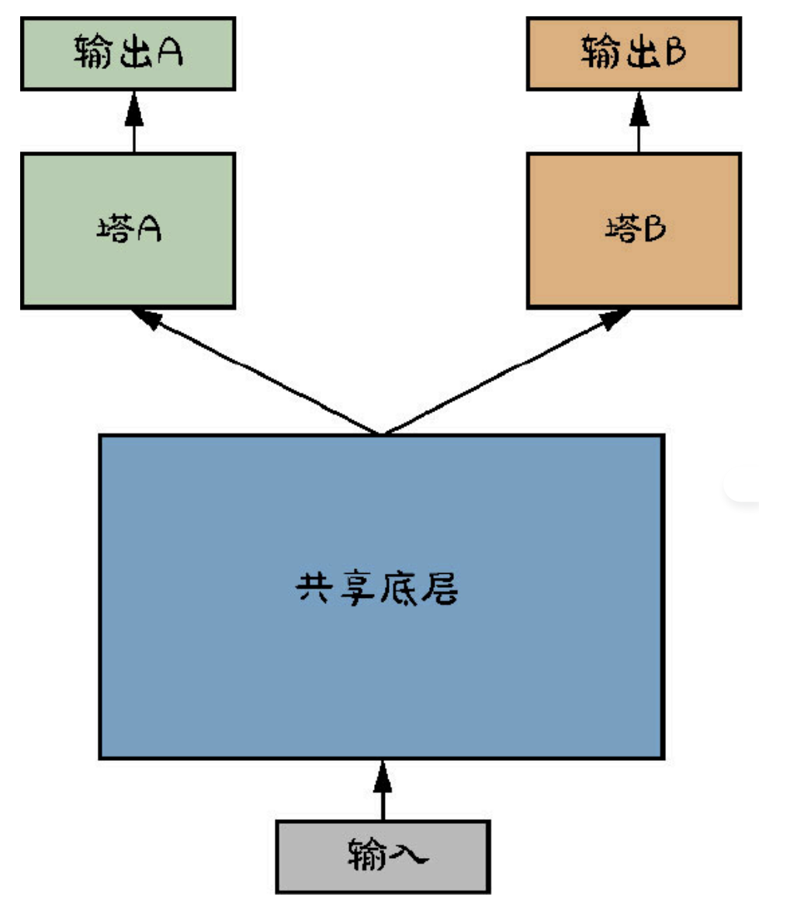****


理想化的情况下，共享底层能实现**多任务之间的知识迁移**，保证**样本数较少的任务能够利用充分训练好的底层**。但实际上，**不同任务间可能会相互影响**，导致**单独训练的结果比联合训练好，或者出现牺牲一个任务来优化另一个任务的情况**。

#### MMoE

MMoE，Multi-gate Mixture-of-Experts，是用于**多任务预测**（例如电影推荐，既要购买也需要打高分）的模型，它在所有任务间**共享专家子模型**，并为每个任务配备**门控网络**，用于**学习一组专家加权系数**。


此前许多基于DNN的多任务学习模型对**数据分布差异以及任务之间的相关性**等因素十分敏感。有大量参数被共享时，由任务差异所带来的内部差异可能会损害部分任务的预测性能。以shared bottom为例，任务之间的相关性越低，模型的表现就越差。

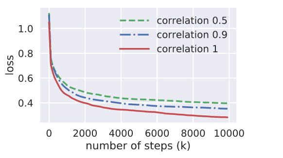


MMoE**显式建模任务之间的关系**，并学习任务特定功能来有效利用共享表示，该方法可以自动分配模型参数，以捕获任务间的共享信息或任务特有信息，从而避免为每个任务引入大量的参数。

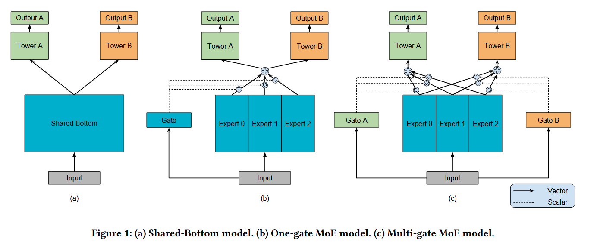

使用多个专家而不是DNN是为了解决**负迁移：强行共享底层参数时，当任务A和任务B的相关性很低，任务A的梯度更新可能会抵消掉任务B的梯度，导致模型两个任务都学不好**。

原始特征先做**embedding**，然后**拼接成共享输入向量x,同时输入到所有的专家和gate中**


任务K的整体输出，$h_{k}$代表任务塔：
$$
y_k = h_k\big(f^{(k)}(x)\big)
\tag{6}
$$
任务K的专家加权和MoE，每个专家是一个MLP


$$
f^{(k)}(x) = \sum_{i=1}^{n} g_k(x)_i , f_i(x)
\tag{7}
$$
其中，第i个expert的输出为 $f_i(x)$，n为expert数量


任务k的门控网络
$$
g_k(x) = \operatorname{softmax}\left(W_{g_k} x\right)
\tag{8}
$$


系统中的Softmax激活函数可能出现**极化现象**：**Softmax输出值中的⼀个接近1，其余接近0**。这会导致只有一个专家的推理结果被使用。

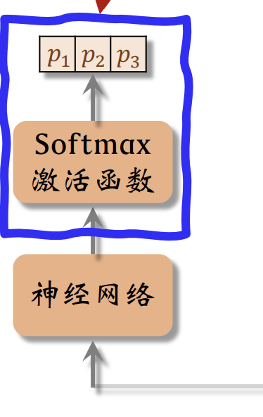

为了解决这个问题，**训练时对Softmax输出的每个向量值以10%的概率dropout**。


#### PLE

多任务学习往往会受到**负迁移（任务之间相关性弱、存在竞争，甚至冲突）**的影响，导致性能退化；同时，通过大量的实验观察到，**一个任务表现的提升往往是通过牺牲其他任务得到的**。

MMoE能够**缓解负迁移**现象但不解决，同时它还存在**跷跷板现象**，因为**MMoE忽视了专家间的不同和交互，任务间的参数会互相干扰**。


PLE，**渐进式分层提取**，相比MMOE有两点改进

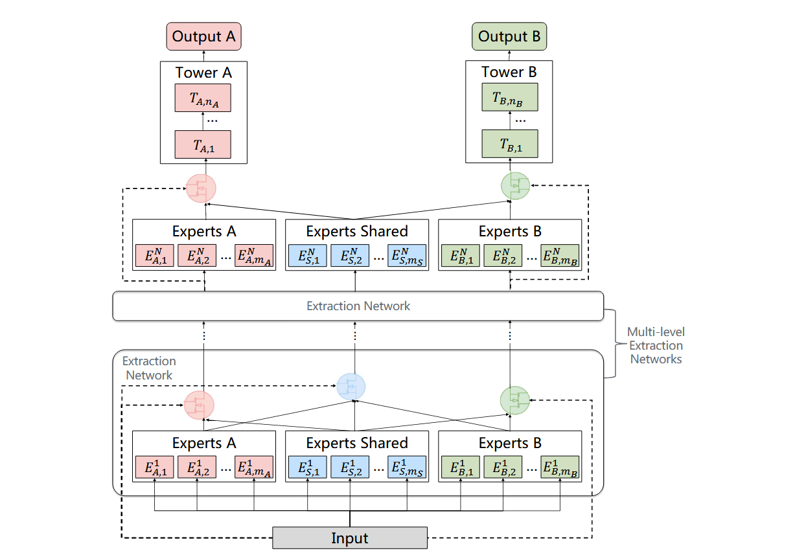


其一，**对模型的共享部分继续拆解**，将**所有专家拆分为任务独占和任务共享两大类**，**前者参与单一任务，后者参与所有任务**。通过显示地**分离**共享专家与任务特定专家，缓解通用知识与任务特定知识之间的**有害参数干扰**。

其二，PLE中引入了**多层专家，专家之间层层递进、深化**，**底层学习共享表示，高层接受底层的输出学习特定的任务表示**。


PLE是对CGC网络的扩展

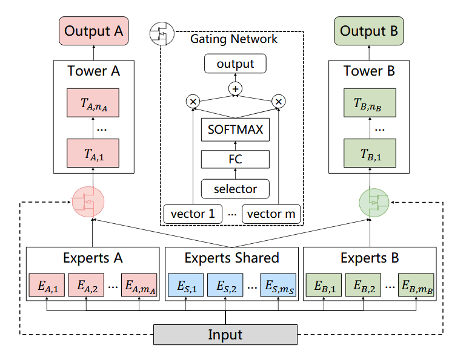


MTL模型端到端训练使用的联合损失如下

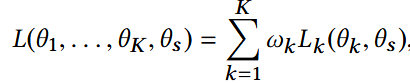

这样的作法存在很多问题，1.**用户的序列行为导致样本空间的异构性（任务对应的样本空间不同**），例如只有点击后才能评论。为了对这些任务进行联合训练，PLE**将所有任务样本空间的并集作为整体训练集，在计算具体任务的损失时，忽略不属于该任务样本空间的样本**。
$$
L_k(\theta_k, \theta_s) = \frac{1}{\sum_i \delta_i^k} \sum_i \delta_i^k loss_k(\hat{y}_k^i(\theta_k, \theta_s), y_k^i)$
$$
i是样本，$δ_i^k$ ∈ {0, 1}表示样本是否属于该任务的样本空间。

2.**MTL模型对训练过程中损失权重的选择非常敏感**，因为损失权重决定各个任务在联合损失中的相对重要性。实际中，不同的任务在不同的训练阶段的重要性可能不同，因此将每个任务的损失权重设置为**动态的**，每一步更新
$$
\omega_k^{(t)} = \omega_{k,0} \times Y_k^t
$$


### 串行建模

**串行建模**主要用于**电商场景**，电商业务需要将**3个概率CTR/CVR/CTCVR**都预估清楚，对于CVR，需要用**点击数据建模**，但是在预测时需要对**未曝光的物料**预测CVR得分，这会带来**SSB**，**严重影响模型效果**。

#### ESMM

**ESMM**，全样本空间多任务学习模型(Entire Space Multi-task Model)，其思路是**将三者都建模在曝光样本空间上**，解决**CVR**建模中存在的两个重要的问题：**SSB，数据稀疏**。

ESMM通过**显示地学习CTCVR（点击转换率）与CTR，来隐式地学习CVR任务**。CVR预估的是如果用户点击了，购买的概率有多大，它和CTR是没有联系的，CTR低不代表CVR也会低。


模型结构如下

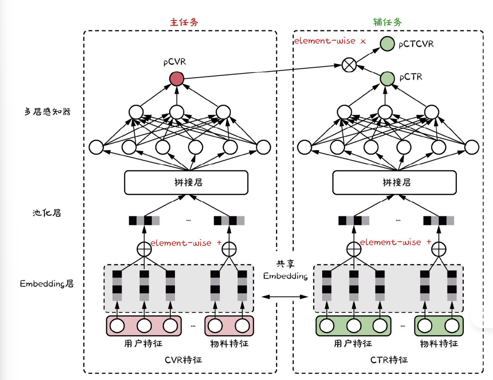

喂入的都是**曝光样本**，**底层的Embedding是共享的**，有利于正例丰富的CTR任务向正例稀疏的CVR任务进行**知识迁移**，解决CVR数据稀疏的问题。

CVR塔实际上是一个中间变量，没有自己的损失函数


ESMM根据**条件概率公式**，将**CTCVR拆分为CTR*CVR**，由于**CTR和CTCVR是建立在曝光样本空间上的，可以被直接优化**。
$$
 L(W_{\text{CTR}}, W_{\text{CVR}}) = \sum_{i=1}^{N} \text{BCE} \left( y_i, \text{dnn}_{\text{CTR}} \left( x_i; W_{\text{CTR}} \right) \right) + \sum_{i=1}^{N} \text{BCE} \left( z_i, \text{dnn}_{\text{CTR}} \left( x_i; W_{\text{CTR}} \right) \times \text{dnn}_{\text{CVR}} \left( x_i; W_{\text{CVR}} \right) \right) 
$$

+ $\boldsymbol{x}_i $ $x_i$是第$ i $条样本的特征，$y_i$ 代表第$ i$条样本是否点击，$ z_i $ 代表第$ i $条样本是否购买，$N $代表样本总数。 
+ $ \text{dnn}_{\text{CTR}} $ 和 $ \text{dnn}_{\text{CVR}} $ 分别代表CTR模块与CVR模块，$ W_{\text{CTR}} $ 和 $ W_{\text{CVR}}$ 分别代表两模块中要学习的权重。 
+ BCE代表二元交叉熵函数。


注意CVR模块是用于和CTR求解CTCVR的，它与**曝光后被购买**计算BCE而不是**点击后被购买计算**。

#### ESM2

在**点击与购买之间还有一些信号**可供使用，如下所示

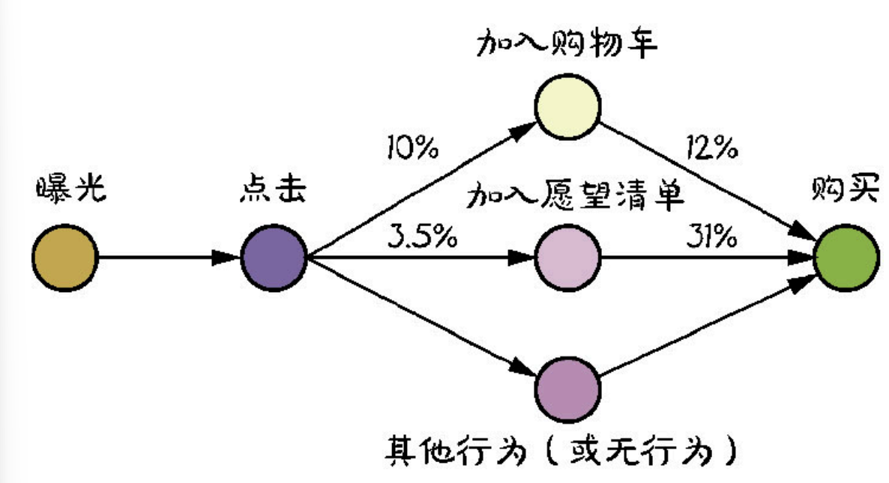

为了充分利用这些信号，阿里巴巴沿着**概率公式拆解目标**的思路，提出了**ESM2**


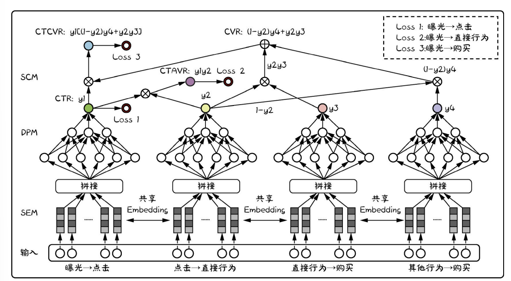

ESM2要预测**四个**概率，**曝光到点击，点击到直接行为，直接行为到购买，间接性到购买**


在曝光样本空间上，定义损失函数：**曝光到点击，曝光到直接行为，曝光到购买**。


其中曝光到点击，**无需组合**直接就可以得到
$$
\text{Loss}_1 = \sum_{i=1}^{N} \text{BCE} \left( c_i, p_i^{\text{ctr}} \right) = \sum_{i=1}^{N} \text{BCE} \left( c_i, y_{1i} \right)
$$

- \( c_i \) 代表第\( i \)条样本是否点击。 
- \( p_i^{\text{CTR}} = y_{1i} \) 是模型预测的第\( i \)条样本的CTR。 
- \( N \)*N*是所有样本数量，BCE代表二元交叉熵损失函数。


曝光到直接行为
$$
p_i^{\text{CTAVR}} = P(a_i = 1|v_i = 1) = P(a_i = 1|c_i = 1) \times P(c_i = 1|v_i = 1) = y_{2i}y_{1i}  \\
\text{Loss}_2 = \sum_{i=1}^{N} \text{BCE} \left( a_i, p_i^{\text{CTAVR}} \right)
$$

+ \( p_i^{\text{CTAVR}} \) 代表模型预测出的第\( i \)个样本“曝光→直接行为”的概率。 
+  \( a_i \) 代表第\( i \)条样本是否发生了直接行为。


曝光到购买
$$
p_i^{\text{CVR}} = P(b_i = 1|c_i = 1) = P(b_i = 1|a_i = 0) \times P(a_i = 0|c_i = 1) + P(b_i = 1|a_i = 1) \times P(a_i = 1|c_i = 1) = y_{4i}(1 - y_{2i}) + y_{3i}y_{2i} \\
p_i^{\text{CTCVR}} = p_i^{\text{CTR}} \times p_i^{\text{CVR}} = y_{1i} \left( y_{4i}(1 - y_{2i}) + y_{3i}y_{2i} \right) \\
\text{Loss}_3 = \sum_{i=1}^{N} \text{BCE} \left( b_i, p_i^{\text{CTCVR}} \right) 
$$

+ \( p_i^{\text{CVR}} \) 代表模型预测出的第\( i \)条样本“点击→购买”的概率。 
+  \( p_i^{\text{CTCVR}} \) 代表模型预测出的第\( i \)条样本“曝光→购买”的概率。 
+  \(b_i\) 代表第\( i \)条样本是否购买。


最终ESM2要优化的目标是**3个目标加权和**
$$
 \text{Loss} = w_1\text{Loss}_1 + w_2\text{Loss}_2 + w_3\text{Loss}_3
$$


### 多个分数的融合

尽管模型会为每个目标都预测一个分数，但是排序时只能依赖一个指标，因此排序前需要**将多个目标的分数融合为一个**。


一种方式是采用**乘法融合**
$$
\text{Score}(u, t_i) = \prod_{k=1}^{K} S_k(u, t_i)^{w_k}
$$
取对数后得到**加法融合**
$$
\text{Score}(u, t_i) = \sum_{k=1}^{K} w_k \log S_k(u, t_i)
$$
对数函数可以**换为任何单调递增的变换函数**
$$
\text{Score}(u, t_i) = \sum_{k=1}^{K} w_k F \left( S_k(u, t_i) \right)
$$


选择变换函数的技术难点在于，模型给不同目标的打分天然存在差异，如果权重设置的不好，可能会导致融合得分偏向某一指标。针对这一问题，一种特殊的变换函数将**目标的打分转化为排名**。
$$
 \text{Scores}_k = \{ S_k(u, t_i) \}, i \in [1, N] \\
 F(S_k(u, t_i)) = \frac{1}{\text{Rank}(S_k(u, t_i), \text{Scores}_k)}
$$


对于**打分权重**，目前**主流方法还是通过线上实验确定**：开M组小流量实验，每组对应一个权重，观察一段时间后，将效果最差的那组权重用新权重替换，最后选择最好的推全。


此外也有一种**自动化的方式**，**根据上一轮的结果自动生成下一轮要实验的超参**，以加速调参过程，提升调参质量，例如**Cross Entropy Method，交叉熵**方法，其核心步骤如下。

1. 所有K个目标的权重都来源于一个K维的**正态分布**
2. 实验开始时，**随机抽取M组权重向量，进行小流量线上实验**
3. 一段时间后，**选取指标最好的前P组**，**重新生成正态分布的均值和方差**，开始下一轮实验，**直到效果收敛**。


## 多场景推荐

多场景推荐指的是，**使用推荐服务的用户中存在着差异明显的不同消费模式**，例如不同的国家的用户，勾选了不同模式的用户，有着不同生命周期的用户。多场景研究**如何用一个模型将行为模式有差异的用户群体都服务好**。


用同一套模型来服务所有用户的缺点是，**训练时容易被大众用户的行为模式主导而忽视小众用户的感受**，但是为每个用户群体专门训练、部署一套模型**性价比太低，不易维护，同时缺少数据**。


### 特征位置

考虑多场景首先要设计出**“场景指示”特征**，并且需要仔细考虑如何把这些特征加入模型。**如果直接把这些特征加到DNN底部，让它们的信息按部就班地层层上传，会导致信息损失，同时在上千个特征中再加入一两个新特征往往效果不明显。**


业界最常见的做法是，**将场景特征加到离最终目标近一点的地方**。

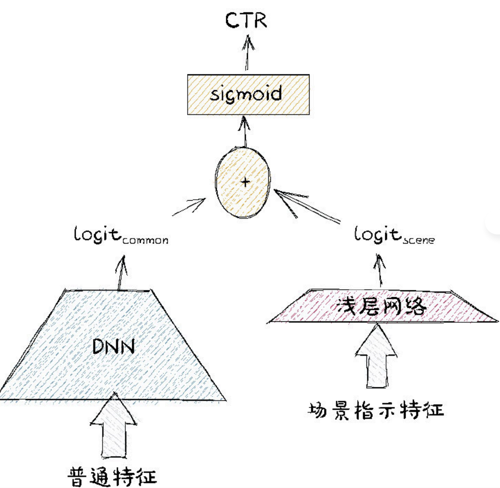

这样做，使场景信息对最终预测结果的影响直接而有力。


### 模型结构

多场景推荐模型有两大部分组成：

- **场景共享部分**：需要共享结构和参数来建模多场景之间的共性，同时迁移知识。
- **场景独立部分**：各场景也需要独立的结构与参数，以建模该场景的特殊性。


这两部分的协同最简单的实现是**将共享结构与各场景的独有结构串联起来**。

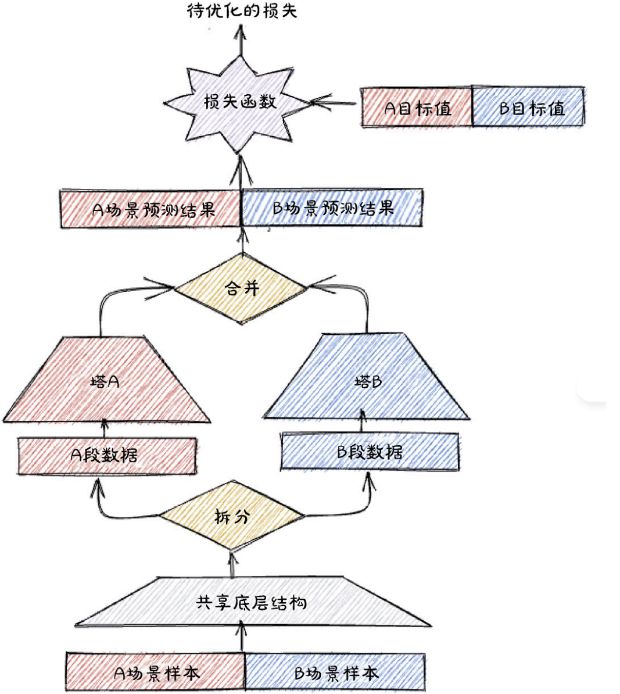


在普通串联结构的基础上，阿里巴巴提出了**Hybrid Mixture-of-Experts(HMoE)**结构。它的理论假设是，**对于某个样本，除了其所在的场景模型打分，其他场景的模型打分也有借鉴意义**。

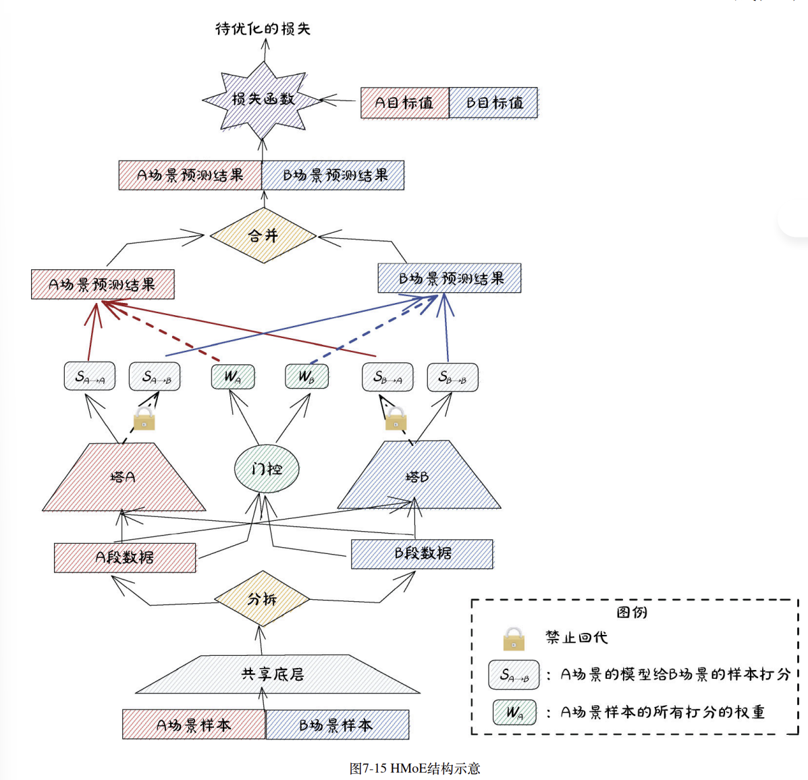


阿里巴巴在2021年提出了**STAR**结构，突破了传统的串联模式，**将场景共享部分与场景独立部分更紧密地交织在一起**。


**每个独立场景的权重是由该场景的的权重和共享权重相乘得到的**。

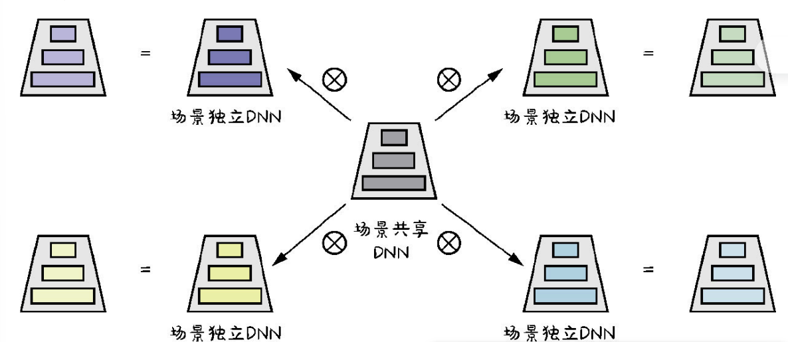
$$
 y_p = \text{DNN}\left( \boldsymbol{x}_p; \boldsymbol{W}_p^* \right) \\
 \boldsymbol{W}_p^* = \left[ \boldsymbol{W}_{p,1}^*, \cdots, \boldsymbol{W}_{p,K}^* \right] 
\\
\boldsymbol{W}_{p,i}^* = \boldsymbol{W}_{p,i} \otimes \boldsymbol{W}_i 
$$

+  第$ p $个场景的输入$\boldsymbol{x}_p $经过一个DNN结构，得到第$ p $个场景的输出$ y_p$。这个DNN的参数是$ \boldsymbol{W}_p^* $。 
+  $ \boldsymbol{W}_p^* = [\boldsymbol{W}_{p,1}^*, \cdots, \boldsymbol{W}_{p,K}^*] $是长度为\(K\)的数组，$\boldsymbol{W}_{p,i}^* $是DNN第$i$层的权重，$K$是DNN的总层数。 
+  $ \boldsymbol{W}_{p,i}^* $由第$ p $个场景独有结构的第$i $层权重$ \boldsymbol{W}_{p,i} $与共享结构的第$ i $层权重$ \boldsymbol{W}_i $通过按位相乘（用$\otimes$表示）得到。


### 模型参数

**动态权重**是近年来兴起的多场景建模模式

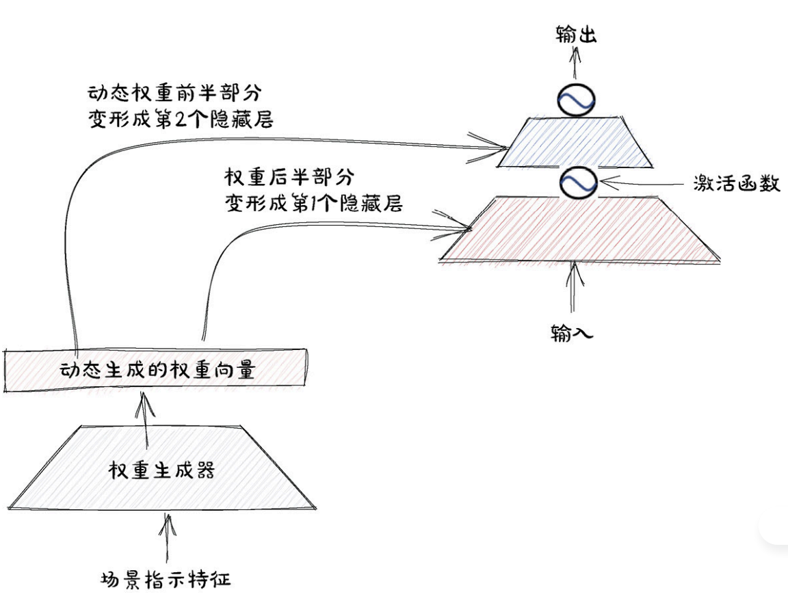


将场景特征喂入**权重生成器**，生成**动态权重向量**，再将权重向量变形为**合适形状的DNN**，**将这个网络应用在推荐模型的关键位置**。动态权重模式可以向滤波器一样控制住信息向上传递的通道，**让信息接受场景特征的调制**。


阿里巴巴提出的**M2M**模型运用**动态权重模式**实现了**多场景+多目标**，其**整体上遵循了MMoE结构**，只不过**在两个关键位置采用了根据场景特征动态生成的权重**。

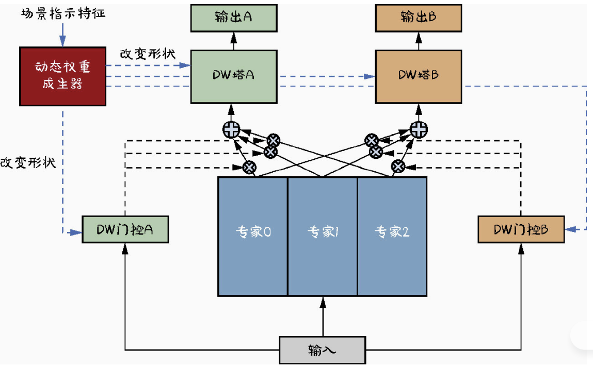


# 冷启动

## 评价指标

冷启动：**系统缺乏足够的信息，无法给用户或物品提供有效的推荐。**


冷启动是推荐系统中**比较复杂**的部分，其考察的指标比其他部分要**多**

+ 作者测指标，目标是促进发布，增大内容池
  + 发布渗透率，当日发布人数/日活人数
  + 人均发布量，当日发布笔记数/日活人数
+ 用户侧指标
  + 新物品的消费指标，点击率交互率，按照曝光数区分
  + 大盘消费指标，系统总体的消费时长和日活，月活
+ 内容侧指标
  + 高热物品占比


## 简单的召回通道

**ItemCF**不适用于物品冷启动，因为新物品**缺少用户交互**。


新物品的**ID Embedding还没学好**，导致**双塔模型**的效果不好，在实现中有两种改进方案

+ **所有新物品共享一个default Embedding**
+ 查找内容**最相似**物品，取**曝光量最高**，对这些物品的**Embedding取平均**作为新物品的Embedding


类目召回，**系统维护类目->物品列表(按时间倒序)**，用类目索引召回**最新的笔记**。与之类似的还有**关键字召回**。这两种召回方法的缺点在于：**只对刚刚发布的物品有效，弱个性化，不够精准。**


## 聚类召回

**聚类索引**：一个物品发布时，用神经网络映射到特征向量，**从聚类中心中找到最相似的cluster**，将该物品添加到**cluster->物品ID列表中(按时间倒排)**


线上召回时：给定用户ID，取回**last-n**物品作为种子笔记，每个种子笔记映射到向量并找出**最相似的cluster**，取回其中**最新的m个物品**。


模型如下


神经网络**共享参数**，接受物品的**图文**内容，要求**种子物品和正样本相似度大，和负样本相似度小**，损失函数如下

Triplet hinge loss: $$L(\mathbf{a},\mathbf{b}^+,\mathbf{b}^-) = \max\{0, \cos(\mathbf{a},\mathbf{b}^-) + m - \cos(\mathbf{a},\mathbf{b}^+)\}.$$

Triplet logistic loss: $$L(\mathbf{a},\mathbf{b}^+,\mathbf{b}^-) = \log(1 + \exp(\cos(\mathbf{a},\mathbf{b}^-) - \cos(\mathbf{a},\mathbf{b}^+))).$$


其中正样本有两种来源：

1. **人工标注相似度**
2. **筛选出高曝光且二级类目相同的物品，用ItemCF选取最相似的物品**


负样本从**全体物品中随机选择**，需要满足物品质量高，内容丰富。


## Look-Alike人群扩散

Look-Alike最初是用于广告系统中的，通过用户画像筛选出对物品感兴趣的**少量种子用户**，再将物品**扩散到和种子用户相似的用户群体**上。


在推荐系统中，对于新物品，如果有**交互行为**则认为交互的用户属于该物品的**种子用户**，对**种子用户的ID Embedding取平均，作为物品的一个特征**。每当有用户交互，**更新**物品的特征向量。

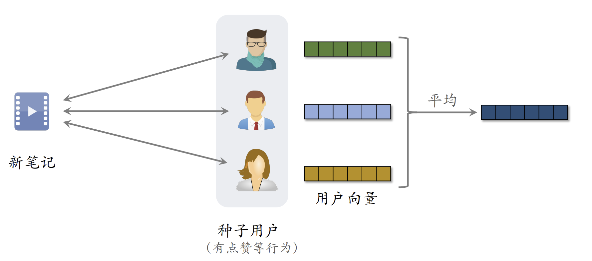


特征会存储到**向量数据库**中，推荐时将用户的ID Embedding输入到数据库中做**最近邻查找**取回物品


## 长尾效应

在推荐系统中，长尾效应是极少数的“热门物品”占据了绝大部分的曝光和点击，而绝大多数的冷门物品无人问津。


+ 训练时对热门物品降采样，在损失函数中增加对长尾物品预测错误的惩罚
+ 对长尾物品给予流量扶持
+ 引入更多的类别特征，长尾物品缺乏交互，那就让模型根据它是什么而不是谁看过它进行推荐


## 对比学习

**对比学习**发源于**图像识别领域**，人们手中有大量图片需要分类，但难点在于只有**少量**图片被标注过，不足以训练出一个高质量的分类器。


对比学习示例如下

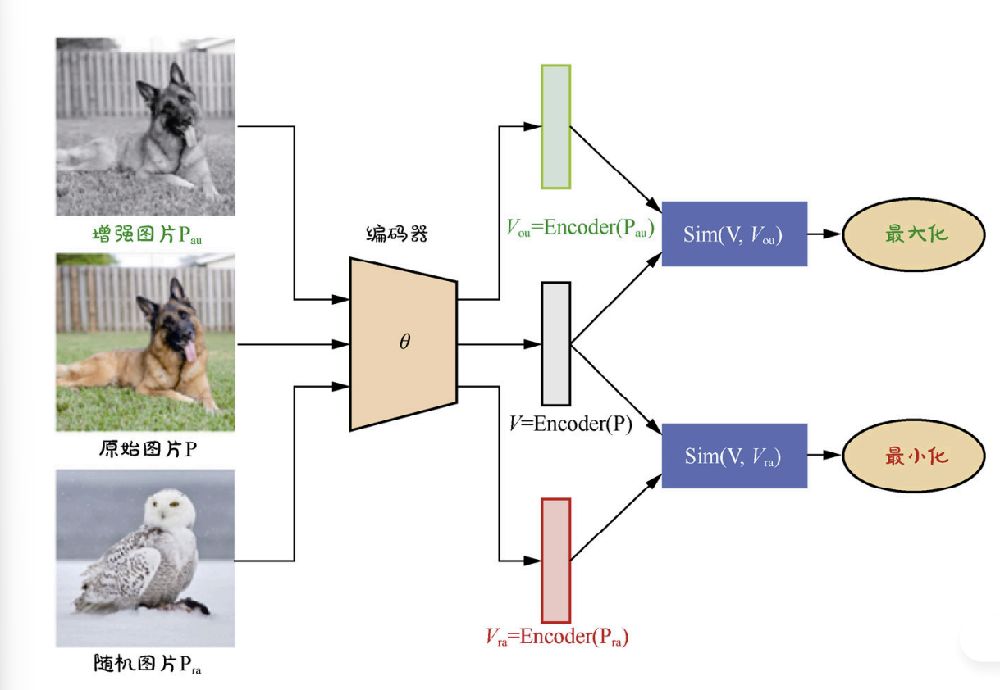

### 推荐系统中的对比学习

虽然**推荐系统中有着源源不断地用户反馈数据**，但是这些**数据分布及其不均衡**，热门的物料总是占据较高的曝光量，剩下的小众的、长尾的物料得不到多少曝光机会，在训练样本中成了少数、弱势群体。


**对比学习**可以**放大少数用户/物料向量在训练样本中的作用**，让模型多见识被其忽视的少数群体，要明确的是对比学习的作用是**纠偏**。

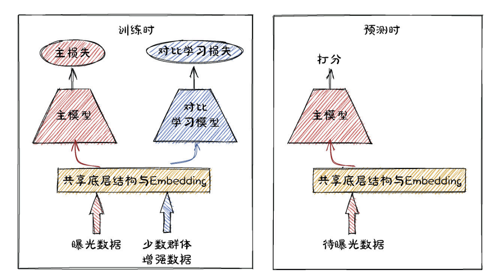

对比学习中，建立一个对比学习模型，主模型以曝光数据为主，对比学习以**鲜有曝光机会的少数人群和小众物料为主，同时二者共享底层参数，不能各学各的**。

### 对比学习与向量化召回

对比学习要经过以下四个步骤

1. **如何定义正样本**，对比学习将原样本与其衍生出的增强样本组合为正样本对
2. **如何定义负样本**，通过随机抽样
3. **如果从复杂的原始特征中提炼出Embedding**，对比学习次啊用Encoder压缩原似乎特征
4. **如何设计损失函数**，对比学习让原样本与其增强样本尽可能近。

这四个步骤与**向量化召回**十分**相似**，但是不能当作是向量化召回的**修改**，因为**对比学习的目的是为了纠偏，它属于自监督学习，关键在于如何数据增强，而不是如何设计负样本**。


### 双塔模型中的对比学习

推荐系统的**头部效应**严重：少部分物品占据大部分点击，大部分物品的点击次数不高。**因此高点击物品的表征学的好，长尾物品的表征学得不好**。


为了更好的学习长尾物品的向量表征，对物品做**自监督学习**，训练物品塔


**同一物品**经过特征变换后从物品塔得到的特征向量应该有**高相似度**，**不同物品**的特征向量应该有**低相似度**。


特征变换的方法有：

+ Random Mask，**随机选取离散的特征置**为default，相当于丢弃
+ Dropout，对**多值离散特征**随机丢弃其中**50%**
+ Complementary，把特征随机分为**两组**，填充为 的形式
+ Mask关联的特征，**离线计算出特征间的互信息**，**随机选一个特征作为种子**，将**其和与其最相关的k/2个特征丢弃**。这种方法效果最好，但是方法复杂，实现难度大，不好维护。


训练模型时，从**全体物品中均匀抽样**，得到一个batch，做两类特征变换输出两组向量，每个物品的损失函数如下


最后做梯度下降最小化损失函数

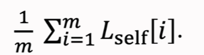


对点击做随机抽样，对全体用户做均匀抽样得到两个batch，同时训练双塔和自监督

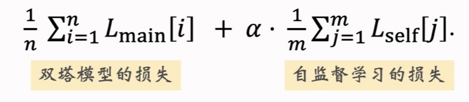


### 纠偏小众用户

对于用户的纠偏主要考虑**用户的行为序列**，传统上针对序列的数据增强有以下三种方法

+ **遮蔽**：随机删除原序列中的一些元素。 
+ **截断**：删除删除原序列中的一段子序列。
+ **打散**：随机找到一段子序列，打乱其顺序。


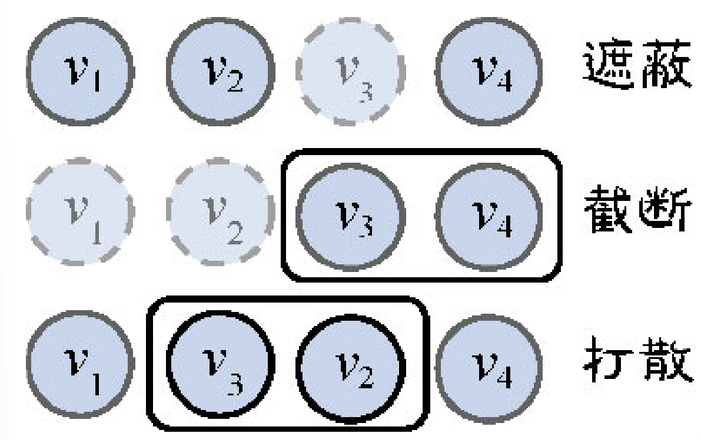


以上的方法对**较短的用户行为序列不友好**，增强后反而增加了学习的难度，因为行为序列变得**更短**。


因此，出现了两种新的数据增强方法

+ **代替**，在原序列中随即找一个物料，用与其相似的物料替换它。
+ **插入**：在原序列中随即找一个物料，在其两侧插入与其相似的物料。

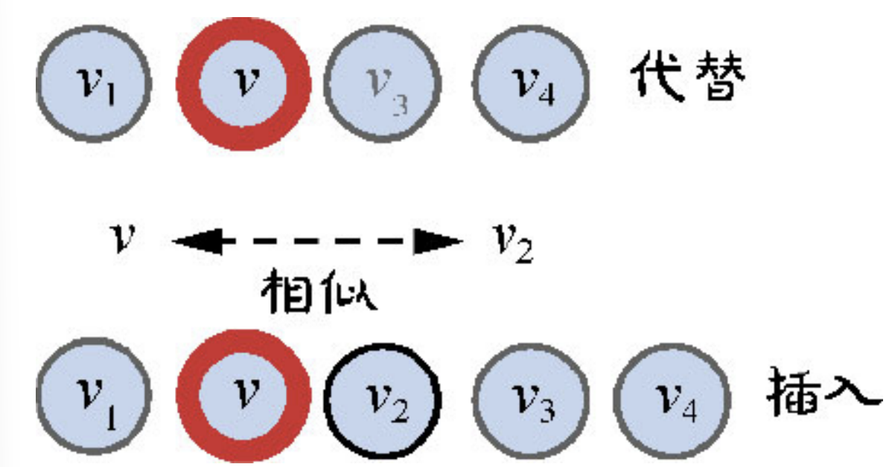


总的来说对于长序列，以上的方法都可以使用；短序列则优先使用新的两种方法。


## 其他算法

### 迁移学习

假设一个用户在旧的场景下他的兴趣已经建模的很成熟了，那么在新场景下可以进行**知识迁移**。

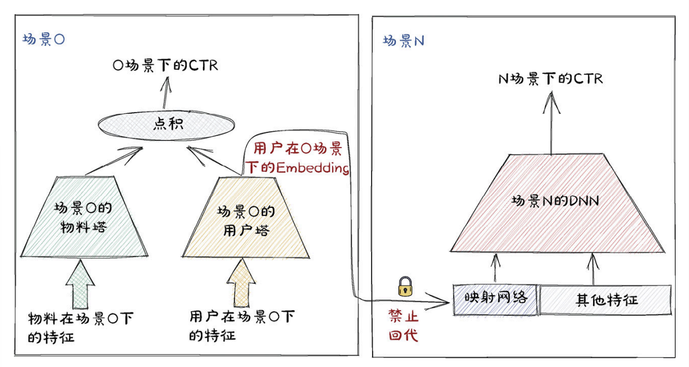

注意，接入的Embedding**禁止回代**。


随着新场景的逐渐成熟，知识迁移可以由**单项变成双向**。

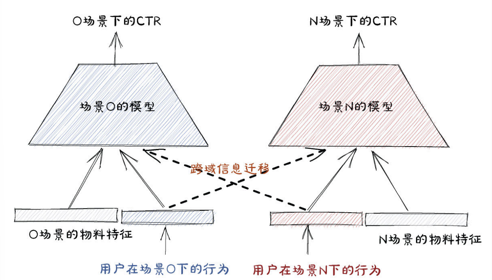


## 流量调控

对于新物品扶持可以**促进发布，增大内容池，挖掘优质物品**。


工业界中系统只会**推荐年龄<30天的物品**，对于**<=24小时**的物品**扶持使其曝光量大于1/30**。


流量调控的做法是**提权**，干涉**粗排和重排**环节，给新物品提权。这是一种**容易实现且投入产出比好**的方法，但是**提权系数不好调控**，很难控制曝光量容易造成过度曝光或不充分曝光。


**保量**：**不论笔记质量高低，都保证24小时内获得100次曝光**，在原有的提权系数上**乘以额外的系数**，该系数通过**目标时间，目标曝光量，发布时间，发布曝光量**计算，最终形式如下。达到了曝光目标后和旧物品做**公平竞争**。

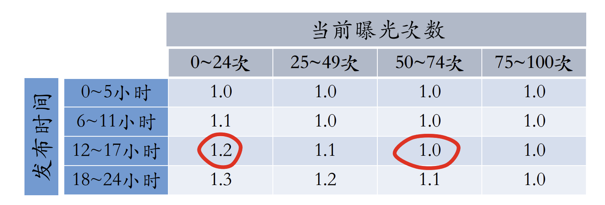


**保量的提权系数也不好做**，同时线**上环境变化**会引起提权系数的**重调**。


注意，采用保量时，不能调整权重系数为**一个非常大的数**快速到达目标曝光量，这会导致物品被推荐给**不合适**的用户，使得**物品的数据(点击率，点赞率)偏低，最终物品会收到系统打压，无法称为热门物品**。


**差异化保量**：不同的物品有**不同的指标**，优质的物品获得**更高的保量指标**。可以用多模态，或作者的历史数据来判断内容的好坏。


# 评估与调试

## 评估流程

首先进行**离线评估**，用**相同的训练集、在相同的初始条件下**，**用不同算法训练出新旧两版模型**，再拿这两版模型在**相同的数据集**上进行评估，如果新模型的**离线评估指标优于旧模型**，可以认为新模型通过了离线测试，可以进入下一阶段。

出于**快速迭代**的考虑，离线评估的**训练集与测试集规模不会太大**，一般采用连续3天或7天历史数据进行训练。


离线得到的模型**不能直接上线使用**，因为离线评估是在**一个理想、简单的环境**下进行的，但实际的线上环境并非如此。**线上的旧模型已经在线持续更新了几个月，而且还在紧跟用户最新的兴趣变化而优化自己**。此时的新模型虽然在离线测试中表现较高，但是**离线数据集中缺少一些特征**，新模型在预测时只能用全0向量来代替这些特征的Embedding，**线上测试时，新模型几乎不可能打败久经考验的旧模型**。

所以新模型在线之前必须**先回溯**，比如用自两周前的历史数据开始训练，**直到追平并接入线上的实时样本流，这样才具备了公平进行线上测试的基础**。

最后开始**线上评估**，随即**划分出两份流量**，一份流量称为控制组，流入老模型；一份称为实验组，流入新模型。实验一段时间后，统计两组流量上的业务指标，如果实验组明显优于对照组，那么可以考虑将新模型推全。


## 评估排序算法

### AUC和GAUC

**AUC，曲线下面积**，简单描述为：**给定一个划分正负类别的阈值（大于为正样本，反之负样本），以该阈值下的FPR（假阳性率真实类别为1的样本中，预测类别为0的比例）为横坐标，TPR（真阳率，真实类别为1的样本中，预测类别为1的比例）为纵坐标，画一个点。通过不断变化与之画出的点就连成了一条ROC曲线，该曲线下的面积就是AUC。** **衡量模型把正样本排在负样本之前的能力**。

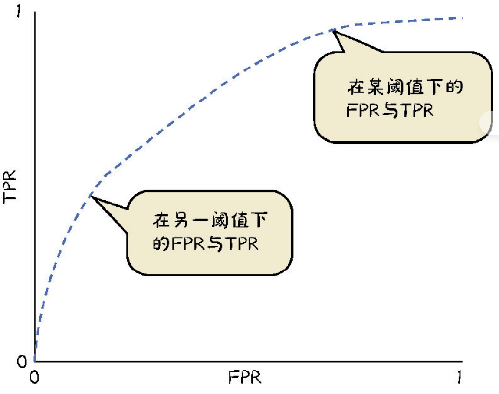

AUC越接近1.0，模型效果越好;等于0.5时，则效果最差，无应用价值


如下所示的3个正样本和3个负样本，按照排序得分降序排列如下，其中一共有9个样本对，有两对错误地将负样本排在了正样本之前，所以最后的AUC=7/9。

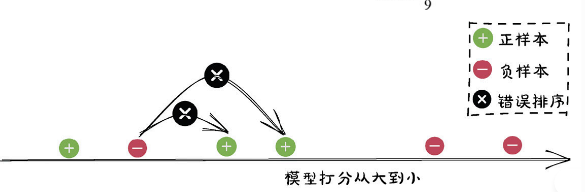


但是**AUC并不适合排序模型**，因为评估中往往不止考虑对一个用户的推荐结果，**普通的AUC能将所有的用户混为一谈，一个用户的样本会影响到另一个用户的评估，容易被高活跃用户主导。**


例如，现有AB两个用户，各自曝光了4个物料，根据模型打分，8个样本由高到低的排序分别是是[A+, A+, A+, B-, B-, A-, B-, B+]，其中A+和B+分别表示两个用户的正样本（比如点击的物料），A-和B-分别表示两个用户的负样本（比如曝光未点击的物料）。按照上述的公式计算，AUC=0.75，看起来还不错。如果只针对A用户，可以得到其AUC=1，全局的AUC低估了模型对A的排序能力；只针对B用户，其AUC=0，全局的AUC高估了模型对B用户的排序能力。


因此在AUC的基础上出现了**GAUC**，将**测试样本划分为Group**，**每个Group统计一个AUC，再将不同AUC加权平均，权重一般用给用户曝光的物料数**。
$$
 \text{GAUC} = \frac{\sum_{u} w_u \text{AUC}_u}{\sum_{u} w_u} = \frac{\sum_{u} n_u \text{AUC}_u}{\sum_{u} n_u}
$$
对之前的例子按照GAUC计算，$ \text{GAUC} = \frac{4 \times 1 + 4 \times 0}{4 + 4} = 0.5 $，表明这个模型的排序能力堪忧。


GAUC的缺点：对**组内正负样本不平衡敏感**，很多组内可能只有1个正样本甚至没有正样本，这些组要么被丢弃，要么贡献有限，导致评估偏向“活跃用户”；**忽略组间关系**，与全局业务目标不一致。

### NDCG

使用AUC衡量排序性能的缺点在于，**其不能反应排序位置的折扣效应**。


**Discounted Cumulative Gain(DCG)**，**综合考虑每个位置上的物料能带来的收益和该位置的折扣效应**
$$
\text{DCG}@K = \sum_{k=1}^{K} \frac{2^{c_k} - 1}{\log_2 (k + 1)}
$$


+ K代表排序结果的长度
+ $c_k$代表第k个位置上的物料的贡献，如果未点击位置k，则$c_k=0$，反之就是观看时长、销售净额的指标的函数

可以看出，**越靠后的位置，对物料的价值打的折扣就越大**。


但是**计算出的DCG不能直接比较、汇总**，因为DCG的上界受query影响，正样本越多，上限越高。

将真实标签排序后，计算DCG得到就为IDCG，二分类举例（K=5），真实标签：1,0,1,0,0，排序后：1,1,0,0,0

$IDCG@5 =
\frac{2^1-1}{\log_2(1+1)} +
\frac{2^1-1}{\log_2(2+1)} +
\frac{2^0-1}{\log_2(3+1)} +
\frac{2^0-1}{\log_2(4+1)} +
\frac{2^0-1}{\log_2(5+1)}$


最后求解nDCG
$$
\text{NDCG}@K = \frac{\text{DCG}@K}{\text{IDCG}@K}
$$
**多个排序结果的NDCG取均值**，就可以衡量整个排序模型的性能。


## 评估召回算法

**AUC不适合评估召回算法**，因为**召回的顺序并非最终呈现给用户的顺序**，并且**召回中不好定义负样本**，首先**不能用曝光未点击的物料作为负样本**，会造成SSB，其次，**召回的物料中未被点击的也不能作为负样本**，没有被点击可能是**因为还未曝光，而非用户不感兴趣**。


**召回时避免直接统计负样本，而是从预测正样本与真实正样本的命中率、覆盖率出发**。

### Precision & Recall

+ Precision@K表示平均下来，每次召回的物料中真正被用户所喜欢的占比。 
+ Recall@K表示平均下来，一个用户真正喜欢的物料中有多大占比能被模型召回

### MAP

Precision 和 Recall是一**对此消彼长**的指标，召回的数量越多，Recall就越高，Precision就越低，**不够全面**。


另一种方法是使用**MAP**，**每次只取前i个作为召回的结果返回，将不同i值下的Precision、Recall连成曲线，然后计算这个曲线下的面积，即AP，多次召回的AP取均值就得到MAP**，它能用来衡量模型的整体召回性能。
$$
 \text{AP}@K = \frac{\sum_{j=1}^{K} \text{Precision}@j \times \text{IsPositive}@j}{\text{TotalPositives}}
$$
**TotalPositives**是**本次推荐中用户喜欢的物料的数量**，**$IsPositive_I$是第i个召回结果是否被用户喜欢**。

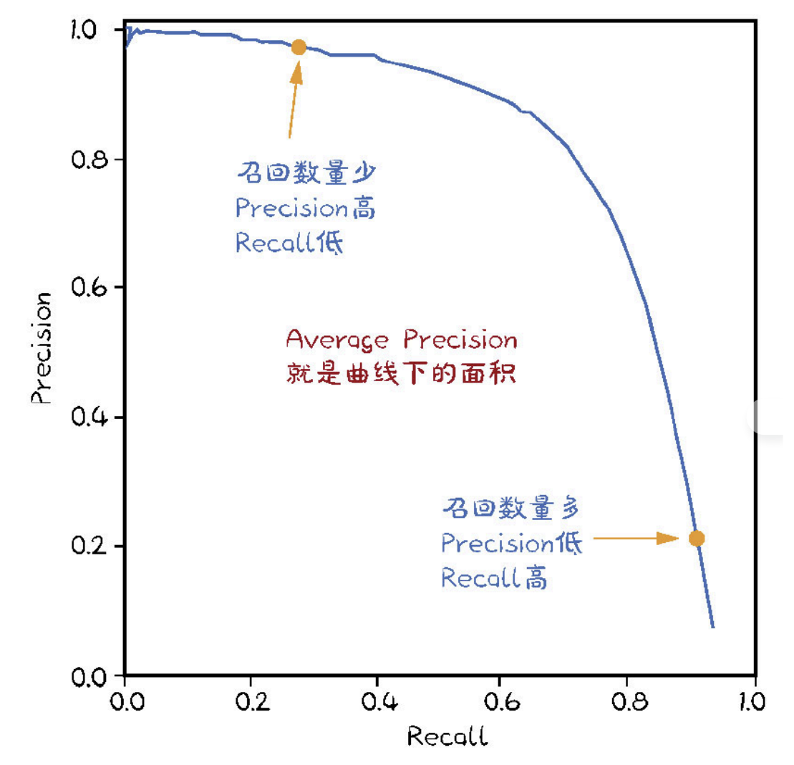


- 第1个用户点击了4个物料，都被模型召回了，其位置为{1,2,4,7}，此次召回的$ \text{AP}@8 = \frac{\frac{1}{1} + \frac{2}{2} + \frac{3}{4} + \frac{4}{7}}{4} = 0.83$； 
-  第2个用户点击了5个物料，但模型只召回了3个，其位置是{1,3,5}，此次召回的$\text{AP}@8 = \frac{\frac{1}{1} + \frac{2}{3} + \frac{3}{5}}{5} = 0.45 $。 
-  对两次AP取平均值，就得到该模型的$ \text{MAP}@8 = \frac{0.83 + 0.45}{2} = 0.64 $。


## 持续评估

模型的评估并非只在模型上线之前进行一次就完事了，模型需要**持续评估**，并且在监控系统中存储、汇总、展示，能够帮助我们及早发现模型出现的问题。


**Progressive Validation**是一种持续评估的方法，**模型拿到最新一批用户反馈后，先进行前代预测结果，接下来一边回代更新模型，一边拿预测结果与用户反馈计算各种指标**。

优点在于

+ 在线训练与在线评估**共用前代环节**，避免重复计算。
+ 得到预测结果时，模型尚未更新最新的用户反馈，因此计算出的**指标是无偏的**。

## A/B测试

AB测试考察**线上指标的影响，以及如何选取最优的参数**。


1. 把用户流量**随机划分为控制组流量与实验组流量**。 
2. **控制组流量流入老模型，实验组流量流入新模型**。**模型差异是两组流量的唯一差异**，其他影响因素（比如用户分布、物料分布、实验模型上下游的其他模型与策略）**必须完全相同**。这也就是A/B实验最重要的同分布原则。
3. **上线实验一段时间**，让两组流量积累起足够多的用户反馈。
4. 通过收集到的用户反馈，分别**统计出两组流量上的关键业务指标**。 
5. 通过数据分析，如果发现实验组上的关键业务指标显著优于控制组，我们就有充分理由相信新模型优于旧模型，可以考虑由新模型替换旧模型。


A/B实验有以下缺点

+　完整的A/B实验**较为复杂**，小团队没有能力和时间从头开发。
+　**A/B实验往往需要足够长的时间，时间成本比较高**，因为**用户行为往往呈现周期性**，所以**A/B实验至少要覆盖一个完整的周期**。
+　**在划分流量时可能会引入偏差，使实验结果有失公平**。

###　流量划分

推荐系统中的流量划分需要遵循两个重要原则

+　**划分流量是随机的**，一个用户划分到控制组还是实验组完全是随机的，其余属性无关。
+　**划分流量又是确定的**，一个用户在今后的访问中也一定会划分到相同的组中。


一种既随机又确定的流量划分是**根据用户的UserID决定用户去向**，表现为使用一个哈希函数映射
$$
\text{bucket} = \text{HASH}(\text{User ID}) \% N
$$


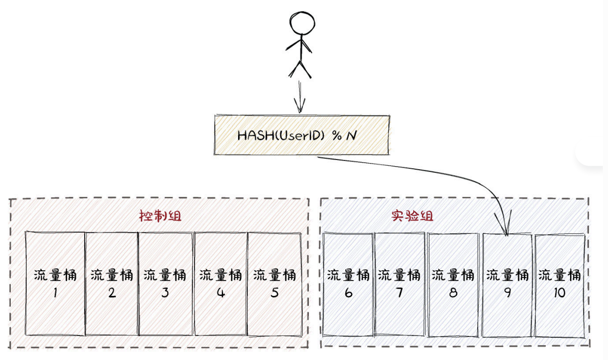

但是上述方法**使得一个用户同时只进行一次实验**，**对流量的利用率太低**，一个公司中存在很多部门和团队，如果大家都按照这种方式做A/B测试，会导致**流量不够**，因此引入了**分层实验**。

### 分层重叠划分流量

分层重叠的流量划分方式是 Google 在 Overlapping Experiment Infrastructure: More, Better, Faster Experimentation论文中提出的，其思想是

+ 假设**要进行N个实验，就将流量划分为N层**。
+ **同一层的各个实验组，其流量是互斥；不同层的实验，其流量是可以重叠的**。两个互斥的召回实验为不能同时作用于一个用户身上，但是一个用户可以受到一个召回和一个精排实验的影响，因为这两个实验不互斥。

注意，这里层并不代表**上下级关系**。
$$
 \text{bucket} = \text{HASH}\left( \text{CONCAT}(\text{Layer ID}, \text{User ID}) \right) \% N
$$
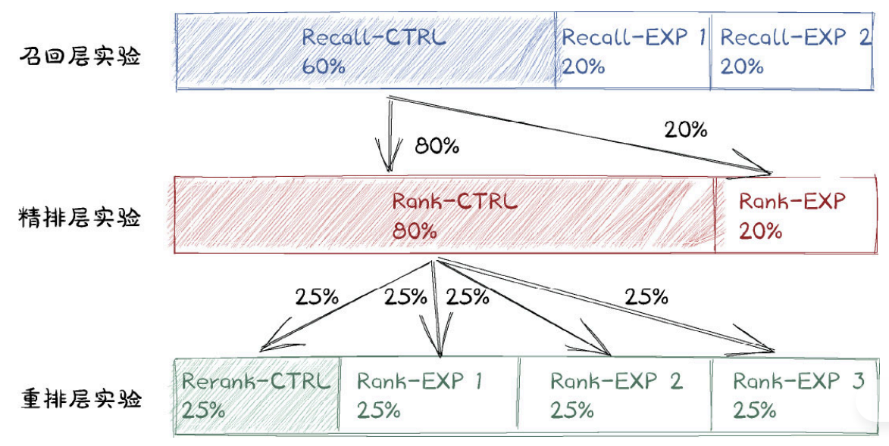


**Holdout**是一种考核**系统指标**的机制，**保留10%的用户完全不受实验影响**，可以考察整个部门对业务指标的贡献。


**实验推全**：当实验有效时，会**建立一个推全层**，与其他层正交。


反转实验：**在推全的新层中开一个旧策略的桶，长期观测实验指标**。该实验是为了解决在实验观测到**显著收益**后希望尽快**推全**新策略（为了腾出桶供其他实验使用或基于新策略做后续的开发），具有**滞后性**的指标，有**长期观测的**需求间的矛盾。


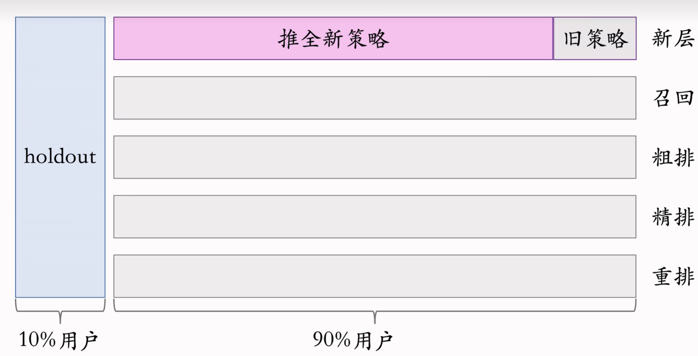


### A/A实验

**A/A实验指的是控制组合实验组采用完全相同的配置，用于检验饰演的两组流量是否存在偏差**。一个值得推荐的习惯是**在正式的A/B实验之前先进行一段时间A/A实验**。


A/A实验可以和A/B实验**同步进行**，即一个实验按照**AABB**方式分配流量

- \( \text{A}_1 \)和\( \text{A}_2 \)使用相同配置的老模型； 
- \( \text{B}_1 \)和\( \text{B}_2 \)使用相同配置的新模型。


### 统计分析

面对实验结果，**不能仅仅只看指标更优**就立刻的出“新模型有效，应该被推广”的结论。新老模型在小流量样本上表现出的指标差异，**可能是由于随机采样的波动性造成的，未必能反应新模型推全后的真实性能**。至于如何判断样本指标间的差异是真实有效的还是偶然发生的，就需要检验这个差异的**显著性水平**。


以推荐系统中最常用的**检验两组流量指标的均值是否相等**为例，首先建立两个假设
$$
 H_0: \mu_e = \mu_c \\
 H_A: \mu_e \neq \mu_c 
$$


- \( \mu_e \) 是如果将Experiment Group中的新模型推广至全体流量，某个关键业务指标（比如观看时长）的均值。\( \mu_e \) 反映了新模型的真实性能水平。 
-  \( \mu_c \) 与 \( \mu_e \) 类似，反映老模型在全体流量上的性能水平。 
-  \( H_0 \) 是原假设，表示新老模型的效果相同，新模型对业务指标没有提升。 
-  \( H_A \) 是备择假设，表示新老模型的效果不同。尽管我们希望 \( \mu_e > \mu_c \)，但是为谨慎起见，我们需要同时考察新模型优于老模型与新模型劣于老模型两种情况。


然后开始A/B实验，一段时间后收集一批样本

- 控制组下收集到 \( n_c \) 个关键指标，组成集合 \( X_c \)，其均值为 \( \bar{x}_c \)，方差为 \( s_c^2 \)； 
- 实验组下收集到 \( n_e \) 个关键指标，组成集合 \( X_e \)，其均值为 \( \bar{x}_e \)，方差为 \( s_e^2 \)。


在原假设成立的前提下，\( \bar{x}_e - \bar{x}_c \) 遵循期望为0，方差为 \( \frac{s_e^2}{n_e} + \frac{s_c^2}{n_c} \) 的正态分布，标准化后有
$$
z = \frac{\bar{x}_e - \bar{x}_c}{\sqrt{\frac{S_c^2}{n_c} + \frac{S_e^2}{n_e}}} \sim \mathcal{N}(0,1)
$$
计算P值，通过查表可以得到在标准正态分布下大于|z|的概率
$$
\text{p-value} = P(x \geqslant |z|) + P(x \leqslant |z|) = 2P(x \geqslant |z|)
$$
**最后将P值与显著性水平$\alpha$比较，如果小于则拒绝原假设，因为小概率事件发生了，反之接受原假设**。


## 指标未涨

算法工程师经常会遇到：指标在里离线实验中相比老模型上涨明显，但A/B实验中却未有涨幅。


首先排查最基本的错误

+ **代码中是否出现了bug**
+ **A/B实验配置是否出错**
+ **离线训练和评估的数据集是否太小了**
+ **离线数据集是否包含了特殊事件，从而削弱了其代表性**

### 数据分布

线上线下数据分布不一致

### 特征穿越

以模型要用到的消费指标为例

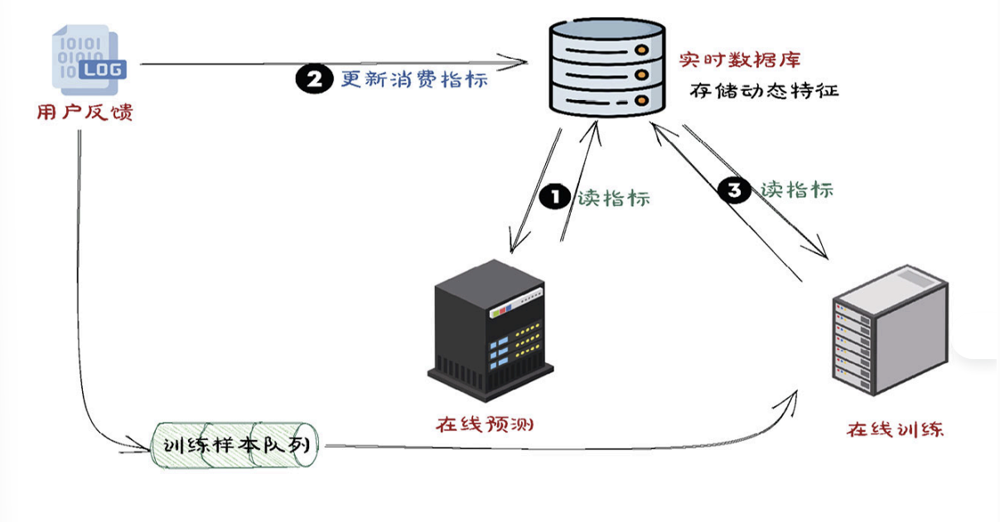

+ 在1时刻，预测程序访问数据库获取最新的消费指标。
+ 预测程序返回推荐结果给用户，用户做出反馈。
+ 2时刻，数据集接受了反馈，更新了各消费指标。
+ 1时刻的用户请求和反馈作为一条样本插入到训练样本队列。
+ 3时刻，在线训练程序开始训练，准本样本时，向数据库请求最新的消费指标，此时数据库返回的是已经被更新过的数据。

**训练模型时，无意包含了实际预测场景中无法获取的信息，这种现象就做特征穿越**。这种行为会导致离线评估的效果更好，而在线预测时，无法用到反馈后的信息，效果自然被打回了原型。


一种解决方法是**在预测时打包数据快照供在线训练使用**

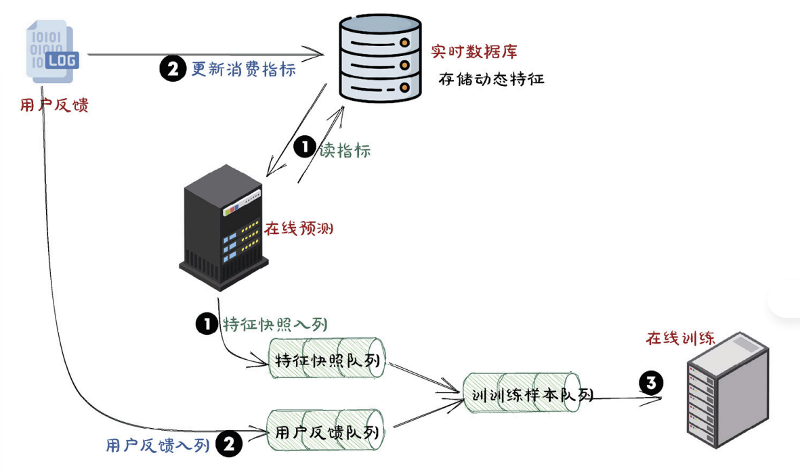


### 老汤模型

在线预测时，新模型很难超过老模型，因此需要给新模型**回溯历史数据**。但是为了赶上老模型，回溯的时间短不了、耗时长、效率低。为了提升回溯效率，**让新模型从老模型参数的基础上热启训练**，使新模型只需要回溯较短时间就能赶上老模型。


对于Embedding**，新模型将老模型的所有Embedding都复制过来作为初值，只有新引入的Embedding才需要随机初始化**。某个特征，在新模型中定义的长度是$ d_{\text{new}} $，在老模型中定义的长度是$ d_{\text{old}} $。

- **最简单的情况就是 $d_{\text{new}} = d_{\text{old}} $，新模型的Embedding直接拿老模型的Embedding当初值。** 
- **如果 $d_{\text{new}} > d_{\text{old}} $，在老模型Embedding补上一段长度的随机向量，当成新模型Embedding的初值。** 
-  **如果 $ d_{\text{new}} < d_{\text{old}} $，将老模型Embedding截短，只保留头部 $ d_{\text{new}} $ 长的向量，当成新模型Embedding的初值。**


对于**网络结构的参数，处理方法与Embedding相似**，复用的模块用老模型的权重，如果出现尺寸不匹配的地方，也需要裁剪和补充。

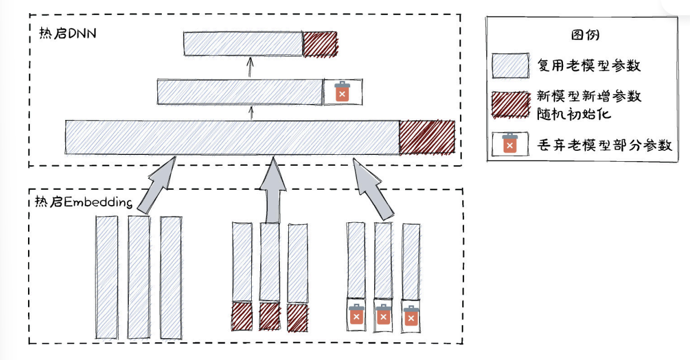


这种方式也有一些缺点

+ **非常麻烦**，新老模型间的银蛇关系没有规律可循，每次从老模型提取参数、裁剪、补齐、重填至新模型，都需要重写编写脚本和配置，费时费力，还容易出错。
+ **限制了算法工程师的手脚**，使我们不愿意对模型大改。
+ **缺乏理论验证**，对参数迁移的方法是出于经验的，没有理论支撑。

### 系统内在缺陷

**离线评估的方法是有偏的**，因为训练和评估用的都是曝光的物料，**离线评测只是说明新模型在曝光样本上表现得比老模型优异，对于未曝光样本新模型在离线阶段既没训练过也没测试过，线上表现未知**。


虽然**新模型也能在线学习，持续更新**，但是**刚上线时，新模型只占很少一部分流量**，**由新模型产生的样本是极其有限的，喂给新模型在线学习的主要还是老模型产生的样本，新模型无法对自己的错误给予足够的重视，因此线上指标可能会迟迟不见起色**。

而在前景不明朗的是时候，新模型不可能被扩大流量，所以**只能在线训练模型时，给自己产生的样本赋予更大的权重**。


### 链路一致性

推荐系统**各个链路都约定俗成地使用曝光的数据**，也就是基于用户真实反馈进行评估和训练，但是在线预测时，**真正影响到模型效果的是链路下游的模型**，因为每个模块的输入都是上一个模块的输出，**如果模型输出的结果不符合下游链路的口味，那么它的结果是不会有机会呈现给用户的，所以离线实验的提升可能不会带来在线实验指标的上涨。**

解决方法是**让模型不仅要你和用户的兴趣爱好，还要迎合下游模型的口味，例如蒸馏**。


## 涨指标的方法

### 召回

推荐系统有几十条召回通道，召回总量是**固定**的，总量越大，指标越好，粗排计算量越大。


在召回方面可做的改进有：

1. **双塔模型**
   1. **优化正负样本**
   2. **优化网络结构**
   3. **优化训练方法**
2. **I2I(基于相似物品做召回)，使用多种计算相似度的方法做召回**
3. **添加小众的召回模型**


### 排序模型

排序模型的改进分为：

1. 精排模型的改进
   1. 基地加宽加深，计算量更大，预测更准确
   2. 做自动的特征交叉，Bilinear和LHUC
   3. 特征工程，添加统计特征和多模态特征
   4. 增加新的预估目标，加入到融分公式中
   5. 纠正position bias
2. 粗排模型的改进
   1. 使用更复杂的模型
   2. 蒸馏精排训练粗排，让二者更一致
3. 用户行为序列建模
   1. 增加序列长度
   2. 筛选方法
   3. 使用ID以外的特征
4. 在线学习
   1. 既做全量更新也做增量更新
5. 老汤模型(老模型泡的久，新模型暂时无法超过)
   1. 随机初始化网络层和Embedding层参数，比较两个模型的效果
   2. 用老模型的结果蒸馏新模型，加快新模型训练。


### 多样性

双塔模型的多样性

1. 线上做召回时，往**用户向量**中添加**随机噪声**，**用户兴趣越窄，噪声越强**。添加噪声使得召回的物品更多样，可以提升系统核心指标。
2. 用户的**LastN**向量中保留最近的r个，对**其余的n-r个随机抽样**(均匀或非均匀)，注入多样性，**提升召回的结果，同时n可以取得比较大**。


**U2I2I**中扩大用户**最近交互过的物品的范围**，按照**类目**做**非均匀取样**，让类目平衡。一方面，**类目更平衡，多样性更好**。另⼀方面， **n可以更大， 覆盖的类目更多**。


### 特殊人群

特殊人群指的是**新用户和低活用户**


对特殊人群要构造**特殊的内容池**，因为**特殊人群的行为很少，召回效果不好**

+ 根据物品获得的交互次数，交互率选择优质物品
+ 做因果判断，判断物品对人群留存率的贡献，根据贡献率选物品

内容池**定期更新**，**排除交互率低和失去时效性的物品**。通常使用双塔模型从特殊内容池里做召回，每个新用户需要单独的训练模型，老用户共享一个模型。


排序时**避免推送新物品和广告**给新用户，保证体验。


低活用户的人均点击量很小，没有点击就不会有进一步交互，因此在**融分公式**中**提高预估点击率的权重**。另外，会**保留**几个曝光坑位给**预估点击率最高**的物品。


排序模型需要改进，**不能用全体用户模型**，否则会有严重的偏差

+ **大模型+小模型**，用全体用户行为训练大模型，大模型预估p拟合用户行为y，用特殊用户行为训练小模型，小模型的结果p拟合大模型的残差y-p。对特殊用户，**结合大模型和小模型的预估p+q**。
+ 融合多个experts，类似MMoE
+ 大模型预估后**小模型做校准**，特殊用户在使用全体数据训练的大模型推理后，在小模型上输入**大模型的结果和用户特征**，拟合真实数据。


如果对每类用户群体**单独使用一个排序模型**，可以**提升短期指标，但是维护代价大，长期有害**。


### 用户的交互行为

用户的**交互行为**可以带来很大的价值。


关注，**如果一个用户关注的作者越多，那么平台对其的吸引量就越大**。用户的留存率(r)和他关注的作者数量(f)呈正相关，如果用户的f较小，那么平台要促进该用户关注更多的作者。

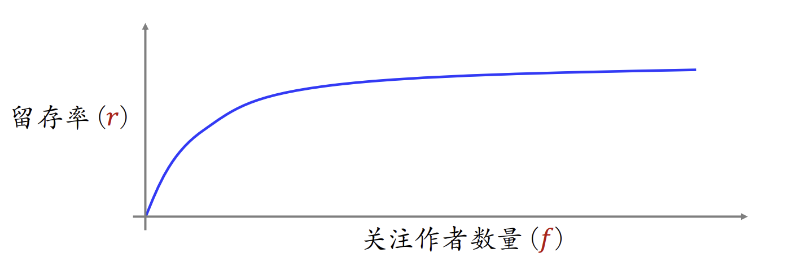


+ 在**融分公式**中添加一项**w(f)\*p**，其中p是模型预估出用户对候选物品的关注率，**w(f)是一个关于f递减的函数**，该指标可以促进用户关注作者。
+ 构建关注**内容池和召回通道**，内容池中物品的关注率高，**只对f较小的用户**使用该内容池。


被关注数(粉丝数)可以提升作者发布积极性，在融分公式中添加**w(fa)\*p**，其中p是预估关注率，**w(fa)是一个关于物品发布者粉丝数递减的函数**。


此外，挖掘**隐式关注关系**(经常看但未关注)也可以提升指标。


转发， **可以给平台带来站外流量**，同样在**融分公式中添加预估转发率乘权重的分数**，促进用户转发，但是转发率的权重要根据用户是不是**KOL**（外站大V，根据用户以往转发带来的流量判断），**如果是，则权重设置较高，反之接近于0**。


评论，融分公式中添加**评论率*与已有评论数量负相关的函数**。 


​	
