#  概要

## 定义

推荐系统可以被定义为：**对于某个用户，在特定的场景下，针对海量的物品信息构建一个函数，函数预测用户对特定候选物品的喜好程度，再根据喜好程度对所有物品进行排序，生成推荐列表。**

推荐系统是一个应用属性很强的领域，需要使用各种各样的技术，**推荐模型只是推荐系统中的一个模块**，而非全部，为了让模型能够正常运行，发挥作用，推荐系统中需要以下众多模块协同工作：

1. 日志系统收集用户反馈，为推荐系统提供原始数据；
2. 大数据系统、流式计算系统从原始数据中提取信息，将它们加工成模型所需的形式
3. 在线学习系统及时更新模型
4. 监控系统让我们观察模型运行是否正常，并且能够自动报警
5. A/B实验系统评估模型效果，并且能够动态配置、改变推荐系统的运行方式

## 推荐系统指标

**北极星指标**

- 用户规模：**日活用户数DAU**——一天内多次使用只算一次日活，**月活用户数MAU**——一月内登录多次使用只算一次月活。
- 消费：**人均使用推荐的时长，人均阅读笔记的数量**
- 发布：**发布渗透率，人均发布量**

**日活用户和留存**是最核心的指标，**UGC**的应用会将**发布量和发布渗透率**也作为核心指标。

工业界常用**LT7和LT30**衡量留存，LT7指的是用户在某一天登陆了应用，**包括这一天的未来一周内的登录次数/7**就是用户这一天的LT7值。所有**用户LT7值的平均**就是系统某一天的LT7结果。

## 实验流程

离线实验：收集**历史数据**，在历史数据上做**训练，测试**。**算法没有部署到产品中，没有跟用户交互。**

小流量AB实验：把**算法部署到实际产品**中，用户实际跟算法做**交互**。用户分为**实验组和对照组，实验组用新策略，对照组用旧策略**，比较实验组是否**优于**对照组，如果优于则可以**加大流量最终推全。**

## 推荐系统的链路

- 召回：用多条通道，取回几千篇笔记
- 粗排：用小规模神经网络给笔记打分，选出分数最高的几百篇
- 精排：用大规模神经网络，给几百篇笔记打分
- 重排：做多样性抽样，规则打散，插入广告和运营笔记

## 大数据架构

以视频推荐为例，为了让模型了解每个视频的受欢迎程度，需要计算每个视频的点击率CTR。计算CTR有3方面的难点

1. 为了保证统计结果的**有效性**，需要将统计窗口拉大，比例统计过去一周每个视频的CTR，**但是要回溯的历史越长，所涉及到的计算量就越大**。
2. 此外线上做预测的**时间非常紧张**，留给所有特征的准备时间不会超过10ms。
3. 由于Hadoop分布式文件系统(HDFS)**只支持批量数据读写**，因此**有许多即时的用户行为还没来得及组成用户日志或落盘到HDFS**，导致出现冷热数据的时间差，只能用到**过时的数据**。

为了应对大数据系统的复杂性，lambda架构应运而生

+ **将数据请划分为分别针对冷热数据的两个子请求**
+ **针对冷数据的请求，由离线曾批量完成计算，其结果由近线层缓存并提供快速查询**
+ **针对热数据的请求，由在线层基于流式算法进行处理**
+ **汇总冷热数据的结果，一般是将两个指标都喂给模型，使模型具备不同时间维度的视角**

离线层：**启动小时级的定时任务，每个小时都向前回溯一周的用户行为日志，统计数据。**

近线层：**将离线层计算后的结果导入键值型数据库，加速访问。**

在线层：**使用Flink，Storm等流式计算框架，对接用户的行为数据流，不等数据落地就直接进行分析，计算结果也缓存到键值数据库中。**

## 推广搜

推广搜是互联网业务的三驾马车，其中推荐与搜索负责**留住用户，生产流量**，而广告负责**将流量变现**。

三者的共同点如下

1. 在功能架构上，三者都遵循**”先召回粗筛，再由排序精挑细选“**
2. 在数据架构上，三者都遵循**Lambda架构**
3. **许多算法和技术在三个领域是互通的**
4. 推广搜都需要**高度个性化**，搜索不能单纯的返回关键词相关的物料，还要考虑用户画像；广告不能满足用户的需求只会浪费金钱。

推荐和搜索最大的差异在于**用户表达其意图的方式不同**，搜索中，用户通过输入查询语句显示表达其意图

其中，**t是物料，q是查询语句，u是用户**，模型衡量物料对用户输入的查询的匹配程度，这里考虑了用户信息，因此**不同的用户使用相同的查询语句得到的结果是不同的**。

而推荐系统中用户无需现实表达其意图，推荐系统通过自己的长期观察，猜测用户意图，完成推荐。

此外，**搜索对推结果的准确性要求更加严格**，例如对多个查询条件搜索时，需要考虑标签的并集

在推荐中，系统会对结果扩展

广告是为了流量变现，需要兼顾**用户，广告主，平台**三方的利益，参与方更多更复杂，优化难度更高。

广告关注的目标是**更深层次的转化**，它的**转换链很长**，例如对于电商app广告，一次完成的转化包括：用户点击广告、下载安装App、注册、成功下单。**这会带来严重的延迟反馈问题，能成功转换的样本较为稀疏，建模难度高**。

此外，**广告对指标的精度要求高**，因为广告费用的计算与指标相关，微小的误差会带来损失，而推搜中只要求**相对准确性**——能排名即可。

最后，**广告的候选集会小很多**，因为投放广告存在一定的技术和财力上的门槛。

# 召回

召回是推荐系统的第一个环节，它面对的候选集一般要达到**百万级规模**，所以召回模块的第一要务就是`快`，**为此它可以牺牲一部分精度，只要能找到与用户兴趣比较匹配的物料就可以，而不一定是最匹配的**

为了**弥补**精度上的不足，召回模块一般采用`多路召回`的方式，以`数量弥补质量`，每路召回只关注用户或物料信息的一个侧面。

注意，**排序模型并不是删除了交叉信息就能作为召回模型**，二者的应用领域不同，召回是为了**筛选掉不感兴趣的物料**。

## Training Data Mining

### 正负样本不均衡

用对比学习，**把一个正样本变成更强的监督用对比学习，把一个正样本变成更强的监督**，例如使用listwise中的infonce loss

###  曝光点击作为负样本

召回阶段不能选择曝光未点击的物品作为负样本，与排序不同，召回的目标是将”用户可能喜欢的，和用户可能不感兴趣的分开“。

因此送入召回模型的样本，既要让模型见过最相似的，也要见过最不靠谱的，从而到达见世面，开眼界的效果。这里曝光未点击的物品与用户可能感兴趣的物品高度相似，这些物品作为负样本无法很好的训练模型。

### 随机负采样

随机负采样不意味着在整个候选库里等概率抽样，在任何一个推荐系统中，`二八定律`是不可避免的，即少数热门物料占据了绝大多数的曝光和点击。

在随机负采样时，大多数负样本由冷门物品组成，因此会导致模型认为冷门物品等于用户不感兴趣，所以要对负样本的抽取按照**热度分布**处理。

### In-batch采样

 **batch 内负采样（in-batch negatives）**。以点击场景的 U2I 召回为例，在一个 batch $$B$$ 中，第 $$i$$ 条正样本由用户 $$u_i$$ 和与其发生交互的物品 $$t_i$$ 组成，即正样本对 $$(u_i, t_i)$$。

batch 内负采样指：对同一用户 $$u_i$$，batch 中除 $$t_i$$ 之外的其它样本的正物品都作为它的负样本，即：
$$
(u_i, t_j), \quad \forall j \in B,; j \ne i
$$
因此，第$i$个样本对应的负样本集合为：
$$
S_i^- = {, t_j \mid j \in B,; j \ne i ,}
$$

这种做法**可以提高模型的训练速度**，从而复用已经计算好的物品表示，当batch足够大时，近似全局负采样

缺点在于：

+ 负样本都来自于**其他用户的点击**，而其他用户的点击大多都是**热门物品**，缺少冷门物品，热门物品经常作为负样本，而实际上热门物品更可能被点击，因此存在**SSB**；
+ 对Batch Size高度依赖，太小了负样本数量受限，太多了带来显存压力。

为了解决样本偏差的问题，在batch内负采样的基础上发展了**混合负采样**，其建立了**一个额外的向量缓存**，存储物料塔中训练得到的**最新物料向量**，在训练每个batch时，先进行batch内负采样，**再额外从向量缓存中采样一些物料向量作为Easy Negative**。

### hard-negative

`hard-negative`指的是**<user,item>匹配度适中的，能在训练时增加难度，让模型关注细节的样本**。

hard-negative的选取有启发式的，即根据业务需求划分。

另一种做法是，用上一版本的召回模型筛选出“没那么相似”的样本对，训练下一版本召回模型，**一般取拿召回位置在101~500上的物料**。

## 损失函数

### NCE loss

二分类交叉熵损失定义为：
$$
\mathcal{L} = -\frac{1}{N}\sum_{i=1}^{N} \left[ y_i \log(\hat{y}_i) + (1 - y_i)\log(1 - \hat{y}_i) \right]
$$
其中
$y_i \in (0,1)$ 为真实标签，$\hat{y}_i \in (0,1)$ 为模型预测为正类的概率，通常由sigmoid得到:$\hat{y}_i = \sigma(z_i) = \frac{1}{1 + e^{-z_i}}$

召回中用到的**CrossEntropyLoss**，是将Softmax和交叉熵结合
$$
L_{\text{Softmax}} = -\frac{1}{|B|} \sum_{(u_i, t_i) \in B} \log \frac{\exp\left(u_i \cdot t_i\right)}{\sum_{j \in T} \exp\left(u_i \cdot t_j\right)}
$$
(u,t)：第i个**真实匹配对**，T：当前用于做softmax的**候选集合**

可以观察到，分母中要计算**用户向量与所有的物料向量**的点积，而物料的大小属于百万甚至千万，计算量十分惊人。

Noise Contrastive Estimation(NCE)是一种**简化分母**的思路，NCE Loss定义，对每个正样本**随机采样负样本**（推荐系统中不会传入负样本），将问题转换为判断**样本是否来自于噪声的二分类问题**
$$
\begin{align*}
L_{\text{NCE}} &= \frac{-1}{|B|} \sum_{(u_i, t_i) \in B} \left[ \log\left(\sigma\left(G(u_i, t_i)\right)\right) + \sum_{j \in S_i} \log\left(1 - \sigma\left(G(u_i, t_j)\right)\right) \right] \\
&= \frac{1}{|B|} \sum_{(u_i, t_i) \in B} \left[ \log\left(1 + \exp\left(-G(u_i, t_i)\right)\right) + \sum_{j \in S_i} \log\left(1 + \exp\left(G(u_i, t_j)\right)\right) \right]
\end{align*}
$$
其中$\sigma$为**Sigmoid**函数,Si表示**第i个正样本对应的负样本集合**，**G(u,t)**为模型对样本的**得分**（如点积）

$$
G(u, t) = \boldsymbol{u} \cdot \boldsymbol{t} - \log Q(t | u)
$$
$\log Q(t | u)$ 是为了**修正热门物品被过度惩罚**，因为**负样本主要由热门物料组成**，会对热门物料进行了过度打压，可能**导致推荐结果过于小众**。$\log Q(t | u)$是一个和**物料热度正相关的函数**。

如果不考虑修正，就得到了**NEG loss**，优点是**计算简便**，但不像NCE loss有**非常强的理论保障**。
$$
L_{\text{NEG}} = \frac{1}{|B|} \sum_{(u_i, t_i) \in B} \left[ \log\left(1 + \exp\left(-u_i \cdot t_i\right)\right) + \sum_{j \in S_i} \log\left(1 + \exp\left(u_i \cdot t_j\right)\right) \right]
$$

### Sampled Softmax

Sampled Softmax的核心思想是**采样近似**，仍然是多分类问题。

1. **对每个训练样本，保留正确的类别**
2. **从所有的类别中随机采样N个负样本**
3. **仅在这个N+1个类别上计算Softmax loss**

$$
L_{\text{SampledSoftmax}} = -\frac{1}{|B|} \sum_{(u_i, t_i) \in B} \log \frac{\exp\left(G(u_i, t_i)\right)}{\exp\left(G(u_i, t_i)\right) + \sum_{j \in S_i} \exp\left(G(u_i, t_j)\right)}
$$

### Pointwise

单点法，为单个物品计算得分，将问题转换为回归或分类

### Pairwise

配对法，关注物品对，可以直接优化排序关系，但是样本量爆炸，**无法区分好一点和好很多**。

一个样本是由：**用户，交互过的正向物料，随机采样的负向物料**组成的**三元组**，优化目标是，**针对同一个用户u，正向物料与他的匹配程度要远远高于负向物料**。

一种损失函数是**Marginal Hinge Loss**，其中m是超参数

$$
L_{\text{Hinge}} = \frac{1}{|B|} \sum_{(u_i, t_{i+}, t_{i-}) \in B} \max\left(0, m - \boldsymbol{u}_i \cdot \boldsymbol{t}_{i+} + \boldsymbol{u}_i \cdot \boldsymbol{t}_{i-}\right)
$$

另一种是**Bayesian Personalized Ranking Loss (BPR Loss)**，它的思想是，针对用户的排序，**正样本在负样本之前的概率$$P_{\text{CorrectOrder}} = \text{sigmoid}(\boldsymbol{u}_i \cdot \boldsymbol{t}_{i+} - \boldsymbol{u}_i \cdot \boldsymbol{t}_{i-})$$要最大化**。
$$
\begin{align*} L_{\text{BPR}} &= \frac{1}{|B|} \sum_{(u_i, t_{i+}, t_{i-}) \in B} -\log\left(P_{\text{CorrectOrder}}^{(i)}\right) \\ &= \frac{1}{|B|} \sum_{(u_i, t_{i+}, t_{i-}) \in B} \log\left(1 + \exp\left(\boldsymbol{u}_i \cdot \boldsymbol{t}_{i-} - \boldsymbol{u}_i \cdot \boldsymbol{t}_{i+}\right)\right) \end{align*}
$$

### Listwise

以整个列表为训练单位，考虑全局相对结构。

`InfoNCE` 可以看作是K+1的多分类问题：让 $q$ 和 $k^+$ 的相似度尽量高，同时让 $q$ 和其他 $k_i$ 的相似度尽量低。温度系数控制softmax对相似度差异的敏感程度
$$
 L_{\text{InfoNCE}} = -\log \frac{\exp(q\cdot k^+/\tau)}{\sum_{i=0}^{K}\exp(q\cdot k_i/\tau)}
$$

## 协同过滤

### **Itemcf**

物品之间的相似度基于物品的**重叠受众 **

如果考虑用户对物品的喜欢程度

### UserCF

计算用户间的相似度，**越热门的物品对计算相似度帮助不大，不能反映出用户的兴趣**，因此需要对物品按照**热度**赋予一个权重。

## 矩阵分解

### 原理

如上图所示，U代表用户，S代表物品，矩阵中的数字是用户对物品的打分，?代表用户没有给物品打过分。实践中，矩阵一般十分稀疏，矩阵分解是将 $m\times n$ 维的矩阵R分解为 $m \times k$的用户矩阵和$k \times n$维的物品矩阵相乘的形式，其中k为隐向量的维度。

常用的训练方法是，通过**梯度下降**让相乘得到的评分矩阵与原始矩阵尽可能拟合。

矩阵补充的实践效果并不好

1. **没有利用物品和用户的属性**
2. **负样本的选取方式不对**
3. **做训练的方法不好，如损失的计算，使用内积**

### 线上召回

1. 训练得到的Embedding矩阵A和B，A中每一列是用户，B中每一列是物品。
2. 把矩阵A的列存储到**字典**中，B用**其他方式**存储。
3. 把**用户ID**作为key查找得到**用户向量a**
4. 第i号物品的embedding记作$b_i$，**返回能使内积<a,$b_i$>最大的k个物品**

最后一步中，如果枚举所有物品，**时间复杂度会正比于物品数量**，工业中一般采用**近似最近邻查找**，**最近邻的标准有欧氏距离，向量内积，余弦相似度**。

首先将物品**按照最近邻划分为多个区域**，每个区域用一个**向量**表示，同时**建立区域内点到向量的映射**。

接下来计算**用户向量与区域向量的距离**（取决于最近邻的标准），找出**最近**的向量；再计算该向量**区域内所有点与用户向量的距离**，得到最近的K个。

这些改进大大减小了枚举的次数。

## Word2Vec

### Item2Vec

**Item2Vec**借鉴了**NLP**领域的**Word2Vec**，Word2Vec的目标是**将每个单词转换为能表征其语义的稠密向量**，学习方法是**给定一个中心词w**，**预测哪些词能够出现在w的上下文中**，与w搭配使用。比如给定一句话`“The quick brown fox jumps over the lazy dog”`，当我们选中`fox`当中心词，并且取宽度为1的窗口作为上下文的范围，Word2Vec的训练目标就 是使`“fox, brown”`和`“fox, jump”`这样的单词组合出现的概率越大越好。

理论上的损失函数就是
$$
L_{\text{word2vec}} = -\frac{1}{|B|} \sum_{(w_i, c_i) \in B} \log \frac{\exp\left(\boldsymbol{w}_i \cdot \boldsymbol{c}_i\right)}{\sum_{j \in V} \exp\left(\boldsymbol{w}_i \cdot \boldsymbol{c}_j\right)}
$$
为了简化计算量，使用**NEG**技巧
$$
L_{\text{word2vec}} = \frac{1}{|B|} \sum_{(w_i, c_i) \in B} \left[ \log\left(1 + \exp\left(-\boldsymbol{w}_i \cdot \boldsymbol{c}_i\right)\right) + \sum_{j \in S_i} \log\left(1 + \exp\left(\boldsymbol{w}_i \cdot \boldsymbol{c}_j\right)\right) \right]
$$
**Item2Vec**则是将用户的某一个**行为序列**当成一个句子，序列中的每个**Item ID**当成一个单词，按照以上方式收集完数据后，直接套用Word2Vec训练，训练完成后，就能得到每个物料的Embedding使用。

### Airbnb召回算法

Item2Vec直接套用Word2Vec尽管简单方便，但是忽略了**推荐领域与NLP领域的许多差异之处**，例如，用户的行为序列中，**第一个点击的物品和最后一个点击的物品非常有可能相似**，但是**NLP中只会认为一个词与左右的词是相关的**。

Airbnb就此，针对民宿中介的业务特点，对Word2Vec进行了若干改造。

I2I召回中

1. **正样本**定义为**窗口内的邻近房屋**，同时如果有房屋被预定了，那么额外增加一批正样本，**由被预定房屋与其他房屋组成**。
2. **负样本**的**主力是随机采样**得到的，同时考虑到房屋的固有属性——随机采样得到的样本大多是异地的，要为**每个房屋从与其同城的其他房屋中采样一部分作为Hard Negative**
3. 损失函数与Word2Vec一样采用**NEG Loss**，但增加了**额外的正负样本**

U2I召回中，Airbnb从**对业务更重要的预定数据**入手，虽然预定数据**十分有限**，但Airbnb根据属性和人工规则**将用户和房屋分类**，这样单个用户与单个房屋的预定记录是稀疏的，而某类用户对某类房屋的预定就吩咐多了，这里要学习的则是**类别的Embedding**，有助于**冷启**。

1. 正样本，如果某用户预定过某房屋，那么用户所属的类别与房屋的类别应该是相似的
2. 负样本的主力是随机采样
3. 损失函数与Word2Vec一样采用**NEG Loss**

## YoutubeDNN召回

`YoutubeDNN`召回的目标是**预测用户下一个观看的视频**，即给定用户U，上下文C和整个视频语料库V，预测用户在时刻t观看的视频$w_t$的可能，是一个多分类模型

$$
P(w_t = i|U, C) = \frac{e^{v_i u}}{\sum_{j \in V} e^{v_j u}} 
$$
显然对于分母是不可能每次都遍历的，youtubeDNN通过为每个正样本**负采样**数千个正样本来加速softmax的效率。

模型训练时，将用户**完整**的看完了一个视频，选取正样本。虽然youtube提供点赞或点踩功能，因为其**反馈太过稀疏**，用户很少给小众视频点这种显示反馈。样本来源**不限于推荐结果**，**而是平台上所有视频的观看**，这样有助于新内容的发现。模型会为每个用户选取**固定数量的样本**，防止**活跃用户主导模型**。

模型接受的特征有：

+ **用户的观看历史**，由可变长的视频ID组成，每个视频ID做**embedding**，再对它们取平均。
+ **用户搜索历史**，和观看历史一样，对每个token做embedding然后取平均，搜索历史会**丢弃顺序信息**以防模型窥探到未来的信息。
+ **人口统计特征**，用户的地理位置和设备做embedding，与上述两个embedding**拼接**在一起。
+ 其他**简单的二值特征和连续特征**，**归一化**到[0,1]后输入网络。
+ **视频的年龄特征**，用训练时间减去视频的点击时间。工程师们观察到用户喜欢新视频，并且推荐新视频有助于冷启动，线上预测时置为**0**确保预测时处于训练的最后一刻。

经过三层ReLU全连接层，得到**用户向量和物品向量**，其中物品属性固定，其向量可以**存储到向量数据库**中后续用于线上搜索。

用户向量来自最后一层隐藏层的输出

视频向量是最后一层隐藏层与softmax层的权重，例如
$$
\begin{align*}
\mathbf{a}^{[l+1]} &= \sigma\left( \mathbf{w}^{[l+1]} \mathbf{a}^{[l]} + \mathbf{b}^{[l+1]} \right) \\
&= \sigma\left( \begin{bmatrix}
\mathbf{w}_{10}^{[l+1]} & \mathbf{w}_{11}^{[l+1]} & \mathbf{w}_{12}^{[l+1]} \\
\mathbf{w}_{20}^{[l+1]} & \mathbf{w}_{21}^{[l+1]} & \mathbf{w}_{22}^{[l+1]} \\
\mathbf{w}_{30}^{[l+1]} & \mathbf{w}_{31}^{[l+1]} & \mathbf{w}_{32}^{[l+1]} \\
\mathbf{w}_{40}^{[l+1]} & \mathbf{w}_{41}^{[l+1]} & \mathbf{w}_{42}^{[l+1]} \\
\mathbf{w}_{50}^{[l+1]} & \mathbf{w}_{51}^{[l+1]} & \mathbf{w}_{52}^{[l+1]}
\end{bmatrix} \cdot \begin{bmatrix}
\mathbf{a}_1^{[l]} \\
\mathbf{a}_2^{[l]} \\
\mathbf{a}_3^{[l]}
\end{bmatrix} + \begin{bmatrix}
\mathbf{b}_1^{[l]} \\
\mathbf{b}_2^{[l]} \\
\mathbf{b}_3^{[l]}
\end{bmatrix} \right)
\end{align*}
$$
$[\mathbf{w}_{10}^{[l+1]}, \mathbf{w}_{11}^{[l+1]}, \mathbf{w}_{12}^{[l+1]} ]$即为视频id为1的向量，这里**softmax层是一个单独的模块**，它的**权重随着每一次训练收敛**，在**所有的训练结束后取权重最后物品向量**，这就相当于**离线计算好了**，**用户向量在线生成**，只是最后不用在过一遍softmax层，而是直接做**最近邻查找**。

最后，经过softmax层，得到每个视频的观看概率。

## 双塔模型

### 原理

召回的应用场景规定，`复杂的结构可以出现在一个塔的内部，但绝对不允许出现在两塔之间`。

双塔模型可以看作是矩阵补充模型的**升级**版，双塔指的是**用户塔和物品塔**

整体结构如下

单个塔如下，双塔**能喂入的特征非常丰富**

双塔要求**两塔之间绝对独立、解耦**，只允许在生成最终的用户向量和物料向量之后才点积交叉一次，在此之前，用户/物料信息只能沿着塔向上流动，**绝对不允许出现跨塔的信息交流**。

在训练好神经网络参数后，**物品表征**事先存储在**向量数据库**中，**线上不做推理**，因为物品特征较为**稳定**。**用户特征**只需做一次**线上推理**。

双塔模型属于**后期融合**——顶层之前不对物品和用户特征做融合，线上计算量小。

### 损失函数

双塔模型比较常用的是**基于Batch内负采样的Sampled Softmax Loss**
$$
\begin{align*} G(u, t) &= \frac{\boldsymbol{u} \cdot \boldsymbol{t}}{\tau} - \log Q(t) \\ L_{\text{Tower}} &= -\frac{1}{|B|} \sum_{(u_i, t_i) \in B} \log \frac{\exp\left(G(u_i, t_i)\right)}{\exp\left(G(u_i, t_i)\right) + \sum_{j \in B, j \neq i} \exp\left(G(u_i, t_j)\right)} \end{align*}
$$
对u和t，一个常见的技巧是**除以它们各自的L2 Norm**，转换为**长度为1的向量**（长度指的是范数——平方和开根号），这样**做点积就等价于用cosine(u,t)计算匹配度**，实践证明，**用cosine的效果要更好**。

**$\tau$是温度系数**，如果设置的很**小**，模型**对错误的放大功能就会很强**，能保证推荐结果的**精度**，但是对用户**潜在兴趣覆盖得不够**；反之，对错误的放大功能就会**很弱**，实现了**推荐结果的多样性**，但是**有损用户体验**。

$$Q(t)$$等于**物料t在所有点击样本中的占比**。

如果采用**混合负采样**，损失函数会**引入额外的$B^`$，**代表生成的物料向量的缓存。
$$
L_{\text{Tower}} = -\frac{1}{|B|} \sum_{(u_i, t_i) \in B} \log \frac{\exp\left(G(u_i, t_i)\right)}{\exp\left(G(u_i, t_i)\right) + \sum_{j \in B+B', j \neq i} \exp\left(G(u_i, t_j)\right)}
$$
因为现在负采样来自两种采样策略，所以$$Q(t)$$是一个**组合概率**
$$
Q(t) = \frac{|B|}{|B| + |B'|} Q_{\text{in-batch}}(t) + \frac{|B'|}{|B| + |B'|} Q_{\text{cache}}(t)
$$
$Q_{\text{in-batch}}(t)$定义同上，$Q_{\text{cache}}$是物料在向量缓存中采样到物料t的概率。

### 双塔改进的技术主线

双塔模型最大的**缺点**在于，**用户侧信息与物料侧信息交叉得太晚**，只有得到最后的用户向量与物料向量后才能通过点积进行唯一一次交叉，但此时两个向量已经是**高度压缩**的了，一些**细粒度的信息已经在塔中损失了**，永远**失去了与对侧信息交叉的机会**。

因此改进双塔模型的一条技术主线是：**如何在每个塔最终输出的向量中保留更多的信息，从而有机会与对侧塔得到的向量交叉。**

一种思路是，要想在双塔输出的最终向量中**保留重要的信息，过滤不重要的xin'xi**。

这种思路体现为用**SENet动态调整输入信息**，**SENet**是**Squeeze-and-Excitation Network**的缩写。假设某一侧的信息在喂入塔之前一共有$f$ 个Field，其中第 $i$ 个Field的Embedding是$\boldsymbol{e}_i$。

SENet分为以下三个步骤组成,，如下所示

1. **Squeeze**（压缩），**将每个Field Embedding压缩成一个代表数字**，压缩函数用$F_{eq}$表示，例如Average Pooling，压缩后得到$\boldsymbol{Z} = \left[ z_1, z_2, \cdots, z_f \right]$ 
   $$
   z_i = \text{F}_{\text{sq}} \left( \boldsymbol{e}_i \right) = \frac{1}{k} \sum_{j=0}^{k-1} \boldsymbol{e}_i \left[ j \right]
   $$

2. **Excitation**，**将压缩得到的向量喂入一个小网络$F_{ex}$​**，比如一个两层的全连接网络，
   $$
   \boldsymbol{A} = \text{F}_{\text{ex}} \left( \boldsymbol{Z} \right) = \sigma_2 \left( W_2 \sigma_1 \left( W_1 \boldsymbol{Z} \right) \right) 
   $$
   第一层相当于让所有的Field Embedding相互交叉，第二层将输出映射回f维向量，得到的A反映了每个Field Embedding的**重要程度**。

3. **Reweight**，将**权重向量A与原始输入相乘代替原始特征**。

在**用户侧和物料侧各放置一个SENet**，使**信息在流进塔之前先被增强或过滤**。

另一种思路考虑到**信息在塔中向上流动的过程是一个信息被压缩的过程，不可避免地会带来信息的损失，因此可以让重要的信息抄近路走捷径，直接送到离最终点积交叉更近的位置**。

抄近路的一个方案是**把每个中间层的的输入都送到最后一层，与最后一层的输出拼接为一个大向量，再经过一层FC压缩得到最后的用户/物料向量**。

另一个方案是**将重要信息不仅接入最后一层还要插入各个中间层，这样重要信息就不会因为在塔中的传播路径太长而损失**。

抄近路也有**缺点**，**额外接入的信息会导致该层需要训练存储更多的参数**。

最后一种思路，**对信息可以通过多种通道向上流动，不必执着于DNN，最后将各通道得到的Embedding聚合**。

《深度粗排在天猫新品中的实践》一文中提出一种**“双塔+FM”**的并联结构，如下所示

$$
\text{logit}_{\text{tower}} = \boldsymbol{UE}_{\text{tower}} \cdot \boldsymbol{TE}_{\text{tower}} \\

 \text{logit}_{\text{FM}} = \boldsymbol{E}_{ht_1} \cdot \boldsymbol{E}_{ct} + \cdots + \boldsymbol{E}_{ht_N} \cdot \boldsymbol{E}_{ct} = \left( \sum_{i=1}^{N} \boldsymbol{E}_{ht_i} \right) \cdot \boldsymbol{E}_{ct} = \boldsymbol{UE}_{\text{FM}} \cdot \boldsymbol{TE}_{\text{FM}} \\

\text{logit} = w_{\text{tower}} \text{logit}_{\text{tower}} + w_{\text{FM}} \text{logit}_{\text{FM}} \\
$$

为了方便预测把公式拆解为两个向量点积的形式
$$
\boldsymbol{UE} = \text{concat} \left( w_{\text{tower}} \boldsymbol{UE}_{\text{tower}}, w_{FM} \boldsymbol{UE}_{\text{FM}} \right) \\
 \boldsymbol{TE} = \text{concat} \left( \boldsymbol{TE}_{\text{tower}}, \boldsymbol{TE}_{\text{FM}} \right) \\

 \text{logit} = \boldsymbol{UE} \cdot \boldsymbol{TE} \\
$$
当**信息传递的通道越来越多**，这种**简单的拼接**会导致**聚合后的向量非常长**，给**计算**、**存储**带来较大的压力，一种常见的做法是，将拼接后的向量**再经过一层FC**，映射成一个**较短的向量**。此外还有一种**Attention Fusion**的方法。

## GCN召回

GCN，图卷积神经网络。根据用户的交互行为构建为一张图，各种实体作为图的顶点，各种互动关系构成了图的边。

GCN的基本思想是通过**在图结构上平滑节点特征来学习节点表示**，图结构上往往假设相连的节点在语义或标签上**更相似**，GCN让**一个节点的表示向其邻居表示靠拢**，从而消除噪声，增强局部一致性。公式如下
$$
\mathbf{e}_u^{(k+1)} = \text{AGG}(\mathbf{e}_u^{(k)}, \{\mathbf{e}_i^{(k)} : i \in \mathcal{N}_u\})
$$
**AGG**用于**综合目标节点和邻居节点在第K层的表示**。

GCN最初是为**带属性图上的节点分类任务**提出的，其中每个节点都有丰富的属性特征作为输入，但是在推荐系统的大部分场景中下节点通常仅有一个id作为特征，因此gcn在推荐系统中效果并**不好**。模型中的**特征变化和非线性激活**对对推荐系统结果的影响微乎其微，甚至于更坏。

### lightGCN

**lightGCN**是将GCN用于推荐系统的改进，作者认为，GCN原有的**特征转换**与**非线性激活**两部分对于推荐任务来说比较冗余，因此作者去掉了它们并只保留最关键的**邻居聚合**。

lightgcn通过在用户-物品交互图对二者的embedding上进行**线性传播**来学习其表示，并将各层学习到的embedding加权求和。

lightgcn中AGG函数使用了**简单的加权求和，完全舍弃了特征变换和非线性激活**，公式如下
$$
\mathbf{e}_u^{(k+1)} = \sum_{i \in \mathcal{N}_u} \frac{1}{\sqrt{|\mathcal{N}_u|} \sqrt{|\mathcal{N}_i|}} \mathbf{e}_i^{(k)}\\

\mathbf{e}_i^{(k+1)} = \sum_{u \in \mathcal{N}_i} \frac{1}{\sqrt{|\mathcal{N}_i|} \sqrt{|\mathcal{N}_u|}} \mathbf{e}_u^{(k)}
$$

与大多数现有的图卷积方法不同，lightgcn中没有使用**自连接**(把自己也当作自己的一个邻居，因为自身的特征也十分重要，如果没有自连接的话，节点会越来越像邻居，导致最后难以区分)，但是后续的**层间组合**操作效果等价于自连接。

最后将每一层的结果加权求和
$$
\mathbf{e}_u = \sum_{k=0}^{K} a_k \mathbf{e}_u^{(k)} ;\ \mathbf{e}_i = \sum_{k=0}^{K} a_k \mathbf{e}_i^{(k)}
$$

这里权重可以**手动调整或用模型训练**，但是为了保证lightgcn的**简洁**，模型中没有**单独设置模块来调整权重**，论文中实验发现用**1/(k+1)**作为权重效果最好，注意实际上就是取**均值**，这里的K是固定值。

lightgcn选择使用三层图卷积，(1)**再多的话会过渡平滑** (2)**每一层都能学习到不同的语义** (3)**对不同层的embedding加权求和，相当于实现了带自连接的图卷积效果，因为第0层就是节点原始的embedding**。

以用户为例，用户u的embedding的二阶表示本质上**是与u相连的所有用户v的加权和**，
$$
\mathbf{e}_u^{(2)} = \sum_{i \in \mathcal{N}_u} \frac{1}{\sqrt{|\mathcal{N}_u|} \sqrt{|\mathcal{N}_i|}} \mathbf{e}_i^{(1)} = \sum_{i \in \mathcal{N}_u} \frac{1}{\sqrt{|\mathcal{N}_i|}} \sum_{v \in \mathcal{N}_i} \frac{1}{\sqrt{|\mathcal{N}_u|} \sqrt{|\mathcal{N}_v|}} \mathbf{e}_v^{(0)}
$$
用户v对u的影响可以用平滑系数表示
$$
c_{v \rightarrow u} = \frac{1}{\sqrt{|\mathcal{N}_u| \sqrt{|\mathcal{N}_v|}}} \sum_{i \in \mathcal{N}_u \cap \mathcal{N}_v} \frac{1}{|\mathcal{N}_i|}
$$
可以看出（1）**二者交互的共同物品越多，用户兴趣越相似（2）交互物品越流行，影响越小（3）用户v交互物品越少，影响越大**；这正是**协同过滤**的思想的体现。物品侧也是同样的。

最后使用**内积**作为得分：
$$
\hat{y}_{ui} = \mathbf{e}_u^\top \mathbf{e}_i
$$

模型使用**BPR loss**
$$
L_{\text{BPR}} = -\frac{1}{M} \sum_{u=1}^{M} \sum_{i \in \mathcal{N}_u} \sum_{j \notin \mathcal{N}_u} \ln \sigma(\hat{y}_{ui} - \hat{y}_{uj}) + \lambda \|\mathbf{E}^{(0)}\|^2
$$
使用的是**简单的负采样**，用**Adam**作为优化器，**小批量**进行训练，因为没有特征变化，所以**引入正则化没有选择dropout**。

lightGCN的优点在于：结构极简，计算高效，易于大规模训练，但是无法利用内容特征（文本图像），冷启动能力弱。

### GraphSAGE

GraphSAGE是GCN的一种实现思想，在GraphSAGE出现之前，GCN的实现都是直推式的——预测与训练只能使用相同的图，对于未曾竖线在训练图上的节点，传统GCN无法给出它们的向量表示。GraphSAGE并不直接学习图上节点的向量表示，而是学习出一个转换函数——只要输入节点特征和连接关系就能返回该节点的向量表示。所以，GraphSAGE是归纳式的，适合推荐系统——大型推荐系统构造出的图通常包含上亿个节点，不可能因新来一个实体就重新建图。

GraphSAGE的思路如下所示
$$
\begin{align*} \boldsymbol{h}_v^0 &= \boldsymbol{x}_v \\ \boldsymbol{h}_v^k &= \sigma\left( W_k \sum_{u \in N(v)} \frac{\boldsymbol{h}_u^{k-1}}{|N(v)|} + B_k \boldsymbol{h}_v^{k-1} \right),\ \forall k > 0 \\ \boldsymbol{z}_v &= \boldsymbol{h}_v^{\text{last}} \end{align*}
$$

+ ${h}_v^0$第节点v第0层卷积的结果
+ ${h}_v^{last}$第节点v最后一层卷积的结果
+ ${h}_v^k$代表第\(k\)层卷积，由两部分组成。\( W_k\sum_{u \in N(v)}\frac{h_u^{k-1}}{|N(v)|} \)代表聚合节点\( v \)的**所有邻居**（即\( N(v) \)）向量，再用权重\( W_k \)线性映射。\( B_kh_v^{k-1} \)表示对节点\( v \)的上一层的输出\( h_v^{k-1} \)，用权重\( B_k \)线性映射。第\(k\)层的卷积结果是将以上两部分之和**用函数\(\sigma\)非线性激活**。

卷积过程如下所示，图中的 AGG 表示聚合操作，PROJB 对应公式中的\( B_k \)，PROJW 对应公式中的\( W_k \)

可以看到，随着卷积的深入，**节点用到的邻居所包含的信息越来越丰富**，相当于扩大了单个节点的感受野。

## Mind

Mind，Multi-Interest Network with Dynamic Routing for Recommendation at Tmall 来自淘宝的召回模型

以往的召回模型，计算得到用户兴趣向量，然后与所有item向量进行最近邻搜索，召回最相关的n个。

**但一个用户兴趣向量很难捕捉用户多方面的兴趣，并且当模型计算的用户兴趣向量不准的话，那召回的item可能全是与用户兴趣偏移的**。

Mind，**能够提取多个用户兴趣向量，更好地捕捉用户多方面的兴趣**

### 问题定义

每个样本可以表示为一个三元组：
$$
(I_u, P_u, F_i)
$$

+ 其中 $I_u$ 表示用户 $u$ 交互过的物品集合（也称为用户行为序列）
+ $P_u$ 表示用户 $u$ 的基本画像信息（例如性别、年龄等）
+ $F_i$ 表示目标物品 $i$ 的特征（例如 item id、category id 等）

MIND 的核心任务是学习一个函数，**通过用户行为和用户基础属性，计算用户的k个兴趣向量**（当k=1时，与YoutubeDnn类似）：
$$
V_u = f_{\text{user}}(I_u, P_u)
$$
其中
$$
V_u = (\vec{v}_u^{1}, \ldots, \vec{v}_u^{K}) \in \mathbb{R}^{d \times K}
$$
表示用户 $u$ 的表示向量集合，其中 $d$ 表示向量维度，$K$ 表示用户表示向量的数量。

目标物品 $i$ 的表示向量由多种属性的embedding进行average pooling得到：
$$
\vec{e}_i= f_{item}(F_i)
$$

当用户表示向量与物品表示向量学习完成后，k个用户兴趣向量都可以用来召回item：
$$
f_{\text{score}}(V_u, \vec{e}*i) =
\max*{1 \le k \le K}
\vec{e}_i^{T}\vec{v}_u^{k}
$$
其中 $N$ 表示匹配阶段需要召回的候选物品数量，系统根据该评分函数选择 Top-$N$ 个物品作为候选集合。

### Multi-Interest Extractor Layer

多兴趣提取层，用于对历史行为进行聚类，并为聚类结果推导出相应的表示向量。

动态路由算法 

### capsule network

Mind借鉴capsule network 胶囊神经网络，提取用户兴趣向量。

capsule network由low_level和high_level的胶囊组成，

- low-level capsule： $\vec{c}_i^l \in \mathbb{R}^{N_l \times 1},\ i \in \{1, \dots, m\}$，$N_l$是胶囊向量的维度
- high-level capsule： $\vec{c}_i^l \in \mathbb{R}^{N_H \times 1},\ i \in \{1, \dots, N\}$
- routing logit： $b_{ij} = (\vec{c}_j^h)^T S_{ij} \vec{c}_i^l$

其中$S_{ij} \in \mathbb{R}^{N_h \times N_l}$为双线性映射矩阵，是需要学习的参数

接着，可以得到high-level capsule的候选向量：$\vec{z}_j^h = \sum_{i=1}^m w_{ij} S_{ij} \vec{c}_i^l$

$w_{i.j}$是连接high-level capsule和low-level capsule的权重：$w_{ij} = \frac{\exp b_{ij}}{\sum_{i=1}^m \exp b_{ij}}$ 

最后，通过非线性的squash函数得到high-level capsule的向量，即capsule network的输出（目标产物），可作为下一层网络层的输入
$$
\vec{c}_j^h = \text{squash}(\vec{z}_j^h) = \frac{\left\|\vec{z}_j^h\right\|^2}{1 + \left\|\vec{z}_j^h\right\|^2} \cdot \frac{\vec{z}_j^h}{\left\|\vec{z}_j^h\right\|}
$$

1. $b_{ij}$ 一般是初始化为 0； 
2. 整个动态路由过程一般重复3次，即以上由low-level capsule 得到 high-level capsule的过程；
3. 由于 high-level capsule 是 capsule network 的输出，初始的输入只有 low-level capsule，所以第一次 routing 无法计算得到 $b_{ij}$，才需要将 $b_{ij}$ 初设化为0；
4. 借由第一次 routing 过程计算得到的 high-level capsule，就可以给到后面的routing过程中。

### B2I Dynamic Routing

论文对经典的胶囊网络做了修改，Behavior-to-Interest (B2I) dynamic routing，即通过用户行为再由动态路由的方法得到用户兴趣向量。

**在这个场景下，low-level capsule对应用户的行为，即用户发生过交互的item向量。high-level capsule对应用户的多个兴趣capsule。**

调整的部分如下：

+ 使用共享双线性映射矩阵S
+ **Randomly initialized routing logits**：将 $b_{ij}$ 初设化修改为高斯分布 $\mathcal{N}(0, \delta^2)$

+ **Dynamic interest number**：不同的用户设置不同的兴趣capsule数量，这主要是为了节省计算资源，$K_u' = \max\left(1,\ \min\left(K,\ \log_2\left(|I_u|\right)\right)\right)$

### Label-aware Attention Layer

在提取得到K个兴趣capsule后，与用户基础属性embedding拼接，然后输入到H层relu全连接神经网络，得到K个最终能够表征用户兴趣的向量$V_u$。

随后送入注意力机制中，用target item赋予k个用户兴趣向量不同的重要性，下图中K和V均为用户兴趣向量，Q为target item。

公式如下：
$$
\vec{\boldsymbol{v}}_u = \text{Attention}\left(\vec{\boldsymbol{e}}_i, \mathrm{V}_u, \mathrm{V}_u\right) = \mathrm{V}_u \mathrm{softmax}\left(\text{pow}\left(\mathrm{V}_u^T \vec{\boldsymbol{e}}_i, p\right)\right)
$$
其中p是控制注意力分布的，p=0时，每个兴趣向量趋于相同的注意力权重，当p大于1，$V_u^T \vec{e}_i$越大的会接接收越大的注意力，当p趋于无穷大时，只有最大的兴趣向量起作用，其他的兴趣向量几乎被忽略。

## SASRec

**捕获序列的动态变化**是推荐系统中重要的一步，以往的方法，`Markov Chains`在稀疏数据集上表现良好，根据用户最近的行为预测下一步动作；而`RNN`，在稠密的数据集上更为优秀，且捕捉整个序列的语义。本文中作者提出使用**注意力机制**来融合两种方法的优点，既能融合整个序列的语义信息，且在每一步预测时会识别出用户历史序列中和候选物品最相关的部分。

`SASRec（Self-Attentive Sequential Recommendation`）本质是把 **Transformer encoder** 用在推荐序列建模上，用来建模用户行为序列中的**长期依赖 + 重要行为选择**。

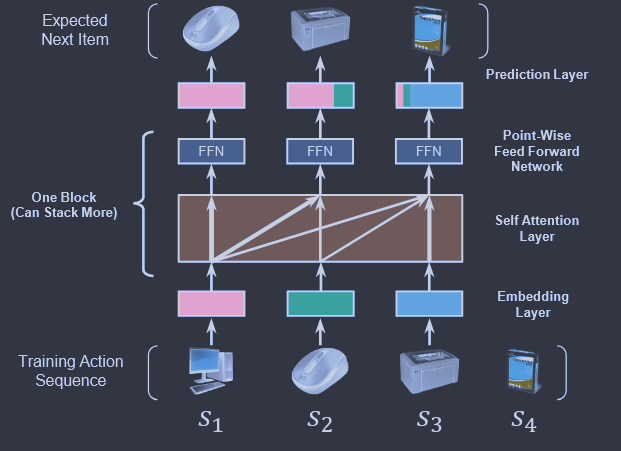

整体流程如下：

1. item序列（用户历史点击物品id）经过embedding层，每个物品embedding还会和对应位置的**position embedding**相加。
2. 进入多层堆叠的Self-attention Layer
   1. 自注意力模块，$\hat{S} = \text{SA}(\hat{E}) = \text{Attention}(\hat{E}W^Q, \hat{E}W^K, \hat{E}W^V)$
   2. 点积前馈神经网络，$F_i = \text{FFN}(S_i) = \text{ReLU}\big(S_i W^{(1)} + b^{(1)}\big) W^{(2)} + b^{(2)}$
   3. 上述两个模块后都跟着残差连接和Dropout，$g(x) = x + \text{Dropout}\big(g(\text{LayerNorm}(x))\big)$
3. 预测层，建模后的用户表示与物料向量做矩阵乘法$r_{i,t} = F_t^{(b)} M_i^\top$，得到相关性分数

## 其他召回

**Geohash召回**，根据用户的**地理位置**召回，取回该地点**最新的K篇优质笔记**，**不考虑个性化**。

Geohash将**二维的经纬度坐标**转换为带有**前缀性质索引性质的一维坐标**。在一定程度上可以保证，两个Geohash的**公共前缀**越长，其所对应的区域就越近。

首先对经度纬度**二分**

- 第一轮：经度范围为 -180°~180°，可以拆分成 -180°~0° 以及 0°~180° 两部分，如果经度从属于前者，则令首个 bit 位取 0，否则令首个 bit 位取 1；
- 第二轮：-180°~0° 可以拆分为 -180°~-90° 和 -90°~0°，如果经度从属于前者，则令第二个 bit 位取 0，否则令第二个 [bit 位](https://zhida.zhihu.com/search?content_id=231481591&content_type=Article&match_order=4&q=bit+位&zhida_source=entity)取 1；0°~180° 可以拆分为 0°~90° 和 90°~180°，前者令第二个 bit 位取 0，后者令第二个 bit 位取 1
- 第 3 ~ N 轮：重复上述步骤的思路，最终递归二分，将经度表示成一个由二进制数字组成的字符串

将转换后的经纬度按照**经度字符串+纬度字符串依次交错排列**的形式组合，最后按照**5个一组划分**按**base32**规则映射，得到最后的字符编码。

**同城召回**，按照**城市**召回最新的K篇优质笔记，**不考虑个性化**。

**缓存召回**，**复用前n次推荐精排的结果**，因为缓存**有限**，需要**退场**机制。

此外还有作者召回。

### 曝光过滤&Bloom Filter

如果用户**看过**某个物品，则不再把该物品**曝光**给该用户。对于**每个用户记录曝光给他的物品(一定时间内)**，对于每个被召回的物品，判断它是否已经给该用户曝光过，**排除掉曾经曝光过**的物品。

**暴力对比**召回的物品是否在曝光记录中，会带来较大的**计算开销**。

Bloom Filter是一种**数据结构**，**判断一个物品ID是否在已曝光的物品集合中**。返回结果为**No**，那么**一定不在**；返回结果为**Yes**，该物品**可能在集合中**(有概率误判)。因此使用Bloom Filter**一定能过滤掉已曝光的物品，但是会导致未曝光的物品被剔除**。该结构的缺点在于，**不支持删除物品**。

Bloom Filter将**物品映射为m维向量**，使用**k个哈希函数**。初始化时，将**已曝光物品**使用**哈希函数**映射到k个位置上，将这些位置设置为**1**，被**重复**映射的位置**忽略**。对被召回的同样使用k个哈希函数映射，如果**全部位置都为1**，说明该物品**被曝光**，反之未被曝光。

曝光物品集合大小为**n**，二进制向量维度为**m**，使用**k**个哈希函数	

人为设定可容忍的误伤概率后，有

# 粗排

**粗排**：从召回通道召回的物料中再次筛选，用于**快速过滤低质量候选**。

**精排**：精排的任务是从层层筛选出的千级规模的比较符合用户兴趣的物料中，挑选出几十个最合用户品味的物料。精排的侧重点是**提升预测精度**，看重**物料信息和用户信息的交叉特征**。

## 粗排双塔模型

**双塔模型在粗排中仍是主力**，与召回的双塔相比，二者的相似之处在于

+ 训练时，都需要**用户塔和物料塔隔离，解耦建模**。
+ 部署时，面对一次用户请求，**用户向量只需要生成一遍**，**物料向量可以离线生成好**，缓存起来，被不同的用户请求。

不同点在于

+ 因为**候选集大小不同**，粗排中无需使用**向量数据库**，物料向量直接**存入内存缓存起来**，在线预测时，**线性遍历**与唯一的用户向量计算粗排得分。
+ 对于负样本，召回绝对不能只拿“曝光未点击”作为负样本，负样本的主力必须由随机负采样组成。**粗排可以和精排一样，拿“曝光未点击“做负样本**，但是这里存在**选择偏差（SSB）**——训练时用的都是曝光后的数据，预测时面对的只是召回后的结果，质量远不如曝光数据，纠正这个偏差是业界的一个改进方向。
+ 使用的样本不同，那么**损失函数**自然也不一样，粗排的损失函数是BCE
+ 召回中，用户向量和物料向量的交叉只能通过点积实现，因为需要调用ANN算法；粗排中，**两个向量可以喂入一个DNN做更复杂的交叉**。

## 蒸馏

精排可以通过**知识蒸馏**的方式向粗排传道授业，**提升粗排模型的表达能力**。

知识蒸馏涉及**两个模型**

+ 一个模型拥有**相对复杂的结构**，**喂入了更多的特征**，表达能力也能强，称为**Teacher**模型，用$\text{F}_\text{t}(X; W_\text{t})$表示。因为**消耗的计算资源太大**，**无法满足在线预测的实时性要求**，或者**用到了在线根本无法拿到的特征，导致上线困难**。
+ 另一个模型**结构相对简单，特征也少**，称为**Student**模型，用 $\text{F}_\text{s}(X; W_\text{s})$表示，**模型易于上线，实时性也好，但是能力不足**。

**知识蒸馏**可以**缓解Student模型能力不足的缺点**。

Student模型的**损失函数**由两部分组成

+ **拟合真实目标y**，表示为$L_s(y, \text{F}_s(X; W_s))$
+ **拟合Teacher模型的输出**，表示为$L_d(\text{F}_\text{t}(X; W_\text{t}), \text{F}_\text{s}(X; W_\text{s}))$

最后Student模型的优化目标是，**最小化以上两种损失的加权平均**
$$
\min_{W_s} (1-\lambda) \times L_s(y, \text{F}_s(X; W_s)) + \lambda \times L_d(\text{F}_t(X; W_t), \text{F}_s(X; W_s))
$$
训练完毕后，**只将Student模型部署上线**。

推荐系统中，**粗排作为Student，精排作为Teacher**，知识蒸馏除了能**提升粗排模型的表达能力**，还能**增强粗排、精排的一致性**。毕竟粗排的下游就是精排，如果挑选出的物料不符合精排的口味，那么粗排的努力就白费了。

一种在粗排实现知识蒸馏的方法是让**粗排、精排联合训练**，优化目标如下
$$
\min_{W_t, W_s} (1-\lambda) L_s(y, \text{F}_s(X; W_s)) + \lambda L_d(\text{F}_t(X, X^*; W_t), \text{F}_s(X; W_s)) + L_t(y, \text{F}_t(X, X^*; W_t)) 
$$

+ $\text{F}_\text{s}(X; W_s)$ 代表Student，也就是粗排模型。
+  $\text{F}_\text{t}(X, X^*; W_t)$代表Teacher，也就是精排模型。$X^*$ 是粗排模型不能用、只能为精排模型所用的那部分交叉特征。 
+ $L_s$ 和 $L_t$ 代表普通的损失，让粗精排模型去拟合用户的真实反馈。 
+ $L_d$ 代表蒸馏损失，要最小化粗精排得分的差距。

这种联合训练实现起来有以下困难：

+ 联合训练的模型**包括粗排和精排的参数**，**非常庞大**，**无法保证两个目标在更新同一参数时不会相互干扰**。
+ **粗排精排耦合在一起，维护更新时牵一发而动全身，不能灵活应对业务目标**。

联合训练的方式一般只适合**小团队**，大厂实际用的是**两阶段蒸馏法**——**线上有了正在运行的精排模型，而且精排模型的打分早已被记录在日志中，让粗排去拟合就好了**。
$$
L = \frac{1}{|B|} \sum_{(X_i, s_i, y_i) \in B} (1-\lambda) L_{\text{CTR}} \left( y_i, \text{F}_{\text{pr}}(X_i) \right) + \lambda L_{\text{Distill}} \left( s_i, \text{F}_{\text{pr}}(X_i) \right) 
$$

+ $B$ 代表一个Batch，每条样本由输入特征向量 $X_i$、用户反馈 $y_i$ 和精排打分 $s_i$ 组成。
+  $\text{F}_{\text{pr}}$ 代表粗排模型。 $L_{\text{CTR}} \left( y_i, \text{F}_{\text{pr}}(X_i) \right)$ 代表主损失函数，让粗排打分去拟合用户真实反馈 $y_i$ 
+  $L_{\text{Distill}} \left( s_i, \text{F}_{\text{pr}}(X_i) \right)$ 代表蒸馏损失函数，让粗排打分去拟合精排打分$s_i$。

## 粗排纠正曝光

**传统的粗排模型**的**样本选择策略**与**精排**一致，用**点击过的物品当正样本**，**“曝光未点击”的物品做负样本**。这种策略下，**所有的样本都来自于曝光数据**，粗排**没有真正见识过**“**低质量**”物料，因此造成了**样本选择性偏差（SSB）**

为此，需要在**被精排排在后面，没有曝光机会的物料中选择一部分作为粗排的负样本**，步骤如下

1. 精排排序后，选择若干头部物品和尾部物品组成$S_{top}与S_{bottom}$
2. 将$S_{top}与S_{bottom}$中的物料俩俩配对，与当前用户u，组成一系列三元组$T = \{(u_p, t_p, t_n)\}, \forall t_p \in S_{\text{top}}, \forall t_n \in S_{\text{bottom}}$
3. 损失函数使用Pairwise，目标是$\text{F}_{\text{pr}}(u, t_p) \gg \text{F}_{\text{pr}}(u, t_n)$
4. 实践中，可以对$S_{top}$增加BCE loss

损失函数如下
$$
L_{\text{pr}} = \frac{1}{|T|} \sum_{(u, t_p, t_n) \in T} L_{\text{LTR}} \left( \text{F}_{\text{pr}}(u, t_p), \text{F}_{\text{pr}}(u, t_n) \right) + \frac{\lambda}{|S_{\text{top}}|} \sum_{(u, t, y) \in S_{\text{top}}} L_{\text{CTR}} \left( \text{F}_{\text{pr}}(u, t), y \right)
$$

+ $\text{F}_{\text{pr}}(u, t)$ 是粗排模型对用户$u$和物料$t$之间匹配程度的打分。 
+  $T$ 是按照上面介绍的步骤组成的三元组。 $L_{\text{LTR}} \left( \text{F}_{\text{pr}}(u, t_p), \text{F}_{\text{pr}}(u, t_n) \right)$ 是用Pairwise Loss建模精排结果的偏序关系。
+  $S_{\text{top}}$ 是包含精排结果中的头部物料的那部分样本，它们得到了曝光机会，从而拥有用户真实反馈$y$。 
+ $L_{\text{CTR}} \left( \text{F}_{\text{pr}}(u, t), y \right)$ 就是普通的CTR预估，让粗排打分拟合用户的真实反馈。

## 粗排三塔模型

**计算开销介于双塔模型和精排模型之间。**

- 用户塔很大，线上只做一次计算。
- 物品塔较大，系统会**缓存**物品塔的输出，因此物品塔可以**避免大部分推理**。
- 交叉塔较小，用于计算统计特征和交叉特征，有n个物品就要做n次推理。

模型的主要开销集中在**上层**

粗排阶段也考虑多样性，首先会将**兴趣分数最高**的200个物品送入精排，随后对剩下的物品计算多样性分数，取出其中**兴趣分数+多样性分数最高**的300个送入到精排。

# 交叉结构

要实现特征交叉，只依靠DNN这种**隐式交叉**是远远不够的，还应该加上**指定阶数**的显示交叉作为补充。

1. Wide & Deep就是用**一阶LR**作为Deep侧的补充。 
2. DeepFM用FM实现**二阶交叉**作为Deep侧的补充。 
3. DCN可以指定**任意阶数**的显式交叉，作为Deep侧的补充。

交叉结构一般用于排序阶段，因为需要较为复杂的模型结构，对时间的要求比较大。

## Factorized Machine 

传统的线性模型中只能表示单个特征对目标的影响

$$
\hat{y} = w_0 + \sum_i w_i x_i
$$
FM手动引入所有的二阶特征交互项
$$
\hat{y} = w_0 + \sum_i w_i x_i + \sum_{i<j} w_{ij} x_i x_j
$$
为了降低计算和存储开销，FM把二阶特征交互系数矩阵（对称）做**低秩分解**

$$
w_{ij} = \langle v_i, v_j \rangle = \sum_{f=1}^{k} v_{i,f} v_{j,f}
$$
例如， \[ W= \begin{bmatrix} - & w_{12} & w_{13} \\ w_{12} & - & w_{23} \\ w_{13} & w_{23} & - \end{bmatrix} \] FM 不直接学习 $w_{12},w_{13},w_{23}$，而是给三个特征分别一个向量： \[ \mathbf{v}_1,\mathbf{v}_2,\mathbf{v}_3 \] ，其中隐向量就是[$v_1,v_2,v_3$]

然后规定： \[ w_{12}=\mathbf{v}_1^\top \mathbf{v}_2,\quad w_{13}=\mathbf{v}_1^\top \mathbf{v}_3,\quad w_{23}=\mathbf{v}_2^\top \mathbf{v}_3 \]

公式化简
$$
\begin{align*}
&\sum_{i=1}^n \sum_{j=i+1}^n \langle v_i, v_j \rangle x_i x_j（实际上是一个上三角矩阵） \\
=&\frac{1}{2} \sum_{i=1}^n \sum_{j=1}^n \langle v_i, v_j \rangle x_i x_j - \frac{1}{2} \sum_{i=1}^n \langle v_i, v_i \rangle x_i^2 （所有的特征和减去对角线后除二） \\
=&\frac{1}{2} \left( \sum_{i=1}^n \sum_{j=1}^n \sum_{f=1}^k v_{i,f} v_{j,f} x_i x_j - \sum_{i=1}^n \sum_{f=1}^k v_{i,f}^2 x_i^2 \right) \\
=&\frac{1}{2} \sum_{f=1}^k \left( \left( \sum_{i=1}^n v_{i,f} x_i \right) \left( \sum_{j=1}^n v_{j,f} x_j \right) - \sum_{i=1}^n v_{i,f}^2 x_i^2 \right) \\
=&\frac{1}{2}\sum_f \Big[(\sum_i v_{if}x_i)^2 - \sum_i v_{if}^2 x_i^2\Big]
\end{align*}
$$

注意$v_i和v_j$是**同一个矩阵**的转置，使用向量内积大大**减小了参数的数量**，从$O(n^2)$到$O(nk)$，k是自定义的向量维度

## Wide & Deep

Wide & Deep用于解决**记忆能力和泛化能力**的矛盾，网络由**浅层网络Wide与深层网络Deep**两部分组成，前者负责记住**共现规则**，后者负责学习**低维稠密表示的组合泛化**。

Deep侧遵循推荐模型的经典设计凡是：**Embedding+DNN**，将稀疏特征映射为稠密向量，再拼接为一个大向量输入到DNN中

**Deep侧对特征使用Embedding扩展它们的内涵，再加上DNN对特征进行高阶隐式求导，大大增强了模型的扩展性和推荐系统的多样性，有利于满足低频，小众，个性化的用户需求**。Deep侧接受的都是手动设计以外的特征。

Wide侧实际就是一个**LR**，不必像单独使用时大而全

**根据人工经验、业务背景，将我们认为（i.e.,先验）有价值的、显而易见的特征及特征组合，喂入Wide侧**

**加入wide侧的特征离最终目标也近，避免自DNN底部层层传递带来的信息损失，更有机会将我们的先验知识贯彻到“顶”**。

模型最终的预测结果是两部分相加再过sigmoid

## DeepFM

进行特征交叉的CTR模型

### 动机

现有方法往往对低阶或高阶交互存在严重偏向，而非兼顾二者；特征交叉依赖专业的特征工程，而不能通过常理推断，甚至于只能通过机器学习挖掘出。

文章证明了可以构建一种端到端学习模型，该模型同时兼顾低阶与高阶特征交互，且除原始特征外无需任何特征工程。

### 模型结构

模型由两部分组成FM侧和Deep侧，**二者共享底层Embedding**。

FM侧如下

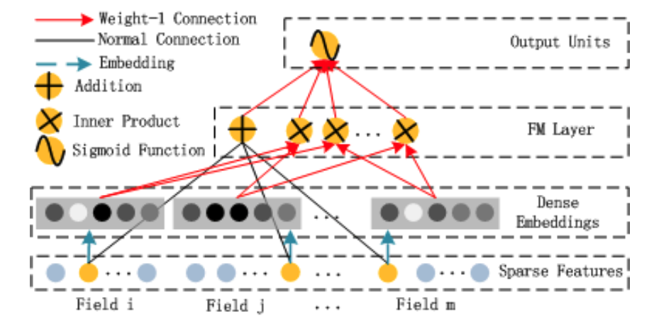

图的表达比较迷惑，可以认为就是普通的FM结构——$$y_{FM} = \langle w, x \rangle + \sum_{i=1}^d \sum_{j=i+1}^d \langle V_i, V_j \rangle x_i \cdot x_j$$

DeeP侧如下，

可以认为是MLP

最后两部分的结果相加—— $$\hat{y} = sigmoid(y_{FM} + y_{DNN})$$

### 结果

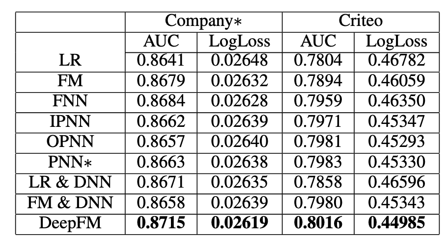

FM&DNN是wide&Deep中将wide替换为FM，但是没有共享底层Embedding，结果证明共享嵌入层对指标有所提升。

## DCN

DCN解决FM和DeepFM的FM部分只能处理**二阶交叉**的问题，同时使用更少的参数。

整体结构 = **Embedding 层 + Cross Network + Deep Network + 输出层**

模型简化图如下

**Embedding and stacking layer**：对特征进行embedding然后拼接。

**Cross Network**：$$x_{l+1} = x_0 x_l^T w_l + b_l + x_l = f(x_l, w_l, b_l) + x_l$$，其中l是层数，$x_0$是第一层输入。**每一层将阶数提升一，L层最多可以得到L+1阶显示多项式交叉，参数量O(Ld)远小于全连接高阶组合，类似于残差连接的计算方式可以使其累加多层也不会产生梯度消失的问题**

**Combination Layer**：需要先将 Cross Network 与 Deep Network 的结果进行 **Concatenation**, 输入到 LR 模型, 从而得到预测概率。

## DCN-v2

虽然DCN能自动学习特征交叉，但是在大规模数据训练中**，DNN会占用绝大多数参数学习隐式交叉，导致交叉网络的能力未被充分利用**；同时交叉网络每一层**只使用一个向量$w_l$进行交叉，参数结构简单，难以充分建模复杂的行为**。

`DCN-V2`可以分为串行结构和并行结构，二者在不同的数据集上有不同的表现

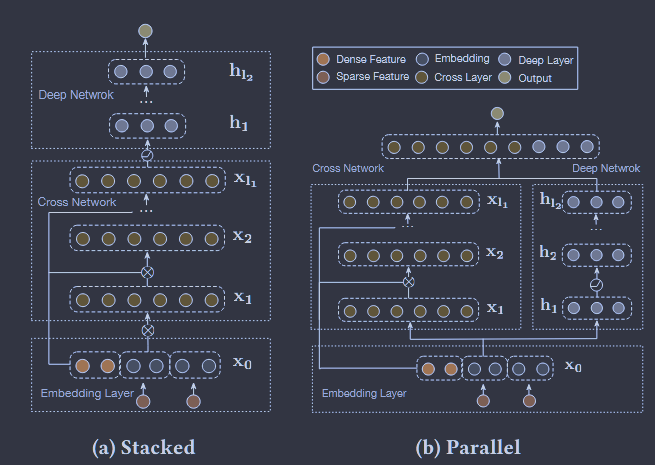

`DCN-V2`的核心改进在于增强了交叉网络的表达能力，每一层使用**矩阵**表达特征交叉
$$
x_{l+1} = x_0 \odot \left(W_l x_l + b_l\right) + x_l
$$

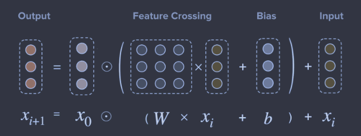

作者经过实验发现，训练得到的矩阵的秩很低，因此可以进行**矩阵分解**，减小参数量
$$
x_{l+1} = x_0 \odot \left(U_l\left(V_l^\top x_i\right) + b_l\right) + x_i
$$

同时作者引入了**MoE**
$$
\begin{align*}
x_{l+1} &= \sum_{i=1}^{k} G_i(x_l) E_i(x_l) + x_l \\
E_i(x_l) &= x_0 \odot \left(U_l^i\left(V_l^{i\top} x_l\right) + b_l\right)
\end{align*}
$$

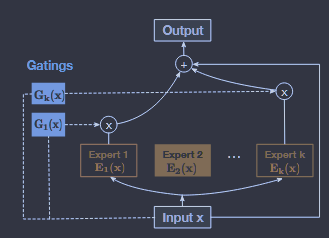

作者认为当特征被投影到低维空间后，不应该被马上还原到原来的高维空间，而是可以在低维空间先进行更复杂的**非线性处理**，最终得到有

$$
E_i(x_l) = x_0 \odot \left(U_l^i \cdot g\left(C_l^i \cdot g\left(V_l^{i\top} x_l\right)\right) + b_l\right)
$$

通过对合成数据进行实验，作者发现DNN不擅长处理乘法交叉，DCN只能较好地学习简单交叉模式，而DCN-V2能够学习更复杂的交叉模式

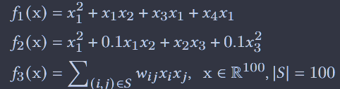

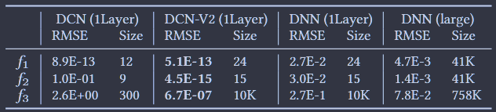

## MGDIN

`Multi-Granularity Information Aware Deferred Interaction Network (MGDIN)`，多粒度信息感知延迟交互网络

CTR模型里特征往往是高度异构的，以往的特征交叉模型将所有的特征同时参与交互，会导致稀疏特征（信息弱，噪声大）污染高质量特征交互。

该模型提出按照不同的粒度划分特征，并采用延迟交互机制，使用attention score衡量特征组信息量，低信息组不参与交互，随着层数增加逐步放开。

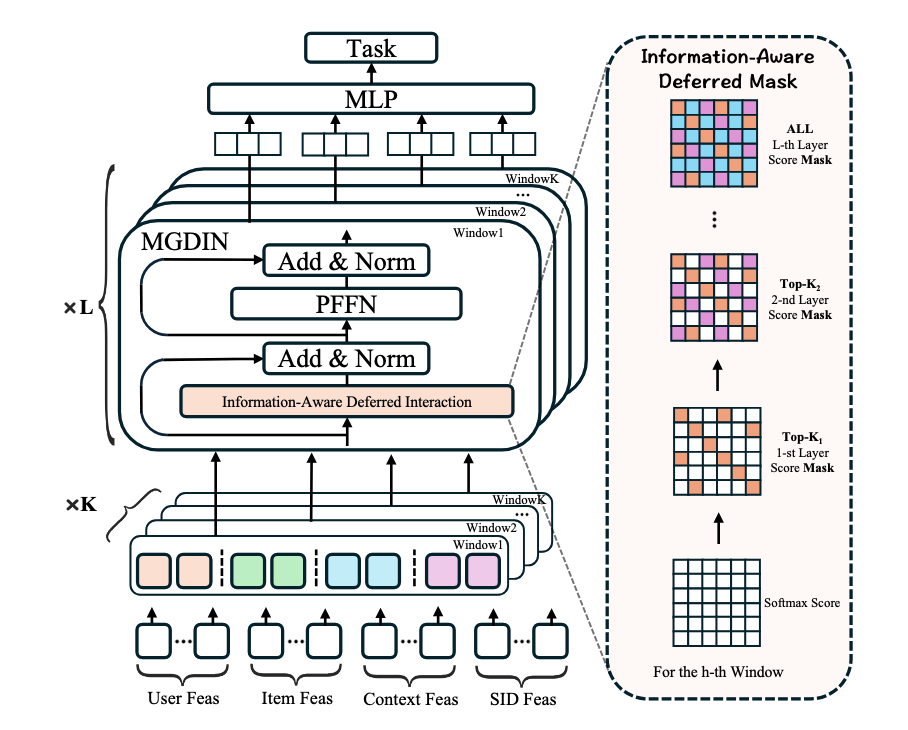

模型首先将输入特征按照窗口大小进行分组。在第 $h$ 个粒度下，特征被划分为：
$$
X^h = \left[ f_1, f_2, \dots, f_{\frac{n}{g_h}} \right]
$$
其中，每个 $f_i$ 表示由 $g_h$ 个原始特征拼接而成的特征组。通过采用多种窗口尺寸（多粒度划分），可以得到多组特征表示：
$$
{ X^1, X^2, \dots, X^h, \dots, X^K }
$$
这些不同粒度的特征组将并行进行后续计算。以下以单一粒度为例进行说明。

1. 基于初始特征表示计算 attention score，得到该粒度下各个特征组之间的相关性矩阵：

$$
A_0^h = \left( X_0^h Q_0^h \right)\left( X_0^h K_0^h \right)^\top
$$

2. 进入多层 Information-Aware Block。在第 $l$ 层中，仅保留 $A_0^h$ 中得分最高的前 $k_l$ 个特征组交互关系，其中：

$$
k_l = \left\lfloor \frac{l}{L} \cdot n^2 \right\rfloor, \quad l \in {1, \dots, L}
$$

基于该掩码机制，第 $l$ 层的输出为：
$$
Z_l^h = \left[ \left( X_{l-1}^h Q_l^h \right)\left( X_{l-1}^h K_l^h \right)^\top \odot \mathbb{I}\left( A_0^h \in \text{Top-}k_l \right) \right] X_{l-1}^h V_l^h
$$

3. 在进入下一层之前，首先进行残差连接与归一化：

$$
\hat{Z}*l^h = \operatorname{LN}\left( Z_l^h + X*{l-1}^h \right)
$$

随后通过前馈网络（PFFN），并再次进行残差连接与归一化：
$$
X_l^h = \operatorname{LN}\left( \operatorname{PFFN}\left( \hat{Z}_l^h \right) + \hat{Z}_l^h \right)
$$

最终，将每个粒度下的输出池，用mlp输出结果
$$
 \hat{y} = \text{MLP}\left( \text{Pooling}\left( X_L^1, \dots, X_L^h, \dots, X_L^K \right) \right) 
$$

模型对比结果

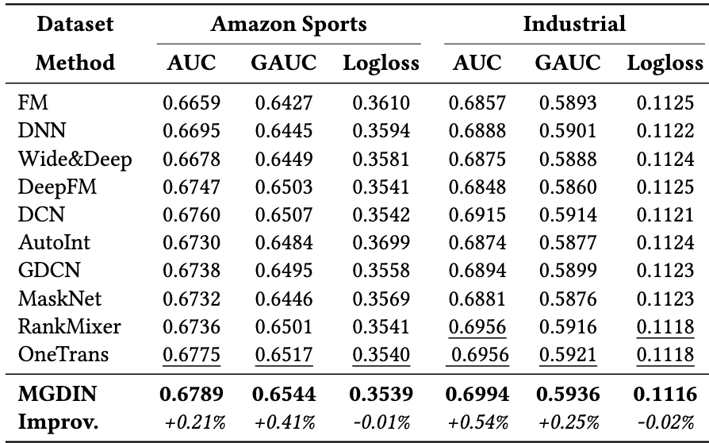

## AutoInt

提出了一种高效实用的算法——自动学习输入特征的高阶特征交互，显式地建模不同阶数的特征组合，通用性强，同时适用于数值型与类别型输入特征，可解释性强。

### 动机

推荐场景下，输入特征通常稀疏且高维，精准的预测依赖于高阶特征组合，这类特征由人工构建耗时严重，且无法穷举。因此，研究者一直致力于为稀疏高维的原始特征及其有效组合构建低维表征。

FM在各类任务中被验证具备有效性，但是受限于多项式拟合的时间复杂度，该方法仅适用于**低阶特征交互建模**。

大量基于MLP的模型在学习乘法类特征交互时效率较低，这些模型隐式地学习特征交互，**可解释性弱**。

### 模型结构

模型结构如下所示

### 交互层

作者使用注意力机制捕捉具备有效意义的特征组合。

以第$m$个特征为例，定义注意力头$h$下，特征$m$与特征$k$的关联度： 
$$
\alpha_{m,k}^{(h)} = \frac{\exp\left(\psi^{(h)}(\boldsymbol{e}_m,\boldsymbol{e}_k)\right)}{\sum_{l=1}^{M}\exp\left(\psi^{(h)}(\boldsymbol{e}_m,\boldsymbol{e}_l)\right)},\\ \psi^{(h)}(\boldsymbol{e}_m,\boldsymbol{e}_k) = \left\langle \boldsymbol{W}_{\text{Query}}^{(h)}\boldsymbol{e}_m,\boldsymbol{W}_{\text{Key}}^{(h)}\boldsymbol{e}_k\right\rangle
$$
其中，$\psi^{(h)}(\cdot,\cdot)$为注意力函数，用于度量特征$m$与特征$k$的相似度，可采用神经网络或内积$\langle\cdot,\cdot\rangle$实现。文中选用内积运算，$\boldsymbol{W}_{\text{Query}}^{(h)}$、$\boldsymbol{W}_{\text{Key}}^{(h)} \in \mathbb{R}^{d'\times d}$为变换矩阵，用于将原始嵌入空间$\mathbb{R}^d$映射至新的特征空间$\mathbb{R}^{d'}$。

得到的注意力分数可用于解释特征之间的交互。

随后，结合注意力系数$\alpha_{m,k}^{(h)}$聚合所有相关特征，对子空间$h$中特征$m$的表征进行更新：
$$
\tilde{\boldsymbol{e}}_m^{(h)}=\sum_{k=1}^{M}\alpha_{m,k}^{(h)}\left(\boldsymbol{W}_{\text{Value}}^{(h)}\boldsymbol{e}_k\right) 
$$
其中$\boldsymbol{W}_{\text{Value}}^{(h)} \in \mathbb{R}^{d'\times d}$。 $\tilde{\boldsymbol{e}}_m^{(h)}$融合了当前注意力头$h$下特征$m$及其关联特征，代表模型学习得到的全新组合特征。单一特征可参与多种特征组合，多头机制可构建不同子空间，独立学习差异化的特征交互模式，以此实现多类型组合特征的挖掘。

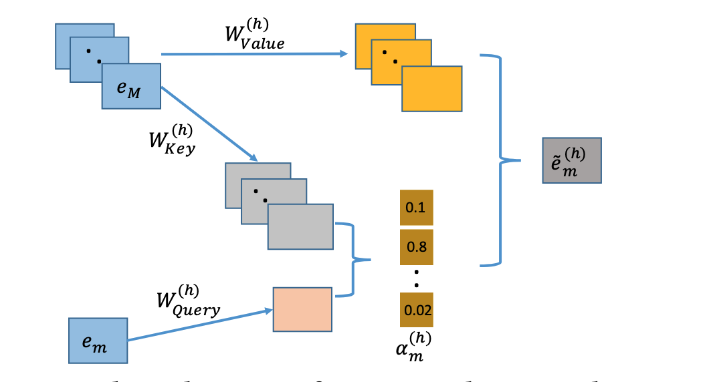

整合所有子空间学习到的组合特征，公式如下： 
$$
\tilde{\boldsymbol{e}}_m = \tilde{\boldsymbol{e}}_m^{(1)} \oplus \tilde{\boldsymbol{e}}_m^{(2)} \oplus \dots \oplus \tilde{\boldsymbol{e}}_m^{(H)} \tag{7}
$$
 其中$\oplus$为拼接操作，$H$为注意力头总数。为保留已学习的组合特征（包括原始一阶独立特征），网络引入标准残差连接。定义如下：
$$
 \boldsymbol{e}_m^{\text{Res}} = \text{ReLU}\big(\tilde{\boldsymbol{e}}_m + \boldsymbol{W}_{\text{Res}}\boldsymbol{e}_m\big)  
$$
$e_m$是交叉层的输入，$\boldsymbol{W}_{\text{Res}} \in \mathbb{R}^{d'H\times d}$ 为维度匹配投影矩阵。 通过该交互层，每个特征$\boldsymbol{e}_m$会被更新为高阶特征表征$\boldsymbol{e}_m^{\text{Res}}$。堆叠多层交互层，将上一层输出作为下一层输入，即可实现任意阶数组合特征的建模。

### 输出层

交互层的输出为一组特征向量 $\{\boldsymbol{e}_m^{\text{Res}}\}_{m=1}^M$，m是层数，将所有特征向量拼接后进行非线性映射： $$ \hat y = \sigma\Big(\boldsymbol{w}^\text{T}\big(\boldsymbol{e}_1^{\text{Res}} \oplus \boldsymbol{e}_2^{\text{Res}} \oplus \dots \oplus \boldsymbol{e}_M^{\text{Res}}\big) + b\Big) \tag{9} $$ 其中，$\boldsymbol{w} \in \mathbb{R}^{d'HM}$ 为投影列向量，$\sigma(x)$ 为sigmoid，输出得到最终的预测点击率。

### 结果

在四个真实数据集中，AutoInt 于三个数据集上取得最优性能。在 Avazu 数据集上，CIN 的 AUC 指标略高，但本文的模型对数损失更低。

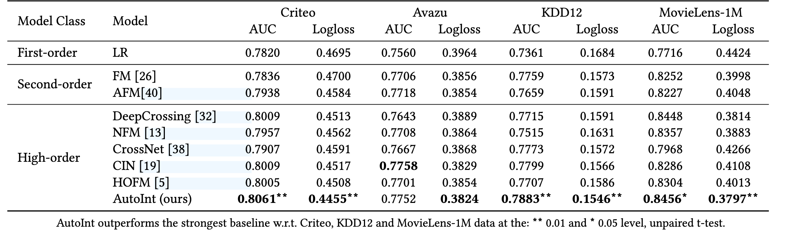

与竞争力最强的基线模型 CIN 相比，本文的模型参数量更少，在线推理阶段的运行效率更高。

去除残差连接后，模型在所有数据集上的性能均出现下降

随着交互层数继续增加，模型可捕获更高阶的特征组合，性能持续优化；当层数达到三层后，性能趋于稳定，表明过度高阶的特征组合对预测增益有限。

文中将两层前馈神经网络与原模型并行训练，输出融合，探索隐式特征对模型性能的提升，经过对比（其他模型也同时联合训练），证明引入隐式特征交互能够增强模型预测能力。但从后两列数据可以看出，相比其他模型，本文模型的性能提升幅度较小，这也说明原生 AutoInt 模型本身已具备极强的特征建模能力。

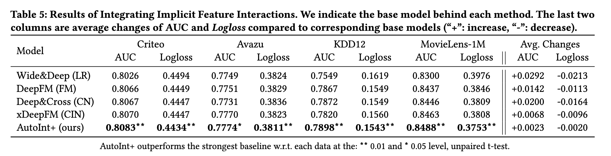

## Wukong

特征交叉模型，核心创新在于通过堆叠多层因子分解机，大幅提升了传统因子分解机的表征能力，能够有效捕捉高阶特征交互并且满足**缩放定律**，作者关注于特征交互层的扩容而不是嵌入表的，即便模型复杂度跨越两个数量级，在现有模型表现失效的区间内，该模型仍能保持效果优势。

### 动机

目前的推荐模型并未呈现出与大语言模型领域类似的缩放规律，当下推荐系统的扩容方式为spare scaling，即扩大嵌入表规模或维度，这种方法无法增强对海量特征间复杂交互的捕捉能力，并且嵌入表查找操作无法利用当下的GPU的算力优势。

这种使得推荐模型难以适配复杂的大型的现实数据，因此作者提出了Wukong旨在为推荐领域建立缩放定律。

### 模型结构

模型中所有的特征先经过EMbedding layer转换为稠密的向量，随后送入到堆叠的交互层，交互层由FMB和LCB组成，最终进入MLP。

模型结构类似于堆叠了DeepFM

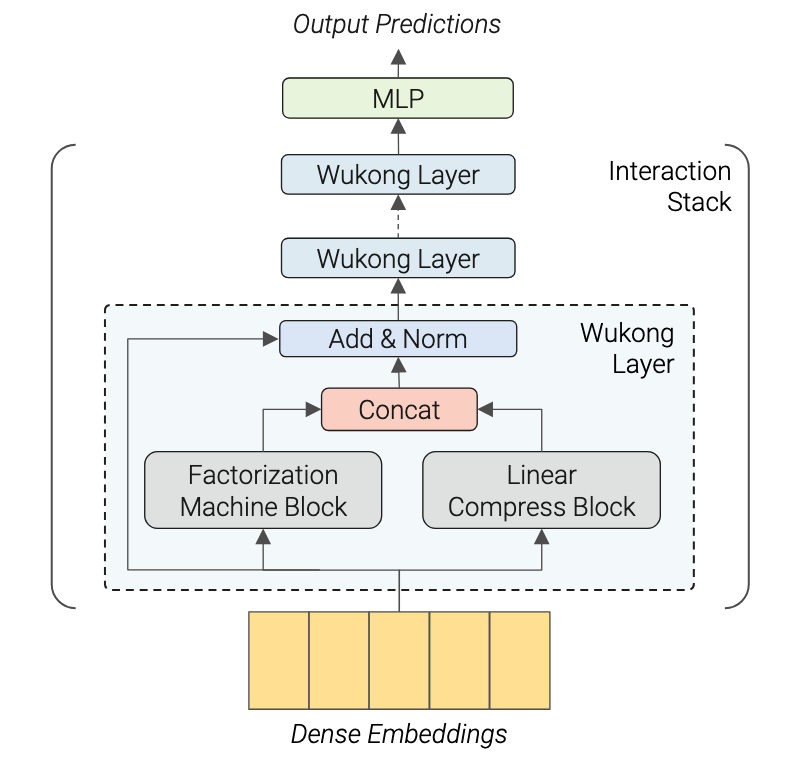

#### Embedding Layer

Embedding Layer并非简单的查表，对于特征中较为重要的会生成多个嵌入，次要的则会生成较少的嵌入，特征最后会拼接起来经过MLP映射到统一的维度。

文章中将Embedding Layer输出的每一个嵌入向量视为独立的整体，表示为$$\boldsymbol{X}_0 \in \mathbb{R}^{n\times d}$$，而非一维形式$$\boldsymbol{X}_0 \in \mathbb{R}^{nd}$$。

#### Interaction Stack

交互层包含两个并行模块：因子分解机模块（FMB）与线性压缩模块（LCB）。因子分解机模块计算该层输入嵌入之间的特征交互，线性压缩模块则对该层输入嵌入进行线性压缩并直接传递输出。两个模块的输出随后进行拼接。

FMB的计算可以总结为以下：
$$
\text{FMB}(X_i) = \text{reshape}\left( \text{MLP}\left( \text{LN}\left( \text{flatten}\left( \text{FM}(X_i) \right) \right) \right) \right)
$$

- 输入$\boldsymbol{X}_i \in \mathbb{R}^{n\times d}$先经过$\text{FM}(\boldsymbol{X})=\boldsymbol{X}\boldsymbol{X}^\text{T}$，得到$\boldsymbol{X}_i \in \mathbb{R}^{n\times n}$即每个token之间的interaction score
- 接着展平再经过一个归一化层稳定训练，$\boldsymbol{X}_i \in \mathbb{R}^{nn}$ 
- 随后送入MLP中把信息重新编码回embedding space，也就是$\boldsymbol{X}_i \in \mathbb{R}^{n_fd}$，这里$n_f$是新生成的Embedding数量
- 最后reshape展开，$\boldsymbol{X}_i \in \mathbb{R}^{n_f\times d}$

因式分解机的计算与存储复杂度会随嵌入数量呈平方级增长，在包含数千个特征的真实数据集上开销会很快达到难以承受的程度。

为此作者利用了逐对内积矩阵的低秩特性来降低复杂度——当嵌入维度d<=嵌入数量的时候，内积交互矩阵$\boldsymbol{X}\boldsymbol{X}^\text{T}$ 为低秩矩阵，大规模数据集一般都满足这一条件。因此引入形状为$n\times k$的可学习投影矩阵Y，与$\boldsymbol{X}\boldsymbol{X}^\text{T}$相乘得到$\boldsymbol{X}\boldsymbol{X}^\text{T}Y$，可以在理论无损的前提下将输出矩阵尺寸从$n \times n$降至$n \times k$大幅降低交互矩阵的存储开销。

利用矩阵乘法结合律，先计算$\boldsymbol{X}^\text{T}Y$，可以将计算复杂度从$O(n^2d)$降至$O(nkd)$

LCB是简单的线性层
$$
 \text{LCB}(X_i) = W_L X_i 
$$
$W_j \in \mathbb{R}^{n_L \times n_i}$ 为权重矩阵，$n_L$ 是表示压缩后嵌入数量的超参数，$n_i$ 为第 $i$ 层的输入嵌入数量。

#### Scaling

模型扩容的超参数如下

+ $l$：交互堆叠层的层数
+ $n_F$：FMB生成的嵌入向量数量
+ $n_L$：LCB生成的嵌入向量数量
+ k：优化因子分解机中的压缩嵌入向量数量
+ $MLP$：网络的深度和维度

### 工程优化

在大规模数据集上应用模型需要做工程上的优化

+ 进行分布式训练——多机多卡
+ 对Embedding table 进行column-wise**分片**，即[100000000, 128]->GPU0: [100000000, 32]，GPU1: [100000000, 32]，GPU2: [100000000, 32]，GPU3: [100000000, 32]。相比于row-wise，该方法的通信效率更高。
+ 使用FSDP策略，将模型的参数划分到多卡上，前向传播反向传递时聚合，能降低显存占用
+ 精度混合

### 结果

模型在六个公开数据集上优于以往模型

由消融实验可知，模型中各个部分

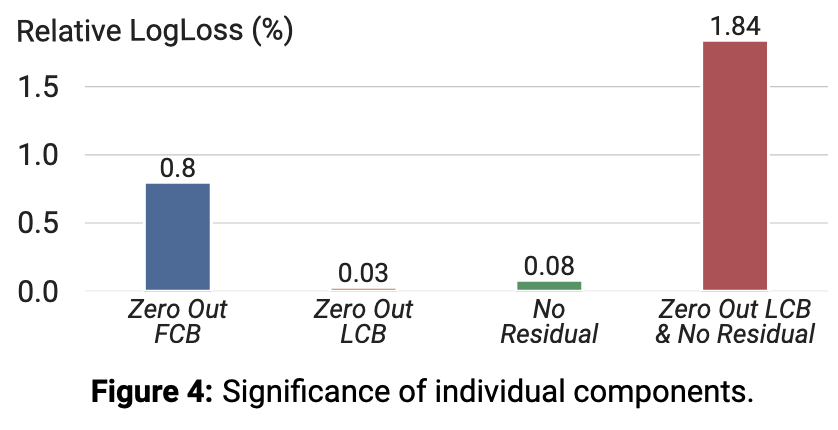

文中分析了悟空模型中各超参数单独扩容对模型效果的贡献。横坐标表示一个样本所需的计算量，纵坐标是loss相对于baseline（DLRM）的减少。

实验发现：增加悟空模型层数l可显著提升模型效果，原因是能够捕捉更高阶特征交互；扩大 MLP 规模也能带来可观性能增益；增大k与$n_F$同样有正向收益，而$n_L$在基础配置下已趋于性能饱和。值得注意的是，**联合扩容**k、$n_F$、$n_L$带来的效果提升，明显优于各参数单独扩容。

### 不足

将模型扩容至高复杂度级别会给在线实时推理带来显著挑战

由于算力开销巨大，本文对模型的理论上限还未研究彻底

尽管模型在多项测评中表现优异，但是对底层原理人缺乏万倍的理论解析

## Rankmixer

RankMixer 是一个**面向排序任务（ranking）的特征交互模型**，其摈弃了昂贵且语义不匹配的注意力机制(attention来源于nlp领域)，转而采用**无参数的Token Mixing+动态稀疏MoE**的组合，在保持极低计算开销的同时，实现了对多源异构特征的全局交互。

作者认为，以往的模型存在不足

+ **Scaling 无效**，早期方法尝试加深/加宽DLRM，但是收益很小，甚至会下降。
+ **异构特征融合困难**，输入特征高度异构，它们来自不同的语义空间，基于内积或注意力的交互方式在这些特征上往往失效，甚至引入噪声

模型结构如下所示，整体可以理解为将transformer中的encoder的self-attention和FFN。

### Tokenization

为在后续阶段实现高效**并行**计算，需将不同维度的嵌入统一为维度对齐的向量，最简单的策略是为每个特征分配长度相同的embedding，但是会对**重要特征计算不足**。

为解决上述问题，文章提出一种结合领域知识、基于语义的token化方法：首先，得到各个特征的embedding，embedding维度可以不同，随后按照先验知识将特征分为**语义一致**的组，例如

+ 用户画像相关一组
+ 候选物料相关一组
+ 行为序列相关一组
+ 交叉特征相关一组

组内的特征先拼接，随后再组间拼接得到$e_{input}=[e_1;e_2;…;e_N]$，接下来把长向量切成多个 fixed-size token，得到T个feature tokens，然后每一段投影到统一纬度D，如下所示

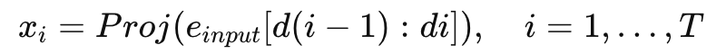

### RankMixer Block

在特征经过Tokenization后，会送入多层RankMixer Block，每个block包括两部分Multi-Head Token Mixing和Per-token FFN。

#### Multi-Head Token Mixing

输入为上一层的特征表示$$X_{n-1} \in \mathbb{R}^{T \times D}$$

首先，对每个 token 在特征维度上划分为 (H) 个子空间（head），可以看作是把每个token拆分为多个低维子空间表示：
$$
x_t = \big[ x_t^{(1)} ,|, x_t^{(2)} ,|, \cdots ,|, x_t^{(H)} \big], \quad t = 1,2,\dots,T
$$

随后，在每个 head 上进行跨 token 的重排与融合，把**来自不同token的同一head重新组合成新的mixed token**，**充分交换token之间的信息**。对于第 (h) 个 head：
$$
s^{(h)} = \mathrm{Concat}\big( x_1^{(h)}, x_2^{(h)}, \dots, x_T^{(h)} \big)
$$

将所有head堆起来形成输出：

$$
\mathrm{TokenMixing}(X) = \mathrm{Merge}\big( s^{(1)}, s^{(2)}, \dots, s^{(H)} \big)
$$

然后，为了做**残差连接**，论文中设置 (H = T)，在保持 token 数量不变的前提下，实现充分的跨 token 信息交互。该过程仅通过张量**重排与拼接**完成，不引入额外参数，因此是一种**无参数的跨 token 特征交叉机制**。

最后，层归一化得到输出：
$$
S = \mathrm{LN}\big( \mathrm{TokenMixing}(X_{n-1}) + X_{n-1} \big)
$$

作者认为：**self-attention依赖的token间内积相似度对于异构特征较为牵强**，例如“用户 ID 子空间”和“商品类别子空间”直接做相似度，并且计算更重参数更多。

#### Per-token FFN

每个token单独过一套 FFN，**不共享参数**，防止**高频特征**主导训练：
$$
v_t = f^{t,2}_{pffn}(Gelu(f^{t,1}_{pffn}(s_t)))
$$
最后做残差和 LayerNorm：
$$
X_n = \mathrm{LN}\big( \mathrm{TokenMixing}(S_{n-1}) + S_{n-1} \big)
$$
相比于参数共享的FFN，**Per-token FFN引入了更多的参数提升表达能力，但保证了计算量不变**。

### Sparse MoE

为了实现 scaling law，Rankmixer中可以将 **Per-token FFN** 替换为 **Per-token SMoE**，注意每个token都有自己的一套专家。

传统的MoE通常使用**TopK Softmax**路由，这里有两个缺陷

+ **专家使用不灵活**，它为每个token强制选择数量固定的token，但是推荐系统中不同的token信息差异大，可能导致浪费计算资源或资源不够
+ **难以优化**，Softmax 产生的概率分布是稠密的，需要专门设计负载均衡损失来防止专家坍塌。

**SMoE**中使用**ReLu**作为激活函数，因此对于不同的token激活的专家数量是**动态**的

门控的计算公式如下所示
$$
G_{i,j}=\operatorname{ReLU}(h_i(s_i)_j)
$$

+ $s$是token
+ $h$是线性层

Per-token SMoE输出为：
$$
v_i=
\sum_{j=1}^{N_e}
G_{i,j}e_{i,j}(s_i)
$$

+ $e$是专家

**SMoE结构使得模型在参数量增加的情况下，每次前向传播的计算量基本保持不变**。

## Scaling

作者给出了四个scaling方向，分别是：

- T：feature token 数量
- D：hidden dimension / model width
- L：RankMixer block 层数
- E：MoE expert 数量

# 用户行为序列建模

## Din模型

### 介绍

Din模型（阿里）将**attention机制引入到了用户兴趣建模上**，传统推荐模型（如 Wide&Deep、DeepFM）通常将用户历史行为（商品向量、商铺向量、商品类别向量）直接**平均池化**，对不同的候选item使用了相同的user embedding。

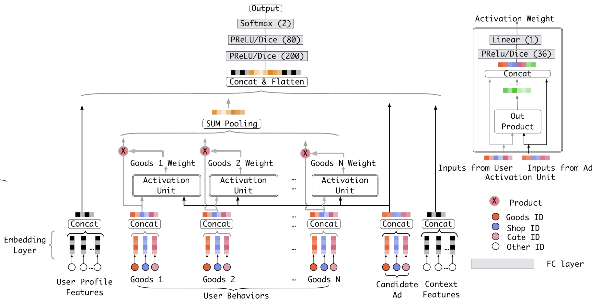

DIN在基础的embedding+MLP上使用了**Attention机制**，结合历史行为与候选物品的相关性，**自适应地计算用户兴趣表征向量**，该表征向量会随物品的不同而动态变化，最终提升用户兴趣的表达能力，从而提升CTR。

DIN网络核心模块**Activation unit**，**为序列中每个历史item计算与当前候选物品的相关性权重**。

先构造特征匹配$$\mathbf{z}_i = [\mathbf{e}_i,\ \mathbf{e}_a,\ \mathbf{e}_i - \mathbf{e}_a,\ \mathbf{e}_i \odot \mathbf{e}_a]$$，$$\mathbf{e}_i \in \mathbb{R}^d$$（历史点击物品的embedding），$$\mathbf{e}_a \in \mathbb{R}^d$$（候选物品的embedding），能让模型学习到差异和细粒度信息。得到的权重不会使用softmax机制进行归一化，目的是保留用户兴趣的强度信息。计算出的是一个分数。

### Mini-batch Aware Regularization

**Embedding** 参数量非常大时，传统 L2 正则化每个 batch 都要遍历整个 Embedding 表，计算代价太高。
$$
L_2(W) = \|W\|_2^2 = \sum_{j=1}^{K} \|w_j\|_2^2
$$
Mini-batch Aware Regularization（mini-batch感知正则化），对当前 mini-batch 中**至少出现一次的非零稀疏特征 ID** 所对应的 Embedding 行。

$$
L_2(W) = \sum_{j=1}^{K} \|w_j\|_2^2 = \sum_{(x,y) \in S} \sum_{j=1}^{K} \frac{I(x_j \neq 0)}{n_j} \|w_j\|_2^2\\
$$

+ S：整个训练集 
+ x：一个样本的特征向量 y：标签，可以认为是模型的输入
+ $x_j$：样本 \(x\) 是否含有特征 $j$
+ $I(x_j \neq 0)$：指示函数，若样本里出现了特征$j$，值为 **1**，否则为 **0** 
+ $n_j$：特征$j$在整个训练集中出现的**总次数**

例如某商品 $j$ 在训练集中出现 100 次，那么每次出现时计算：
$$
\frac{1}{100}\|w_j\|_2^2
$$
累计 100 次后：
$$
100\times\frac{1}{100}\|w_j\|_2^2
=\|w_j\|_2^2
$$
**仍然等于**原来的 L2 正则项。

假设训练集被划分为 $B$ 个 mini-batch：
$$
B_1,B_2,\ldots,B_B
$$
那么可以进一步写成：
$$
L_2(W)=
\sum_{j=1}^{K}
\sum_{m=1}^{B}
\sum_{(x,y)\in B_m}
\frac{I(x_j\neq0)}{n_j}
\|w_j\|_2^2
$$

为了方便计算，作者做了近似，定义

$$
\alpha_{mj} = \max_{(x,y) \in B_m} I(x_j \neq 0)
$$
若第$m$个 batch 中至少有一个样本出现特征 $j$，则 $\alpha_{mj} = 1$, 否则 $\alpha_{mj} = 0$，按照batch级别计算
$$
L_2(W) \approx \sum_{j=1}^{K} \sum_{m=1}^{B} \frac{\alpha_{mj}}{n_j} \|w_j\|_2^2
$$

### Dice激活函数

`PReLU`激活函数公式如下，它为负数区域增加了一个可学习的斜率
$$
f(x) =  \begin{cases} x, & x > 0 \\ \alpha x, & x \le 0 \end{cases}
$$
 该激活函数的阈值为0，作者认为这个分界点不一定适合大规模、稀疏的CTR数据，应该让分界点自适应变化。

`Dice`可看作PReLU的泛化形式。其核心思想是：根据输入数据的分布自适应调整整流点，将整流点设为输入的均值。此外，Dice实现了两条路径间的平滑切换。当E[s]=0且Var[s]=0时，Dice退化为PReLU。
$$
\mathrm{Dice}(x) = p(x)\cdot x + (1 - p(x)) \cdot \alpha x\\
p(x) = \sigma\left(BN(x)\right)
$$

+ $BN(x)$：BatchNorm，标准化输入
+ $\sigma$：Sigmoid
+ $p(x)$：输入为正的概率 
+ $\alpha$：可学习参数（类似 PReLU 的负斜率）

### 改进

Din的一个缺点在于忽略了**行为序列内部各元素之间的依赖关系**，目前较为常用的对用户行为序列建模的方法是采用双层Attention。

第一层attention得到的每个新元素都**融合了原始序列中其他物料的信息**，然后进入到Din模型。

## DIEN

相比于Din模型的只能对历史物品用目标物品加权的特点，**DIEN还能建模用户的历史兴趣是如何关于目标物品演变为最终的兴趣向量**。

### 动机

现有多种用于兴趣建模的点击率预测方法，但多数方法直接将行为等同于用户兴趣，缺乏对具体行为背后潜在兴趣的针对性建模，同时鲜有研究考虑兴趣的变化趋势。

### 模型结构

DIEN的结构与DIN相似，首先所有的特征过一个embedding layer，随后用户序列特征进入兴趣提取模块处理，最后将各个embedding拼接后送入到mlp中。

兴趣提取模块由两部分组成：Interest Extractor Layer从用户行为中提取兴趣序列；Interest Evolving Layer根据目标物品建模兴趣的进化。

#### Interest Extractor Layer

作者认为历史行为不能表示兴趣，所以需要从行为中提取兴趣序列，Interest Extractor Layer使用`GRU`（Gated Recurrent Unit）从用户行为序列中提取一系列兴趣状态，按**时间顺序**处理用户行为序列。

GRU，门控循环单元，循环神经网络RNN的一种改进结构，用于建模序列数据，能解决传统RNN在长序列中出现的梯度消失问题，且运算速度比LSTM更快。

GRU 的计算公式如下，有T个物品就会生成T个兴趣状态，每个兴趣状态都是从上一个兴趣状态与当前物品融合得到的：
$$
u_t = \sigma(W_u i_t + U_u h_{t-1} + b_u) \\
r_t = \sigma(W_r i_t + U_r h_{t-1} + b_r) \\
\tilde{h}_t = \tanh(W_h i_t + r_t \circ U_h h_{t-1} + b_h) \\
h_t = (1 - u_t) \circ h_{t-1} + u_t \circ \tilde{h}_t \\
$$
其中：

- $\sigma$ 表示 sigmoid 激活函数
- $i_t$ 表示 GRU 在时刻 $t$ 的输入，其中 $i_t = e_b[t]$，表示用户在第 $t$ 次的行为 embedding
- $\circ$ 表示逐元素乘
- $W_u, W_r, W_h \in \mathbb{R}^{n_H \times n_I}$
- $U_u, U_r, U_h \in \mathbb{R}^{n_H \times n_H}$
- $n_H$ 为隐状态维度，$n_I$ 为输入维度

- $h_t$ 表示用户在时间 $t$ 的潜在兴趣
- $u_t$ 更新门，控制保留多少旧状态，引入多少新信息
- $r_t$ 重置门，控制在计算候选状态时，是否忽略过去

仅靠最终 **CTR** 标签训练 GRU，监督信号比较弱，**考虑到每一时刻的用户兴趣会直接引导下一连续行为的产生**，因此作者引入了辅助任务：**利用下一时刻的行为，监督当前兴趣状态的学习**。

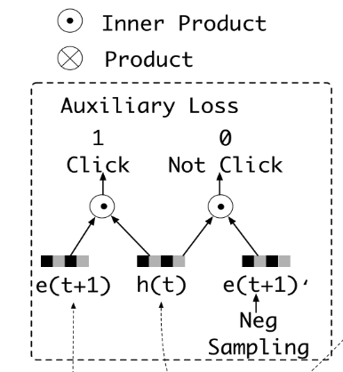

模型将**下一时刻点击的物品**作为正样本，同时从全商品集合中**随机采样**作为负样本（排除正样本），计算
$$
L_{aux} = -\frac{1}{N} \left( \sum_{i=1}^{N} \sum_{t} \log \sigma(\mathbf{h}_t^i, \mathbf{e}_b^i[t+1]) + \log\left(1 - \sigma(\mathbf{h}_t^i, \hat{\mathbf{e}}_b^i[t+1])\right) \right)
$$

+ ${h}^i_t$为第 i 个用户在第 t 步的 GRU 隐藏状态
+ $e_b^i$是用户点击序列，$\hat{\mathbf{e}_b^i}$为负采样序列
+ $\sigma(\mathbf{x}_1, \mathbf{x}_2) = \frac{1}{1 + \exp\left(-\left[\mathbf{x}_1, \mathbf{x}_2\right]\right)}$

点击率预测的最终损失函数为
$$
L = L_{target} + \alpha * L_{aux}
$$

拼接全部 T 个兴趣状态 $[\boldsymbol{h}_1,\boldsymbol{h}_2,\dots,\boldsymbol{h}_T]$，即可生成具备强表达能力的兴趣序列

#### Interest Evolving Layer

受外部环境与内在认知的共同影响，用户各类兴趣会随时间不断**演化**。以服饰类兴趣为例，随着流行趋势与个人审美变化，用户的服饰偏好会持续迭代，而这一兴趣演化过程将直接决定服饰候选商品的点击率预测结果。

用户的兴趣存在两个关键特性：（1）兴趣漂移，用户的兴趣是多样的，某一阶段用户可能集中关注书籍类商品，后续又会产生服饰类消费需求；（2）不同兴趣间虽存在潜在关联，但各自拥有独立演化路径。

`Interest Evolving Layer`融合注意力机制的局部激活能力与门控循环单元的序列学习能力完成兴趣演化建模——在门控循环单元的每一步运算中引入局部激活，可强化相关兴趣的作用权重、削弱兴趣漂移带来的干扰。

具体表现为候选物品的向量与每一步兴趣状态计算attention激活对应的兴趣，attention score的得分在AUGRU中控制兴趣状态的转移，如果某一行为不相关，则不会更新，即$h_t=h_t-1$，最终得到的是一条**和候选物品相关的兴趣路径**。Din模型虽然能弱化不相关行为，但是做不到消除。

注意力权重的计算如下
$$
a_t = \frac{\exp(h_t W e_a)}{\sum_{j=1}^{T} \exp(h_j W e_a)}
$$

- $h_t$：Interest Extractor 输出
- $i'_t$：Interest Evolving 输入
- $W \in \mathbb{R}^{n_H \times n_A}$，$n_A$是目标物品的维度
- $e_a$ 目标物品的 embedding

作者提出了三种结合注意力机制与GRU的结构

首先是AIGRU，用注意力分数调控演化层的输入
$$
i'_t = s_t \cdot a_t
$$
式中，$\boldsymbol{s}_t$为兴趣抽取层 GRU 第t步隐藏状态，$\boldsymbol{i}'_t$ 为第二层演化 GRU 的输入，第一层得到的$h_t$仅仅用于计算注意力分数

该结构存在明显缺陷，即使输入置0，仍会改变GRU的隐藏状态（$h_t^`$），导致弱相关兴趣依旧干扰兴趣演化的学习过程。

随后是 AGRU，用注意力得分直接替换GRU的更新门
$$
s'_t = (1 - a_t), s'_{t-1} + a_t, \tilde{s}'_t
$$

AGRU 虽可通过注意力得分直接约束隐藏状态更新，但使用单一标量注意力得分替换向量形式的更新门，忽略了更新门不同维度间的重要性差异。

最后是AUGRU，用attention score对更新门加权
$$
\tilde{u}'_t = a_t \cdot u'_t \\
s'_t = (1 - \tilde{u}'_t) \circ s'_{t-1} + \tilde{u}'_t \circ \tilde{s}'_t
$$

- $u'_t$：GRU 原始 update gate

AUGRU 完整保留更新门的维度特征，并利用注意力得分对更新门全局维度进行缩放。

最终，取演化后$s_t$作为DIEN网络的输出

### 结果

在公开数据集上测试，其中，BaseModel使用与DIEN一致的embedding layer和MLR，但是对行为的建模只用了sum pooling。

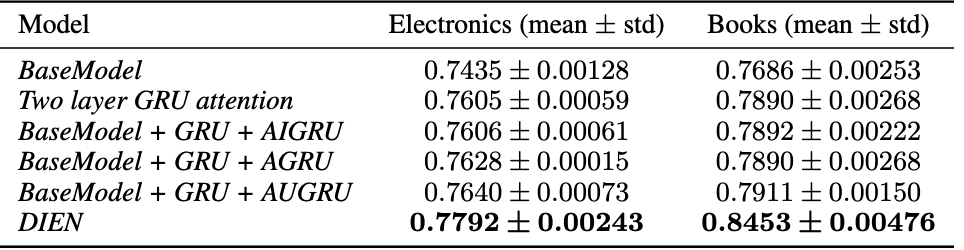

可以观察到，DIEN有不错的提升，且第二层的注意力门控循环单元选择AUGRU效果更优。

在真实数据集上进行A/B测试，该模型带来了巨大的提升

## SIM模型

DIN模型的计算量与**N的大小**有关，因此只会保留最近的**几百个物品**，只会导致模型**关注短期兴趣，遗忘长期兴趣**。

SIM模型在DIN模型的基础上**保留更大的N**，计算时**快速排除**掉与**候选物品无关**的LastN物品，**降低计算量**。

SIM模型第一步做**查找**

+ **Hard Search，根据候选物品的类目，保留类目相同的即可，简单快速无需训练。**查找时不可能为每个候选物料把用户全部历史都遍历一遍，为了加速这一过程，阿里巴巴设计了了**User Behavior Tree**（UBT）数据库，**将每个用户的长期行为序列分门别类地缓存起来**。
+ **Soft Search，物品做Embedding，把候选物品做query，使用K近邻查找。效果更好，但是实现更复杂。**

接下来**计算相似度做加权平均**。

对历史物品拼接一个**时间间隔**(历史行为发生时间与当前候选物品曝光时间之间的差值)，用于**建模兴趣随时间衰减**，随后使用多头注意力机制计算权重

# 多任务与多目标

**多任务建模**，也称**多目标建模**，例如同时建模三个目标：从曝光到点击的（CTR），从点击到购买（CVR），从曝光到购买（CTCVR）。

推荐系统中**不能对每个目标单独建模**，这会对**内存和算力**带来巨大的消耗。另一个原因是：**用户转化是一个链条** ，比如先点击，再加入购物车最后购买，这个**链条中越靠后的环节价值越大，但是可用的正样本也越少，单独训练会带来较大的误差**。

此外，推荐系统也不能**只对终极目标建模**，例如CTCVR，**只考虑CTCVR能带来短期利益，但是不利于提高用户粘性和长期销售额**（只推荐购买能力之内的中低价物品）；此外，**其他的指标也能带来价值**，不可忽略。

## MMoE

`MoE`是DNN的改进，将一个大的DNN拆分为多个expert并使用**一个router/gate**控制每个expert输出的权重，在参数量相同的情况下，表达能力更强。

使用多个专家而不是DNN是为了解决**负迁移：强行共享底层参数时，当任务A和任务B的相关性很低，任务A的梯度更新可能会抵消掉任务B的梯度，导致模型两个任务都学不好**。

MoE可以分为**Dense MoE**，所有专家都会被执行
$$
y=\sum_{i=1}^{N}g_i(x)E_i(x)
$$
优点是结构简单、训练稳定，但计算量会随着专家数量增加。

以及**Sparse MoE**，门控网络只选择权重最高的几个专家，例如 Top-1 或 Top-2：
$$
S(x)=\operatorname{TopK}(g(x))
$$
输出为：
$$
y=\sum_{i\in S(x)}g_i(x)E_i(x)
$$
这样可以增加模型参数量，但不显著增加每次计算量。

`MMoE`，Multi-gate Mixture-of-Experts，是用于**多任务预测**（例如电影推荐，既要购买也需要打高分）的模型，在MoE基础上改进，为每个任务配备**门控网络**，用于**学习一组专家加权系数**，换言之，**门控的数目和任务数一致**。

原始特征先做**embedding**，然后**拼接成共享输入向量x,同时输入到所有的专家和gate中**

任务K的整体输出，$h_{k}$代表任务塔：
$$
y_k = h_k\big(f^{(k)}(x)\big)
\tag{6}
$$
任务K的专家加权和MoE，每个专家是一个MLP

$$
f^{(k)}(x) = \sum_{i=1}^{n} g_k(x)_i , f_i(x)
\tag{7}
$$
其中，第i个expert的输出为 $f_i(x)$，n为expert数量

任务k的门控网络
$$
g_k(x) = \operatorname{softmax}\left(W_{g_k} x\right)
\tag{8}
$$

系统中的Softmax激活函数可能出现**极化现象**：**Softmax输出值中的⼀个接近1，其余接近0**。这会导致只有一个专家的推理结果被使用。

为了解决这个问题，**训练时对Softmax输出的每个向量值以10%的概率dropout**。

### 负载均衡 

MoE结构可能出现**负载不均**的问题，即多个token指派到同一个专家处理，在训练的过程中会逐渐恶化，只有激活的专家才会进行参数的更新或者推理。为了实现负载均衡，最常见的一种方法是在门控中添加**噪声**，避免反复路由到同一个专家。
$$
H(x)_i = (x \cdot W_g)_i + \text{StandardNormal}() \cdot \text{Softplus}\big((x \cdot W_{\text{noise}})_i\big)
$$
deepseek v3中介绍了两种负载均衡的方法，一种是在选择topk物品时，为每一个专家添加一个**偏置量**（仅用于筛选），在训练步骤结束时，如果某个专家过载，则按照一定比例减少其偏置量，反之，按照相应的比例增加。

另一种方式是添加了Complementary Sequence-Wise Auxiliary Loss（互补序列辅助损失），当部分专家反复在topk中被选中的时候，该损失会变大
$$
\begin{aligned}
\mathcal{L}_{\text{Bal}} &= \alpha \sum_{i=1}^{N_r} f_i P_i, \\
f_i &= \frac{N_r}{K_r T} \sum_{t=1}^{T} \mathbb{1}\big(s_{i,t} \in \text{Topk}(\{s_{j,t}\mid 1 \le j \le N_r\}, K_r)\big), \\
s_{i,t}' &= \frac{s_{i,t}}{\sum_{j=1}^{N_r} s_{j,t}}, \\
P_i &= \frac{1}{T}\sum_{t=1}^{T} s_{i,t}'
\end{aligned}
$$

+ $T$: 当前 sequence 的 token 数
+ $N_r$: expert 数量
+ $K_r$: 每个 token 激活几个专家
+ $s_{i,t}$: token $t$ 与专家 $i$ 的 affinity score
+ $f_i$: 专家 $i$ 实际被选中的频率
+ $P_i$: 这个 sequence 里模型对专家 $i$ 的平均偏好程度，每个token与专家分数的均值 
+ $\alpha$: 这个辅助 loss 的权重，而且 DeepSeek-V3 明确说它设置得非常小。

## PLE

MMoE能够**缓解负迁移**现象但不解决，同时它还存在**跷跷板现象（一个任务的指标提升，另一个任务的指标下降，两个任务很难同时变好）**，因为**MMoE忽视了专家间的不同和交互，任务间的参数会互相干扰**。

PLE，**渐进式分层提取**，相比MMOE有两点改进

其一，**对模型的共享部分继续拆解**，将**所有专家拆分为任务独占和任务共享两大类**，**前者参与单一任务，后者参与所有任务**。通过显示地**分离**共享专家与任务特定专家，缓解通用知识与任务特定知识之间的**有害参数干扰**。这里每个任务的门控只能看到**对应任务的专家和共享专家**。

其二，PLE中引入了**多层专家，专家之间层层递进、深化**，**底层学习共享表示，高层接受底层的输出学习特定的任务表示**。

PLE是对CGC网络的扩展

MTL模型端到端训练使用的联合损失如下

这样的作法存在很多问题，1.**用户的序列行为导致样本空间的异构性（任务对应的样本空间不同**），例如只有点击后才能评论。为了对这些任务进行联合训练，PLE**将所有任务样本空间的并集作为整体训练集，在计算具体任务的损失时，忽略不属于该任务样本空间的样本**。
$$
L_k(\theta_k, \theta_s) = \frac{1}{\sum_i \delta_i^k} \sum_i \delta_i^k loss_k(\hat{y}_k^i(\theta_k, \theta_s), y_k^i
$$
$i$是样本，$δ_i^k$ ∈ {0, 1}表示样本是否属于该任务的样本空间。

2.**MTL模型对训练过程中损失权重的选择非常敏感**，因为损失权重决定各个任务在联合损失中的相对重要性。实际中，不同的任务在不同的训练阶段的重要性可能不同，因此将每个任务的损失权重设置为**动态的**，每一步更新
$$
\omega_k^{(t)} = \omega_{k,0} \times Y_k^t
$$

## PEPNET

快手提出的用于多场景多任务的模型。

现在推荐系统大多为多场景多任务，如下图所示，有多个页面，每个页面视为一个场景，如快手的精选、首页、发现页面，每个场景下有多个任务，如点赞、关注、收藏等。

不同的场景下，往往存在重叠的用户和物品，具有一定的**共性**；不同的优化目标间有一定的相关性，因此任务之间也是**相互依赖**的。为每个场景训练一个模型，不仅仅在**部署成本和迭代效率**上是不可接受的，而且**没有利用到全部的数据和忽视了数据间的共性**，导致优化不够充分。

`PEPNET`是一个高效的，即插即用的结构，它将**多场景和多目标理解为用户在不同的情境下和物品交互**，而**准确地进行个性化建模**有助于捕捉用户在不同情境下对物品的偏好程度，从而缓解问题。如果直接把个性化输入作为普通特征，那么经过网络的传播后，其影响会变得微弱，为此`PEPNET`让**个性化信息能控制模型的内部表示和计算过程（底层embedding共享表示和高层DNN隐藏层）**。

网络结构如下图所示，主要包含Gate Nu、EPNet和PPNet三部分：

- **Gate NU**：基于先验信息的门控结构，是EPNet和PPNet的基本单元；
- **EPNet**：**场景信息**作为输入，增强模型对用户跨域行为的底层感知能力；
- **PPNet**：**用户和item信息**作为门控输入，适配不同任务每层参数，平衡顶层任务间相互依赖关系；

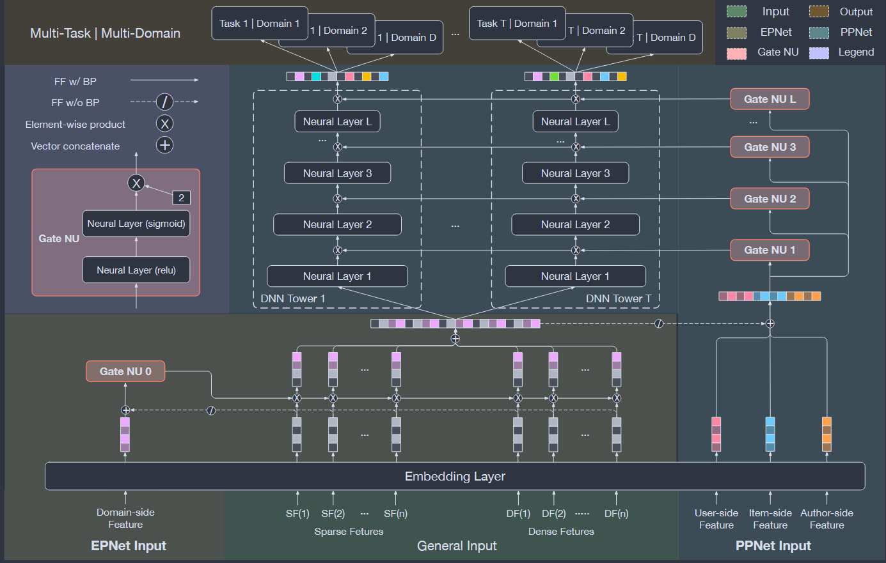

### Gate NU

由两层FC构成，第一层激活函数为relu，第二层激活函数为sigmoid，第二层结果乘2作为输出，从而把输出取值从[0, 1]转化为[0, 2]

### EPNet

场景特征（场景ID或场景特有特征）和General embedding作为输入
$$
E = E(\mathcal{F}_S) \oplus E(\mathcal{F}_D) \\
\delta_{domain} = \mathcal{U}_{ep}\big(E(\mathcal{F}_d)\oplus\big(\Theta(E)\big)\big)
$$
注意这里General embedding的梯度**不回传**

得到的分数用于向General embedding**注入领域相关的个性化先验知识**
$$
O_{ep} = \delta_{domain} \otimes E
$$

### PPNet

PPNet **不让每个塔对所有用户使用同一套参数，通过修改隐藏层的贡献，让每个用户拥有一套独立的参数**。

将[融入场景信息的Embedding结果、用户id、Item id、作者id] concat在一起作为输入，通过Gate NU得到门控结果，然后与多任务塔中的DNN层结果element-wise相乘后，作为下一层DNN的输入。
$$
O_{prior} = E(\mathcal{F}_u) \oplus E(\mathcal{F}_i) \oplus E(\mathcal{F}_a) \\
\delta_{task} = \mathcal{U}_{pp}\big(O_{prior} \oplus \big(\Theta(O_{ep})\big)\big) \\
O_{pp} = \delta_{task} \otimes H
$$
​	

### 工程优化

+ 为避免避免embedding参数很快填满机器内存，设计了一个**特殊的参数服务器来实现无冲突和内存高效的全局共享embedding表**。
+ 快手使用**在线训练**，每个 pass 训练完之后，需要把新参数同步到线上服务。对于巨量的embedding表，不能同步所有的参数，**而是每次只同步一小部分，也就是设置数量上限，或对更新频率低的参数暂时不同步。**
+ 视频场景下ID特征变化快，为了更好的捕捉底层Embedding的变化，同时稳定更新高层DNN参数，**二者采用不同的更新策略：前者使用AdaGrad后者使用adam(较小学习率，稳定更新)**

## ESMM

**ESMM**，全样本空间多任务学习模型(Entire Space Multi-task Model)，其思路是**将三者都建模在曝光样本空间上**，解决**CVR**建模中存在的两个重要的问题：**SSB，数据稀疏**。

ESMM通过**显示地学习CTCVR（点击转换率）与CTR，来隐式地学习CVR任务**。CVR预估的是用户点击商品后，购买的概率有多大，它和CTR是没有联系的，CTR低不代表CVR也会低。

模型结构如下

喂入的都是**曝光样本**，**底层的Embedding是共享的**，有利于正例丰富的CTR任务向正例稀疏的CVR任务进行**知识迁移**，解决CVR数据稀疏的问题。

CVR塔实际上是一个中间变量，没有自己的损失函数

ESMM根据**条件概率公式**，将**CTCVR拆分为CTR*CVR**，由于**CTR和CTCVR是建立在曝光样本空间上的，可以被直接优化**。
$$
 L(W_{\text{CTR}}, W_{\text{CVR}}) = \sum_{i=1}^{N} \text{BCE} \left( y_i, \text{dnn}_{\text{CTR}} \left( x_i; W_{\text{CTR}} \right) \right) + \sum_{i=1}^{N} \text{BCE} \left( z_i, \text{dnn}_{\text{CTR}} \left( x_i; W_{\text{CTR}} \right) \times \text{dnn}_{\text{CVR}} \left( x_i; W_{\text{CVR}} \right) \right) 
$$

+ $\boldsymbol{x}_i$ $x_i$是第$i$条样本的特征，$y_i$ 代表第$i$条样本是否点击， $z_i$ 代表第$i$条样本是否购买，$N$代表样本总数。 
+ $\text{dnn}_{\text{CTR}}$ 和 $\text{dnn}_{\text{CVR}}$ 分别代表CTR模块与CVR模块，$W_{\text{CTR}}$ 和 $W_{\text{CVR}}$ 分别代表两模块中要学习的权重。 
+ BCE代表二元交叉熵函数。

注意CVR模块是用于和CTR求解CTCVR的，它与**曝光后被购买**计算BCE而不是**点击后被购买计算**。

## GradNorm(Loss优化策略)

梯度归一化算法（`GradNorm`），根据梯度损失计算task样本权重的方法，降低学习速度快的task的权重，加快学习速度慢的task的权重。不受任务数量限制，仅需少量训练迭代即可完成调优；动态调整梯度范数，使不同任务以相似的训练速度进行学习。

### 动机

相比于单任务网络，多任务网络运算速度与模型性能更具优势，但是难以训练，损失尺度较大的任务可能会主导训练；网格搜索的优化方法在增加一项任务时就是的计算量呈指数增常，调参过程繁琐。

### 过程

GradNorm根据**损失下降速度**计算每个task的**学习速度**：

- $\tilde{L}_i(t) = L_i(t) / L_i(0)$：第 $i$ 个任务在时间 $t$ 的损失比例。这是任务“逆训练速度”的度量（即值越小表示训练越快）。
- $r_i(t) = \tilde{L}_i(t) / \mathbb{E}_{task}[\tilde{L}_i(t)]$：第 $i$ 个任务的相对逆训练速度。$\mathbb{E}_{task}[\tilde{L}_i(t)]$表示所有task的$\tilde{L}_i(t)$均值

GradNorm使用**梯度损失**更新每个任务的权重
$$
L_{grad}(t; w_i(t)) = \sum_i \left| G_W^{(i)}(t) - G_W(t)\times[r_i(t)]^{\alpha} \right|
$$

- $W$：网络权重的一个子集 ( $W \subset \mathcal{W}$ )，我们在该子集上应用 GradNorm。通常选择为**最后一个共享层的权重**以节省计算开销。
- 式子第一步是基于模型计算的输出值，第二部分是task对参数的梯度的**理想取值**
- $G_W^{(i)}(t) = | \nabla_W , w_i(t)L_i(t) |_2$：第 $i$ 个任务的加权损失 $w_i(t)L_i(t)$ 对权重 $W$ 的梯度的 L2 范数
- $G_W(t) = \mathbb{E}_{task}[G_W^{(i)}(t)]$：在时间 $t$ 时所有任务梯度范数的平均值，作为统一尺度，它在每个时间步 $t$ 提供一个基准。
- $\alpha$ 是一个超参数，**当任务差异较大（学习动态不同）时，应使用较大的 $\alpha$，可以大于1；当任务较为对称时，应使用较小的 $\alpha$；当 $\alpha = 0$ 时，所有任务梯度将被强制相等**。

为了避免$w_i(t)$直接更新到0，训练中将目标梯度 $G_W(t)\times[r_i(t)]^{\alpha}$ 视为**常数**

为了避免全局学习率的影响，每一步更新后，对权重进行归一化：$\sum_i w_i(t) = T(任务数)$，以使梯度归一化过程与全局学习率**解耦**。

## 分数融合

尽管模型会为每个目标都预测一个分数，但是排序时只能依赖一个指标，因此排序前需要**将多个目标的分数融合为一个**。

一种方式是采用**乘法融合**
$$
\text{Score}(u, t_i) = \prod_{k=1}^{K} S_k(u, t_i)^{w_k}
$$
取对数后得到**加法融合**
$$
\text{Score}(u, t_i) = \sum_{k=1}^{K} w_k \log S_k(u, t_i)
$$
对数函数可以**换为任何单调递增的变换函数**
$$
\text{Score}(u, t_i) = \sum_{k=1}^{K} w_k F \left( S_k(u, t_i) \right)
$$

选择变换函数的技术难点在于，模型给不同目标的打分天然存在差异，如果权重设置的不好，可能会导致融合得分偏向某一指标。针对这一问题，一种特殊的变换函数将**目标的打分转化为排名**。
$$
 \text{Scores}_k = \{ S_k(u, t_i) \}, i \in [1, N] \\
 F(S_k(u, t_i)) = \frac{1}{\text{Rank}(S_k(u, t_i), \text{Scores}_k)}
$$

对于**打分权重**，目前**主流方法还是通过线上实验确定**：开M组小流量实验，每组对应一个权重，观察一段时间后，将效果最差的那组权重用新权重替换，最后选择最好的推全。

此外也有一种**自动化的方式**，**根据上一轮的结果自动生成下一轮要实验的超参**，以加速调参过程，提升调参质量，例如**Cross Entropy Method，交叉熵**方法，其核心步骤如下。

1. 所有K个目标的权重都来源于一个K维的**正态分布**
2. 实验开始时，**随机抽取M组权重向量，进行小流量线上实验**
3. 一段时间后，**选取指标最好的前P组**，**重新生成正态分布的均值和方差**，开始下一轮实验，**直到效果收敛**。

# 冷启动

## 评价指标

冷启动：**系统缺乏足够的信息，无法给用户或物品提供有效的推荐。**

冷启动是推荐系统中**比较复杂**的部分，其考察的指标比其他部分要**多**

+ 作者测指标，目标是促进发布，增大内容池
  + 发布渗透率，当日发布人数/日活人数
  + 人均发布量，当日发布笔记数/日活人数
+ 用户侧指标
  + 新物品的消费指标，点击率交互率，按照曝光数区分
  + 大盘消费指标，系统总体的消费时长和日活，月活
+ 内容侧指标
  + 高热物品占比

## 用户冷启动

### **加强重要区分性特征**

先验已知新老用户的行为模式有较大差异，因此优化用户冷启动的一个方法是，将这一先验知识注入到模型中，然后模型对新老用户能够区别对待。

首先，需要能够显示标注新用户的特征，例如：

- 一个标识当前用户是否是新用户的0/1标志位
- 用户是否登录
- 首次登录距今时间
- 交互过的item的个数
- ......

**强bias特征加得浅**，将这些特征的加得里final logit近一些，让它们对最终loss的影响更直接一些，比如$\text{Logit}_{final} = \text{Logit}_{ordinary} + \text{Logit}_{bias}$，参考wide&deep中的策略，让强bias特征贡献的损失通过简单的线性层就能得到。

**强bias特征做裁判**，可以讲这些强bias特征喂入SENet或LHUC(Learn Hidden Unit Contribution)来决定其他特征的重要性。

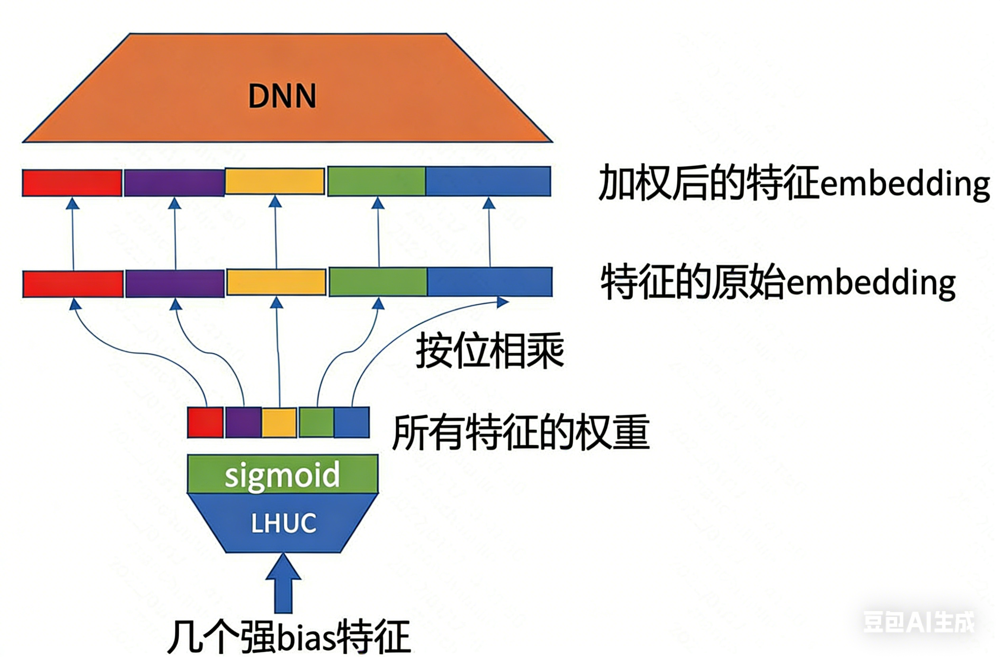

- 强bias特征作为LHUC的输入，经过sigmiod激活函数后，输出是一个N维度向量，N是所有fileld的个数
- N维向量就是各field的重要性，将其按位乘到各field的embedding上，起到增强或削弱的作用。比如：
  - 比如产品设计不允许未登录用户点赞、评论，那么新用户样本中的相关特征的重要性“应该”为0
  - 用户点击哪个站外广告被引入app，这个信息只对新用户有用（权重应该大），对老用户意义就不大了（权重应该小）
- 加权后的各field embedding再拼接起来，喂入上层DNN

### 新用户的初值

这种方法的思路是**如果新用户的初始值并非随机，而是已经非常靠谱了，通过少量数据+几次迭代，就能收敛到不错的用户表示**。

uid是最具个性化的特征输入，在老用户推荐中发挥了极其重要的作用，但是新用户的uid质量很差（训练时得到的是随机向量，预测时得到的是全0向量），因此一种增强新用户初值的方法是用**Group Embedding代替新用户的Id Embedding**。

这里将uid embedding拆解为$E_{uid} = E_{initGroup} + E_{PersonalResidual}$，前者是初始用户群的embedding，这个分群只依靠新用户友好型特征，比如：年龄、性别、安装那些（种类）的app，是被哪个（类）广告拉新进来的，类似于(age=18~24, gender=女, os=iOS, channel=广告A, .... )-> group_id = 10237。后者代表用户进入app之后，随着在app内行为越来越丰富，其距离初始用户群的**个性化残差**。

$E_{initGroup}$借鉴Airbnb用类似word2vec的方式获取，预训练保存

+ 正样本：某个新用户的$E_{initGroup}$，与其交互过的 item embedding，在向量空间上应该足够近
+ 负样本：随机采样一些 item embedding

实践中只**使用新用户的数据，不用老用户的数据**，因为，老用户交互的item，主要是由推荐系统根据用户历史推荐出去的，和用户的初始元信息（比如，年龄、性别、App等）关系已经不大了。引入老用户数据，反而引入了噪声。

正式训练时，$E_{initGroup}$对于新老用户**stop gradient**，可以防止老用户数据带偏$E_{initGroup}$，也能让信息都积累在$E_{PersonalResidual}$。

### UIE

出自腾讯的论文`Enhancing User Interest based on Stream Clustering and Memory Networks in Large-Scale Recommender Systems`

UIE分为UPE（User Profile Enhancement），UCBE（User Consumption Behavior Enhancement），UCSE（User Consumption Sequence Enhancement）

UPE **用相似用户的聚类中心（centroid）来补全和增强当前用户的 profile 表示**

## 其他算法

### 迁移学习

假设一个用户在旧的场景下他的兴趣已经建模的很成熟了，那么在新场景下可以进行**知识迁移**。

注意，接入的Embedding**禁止回代**。

随着新场景的逐渐成熟，知识迁移可以由**单项变成双向**。

## 流量调控

对于新物品扶持可以**促进发布，增大内容池，挖掘优质物品**。

工业界中系统只会**推荐年龄<30天的物品**，对于**<=24小时**的物品**扶持使其曝光量大于1/30**。

流量调控的做法是**提权**，干涉**粗排和重排**环节，给新物品提权。这是一种**容易实现且投入产出比好**的方法，但是**提权系数不好调控**，很难控制曝光量容易造成过度曝光或不充分曝光。

**保量**：**不论笔记质量高低，都保证24小时内获得100次曝光**，在原有的提权系数上**乘以额外的系数**，该系数通过**目标时间，目标曝光量，发布时间，发布曝光量**计算，最终形式如下。达到了曝光目标后和旧物品做**公平竞争**。

**保量的提权系数也不好做**，同时线**上环境变化**会引起提权系数的**重调**

注意，采用保量时，不能调整权重系数为**一个非常大的数**快速到达目标曝光量，这会导致物品被推荐给**不合适**的用户，使得**物品的数据(点击率，点赞率)偏低，最终物品会收到系统打压，无法称为热门物品**。

**差异化保量**：不同的物品有**不同的指标**，优质的物品获得**更高的保量指标**。可以用多模态，或作者的历史数据来判断内容的好坏。

# 评估与调试

## 评估流程

首先进行**离线评估**，用**相同的训练集、在相同的初始条件下**，**用不同算法训练出新旧两版模型**，再拿这两版模型在**相同的数据集**上进行评估，如果新模型的**离线评估指标优于旧模型**，可以认为新模型通过了离线测试，可以进入下一阶段。

出于**快速迭代**的考虑，离线评估的**训练集与测试集规模不会太大**，一般采用连续3天或7天历史数据进行训练。

离线得到的模型**不能直接上线使用**，因为离线评估是在**一个理想、简单的环境**下进行的，但实际的线上环境并非如此。**线上的旧模型已经在线持续更新了几个月，而且还在紧跟用户最新的兴趣变化而优化自己**。此时的新模型虽然在离线测试中表现较高，但是**离线数据集中缺少一些特征**，新模型在预测时只能用全0向量来代替这些特征的Embedding，**线上测试时，新模型几乎不可能打败久经考验的旧模型**。

所以新模型在线之前必须**先回溯**，比如用自两周前的历史数据开始训练，**直到追平并接入线上的实时样本流，这样才具备了公平进行线上测试的基础**。

最后开始**线上评估**，随即**划分出两份流量**，一份流量称为控制组，流入老模型；一份称为实验组，流入新模型。实验一段时间后，统计两组流量上的业务指标，如果实验组明显优于对照组，那么可以考虑将新模型推全。

## 评估排序算法

### AUC和GAUC

**AUC，曲线下面积**，简单描述为：**给定一个划分正负类别的阈值（大于为正样本，反之负样本），以该阈值下的FPR（假阳性率真实类别为1的样本中，预测类别为0的比例）为横坐标，TPR（真阳率，真实类别为1的样本中，预测类别为1的比例）为纵坐标，画一个点。通过不断变化与之画出的点就连成了一条ROC曲线，该曲线下的面积就是AUC。** **衡量模型把正样本排在负样本之前的能力**。

AUC越接近1.0，模型效果越好;等于0.5时，效果最差，和随机猜测差不多，无应用价值

。

如下所示的3个正样本和3个负样本，按照排序得分降序排列如下，其中一共有9个样本对，有两对错误地将负样本排在了正样本之前，所以最后的AUC=7/9。

但是**AUC并不适合排序模型**，因为评估中往往不止考虑对一个用户的推荐结果，**普通的AUC能将所有的用户混为一谈，一个用户的样本会影响到另一个用户的评估，容易被高活跃用户主导。**

例如，现有AB两个用户，各自曝光了4个物料，根据模型打分，8个样本由高到低的排序分别是是[A+, A+, A+, B-, B-, A-, B-, B+]，其中A+和B+分别表示两个用户的正样本（比如点击的物料），A-和B-分别表示两个用户的负样本（比如曝光未点击的物料）。按照上述的公式计算，AUC=0.75，看起来还不错。如果只针对A用户，可以得到其AUC=1，全局的AUC低估了模型对A的排序能力；只针对B用户，其AUC=0，全局的AUC高估了模型对B用户的排序能力。

因此在AUC的基础上出现了**GAUC**，将**测试样本划分为Group**，**每个Group统计一个AUC，再将不同AUC加权平均，权重一般用给用户曝光的物料数**。
$$
 \text{GAUC} = \frac{\sum_{u} w_u \text{AUC}_u}{\sum_{u} w_u} = \frac{\sum_{u} n_u \text{AUC}_u}{\sum_{u} n_u}
$$
对之前的例子按照GAUC计算，$\text{GAUC} = \frac{4 \times 1 + 4 \times 0}{4 + 4} = 0.5$，表明这个模型的排序能力堪忧。

GAUC的缺点：对**组内正负样本不平衡敏感**，很多组内可能只有1个正样本甚至**没有正样本**，这些组要么被丢弃，要么贡献有限，导致评估偏向“活跃用户”；**忽略组间关系**，与全局业务目标不一致。

### NDCG

**Discounted Cumulative Gain(DCG)**，**综合考虑每个位置上的物料能带来的收益和该位置的折扣效应**，可以反映**相关物品是否被排在更靠前的位置**。
$$
\text{DCG}@K = \sum_{k=1}^{K} \frac{2^{c_k} - 1}{\log_2 (k + 1)}
$$

+ K代表排序结果的长度
+ $c_k$代表第k个位置上的物料的贡献，如果未点击位置k，则$c_k=0$，反之就是观看时长、销售净额的指标的函数

可以看出，**越靠后的位置，对物料的价值打的折扣就越大**。

但是**计算出的DCG不能直接比较、汇总**，因为DCG的上界受query影响，**正样本越多**，上限越高。

将真实标签排序后，计算DCG得到就为IDCG，二分类举例（K=5），真实标签：1,0,1,0,0，排序后：1,1,0,0,0

$IDCG@5 =
\frac{2^1-1}{\log_2(1+1)} +
\frac{2^1-1}{\log_2(2+1)} +
\frac{2^0-1}{\log_2(3+1)} +
\frac{2^0-1}{\log_2(4+1)} +
\frac{2^0-1}{\log_2(5+1)}$

最后求解nDCG
$$
\text{NDCG}@K = \frac{\text{DCG}@K}{\text{IDCG}@K}
$$
**多个排序结果的NDCG取均值**，就可以衡量整个排序模型的性能。

## 评估召回算法

**AUC不适合评估召回算法**，因为**召回的顺序并非最终呈现给用户的顺序**，并且**召回中不好定义负样本**，首先**不能用曝光未点击的物料作为负样本**，会造成SSB，其次，**召回的物料中未被点击的也不能作为负样本**，没有被点击可能是**因为还未曝光，而非用户不感兴趣**。

**召回时避免直接统计负样本，而是从预测正样本与真实正样本的命中率、覆盖率出发**。

### Precision & Recall

+ Precision@K表示平均下来，每次召回的物料中真正被用户所喜欢的占比。 
+ Recall@K表示平均下来，一个用户真正喜欢的物料中有多大占比能被模型召回

### MAP

Precision 和 Recall是一**对此消彼长**的指标，召回的数量越多，Recall就越高，Precision就越低，**不够全面**。

另一种方法是使用**MAP**，**每次只取前i个作为召回的结果返回，将不同i值下的Precision、Recall连成曲线，然后计算这个曲线下的面积，即AP，多次召回的AP取均值就得到MAP**，它能用来衡量模型的整体召回性能。
$$
 \text{AP}@K = \frac{\sum_{j=1}^{K} \text{Precision}@j \times \text{IsPositive}@j}{\text{TotalPositives}}
$$
**TotalPositives**是**本次推荐中用户喜欢的物料的数量**，**$IsPositive_I$是第i个召回结果是否被用户喜欢**。

- 第1个用户点击了4个物料，都被模型召回了，其位置为{1,2,4,7}，此次召回的$ \text{AP}@8 = \frac{\frac{1}{1} + \frac{2}{2} + \frac{3}{4} + \frac{4}{7}}{4} = 0.83$； 
-  第2个用户点击了5个物料，但模型只召回了3个，其位置是{1,3,5}，此次召回的$\text{AP}@8 = \frac{\frac{1}{1} + \frac{2}{3} + \frac{3}{5}}{5} = 0.45 $。 
-  对两次AP取平均值，就得到该模型的$ \text{MAP}@8 = \frac{0.83 + 0.45}{2} = 0.64 $。

## A/B测试

AB测试考察**线上指标的影响，以及如何选取最优的参数**。

1. 把用户流量**随机划分为控制组流量与实验组流量**。 
2. **控制组流量流入老模型，实验组流量流入新模型**。**模型差异是两组流量的唯一差异**，其他影响因素（比如用户分布、物料分布、实验模型上下游的其他模型与策略）**必须完全相同**。这也就是A/B实验最重要的同分布原则。
3. **上线实验一段时间**，让两组流量积累起足够多的用户反馈。
4. 通过收集到的用户反馈，分别**统计出两组流量上的关键业务指标**。 
5. 通过数据分析，如果发现实验组上的关键业务指标显著优于控制组，我们就有充分理由相信新模型优于旧模型，可以考虑由新模型替换旧模型。

A/B实验有以下缺点

+　完整的A/B实验**较为复杂**，小团队没有能力和时间从头开发。
+　**A/B实验往往需要足够长的时间，时间成本比较高**，因为**用户行为往往呈现周期性**，所以**A/B实验至少要覆盖一个完整的周期**。
+　**在划分流量时可能会引入偏差，使实验结果有失公平**。

###　流量划分

推荐系统中的流量划分需要遵循两个重要原则

+　**划分流量是随机的**，一个用户划分到控制组还是实验组完全是随机的，其余属性无关。
+　**划分流量又是确定的**，一个用户在今后的访问中也一定会划分到相同的组中。

一种既随机又确定的流量划分是**根据用户的UserID决定用户去向**，表现为使用一个哈希函数映射
$$
\text{bucket} = \text{HASH}(\text{User ID}) \% N
$$

但是上述方法**使得一个用户同时只进行一次实验**，**对流量的利用率太低**，一个公司中存在很多部门和团队，如果大家都按照这种方式做A/B测试，会导致**流量不够**，因此引入了**分层实验**。

### 分层重叠划分流量

分层重叠的流量划分方式是 Google 在 Overlapping Experiment Infrastructure: More, Better, Faster Experimentation论文中提出的，其思想是

+ 假设**要进行N个实验，就将流量划分为N层**。
+ **同一层的各个实验组，其流量是互斥；不同层的实验，其流量是可以重叠的**。两个互斥的召回实验为不能同时作用于一个用户身上，但是一个用户可以受到一个召回和一个精排实验的影响，因为这两个实验不互斥。

注意，这里层并不代表**上下级关系**。
$$
 \text{bucket} = \text{HASH}\left( \text{CONCAT}(\text{Layer ID}, \text{User ID}) \right) \% N
$$

**Holdout**是一种考核**系统指标**的机制，**保留10%的用户完全不受实验影响**，可以考察整个部门对业务指标的贡献。

**实验推全**：当实验有效时，会**建立一个推全层**，与其他层正交。

反转实验：**在推全的新层中开一个旧策略的桶，长期观测实验指标**。该实验是为了解决在实验观测到**显著收益**后希望尽快**推全**新策略（为了腾出桶供其他实验使用或基于新策略做后续的开发），具有**滞后性**的指标，有**长期观测的**需求间的矛盾。

### A/A实验

**A/A实验指的是控制组合实验组采用完全相同的配置，用于检验饰演的两组流量是否存在偏差**。一个值得推荐的习惯是**在正式的A/B实验之前先进行一段时间A/A实验**。

A/A实验可以和A/B实验**同步进行**，即一个实验按照**AABB**方式分配流量

- \( \text{A}_1 \)和\( \text{A}_2 \)使用相同配置的老模型； 
- \( \text{B}_1 \)和\( \text{B}_2 \)使用相同配置的新模型。

### 统计分析

面对实验结果，**不能仅仅只看指标更优**就立刻的出“新模型有效，应该被推广”的结论。新老模型在小流量样本上表现出的指标差异，**可能是由于随机采样的波动性造成的，未必能反应新模型推全后的真实性能**。至于如何判断样本指标间的差异是真实有效的还是偶然发生的，就需要检验这个差异的**显著性水平**。

以推荐系统中最常用的**检验两组流量指标的均值是否相等**为例，首先建立两个假设
$$
 H_0: \mu_e = \mu_c \\
 H_A: \mu_e \neq \mu_c 
$$

- \( \mu_e \) 是如果将Experiment Group中的新模型推广至全体流量，某个关键业务指标（比如观看时长）的均值。\( \mu_e \) 反映了新模型的真实性能水平。 
-  \( \mu_c \) 与 \( \mu_e \) 类似，反映老模型在全体流量上的性能水平。 
-  \( H_0 \) 是原假设，表示新老模型的效果相同，新模型对业务指标没有提升。 
-  \( H_A \) 是备择假设，表示新老模型的效果不同。尽管我们希望 \( \mu_e > \mu_c \)，但是为谨慎起见，我们需要同时考察新模型优于老模型与新模型劣于老模型两种情况。

然后开始A/B实验，一段时间后收集一批样本

- 控制组下收集到 \( n_c \) 个关键指标，组成集合 \( X_c \)，其均值为 \( \bar{x}_c \)，方差为 \( s_c^2 \)； 
- 实验组下收集到 \( n_e \) 个关键指标，组成集合 \( X_e \)，其均值为 \( \bar{x}_e \)，方差为 \( s_e^2 \)。

在原假设成立的前提下，\( \bar{x}_e - \bar{x}_c \) 遵循期望为0，方差为 \( \frac{s_e^2}{n_e} + \frac{s_c^2}{n_c} \) 的正态分布，标准化后有
$$
z = \frac{\bar{x}_e - \bar{x}_c}{\sqrt{\frac{S_c^2}{n_c} + \frac{S_e^2}{n_e}}} \sim \mathcal{N}(0,1)
$$
计算P值，通过查表可以得到在标准正态分布下大于|z|的概率
$$
\text{p-value} = P(x \geqslant |z|) + P(x \leqslant |z|) = 2P(x \geqslant |z|)
$$
**最后将P值与显著性水平$\alpha$比较，如果小于则拒绝原假设，因为小概率事件发生了，反之接受原假设**。

## 指标未涨

算法工程师经常会遇到：指标在里离线实验中相比老模型上涨明显，但A/B实验中却未有涨幅。

首先排查最基本的错误

+ **代码中是否出现了bug**
+ **A/B实验配置是否出错**
+ **离线训练和评估的数据集是否太小了**
+ **离线数据集是否包含了特殊事件，从而削弱了其代表性**
+ **评估方法有偏**

### 数据分布

线上线下数据分布不一致，在工作中出现过线上对特征的处理与线下不一致。

### 特征穿越

以模型要用到的消费指标为例

+ 在1时刻，预测程序访问数据库获取最新的消费指标。
+ 预测程序返回推荐结果给用户，用户做出反馈。
+ 2时刻，数据集接受了反馈，更新了各消费指标。
+ 1时刻的用户请求和反馈作为一条样本插入到训练样本队列。
+ 3时刻，在线训练程序开始训练，准本样本时，向数据库请求最新的消费指标，此时数据库返回的是已经被更新过的数据。

**训练模型时，无意包含了实际预测场景中无法获取的信息，这种现象就做特征穿越**。这种行为会导致离线评估的效果更好，而在线预测时，无法用到反馈后的信息，效果自然被打回了原型。

一种解决方法是**在预测时打包数据快照供在线训练使用**

### 老汤模型

在线预测时，新模型很难超过老模型，因此需要给新模型**回溯历史数据**。但是为了赶上老模型，回溯的时间短不了、耗时长、效率低。为了提升回溯效率，**让新模型从老模型参数的基础上热启训练**，使新模型只需要回溯较短时间就能赶上老模型。

对于Embedding**，新模型将老模型的所有Embedding都复制过来作为初值，只有新引入的Embedding才需要随机初始化**。某个特征，在新模型中定义的长度是$d_{\text{new}}$，在老模型中定义的长度是$d_{\text{old}}$。

- **最简单的情况就是 $d_{\text{new}} = d_{\text{old}}$，新模型的Embedding直接拿老模型的Embedding当初值。** 
- **如果 $d_{\text{new}} > d_{\text{old}}$，在老模型Embedding补上一段长度的随机向量，当成新模型Embedding的初值。** 
-  **如果 $d_{\text{new}} < d_{\text{old}}$，将老模型Embedding截短，只保留头部 $d_{\text{new}}$ 长的向量，当成新模型Embedding的初值。**

对于**网络结构的参数，处理方法与Embedding相似**，复用的模块用老模型的权重，如果出现尺寸不匹配的地方，也需要裁剪和补充。

这种方式也有一些缺点

+ **非常麻烦**，新老模型间的映射关系没有规律可循，每次从老模型提取参数、裁剪、补齐、重填至新模型，都需要重写编写脚本和配置，费时费力，还容易出错。
+ **限制了算法工程师的手脚**，使我们不愿意对模型大改。
+ **缺乏理论验证**，对参数迁移的方法是出于经验的，没有理论支撑。

### 系统内在缺陷

**离线评估的方法是有偏的**，因为训练和评估用的都是曝光的物料，**离线评测只是说明新模型在曝光样本上表现得比老模型优异，对于未曝光样本新模型在离线阶段既没训练过也没测试过，线上表现未知**。

虽然**新模型也能在线学习，持续更新**，但是**刚上线时，新模型只占很少一部分流量**，**由新模型产生的样本是极其有限的，喂给新模型在线学习的主要还是老模型产生的样本，新模型无法对自己的错误给予足够的重视，因此线上指标可能会迟迟不见起色**。

而在前景不明朗的是时候，新模型不可能被扩大流量，所以**只能在线训练模型时，给自己产生的样本赋予更大的权重**。

### 链路一致性

推荐系统**各个链路都约定俗成地使用曝光的数据**，也就是基于用户真实反馈进行评估和训练，但是在线预测时，**真正影响到模型效果的是链路下游的模型**，因为每个模块的输入都是上一个模块的输出，**如果模型输出的结果不符合下游链路的口味，那么它的结果是不会有机会呈现给用户的，所以离线实验的提升可能不会带来在线实验指标的上涨。**

解决方法是**让模型不仅要你和用户的兴趣爱好，还要迎合下游模型的口味，例如蒸馏**。

## 涨指标的方法

### 召回

推荐系统有几十条召回通道，召回总量是**固定**的，总量越大，指标越好，粗排计算量越大。

在召回方面可做的改进有：

1. **双塔模型**
   1. **优化正负样本**
   2. **优化网络结构**
   3. **优化训练方法**
2. **I2I(基于相似物品做召回)，使用多种计算相似度的方法做召回**
3. **添加小众的召回模型**

### 排序模型

排序模型的改进分为：

1. 精排模型的改进
   1. 基地加宽加深，计算量更大，预测更准确
   2. 做自动的特征交叉，Bilinear和LHUC
   3. 特征工程，添加统计特征和多模态特征
   4. 增加新的预估目标，加入到融分公式中
   5. 纠正position bias
2. 粗排模型的改进
   1. 使用更复杂的模型
   2. 蒸馏精排训练粗排，让二者更一致
3. 用户行为序列建模
   1. 增加序列长度
   2. 筛选方法
   3. 使用ID以外的特征
4. 在线学习
   1. 既做全量更新也做增量更新
5. 老汤模型(老模型泡的久，新模型暂时无法超过)
   1. 随机初始化网络层和Embedding层参数，比较两个模型的效果
   2. 用老模型的结果蒸馏新模型，加快新模型训练。

### 多样性

双塔模型的多样性

1. 线上做召回时，往**用户向量**中添加**随机噪声**，**用户兴趣越窄，噪声越强**。添加噪声使得召回的物品更多样，可以提升系统核心指标。
2. 用户的**LastN**向量中保留最近的r个，对**其余的n-r个随机抽样**(均匀或非均匀)，注入多样性，**提升召回的结果，同时n可以取得比较大**。

**U2I2I**中扩大用户**最近交互过的物品的范围**，按照**类目**做**非均匀取样**，让类目平衡。一方面，**类目更平衡，多样性更好**。另⼀方面， **n可以更大， 覆盖的类目更多**。

### 特殊人群

特殊人群指的是**新用户和低活用户**

对特殊人群要构造**特殊的内容池**，因为**特殊人群的行为很少，召回效果不好**

+ 根据物品获得的交互次数，交互率选择优质物品
+ 做因果判断，判断物品对人群留存率的贡献，根据贡献率选物品

内容池**定期更新**，**排除交互率低和失去时效性的物品**。通常使用双塔模型从特殊内容池里做召回，每个新用户需要单独的训练模型，老用户共享一个模型。

排序时**避免推送新物品和广告**给新用户，保证体验。

低活用户的人均点击量很小，没有点击就不会有进一步交互，因此在**融分公式**中**提高预估点击率的权重**。另外，会**保留**几个曝光坑位给**预估点击率最高**的物品。

排序模型需要改进，**不能用全体用户模型**，否则会有严重的偏差

+ **大模型+小模型**，用全体用户行为训练大模型，大模型预估p拟合用户行为y，用特殊用户行为训练小模型，小模型的结果p拟合大模型的残差y-p。对特殊用户，**结合大模型和小模型的预估p+q**。
+ 融合多个experts，类似MMoE
+ 大模型预估后**小模型做校准**，特殊用户在使用全体数据训练的大模型推理后，在小模型上输入**大模型的结果和用户特征**，拟合真实数据。

如果对每类用户群体**单独使用一个排序模型**，可以**提升短期指标，但是维护代价大，长期有害**。

### 用户的交互行为

用户的**交互行为**可以带来很大的价值。

关注，**如果一个用户关注的作者越多，那么平台对其的吸引量就越大**。用户的留存率(r)和他关注的作者数量(f)呈正相关，如果用户的f较小，那么平台要促进该用户关注更多的作者。

+ 在**融分公式**中添加一项**w(f)\*p**，其中p是模型预估出用户对候选物品的关注率，**w(f)是一个关于f递减的函数**，该指标可以促进用户关注作者。
+ 构建关注**内容池和召回通道**，内容池中物品的关注率高，**只对f较小的用户**使用该内容池。

被关注数(粉丝数)可以提升作者发布积极性，在融分公式中添加**w(fa)\*p**，其中p是预估关注率，**w(fa)是一个关于物品发布者粉丝数递减的函数**。

此外，挖掘**隐式关注关系**(经常看但未关注)也可以提升指标。

转发， **可以给平台带来站外流量**，同样在**融分公式中添加预估转发率乘权重的分数**，促进用户转发，但是转发率的权重要根据用户是不是**KOL**（外站大V，根据用户以往转发带来的流量判断），**如果是，则权重设置较高，反之接近于0**。

评论，融分公式中添加**评论率*与已有评论数量负相关的函数**。 

​	
