#  概要

## 定义

推荐系统可以被定义为：**对于某个用户，在特定的场景下，针对海量的物品信息构建一个函数，函数预测用户对特定候选物品的喜好程度，再根据喜好程度对所有物品进行排序，生成推荐列表。**

推荐系统是一个应用属性很强的领域，需要使用各种各样的技术，**推荐模型只是推荐系统中的一个模块**，而非全部，为了让模型能够正常运行，发挥作用，推荐系统中需要以下众多模块协同工作：

1. 日志系统收集用户反馈，为推荐系统提供原始数据；
2. 大数据系统、流式计算系统从原始数据中提取信息，将它们加工成模型所需的形式
3. 在线学习系统及时更新模型
4. 监控系统让我们观察模型运行是否正常，并且能够自动报警
5. A/B实验系统评估模型效果，并且能够动态配置、改变推荐系统的运行方式

## 推荐系统指标

**北极星指标**

- 用户规模：**日活用户数DAU**——一天内多次使用只算一次日活，**月活用户数MAU**——一月内登录多次使用只算一次月活。
- 消费：**人均使用推荐的时长，人均阅读笔记的数量**
- 发布：**发布渗透率，人均发布量**

## 实验流程

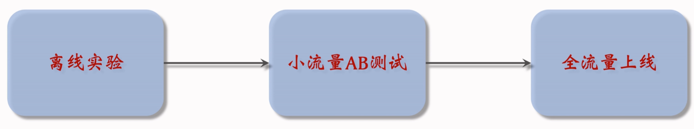

离线实验：收集**历史数据**，在历史数据上做**训练，测试**。**算法没有部署到产品中，没有跟用户交互。**

小流量AB实验：把**算法部署到实际产品**中，用户实际跟算法做**交互**。用户分为**实验组和对照组，实验组用新策略，对照组用旧策略**，比较实验组是否**优于**对照组，如果优于则可以**加大流量最终推全。**


## 推荐系统的链路

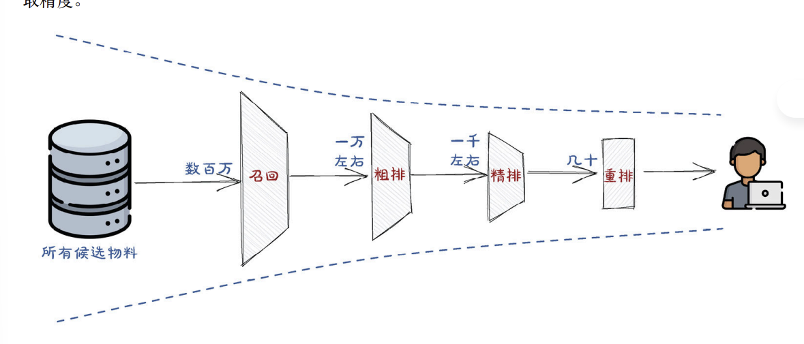

- 召回：用多条通道，取回几千篇笔记
- 粗排：用小规模神经网络给笔记打分，选出分数最高的几百篇
- 精排：用大规模神经网络，给几百篇笔记打分
- 重排：做多样性抽样，规则打散，插入广告和运营笔记


## 大数据架构


以视频推荐为例，为了让模型了解每个视频的受欢迎程度，需要计算每个视频的点击率CTR。计算CTR有3方面的难点

1. 为了保证统计结果的**有效性**，需要将统计窗口拉大，比例统计过去一周每个视频的CTR，**但是要回溯的历史越长，所涉及到的计算量就越大**。
2. 此外线上做预测的**时间非常紧张**，留给所有特征的准备时间不会超过10ms。
3. 由于Hadoop分布式文件系统(HDFS)**只支持批量数据读写**，因此**有许多即时的用户行为还没来得及组成用户日志或落盘到HDFS**，导致出现冷热数据的时间差，只能用到**过时的数据**。


为了应对大数据系统的复杂性，lambda架构应运而生

+ **将数据请求还结尾分别针对冷热数据的两个子请求**
+ **针对冷数据的请求，由离线曾批量完成计算，其结果由近线层缓存并提供快速查询**
+ **针对热数据的请求，由在线层基于流式算法进行处理**
+ **汇总冷热数据的结果，一般是将两个指标都喂给模型，使模型具备不同时间维度的视角**

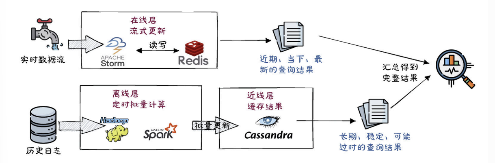


离线层：**启动小时级的定时任务，每个小时都想浅灰塑一周的用户行为日志，统计数据。**

近线层：**将离线层计算后的结果导入键值型数据库，加速访问。**

在线层：**使用Flink，Storm等六十计算框架，对接用户的行为数据流，不等数据落地就直接进行分析，计算结果也缓存到键值数据库中。**


## A/B测试

AB测试考察**线上指标的影响，以及如何选取最优的参数**。

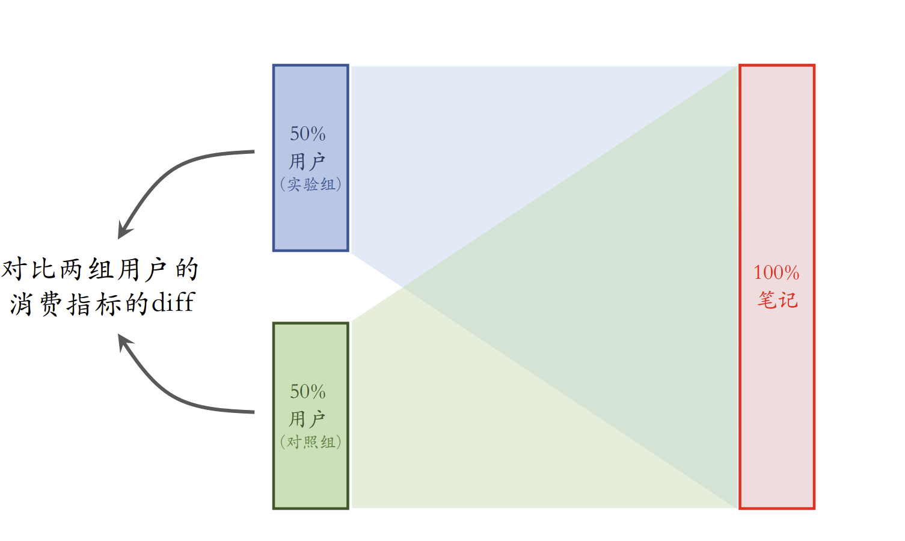

随机分桶，将用户ID用**哈希函数**映射为一个整数，分为多个桶，用户ID落在那个桶中就按照桶的策略做推荐。

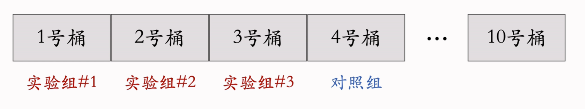


一个公司中存在很多部门和团队，如果大家都需要做A/B测试，会导致**流量不够**，因此引入了**分层实验**。


分层实验：**同层互斥，不同层正交**。以召回层为例，两组召回层实验不能作用与一个用户身上，但是一个用户可以受到一个召回层和一个精排层的影响。

有的同类策略天然互斥，同类策略的效果可能会互相干扰。不同类型的策略通常不会相互干扰。

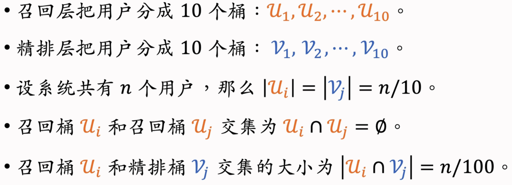


**Holdout**是一种考核**系统指标**的机制，**保留10%的用户完全不受实验影响**，可以考察整个部门对业务指标的贡献。


**实验推全**：当实验有效时，会**建立一个推全层**，与其他层正交。


反转实验：**在推全的新层中开一个旧策略的桶，长期观测实验指标**。该实验是为了解决在实验观测到**显著收益**后希望尽快**推全**新策略（为了腾出桶供其他实验使用或基于新策略做后续的开发），具有**滞后性**的指标，有**长期观测的**需求间的矛盾。


## 推广搜

推广搜是互联网业务的三驾马车，其中推荐与搜索负责**留住用户，生产流量**，而广告负责**将流量变现**。


三者的共同点如下

1. 在功能架构上，三者都遵循**”先召回粗筛，再由排序精挑细选“**
2. 在数据架构上，三者都遵循**Lambda架构**
3. **许多算法和技术在三个领域是互通的**
4. 推广搜都需要**高度个性化**，搜索不能单纯的返回关键词相关的物料，还要考虑用户画像；广告不能满足用户的需求只会浪费金钱。


推荐和搜索最大的差异在于**用户表达其意图的方式不同**，搜索中，用户通过输入查询语句显示表达其意图


其中，**t是物料，q是查询语句，u是用户**，模型衡量物料对用户输入的查询的匹配程度，这里考虑了用户信息，因此**不同的用户使用相同的查询语句得到的结果是不同的**。


而推荐系统中用户无需现实表达其意图，推荐系统通过自己的长期观察，猜测用户意图，完成推荐。


此外，**搜索对推结果的准确性要求更加严格**，例如对多个查询条件搜索时，需要考虑标签的并集

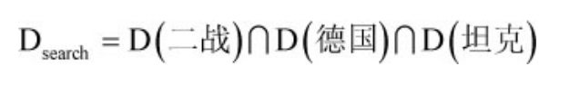


在推荐中，系统会对结果扩展

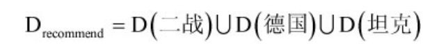


广告是为了流量变现，需要兼顾**用户，广告主，平台**三方的利益，参与方更多更复杂，优化难度更高。

广告关注的目标是**更深层次的转化**，它的**转换链很长**，例如对于电商app广告，一次完成的转化包括：用户点击广告、下载安装App、注册、成功下单。**这会带来严重的延迟反馈问题，能成功转换的样本较为稀疏，建模难度高**。

此外，**广告对指标的精度要求高**，因为广告费用的计算与指标相关，微小的误差会带来损失，而推搜中只要求**相对准确性**——能排名即可。

最后，**广告的候选集会小很多**，因为投放广告存在一定的技术和财力上的门槛。


# 特征工程

现如今的深度学习网络(DNN)，被认为可以当作**万能函数模拟器**，包括但不限于自动模拟特征工程。但越来越多的实践证明DNN的**局限性**——在现实的训练中会出现梯度爆炸，梯度消失，**不同特征受训机会不均衡等问题**，同时DNN会带来**时间上的代价**，因此用**DNN取代特征工程为之过早**。

## 特征提取

物料包括的特征有

+ **物料属性**，在物料入库时就能获取到，在大型推荐系统中，**物料的ID也是重要的特征**
+ **物料的类别和标签，不依赖用户反馈，只通过分析物料内容就能得到，一般由专门的算法获取**
+ **基于内容的Embedding**，用模型（CNN或BERT）的某一层输出作为物料特征
+ **物料的动态画像**，即后验统计数据，按照时间（全生命周期、过去一周）或对象（CTR、平均播放进度、排名）划分
+ **用户给物料反向打标签，将消费过某个物料的用户身上的标签传递并积累到物料上**


用户的特征有

+ 用户的**人口属性**
+ **对用户的行为序列建模**
+ **交叉特征**，交叉的方式有笛卡尔积交叉和内积交叉
+ **偏差特征**，一些推荐的物品由于推荐位置**靠后**使得没有被点击从而被当作负样本，这种误差会诱导模型。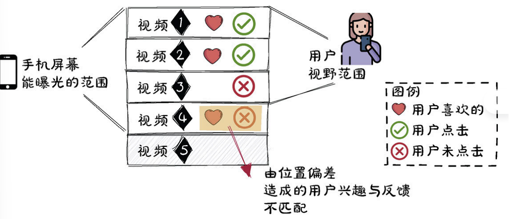 一种解决方案是从数据入手，比如**更严格地定义正负样本**，以**Above Click**为例，**只有位于被点击物料上方的未点击物料才会被作为负样本**， 另一种解决方案是从模型入手，让模型学习到负样本是位置原因带来的，在模型中**将偏差作为特征**，**训练时使用真实偏差，预测时将偏差设为一个统一的值**，也被称为伪特征。为了**保证不同的偏差值在预测时不会影响到模型**，偏差特征要**通过一个线性层接入模型，而绝不能和其他正常特征一起喂入DNN**。


## 数据特征的处理

### 处理缺失值

处理缺失值最常规的做法是用**所有样本的均值或中位数**，也可以更**精细**一点，按照**类别划分子样本**取值。


另一种做法是**训练模型预测缺失值**。


如果对**数值特征离散化**，在分桶时，为每个特征增加一个未知的桶，专门存储缺失值。


### 标准化

标准化是为了将不同量纲，不同取值范围的数值特征都压缩到一个数值范围内，使他们具有可比性。最常用的是z-score标准化


长尾分布的特征需要先变换为正态分布再进行标准化，否则统计的均值和方差会被带偏。


### 数据平滑和消偏

推荐系统中会遇到**样本太少**的情况，导致计算结果不可信，例如一个物品只被曝光了一次并被购买，由此计算出的购买率是100%，这显然是不对的。为了**消除小样本的负面影响**，提高计算结果的置信水平，可以采用**威尔逊区间平滑**


威尔逊区间平滑对简单计算出的比率修正，样本数量越大，修正后的比率越接近远比率。


此外，为抹平不同细分领域天然存在的偏差引入**消偏**。

以点击率为例，A的点击率优于B，但A处于更显眼的位置，因此点击率不能代表A的内容更出色。为了消除影响可以使用之前提及过的特征工程的技巧，或者采用CoEC消偏。


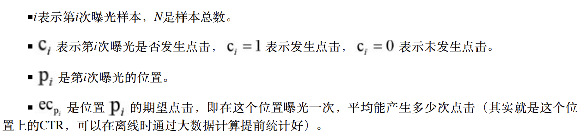


### 分桶离散化

分桶有三种方法：

+ **等宽分桶，将特征值域平均划分为N等份**
+ **等频分桶，用N个分位数作为各桶的边界**
+ **模型分桶**，是**简单决策树**拟合特征与目标值，在分桶时，用特征落到的**叶子节点的编号**作为离散化结果


### 类别特征

推荐系统的特征空间主要由**高维的稀疏的类别特征构成**（系统中包含几万个标签，但是每个物品只包含数个）。线上工程中，类别特征可以**减小计算开销**，提升在线预测与预测的实时性。


以上述公式为例，对于类别特征**只需将非零特征对应的权重相加即可**，省去了乘法运算。


类别特征的维度特别高，再加上实数特征分桶，多维特征交叉，特征空间的维度非常容易上亿，为此出现了**Parameter Server**架构**分散了参数存储和检索的压力**。


推荐系统中类别特征一般通过**Embedding和多特征交叉**增强表达能力。


类别特征中的字符串一般通过**索引表或哈希函数映射到Embedding矩阵，对应一个embedding向**量。


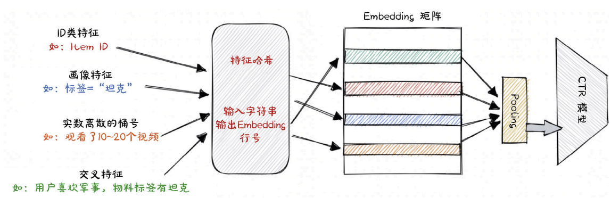


# Embedding层

## 概述

Embedding层负责将**稀疏的类别特征映射成一个稠密向量**。

Embedding层还能**概念拆解为特征向量**，目的是**提升推荐算法的扩展能力**，从而能够自动挖掘出那些低频、长尾、小众的模式。将概念拆开，使得推荐算法**从精准匹配转化为模糊查找**。


下述代码展示了如何用库实现简单的Embedding层

```python
import tensorflow as tf
import tensorflow.keras as keras

# 词表
unq_categories=['music','movie','finance','game','military','history']
id_mapping_layer=keras.layers.StringLookup(vocabulary=unq_categories) # 字符拆拿到整数

# Embedding层，六维压缩到四维，多一用于处理不在词表中的单词
emb_layer=keras.layers.Embedding(input_dim=len(unq_categories)+1,output_dim=4)

# 输入
cate_input=tf.constant(['music','movie','finance','game','military','history','None'],dtype=tf.string)
cate_ids=id_mapping_layer(cate_input)

# 得到Embedding后的结果
cate_embeddings=emb_layer(cate_ids)
```


## 共享or独占

共享Embedding是指**同一套Embedding喂入模型的多个地方，发挥多个作用**。例如，双塔模型中用户行为序列特征与物料共享Embedding，

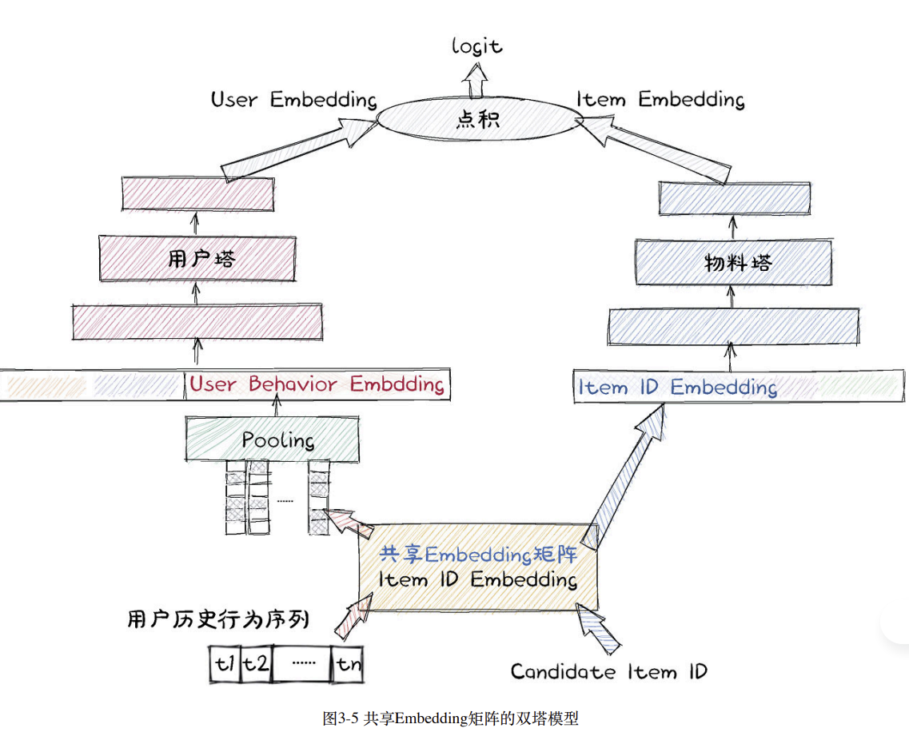

在交叉特征时，FM算法也会用到。


显而易见，共享Embedding可以**节省存储空间**，因为Embedding矩阵一般都很大。

另一个好处是，共享可以**缓解由于数据不足导致的训练不充分**，对于数据较少的Field可以与邻近的Field共享一个Embedding。


使用独占Embedding有两种情况，**一种是避免干扰，另一种是为了更好的进行特征交叉**。


# 召回策略

召回是推荐系统的第一个环节，它面对的候选集一般要达到**百万级规模**，所以召回模块的第一要务就是`快`，**为此它可以牺牲一部分精度，只要能找到与用户兴趣比较匹配的物料就可以，而不一定是最匹配的**。

召回模块主要依赖“`离线计算+在线缓存`”模式来实现对上百万规模候选集的快速筛选，离线处理时，因为不知道用户的信息，所以召回模型在结构与特征上都不能出现`用户信息和物料信息的交叉`，这**限制了召回模型**的表达能力，也就制约了召回模型的预测精度。

为了**弥补**精度上的不足，召回模块一般采用`多路召回`的方式，以`数量弥补质量`，每路召回只关注用户或物料信息的一个侧面。

注意，**排序模型并不是删除了交叉信息就能作为召回模型**，二者的应用领域不同，召回是为了**筛选掉不感兴趣的物料**。


## 模型架构

召回大致分为**传统召回算法（协同过滤等）和向量化召回**，其中向量化召回就是将**召回问题建模成向量空间内的近邻搜索问题**。


向量化召回建模框架由四个维度构成

+ **如何定义正样本**
+ **如何定义负样本**
+ **如何将用户和物料映射为Embedding**
+ **如何定义优化目标**


### 正负样本

正样本的选取很简单，**使用曝光且有点击的物品**即可，需要**平衡**冷门物品和热门物品，对**前者过采样对后者降采样**。


负样本的来源有：没有被召回，被召回但是被排序截断，被曝光但是没有被点击。

**Easy Negative** 指的是**用户不怎么感兴趣，模型很容易区分的负样本**。

**Hard negative** 指的是那些**错误类别中最难区分、最接近正样本（以用户很感兴趣）的负样本**，在推荐系统中是**被排序淘汰的物品**。

训练时**混合两种样本，对半开**


**被曝光但是没有被点击不应该作为负样本**，它会导致模型效果下降。

对喂入召回模型的样本的要求是**，既要让模型见过最匹配的组合，也要让模型见过最不靠谱的组合**，这样才能让模型达到“**开眼界、见世面**”的目的，能被曝光的物品已经属于**用户比较感兴趣的物品了**，甚至可以用作**正样本**，它不能让模型学习到用户不喜欢的模式。

### 优化目标

召回的损失函数主要考虑的是**排序的相对准确性**

#### NCE loss

假设模型输出 logits 向量
$$
z = [z_1, z_2, \dots, z_K]
$$
其中 $K$ 是类别数。**Softmax** 将 logits 转成概率分布：
$$
p_i = \frac{e^{z_i}}{\sum_{j=1}^{K} e^{z_j}}
$$
交叉熵损失定义为：
$$
L = -\sum_{i=1}^{K} y_i \log(p_i)
$$
若真实标签是 one-hot 向量（即正确类别为 $c$），则：
$$
L = -\log(p_c) = -\log\left(\frac{e^{z_c}}{\sum_{j=1}^{K} e^{z_j}}\right)
$$


召回中用到的**Softmax Loss**如下
$$
L_{\text{Softmax}} = -\frac{1}{|B|} \sum_{(u_i, t_i) \in B} \log \frac{\exp\left(u_i \cdot t_i\right)}{\sum_{j \in T} \exp\left(u_i \cdot t_j\right)}
$$
注：用点积表示两个向量的相似度


可以观察到。分母中要计算**用户向量与所有的物料向量**的点积，而物料的大小属于百万甚至千万，计算量十分惊人。


Noise Contrastive Estimation(NCE)是一种**简化分母**的思路，NCE Loss定义，对每个正样本**随机采样负样本**（推荐系统中不会传入负样本），将问题转换为判断**样本是否来自于噪声的二分类问题**
$$
\begin{align*}
L_{\text{NCE}} &= \frac{-1}{|B|} \sum_{(u_i, t_i) \in B} \left[ \log\left(\sigma\left(G(u_i, t_i)\right)\right) + \sum_{j \in S_i} \log\left(1 - \sigma\left(G(u_i, t_j)\right)\right) \right] \\
&= \frac{1}{|B|} \sum_{(u_i, t_i) \in B} \left[ \log\left(1 + \exp\left(-G(u_i, t_i)\right)\right) + \sum_{j \in S_i} \log\left(1 + \exp\left(G(u_i, t_j)\right)\right) \right]
\end{align*}
$$
其中$\sigma$为**Sigmoid**函数，**G(u,t)**为模型对样本的**得分**（如点积）。


其中
$$
G(u, t) = \boldsymbol{u} \cdot \boldsymbol{t} - \log Q(t | u)
$$
$ \log Q(t | u)$是为了**修正热门物品被过度惩罚**，因为**负样本主要由热门物料组成**，实际上是对热门物料进行了过度打压，可能**导致推荐结果过于小众**。$ \log Q(t | u)$是一个和**物料热度正相关的函数**。


如果不考虑修正，就得到了**NEG loss**，优点是**计算简便**，但不像NCE loss有**非常强的理论保障**。
$$
L_{\text{NEG}} = \frac{1}{|B|} \sum_{(u_i, t_i) \in B} \left[ \log\left(1 + \exp\left(-u_i \cdot t_i\right)\right) + \sum_{j \in S_i} \log\left(1 + \exp\left(u_i \cdot t_j\right)\right) \right]
$$

#### Sampled Softmax

Sampled Softmax的核心思想是**采样近似**，仍然是多分类问题。

1. **对每个训练样本，保留正确的类别**
2. **从所有的类别中随机采样N个负样本**
3. **仅在这个N+1个类别上计算Softmax loss**

$$
L_{\text{SampledSoftmax}} = -\frac{1}{|B|} \sum_{(u_i, t_i) \in B} \log \frac{\exp\left(G(u_i, t_i)\right)}{\exp\left(G(u_i, t_i)\right) + \sum_{j \in S_i} \exp\left(G(u_i, t_j)\right)}
$$


#### Pairwise Loss

一个样本是由：**用户，交互过的正向物料，随机采样的负向物料**组成的**三元组**，优化目标是，**针对同一个用户u，正向物料与他的匹配程度要远远高于负向物料**。


一种损失函数是**Marginal Hinge Loss**，其中m是超参数


$$
L_{\text{Hinge}} = \frac{1}{|B|} \sum_{(u_i, t_{i+}, t_{i-}) \in B} \max\left(0, m - \boldsymbol{u}_i \cdot \boldsymbol{t}_{i+} + \boldsymbol{u}_i \cdot \boldsymbol{t}_{i-}\right)
$$


另一种是**Bayesian Personalized Ranking Loss (BPR Loss)**，它的思想是，针对用户的排序，**正样本在负样本之前的概率$$P_{\text{CorrectOrder}} = \text{sigmoid}(\boldsymbol{u}_i \cdot \boldsymbol{t}_{i+} - \boldsymbol{u}_i \cdot \boldsymbol{t}_{i-})$$要最大化**。
$$
\begin{align*} L_{\text{BPR}} &= \frac{1}{|B|} \sum_{(u_i, t_{i+}, t_{i-}) \in B} -\log\left(P_{\text{CorrectOrder}}^{(i)}\right) \\ &= \frac{1}{|B|} \sum_{(u_i, t_{i+}, t_{i-}) \in B} \log\left(1 + \exp\left(\boldsymbol{u}_i \cdot \boldsymbol{t}_{i-} - \boldsymbol{u}_i \cdot \boldsymbol{t}_{i+}\right)\right) \end{align*}
$$

## 基于物品的协同过滤 **Itemcf**

### 原理


物品之间的相似度基于物品的**重叠受众 **

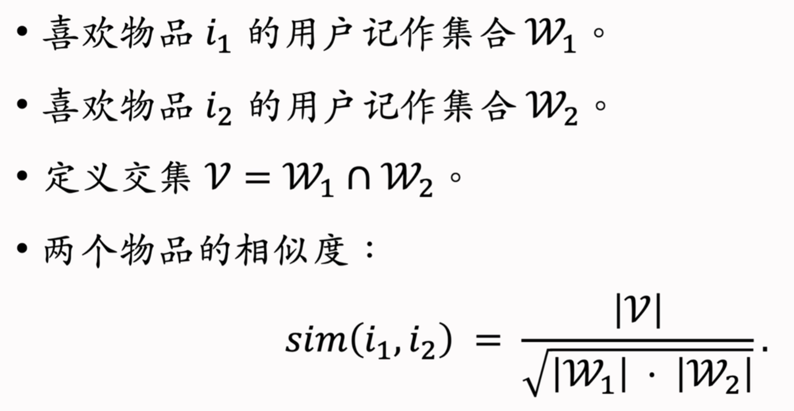


如果考虑用户对物品的喜欢程度


### 流程

事先做离线计算

- **建立用户->物品的索引**
  - 记录每个用户最近点击，交互过的物品ID
  - 给定用户ID可与找出他近期感兴趣的物品
- **建立物品->物品的ID**
  - 计算物品之间的相似度
  - 对每个物品，索引其最相似的K个物品


线上做交互

1. **给定用户ID，通过用户->物品索引，找到用户最感兴趣的物品列表(last-n)。**
2. **对于last-n列表中每个物品，通过物品->物品的索引，找到top-k相似物品。**
3. **对于取回的nk个相似物品，用公式预估用户对物品的兴趣分数。**
4. **返回分数最高的100个物品，作为该召回通道的推荐结果。**


使用索引，离线计算量大，但是线上计算量小。

## Swing 召回

Swing是ItemCF的**变体**，ItemCF是基于用户重叠来计算相似度的，但是如果用户在一个**小圈子**中(微信群)，圈子中分享的物品被点击或点赞并非出于感兴趣，因此**两个不相干的物品会被错误的认为相似**。

Swing**给用户设置权重**，用户喜欢的物品重叠越多，越说明他们出于一个圈子，依次防止出现小圈子问题。

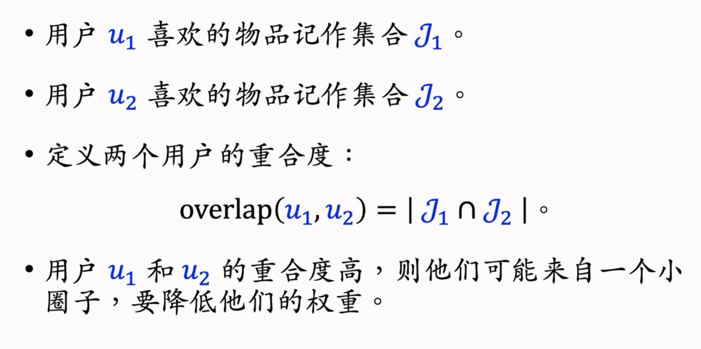


​								 


## 基于用户的协同过滤额 UserCF

### 原理

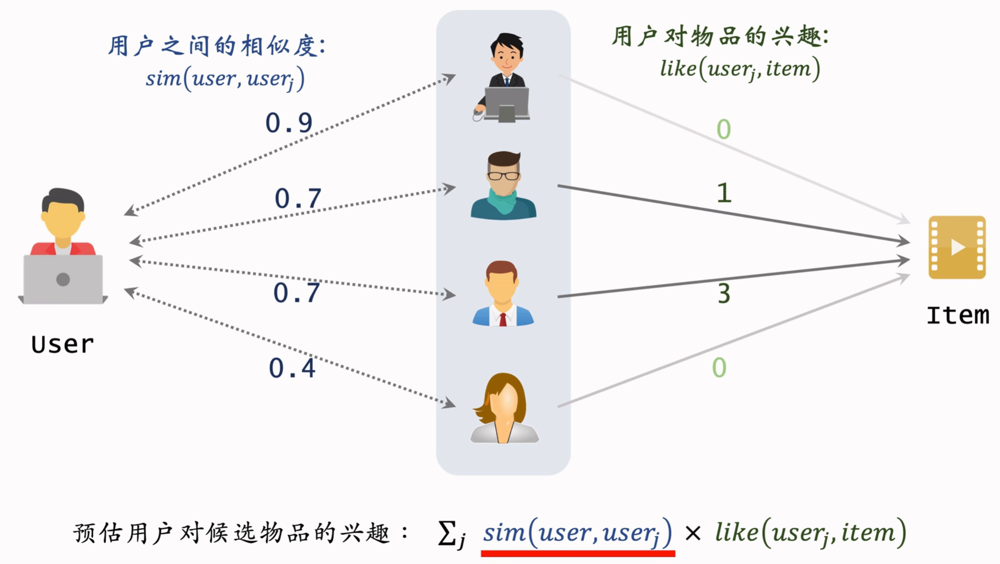


计算用户间的相似度，**越热门的物品对计算相似度帮助不大，不能反映出用户的兴趣**，因此需要对物品按照**热度**赋予一个权重。


### 流程

事先做离线计算

- **建立用户->物品的索引**
  - 记录每个用户最近点击，交互过的物品ID
  - 给定用户ID可与找出他近期感兴趣的物品
- **建立用户->用户的ID**
  - 计算用户之间的相似度
  - 对每个用户，索引其最相似的K个用户


线上做交互

1. **给定用户ID，通过用户->用户索引，找到最相似的k个用户top-k。**
2. **对于top-k列表中的用户，通过用户->物品的索引，找到last-n。**
3. **对于取回的nk个相似物品，用公式预估用户对物品的兴趣分数。**
4. **返回分数最高的100个物品，作为该召回通道的推荐结果。**


## 矩阵补充

### 原理

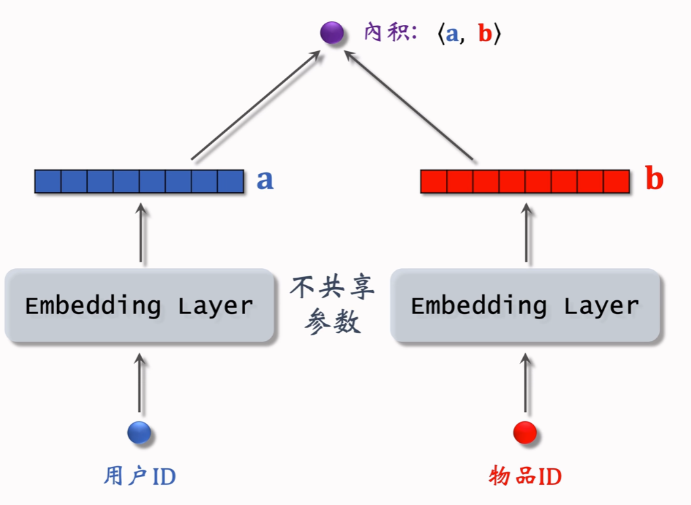


模型的输入为(用户ID，物品ID，兴趣分数)的集合，兴趣分数是系统记录的，如

+ 曝光但是没有点击，0分
+ 点击，点赞，收藏，转发，各算1分
+ 分数最低是0最高是4


**模型将物品ID和用户ID做embedding，映射为向量，两个向量的内积作为用户对物品的兴趣分数。**


让模型拟合观测的真实兴趣分数，**得到两个Embedding层的参数**，即一个矩阵，矩阵的**列**表示用户/物品。


数据集可以看作是给定了下述的矩阵，模型通过拟合得到其他位置的兴趣分数，最终做推荐。

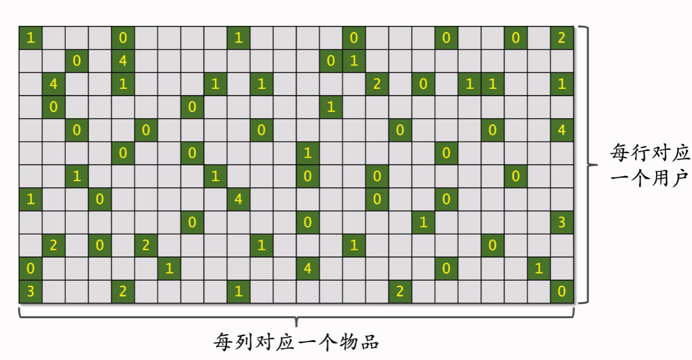


矩阵补充的实践效果并不好

1. **没有利用物品和用户的属性**
2. **负样本的选取方式不对**
3. **做训练的方法不好，如损失的计算，使用内积**


### 线上召回

1. 训练得到的Embedding矩阵A和B，A中每一列是用户，B中每一列是物品。
2. 把矩阵A的列存储到**字典**中，B用**其他方式**存储。
3. 把**用户ID**作为key查找得到**用户向量a**
4. 第i号物品的embedding记作$b_i$，**返回能使内积<a,$b_i$>最大的k个物品**


最后一步中，如果枚举所有物品，**时间复杂度会正比于物品数量**，工业中一般采用**近似最近邻查找**，**最近邻的标准有欧氏距离，向量内积，余弦相似度**。


首先将物品**按照最近邻划分为多个区域**，每个区域用一个**向量**表示，同时**建立区域内点到向量的映射**。

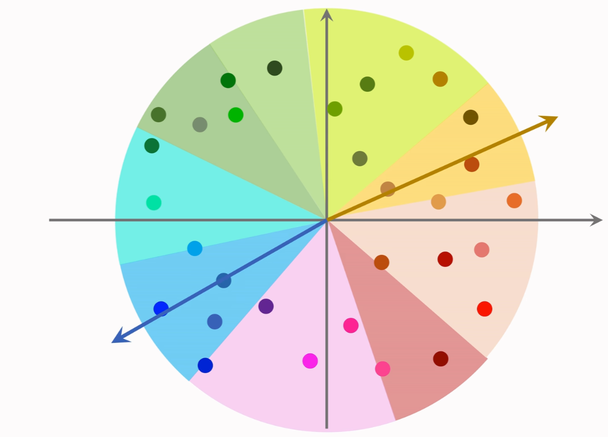


接下来计算**用户向量与区域向量的距离**（取决于最近邻的标准），找出**最近**的向量；再计算该向量**区域内所有点与用户向量的距离**，得到最近的K个。


这些改进大大减小了枚举的次数。


## Word2Vec

### Item2Vec

**Item2Vec**借鉴了**NLP**领域的**Word2Vec**，Word2Vec的目标是**将每个单词转换为能表征其语义的稠密向量**，学习方法是**给定一个中心词w**，**预测哪些词能够出现在w的上下文中**，与w搭配使用。比如给定一句话`“The quick brown fox jumps over the lazy dog”`，当我们选中`fox`当中心词，并且取宽度为1的窗口作为上下文的范围，Word2Vec的训练目标就 是使`“fox, brown”`和`“fox, jump”`这样的单词组合出现的概率越大越好。


理论上的损失函数就是
$$
L_{\text{word2vec}} = -\frac{1}{|B|} \sum_{(w_i, c_i) \in B} \log \frac{\exp\left(\boldsymbol{w}_i \cdot \boldsymbol{c}_i\right)}{\sum_{j \in V} \exp\left(\boldsymbol{w}_i \cdot \boldsymbol{c}_j\right)}
$$
为了简化计算量，使用**NEG**技巧
$$
L_{\text{word2vec}} = \frac{1}{|B|} \sum_{(w_i, c_i) \in B} \left[ \log\left(1 + \exp\left(-\boldsymbol{w}_i \cdot \boldsymbol{c}_i\right)\right) + \sum_{j \in S_i} \log\left(1 + \exp\left(\boldsymbol{w}_i \cdot \boldsymbol{c}_j\right)\right) \right]
$$
**Item2Vec**则是将用户的某一个**行为序列**当成一个句子，序列中的每个**Item ID**当成一个单词，按照以上方式收集完数据后，直接套用Word2Vec训练，训练完成后，就能得到每个物料的Embedding使用。


### Airbnb召回算法

Item2Vec直接套用Word2Vec尽管简单方便，但是忽略了**推荐领域与NLP领域的许多差异之处**，例如，用户的行为序列中，**第一个点击的物品和最后一个点击的物品非常有可能相似**，但是**NLP中只会认为一个词于它左右的词是相关的**。

Airbnb就此，针对民宿中介的业务特点，对Word2Vec进行了若干改造。


I2I召回中

1. **正样本**定义为**窗口内的邻近房屋**，同时如果有房屋被预定了，那么额外增加一批正样本，**由被预定房屋与其他房屋组成**。
2. **负样本**的**主力是随机采样**得到的，同时考虑到房屋的固有属性——随机采样得到的样本大多是异地的，要为**每个房屋从与其同城的其他房屋中采样一部分作为Hard Negative**
3. 损失函数与Word2Vec一样采用**NEG Loss**，但增加了**额外的正负样本**


U2I召回中，Airbnb从**对业务更重要的预定数据**入手，虽然预定数据**十分有限**，但Airbnb根据属性和人工规则**将用户和房屋分类**，这样单个用户与单个房屋的预定记录是稀疏的，而某类用户对某类房屋的预定就吩咐多了，这里要学习的则是**类别的Embedding**，有助于**冷启**。

1. 正样本，如果某用户预定过某房屋，那么用户所属的类别与房屋的类别应该是相似的
2. 负样本的主力是随机采样
3. 损失函数与Word2Vec一样采用**NEG Loss**


### 阿里巴巴的EGES召回

EGES认为“`只有被同一个用户在同一个session内交互过的两个物料才有相似性`”太过于**局限**，EGES考虑**跨用户，跨session的相似性**，以提高模型的扩展性，同时**有助于冷启**。


+ 根据**用户行为序列建立物料关系图**，图中每一个节点代表一个物料，每一条边代表两个物料被**顺序交互过**，比如，图5-3(a)中的用户U1先点击过物料D，再点击 过物料A，那么在图5-3(b)上就有一条边由D指向A。节点i,j之间的**权重**等于数据集中“`先点击i再点击j`”的**次数**。
+ 根据物料关系图，**生产一批新的序列**，由节点i到节点j的**转移概率**$$P(v_j | v_i) = \frac{M_{ij}}{\sum_{j \in N_v(M)} M_{ij}}$$，$M_{ij}$是i到j的边权，$$N_+(v_i)$$是i的邻居个数
+ 在这些新序列上**套用Word2Vec方法**，定义滑窗，窗口内的两个物料是相似的，成为正样本


负样本的选取**照搬Word2Vec中的随机负采样方法**。


Embedding时，EGES还引入了**物料的属性信息**，将ID embedding属性与其他属性**合成新的Embedding**。EGES定义了**1（ID）+N（属性）个Embedding矩阵**。


合并可以按照**Average Pooling**，$$H_v = \frac{1}{n+1} \sum_{s=0}^n W_v^s$$

或者定义一个**待学习的权重矩阵**$$A \in \mathbf{R}^{|V| \times (1+n)}$$（|V|是所有物料数），**按照权重合并属性**，$$H_v = \frac{\sum_{j=0}^n \exp\left(a_v^j\right) W_v^j}{\sum_{j=0}^n \exp\left(a_v^j\right)}$$


损失函数**套用了Word2Vec中的NEG Loss**


## FM召回

相比于其他召回模型，**FM简单的结构限制了特征交叉，削弱了模型的表达能力，但也使FM具备了易于上线部署、解释性强等优点**。


FM中需要在**正样本中对热门物品降采样**，否则模型会迫使每个用户向量可能接近少数热门物料的向量。降采样参考Word2Vec过滤高频停用词的做法
$$
P_{\text{pos}}(t_i) = \sqrt{\frac{\alpha}{f(t_i)}}
$$

+ **f是物品的曝光频率**
+ **$\alpha$是超参数**，可以理解为定义冷门物品的门槛，**如果f<=a，那么物料就必须成为正样本**


热门物品中**在负样本中要过采样**，热门物品当负向物料能**极大地提升模型的分辨能力**。过采样参考Word2Vec中用到的公式，b是超参数，一般取**0.75**
$$
P_{\text{neg}}(t_i) = \frac{F(t_i)^b}{\sum_{t' \in V} F(t')^b}
$$


FM计算(u,t)之间的匹配度公式如下


$$
\text{FM}(u, t) = b + \sum_{i \in I(u,t)} w_i + \sum_{i \in I(u,t)} \sum_{(j=i+1) \in I(u,t)} \boldsymbol{v}_i \cdot \boldsymbol{v}_j
$$

+ w代表特征的权重
+ v代表特征的Embedding


按照是用户特征还是物料特征进一步拆分


$$
\text{FM}(u, t) = b + [W_u + W_t] + [V_{uu} + V_{tt} + V_{ut}]
$$

+ uu 表示用户特征交叉
+ tt 物料特征交叉
+ ut 用户和物料特征交叉


在给不同物料打分时，由于**用户是固定的**，因此公式中不涉及到物料的部分可以忽略，简化为
$$
\text{FM}(u, t) = W_t + V_{tt} + V_{ut}
$$
其中$v_{tt}$可以因子分解将复杂度降为线性，可以离线计算出作为常数
$$
V_{tt} = \sum_{i \in I_t} \sum_{(j=i+1) \in I_t} \boldsymbol{v}_i \cdot \boldsymbol{v}_j = \frac{1}{2} \text{reducesum} \left[ \left( \sum_{i \in I_t} \boldsymbol{v}_i \right)^2 - \sum_{i \in I_t} \boldsymbol{v}_i^2 \right]
$$
$v_{ut}$拆解为两个向量点积的形式
$$
V_{ut} = \sum_{i \in I_u} \sum_{j \in I_t} \boldsymbol{v}_i \cdot \boldsymbol{v}_j = \left( \sum_{i \in I_u} \boldsymbol{v}_i \right) \cdot \left( \sum_{j \in I_t} \boldsymbol{v}_j \right)
$$


最后将公式转换为两个向量点积的形式
$$
\begin{align*} \text{FM}(u, t) &= \boldsymbol{E}_u \cdot \boldsymbol{E}_t \\ \boldsymbol{E}_u &= \text{concat}\left( 1, \sum_{i \in I_u} \boldsymbol{v}_i \right) \\ \boldsymbol{E}_t &= \text{concat}\left( W_t + V_{tt}, \sum_{j \in I_t} \boldsymbol{v}_j \right) \end{align*}
$$
**召回时，在线实时计算$E_u$，$E_t$提前离线计算好。**


注意上述公式只针对**预测**，因为要保证**实时性**，在**训练**时没必要把用户特征和物料特征拆开。
$$
\text{FM}(u, t) = b + \sum_{i \in I(u,t)} w_i + \frac{1}{2} \text{reducesum} \left[ \left( \sum_{i \in I(u,t)} \boldsymbol{v}_i \right)^2 - \sum_{i \in I(u,t)} \boldsymbol{v}_i^2 \right]
$$

## 双塔模型

### 正样本

+ U2I：**一个用户与其交互过的物料相互匹配**，构成一对正样本
+ I2I：**一个用户在一个session交互过的两个物料应该具备相似性**，可以成为一对正样本
+ U2U：**一个用户的一半行为历史与其另一半行为历史应该彼此相似**，可以组成一对正样本

### 负样本

常见的做法是**batch内负采样**。以点击场景下的U2I召回为例，在一个Batch \( B \) 中，第\( i \)条正样本由用户\( u_i \)和与他交互过的物料\( t_i \)组成，是正样本。Batch内负采样是指：\( u_i \)与除了\( t_i \)之外\( B \)中其他正样本中的物料组成负样本。即\( (u_i, t_j), \forall j \in B-i \)，都是负样本。

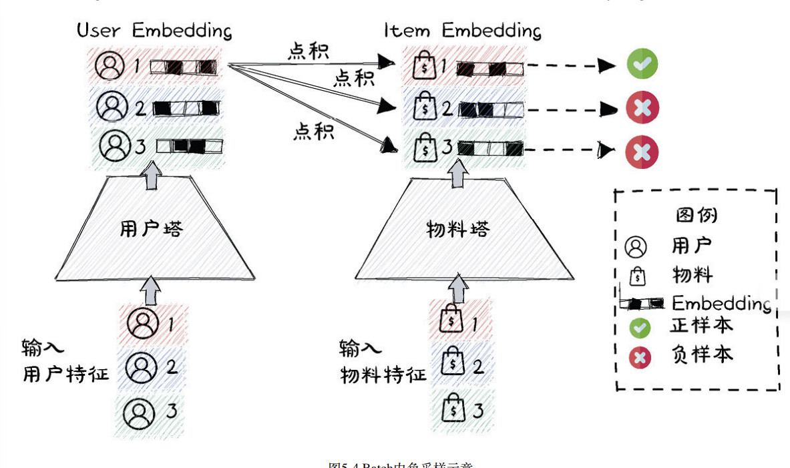

缺点在于被点击的物品大多是**热门物料**，属于hard negative，模型**缺少与用户兴趣不相关的Easy Negative**。


为了解决样本偏差的问题，在batch内负采样的基础上发展了**混合负采样**，其建立了**一个额外的向量缓存**，存储物料塔中训练得到的**最新物料向量**，在训练每个batch时，先进行batch内负采样，**再额外从向量缓存中采样一些物料向量作为Easy Negative**。


### 原理

召回的应用场景规定，`复杂的结构可以出现在一个塔的内部，但绝对不允许出现在两塔之间`。


双塔模型可以看作是矩阵补充模型的**升级**版，双塔指的是**用户塔和物品塔**


整体结构如下


单个塔如下，双塔**能喂入的特征非常丰富**


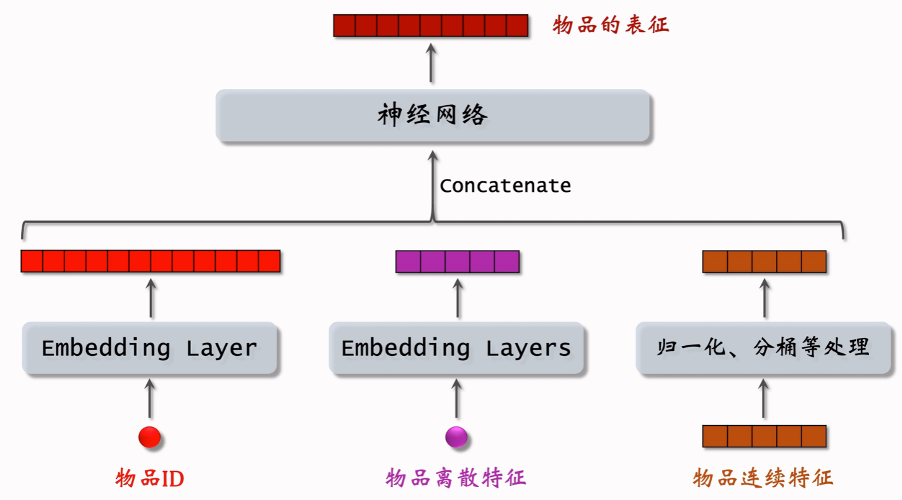


双塔要求**两塔之间绝对独立、解耦**，只允许在生成最终的用户向量和物料向量之后才点积交叉一次，在此之前，用户/物料信息只能沿着塔向上流动，**绝对不允许出现跨塔的信息交流**。


在训练好神经网络参数后，**物品表征**事先存储在**向量数据库**中，**线上不做推理**，因为物品特征较为**稳定**。**用户特征**只需做一次**线上推理**。


双塔模型属于**后期融合**——顶层之前不对物品和用户特征做融合，线上计算量小。


### 损失函数

双塔模型比较常用的是**基于Batch内负采样的Sampled Softmax Loss**
$$
\begin{align*} G(u, t) &= \frac{\boldsymbol{u} \cdot \boldsymbol{t}}{\tau} - \log Q(t) \\ L_{\text{Tower}} &= -\frac{1}{|B|} \sum_{(u_i, t_i) \in B} \log \frac{\exp\left(G(u_i, t_i)\right)}{\exp\left(G(u_i, t_i)\right) + \sum_{j \in B, j \neq i} \exp\left(G(u_i, t_j)\right)} \end{align*}
$$
对u和t，一个常见的技巧是**除以它们各自的L2 Norm**，转换为**长度为1的向量**（长度指的是范数——平方和开根号），这样**做点积就等价于用cosine(u,t)计算匹配度**，实践证明，**用cosine的效果要更好**。

**$\tau$是温度系数**，如果设置的很**小**，模型**对错误的放大功能就会很强**，能保证推荐结果的**精度**，但是对用户**潜在兴趣覆盖得不够**；反之，对错误的放大功能就会**很弱**，实现了**推荐结果的多样性**，但是**有损用户体验**。


$$Q(t)$$等于**物料t在所有点击样本中的占比**。


如果采用**混合负采样**，损失函数会**引入额外的$B^`$，**代表生成的物料向量的缓存。
$$
L_{\text{Tower}} = -\frac{1}{|B|} \sum_{(u_i, t_i) \in B} \log \frac{\exp\left(G(u_i, t_i)\right)}{\exp\left(G(u_i, t_i)\right) + \sum_{j \in B+B', j \neq i} \exp\left(G(u_i, t_j)\right)}
$$
因为现在负采样来自两种采样策略，所以$$Q(t)$$是一个**组合概率**
$$
Q(t) = \frac{|B|}{|B| + |B'|} Q_{\text{in-batch}}(t) + \frac{|B'|}{|B| + |B'|} Q_{\text{cache}}(t)
$$
$Q_{\text{in-batch}}(t)$定义同上，$Q_{\text{cache}}$是物料在向量缓存中采样到物料t的概率。


### 模型更新

全量更新：在今天凌晨，用**昨天的数据在昨天的模型参数基础上做训练**，并更新**物品向量**。

增量更新：每隔**几十分钟**更新模型参数（**只更新ID Embedding参数**），需要**实时收集线上数据**。


一般系统会**结合使用**两种更新方式。


### 自监督

推荐系统的**头部效应**严重：少部分物品占据大部分点击，大部分物品的点击次数不高。**因此高点击物品的表征学的好，长尾物品的表征学得不好**。


为了更好的学习长尾物品的向量表征，对物品做**自监督学习**，训练物品塔


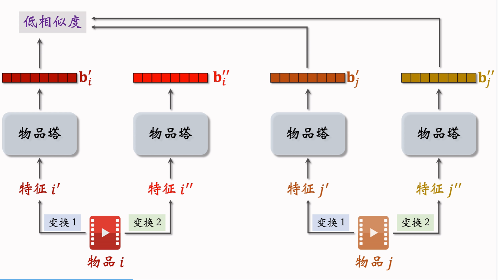

**同一物品**经过特征变换后从物品塔得到的特征向量应该有**高相似度**，**不同物品**的特征向量应该有**低相似度**。


特征变换的方法有：

+ Random Mask，**随机选取离散的特征置**为default，相当于丢弃
+ Dropout，对**多值离散特征**随机丢弃其中**50%**
+ Complementary，把特征随机分为**两组**，填充为 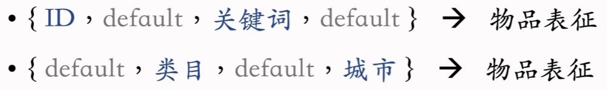的形式
+ Mask关联的特征，**离线计算出特征间的互信息**，**随机选一个特征作为种子**，将**其和与其最相关的k/2个特征丢弃**。这种方法效果最好，但是方法复杂，实现难度大，不好维护。


训练模型时，从**全体物品中均匀抽样**，得到一个batch，做两类特征变换输出两组向量，每个物品的损失函数如下

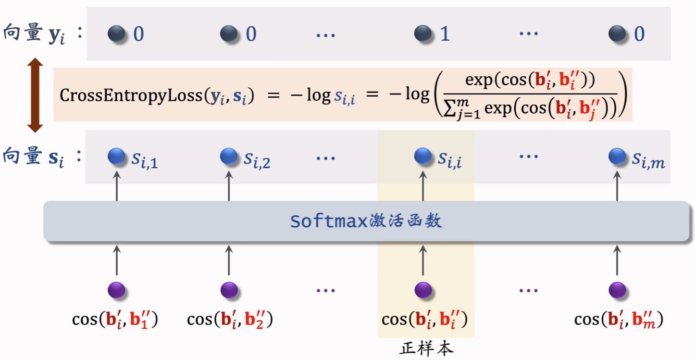

最后做梯度下降最小化损失函数


对点击做随机抽样，对全体用户做均匀抽样得到两个batch，同时训练双塔和自监督


## GCN召回

GCN，图卷积神经网络。推荐系统可以被构建为一张图，各种实体作为图的顶点，各种互动关系构成了图的边。


GCN将**召回建模为边预测问题**，即**预测图上两个顶点之间是否有边存在**，用户节点和物料节点之间的边可以作为**U2I**召回结果，物料节点之间的边可以作为**I2I**召回结果。GCN利用了**实体间的信息传递**。


**一条边所连的两个节点**作为**正样本**，固定一个样本在**图上随机采样**组成**负样本**。


GraphSAGE是GCN的一种实现思想，在GraphSAGE出现之前，GCN的实现都是直推式的——预测与训练只能使用相同的图，对于未曾竖线在训练图上的节点，传统GCN无法给出它们的向量表示。GraphSAGE并不直接学习图上节点的向量表示，而是学习出一个转换函数——只要输入节点特征和连接关系就能返回该节点的向量表示。所以，GraphSAGE是归纳式的，适合推荐系统——大型推荐系统构造出的图通常包含上亿个节点，不可能因新来一个实体就重新建图。


GraphSAGE的思路如下所示
$$
\begin{align*} \boldsymbol{h}_v^0 &= \boldsymbol{x}_v \\ \boldsymbol{h}_v^k &= \sigma\left( W_k \sum_{u \in N(v)} \frac{\boldsymbol{h}_u^{k-1}}{|N(v)|} + B_k \boldsymbol{h}_v^{k-1} \right),\ \forall k > 0 \\ \boldsymbol{z}_v &= \boldsymbol{h}_v^{\text{last}} \end{align*}
$$

+ ${h}_v^0$第节点v第0层卷积的结果
+ ${h}_v^{last}$第节点v最后一层卷积的结果
+ ${h}_v^k$代表第\(k\)层卷积，由两部分组成。\( W_k\sum_{u \in N(v)}\frac{h_u^{k-1}}{|N(v)|} \)代表聚合节点\( v \)的**所有邻居**（即\( N(v) \)）向量，再用权重\( W_k \)线性映射。\( B_kh_v^{k-1} \)表示对节点\( v \)的上一层的输出\( h_v^{k-1} \)，用权重\( B_k \)线性映射。第\(k\)层的卷积结果是将以上两部分之和**用函数\(\sigma\)非线性激活**。


卷积过程如下所示，图中的 AGG 表示聚合操作，PROJB 对应公式中的\( B_k \)，PROJW 对应公式中的\( W_k \)


可以看到，随着卷积的深入，**节点用到的邻居所包含的信息越来越丰富**，相当于扩大了单个节点的感受野。


## Deep Retrieval

把物品表征为路径，线上查找用户最匹配的路径。


### 索引

下图中路径的深度为3，宽度为K

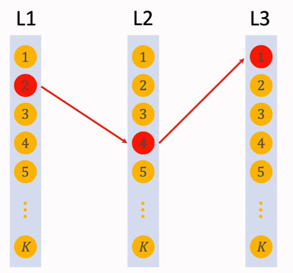


预先建立**物品到路径**和**路径到物品**的索引，两者都是**一对多**的关系


### 预估用户对路径的兴趣


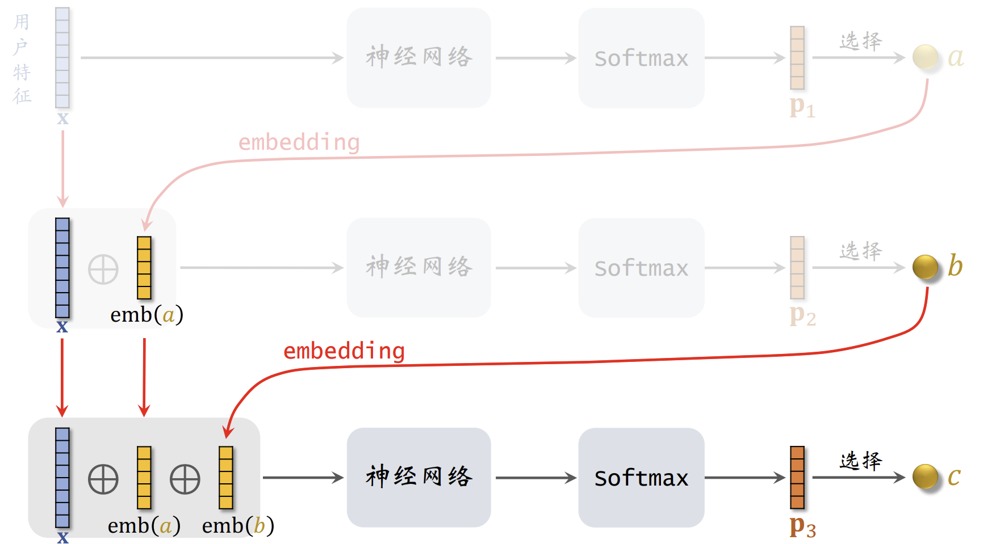

对于路径[a,b,c]，输入用户特征x，经过神经网络和Softmax层得到p1，选择节点a；对节点a做**embedding**和用户特征**拼接**，输入到神经网络和Softmax中得到p2，选择其中的节点b...


最后的分数如下

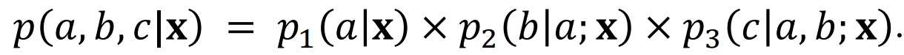


### 线上召回

1. **给定用户特征，用beam search召回一批路径。**
2. **利用索引，召回一批物品**
3. **对物品打分和排序，选出一个子集，打分的方法不固定**


beam search是一种**贪心**思想，用于选取**最优**的路径，**但不保证最优**。


以beam size=4为例

**对第一层，选出分数最高的四个节点**

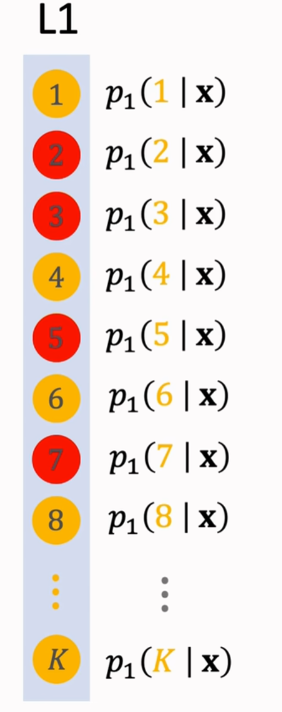


考虑从**四个节点出发**经过的**4K条路径**中**分数最大的4个**

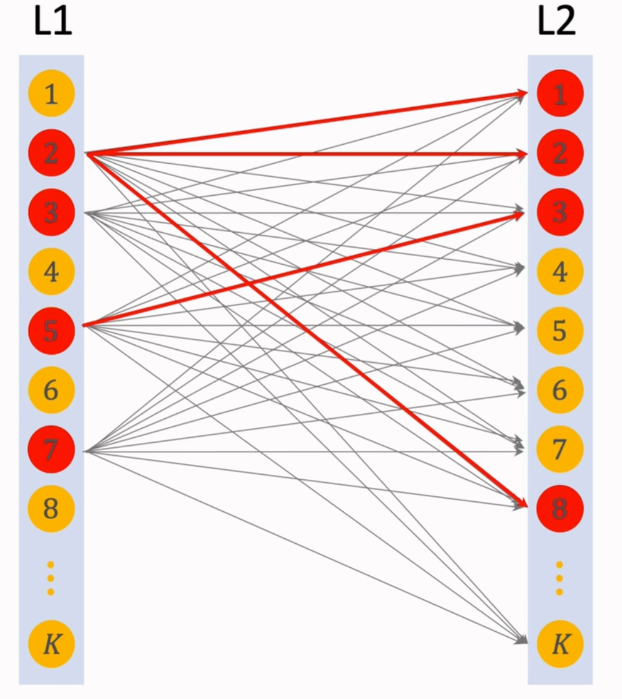

从**上一步选择的节点出发**，找出分数最大的4条路径

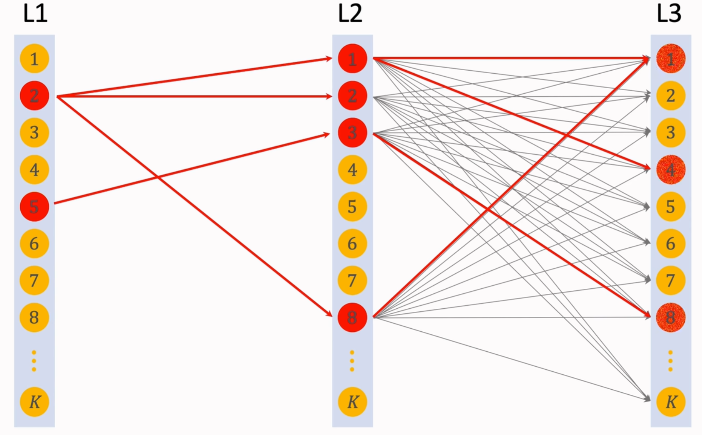


### 训练

**同时学习神经网络参数和物品表征**


对于神经网络参数，只用正样本，即click(user,item)=1。将点击过的物品表述为多条路径，最大化用户对路径的分数

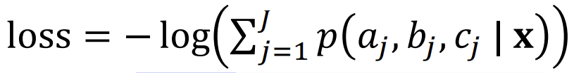


定义物品与路径的**相关性**


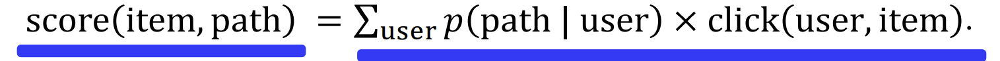


选出相关性**最大**的路径作为物品的表征

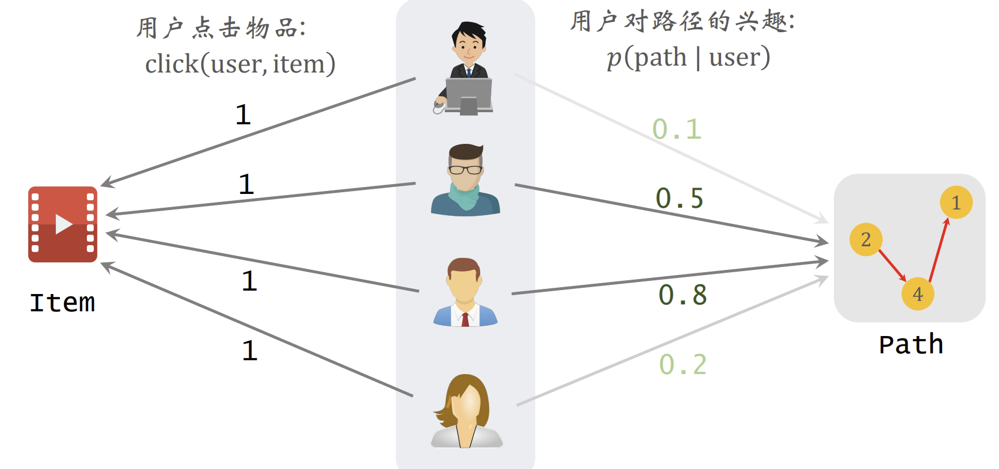


显然，要使物品表征出的**路径相关分数最大**，同时为了避免**过多的物品被一条路径表征**，引入正则项惩罚：**路径表征的物品数的4次幂**。

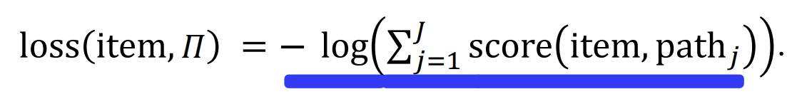

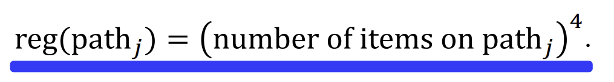


更新时，从未被选择的路径中，选出使损失函数和正则项和最小的最为新的路径。这一步理解不够

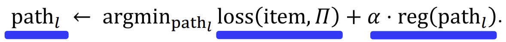


## 其他召回

**Geohash召回**，根据用户的**地理位置**召回，取回该地点**最新的K篇优质笔记**，**不考虑个性化**。


Geohash将**二维的经纬度坐标**转换为带有**前缀性质索引性质的一维坐标**。在一定程度上可以保证，两个Geohash的**公共前缀**越长，其所对应的区域就越近。


首先对经度纬度**二分**

- 第一轮：经度范围为 -180°~180°，可以拆分成 -180°~0° 以及 0°~180° 两部分，如果经度从属于前者，则令首个 bit 位取 0，否则令首个 bit 位取 1；
- 第二轮：-180°~0° 可以拆分为 -180°~-90° 和 -90°~0°，如果经度从属于前者，则令第二个 bit 位取 0，否则令第二个 [bit 位](https://zhida.zhihu.com/search?content_id=231481591&content_type=Article&match_order=4&q=bit+位&zhida_source=entity)取 1；0°~180° 可以拆分为 0°~90° 和 90°~180°，前者令第二个 bit 位取 0，后者令第二个 bit 位取 1
- 第 3 ~ N 轮：重复上述步骤的思路，最终递归二分，将经度表示成一个由二进制数字组成的字符串

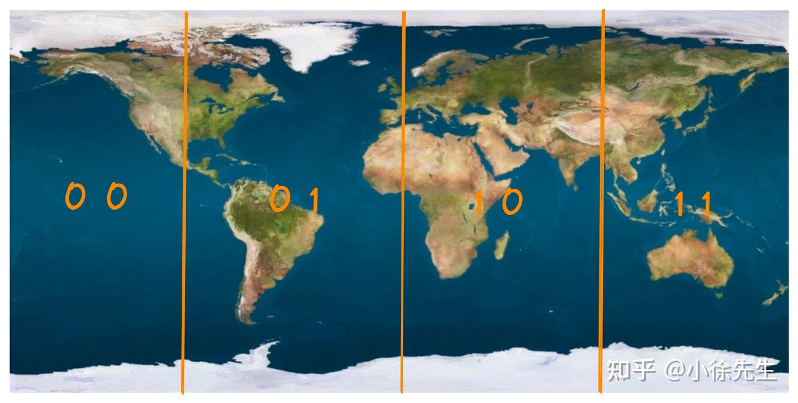


将转换后的经纬度按照**经度字符串+纬度字符串依次交错排列**的形式组合，最后按照**5个一组划分**按**base32**规则映射，得到最后的字符编码。


**同城召回**，按照**城市**召回最新的K篇优质笔记，**不考虑个性化**。


**缓存召回**，**复用前n次推荐精排的结果**，因为缓存**有限**，需要**退场**机制。


此外还有作者召回。

### 曝光过滤&Bloom Filter

如果用户**看过**某个物品，则不再把该物品**曝光**给该用户。对于**每个用户记录曝光给他的物品(一定时间内)**，对于每个被召回的物品，判断它是否已经给该用户曝光过，**排除掉曾经曝光过**的物品。


**暴力对比**召回的物品是否在曝光记录中，会带来较大的**计算开销**。


Bloom Filter是一种**数据结构**，**判断一个物品ID是否在已曝光的物品集合中**。返回结果为**No**，那么**一定不在**；返回结果为**Yes**，该物品**可能在集合中**(有概率误判)。因此使用Bloom Filter**一定能过滤掉已曝光的物品，但是会导致未曝光的物品被剔除**。该结构的缺点在于，**不支持删除物品**。


Bloom Filter将**物品映射为m维向量**，使用**k个哈希函数**。初始化时，将**已曝光物品**使用**哈希函数**映射到m位上的k个位置，将这些位置设置为**1**，被**重复**映射的位置**忽略**。对被召回的同样使用k个哈希函数映射，如果**全部位置都为1**，说明该物品**被曝光**，反之未被曝光。

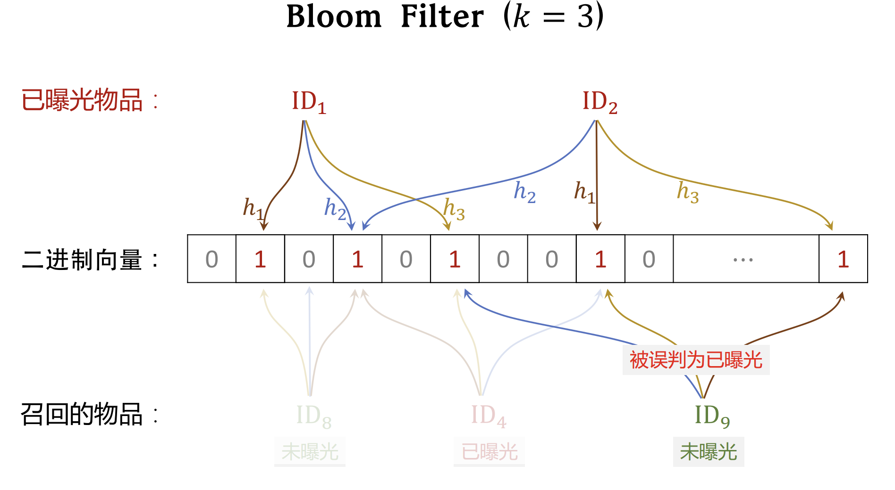


曝光物品集合大小为**n**，二进制向量维度为**m**，使用**k**个哈希函数	

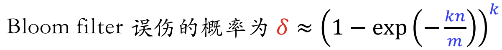


人为设定可容忍的误伤概率后，有


# 排序


**粗排**：从召回通道召回的物料中再次筛选，用于**快速过滤低质量候选**。

**精排**：精排的任务是从上有层层筛选出的千级规模的比较符合用户兴趣的物料中，挑选出几十个最合用户品味的物料。精排的侧重点是**提升预测精度**，看重**物料信息和用户信息的交叉特征**。

## 排序特征

- 用户画像：用户ID，人口统计学属性，账号信息，感兴趣的类目
- 物品画像：物品ID，发布时间，内容信息，类目，关键词
- 用户统计特征：用户不同时间段的/对不同类目的统计量
- 物品统计特征：物品不同时间段/按用户特征划分的统计量，发布者统计特征
- 场景特征：用户位置，当前时间，登录设备


物品特征**稳定**，用户特征**较为稳定**，统计特征**动态变化**。


## 粗排双塔模型

### 粗排双塔与召回双塔的异同

**双塔模型在粗排中仍是主力**，与召回的双塔相比，二者的相似之处在于

+ 训练时，都需要**用户塔和物料塔隔离，解耦建模**。
+ 部署时，面对一次用户请求，**用户向量只需要生成一遍**，**物料向量可以离线生成好**，缓存起来，被不同的用户请求。

不同点在于

+ 因为**候选集大小不同**，粗排中无需使用**向量数据库**，物料向量直接**存入内存缓存起来**，在线预测时，**线性遍历**与唯一的用户向量计算粗排得分。
+ 对于负样本，召回绝对不能只拿“曝光未点击”作为负样本，负样本的主力必须由随机负采样组成。**粗排可以和精排一样，拿“”曝光未点击“做负样本**，但是这里存在**选择偏差（SSB）**——训练时用的都是曝光后的数据，预测时面对的只是召回后的结果，质量远不如曝光数据，纠正这个偏差是业界的一个改进方向。
+ 使用的样本不同，那么**损失函数**自然也不一样，粗排的损失函数是BCE
+ 召回中，用户向量和物料向量的交叉只能通过点积实现，因为需要调用ANN算法；粗排中，**两个向量可以喂入一个DNN做更复杂的交叉**。

### 双塔改进的技术主线

双塔模型最大的**缺点**在于，**用户侧信息与物料测侧信息交叉得太晚**，只有得到最后的用户向量与物料向量后才能通过点积进行唯一一次交叉，但此时两个向量已经是**高度压缩**的了，一些**细粒度的信息已经在塔中损失了**，永远**失去了与对侧信息交叉的机会**。


因此改进双塔模型的一条技术主线是：**如何在每个塔最终输出的向量中保留更多的信息，从而有机会与对侧塔得到的向量交叉。**


一种思路是，要想在双塔输出的最终向量中**保留更多有用、细粒度的信息**，**就要从源头上减少噪声信息的输入，否则噪声信息会污染细粒度信息，使其无法幸存到与对侧信息交叉的那一刻**。

这种思路体现为用**SENet动态调整输入信息**

**SENet**是**Squeeze-and-Excitation Network**的缩写。假设某一侧的信息在喂入塔之前一共有\( f \)个Field，其中第\( i \)个Field的Embedding是\( \boldsymbol{e}_i \)。SENet分为以下三个步骤组成,，如下所示

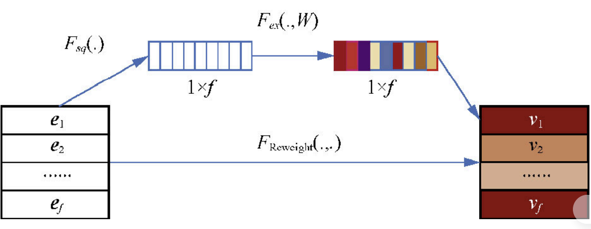


1. **Squeeze**（压缩），**将每个Field Embedding压缩成一个代表数字**，压缩函数用$F_{eq}$表示，例如Average Pooling，压缩后得到\( \boldsymbol{Z} = \left[ z_1, z_2, \cdots, z_f \right] \)​ 
   $$
   z_i = \text{F}_{\text{sq}} \left( \boldsymbol{e}_i \right) = \frac{1}{k} \sum_{j=0}^{k-1} \boldsymbol{e}_i \left[ j \right]
   $$

2. **Excitation**，**将压缩得到的向量喂入一个小网络$F_{ex}$​**，比如一个两层的全连接网络，
   $$
   \boldsymbol{A} = \text{F}_{\text{ex}} \left( \boldsymbol{Z} \right) = \sigma_2 \left( W_2 \sigma_1 \left( W_1 \boldsymbol{Z} \right) \right) 
   $$
   第一层相当于让所有的Field Embedding相互交叉，第二层将输出映射回f维向量，得到的A反映了每个Field Embedding的**重要程度**。

3. **Reweight**，将**权重向量A与原始输入相乘代替原始特征**。


在**用户侧和物料侧各放置一个SENet**，使**信息在流进塔之前先被增强或过滤**。


另一种思路考虑到**信息在塔中向上流动的过程是一个信息被压缩的过程，不可避免地会带来信息的损失，因此可以让重要的信息抄近路走捷径，直接送到离最终点积交叉更近的位置**。

抄近路的一个方案是**把每个中间层的的输入都送到最后一层，与最后一层的输出拼接为一个大向量，再经过一层FC压缩得到最后的用户/物料向量**。


另一个方案是**将重要信息不仅接入最后一层还要插入各个中间层，这样重要信息就不会因为在塔中的传播路径太长而损失**。

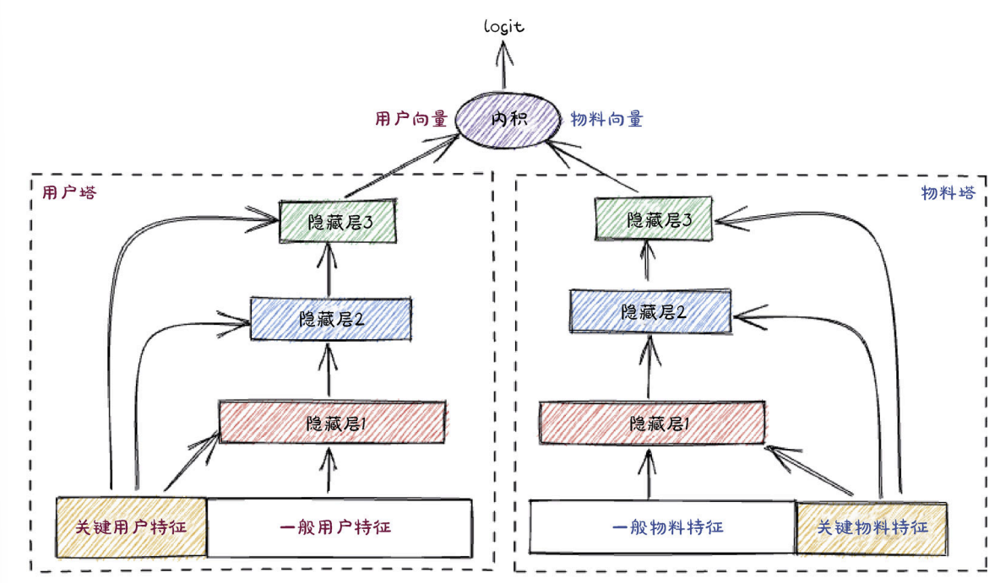

抄近路也有**缺点**，**额外接入的信息会导致该层需要训练存储更多的参数**。


最后一种思路，**对信息可以通过多种通道向上流动，不必执着于DNN，最后将各通道得到的Embedding聚合**。


《深度粗排在天猫新品中的实践》一文中提出一种**“双塔+FM”**的并联结构，如下所示

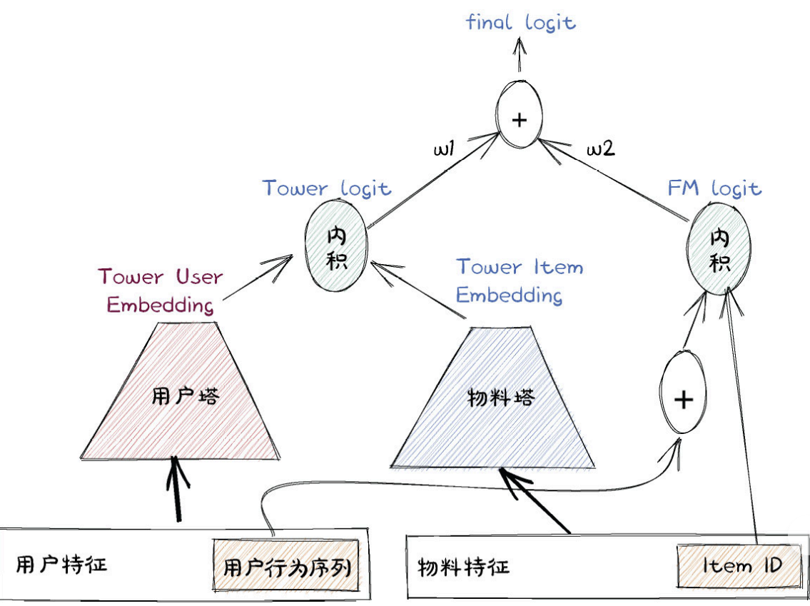


$$
\text{logit}_{\text{tower}} = \boldsymbol{UE}_{\text{tower}} \cdot \boldsymbol{TE}_{\text{tower}} \\

 \text{logit}_{\text{FM}} = \boldsymbol{E}_{ht_1} \cdot \boldsymbol{E}_{ct} + \cdots + \boldsymbol{E}_{ht_N} \cdot \boldsymbol{E}_{ct} = \left( \sum_{i=1}^{N} \boldsymbol{E}_{ht_i} \right) \cdot \boldsymbol{E}_{ct} = \boldsymbol{UE}_{\text{FM}} \cdot \boldsymbol{TE}_{\text{FM}} \\

\text{logit} = w_{\text{tower}} \text{logit}_{\text{tower}} + w_{\text{FM}} \text{logit}_{\text{FM}} \\
$$


为了方便预测把公式拆解为两个向量点积的形式
$$
\boldsymbol{UE} = \text{concat} \left( w_{\text{tower}} \boldsymbol{UE}_{\text{tower}}, w_{FM} \boldsymbol{UE}_{\text{FM}} \right) \\
 \boldsymbol{TE} = \text{concat} \left( \boldsymbol{TE}_{\text{tower}}, \boldsymbol{TE}_{\text{FM}} \right) \\

 \text{logit} = \boldsymbol{UE} \cdot \boldsymbol{TE} \\
$$
当**信息传递的通道越来越多**，这种**简单的拼接**会导致**聚合后的向量非常长**，给**计算**、**存储**带来较大的压力，一种常见的做法是，将拼接后的向量**再经过一层FC**，映射成一个**较短的向量**。此外还有一种**Attention Fusion**的方法。


## 蒸馏

精排可以通过**知识蒸馏**的方式向粗排传道授业，**提升粗排模型的表达能力**。


知识蒸馏涉及**两个模型**

+ 一个模型拥有**相对复杂的结构**，**喂入了更多的特征**，表达能力也能强，称为**Teacher**模型，用\( \text{F}_\text{t}(X; W_\text{t}) \)表示。因为**消耗的计算资源太大**，**无法满足在线预测的实时性要求**，或者**用到了在线根本无法拿到的特征，导致上线困难**。
+ 另一个模型**结构相对简单，特征也少**，称为**Student**模型，用 \( \text{F}_\text{s}(X; W_\text{s}) \)表示，**模型易于上线，实时性也好，但是能力不足**。


**知识蒸馏**可以**缓解Student模型能力不足的缺点**。


Student模型的**损失函数**由两部分组成

+ **拟合真实目标y**，表示为\( L_s(y, \text{F}_s(X; W_s)) \)
+ **拟合Teacher模型的输出**，表示为\( L_d(\text{F}_\text{t}(X; W_\text{t}), \text{F}_\text{s}(X; W_\text{s})) \)

最后Student模型的优化目标是，**最小化以上两种损失的加权平均**
$$
 \min_{W_s} (1-\lambda) \times L_s(y, \text{F}_s(X; W_s)) + \lambda \times L_d(\text{F}_t(X; W_t), \text{F}_s(X; W_s)) 
$$
训练完毕后，**只将Student模型部署上线**。


推荐系统中，**粗排作为Student，精排作为Teacher**，知识蒸馏除了能**提升粗排模型的表达能力**，还能**增强粗排、精排的一致性**。毕竟粗排的下游就是精排，如果挑选出的物料不符合精排的口味，那么粗排的努力就白费了。


一种在粗排实现知识蒸馏的方法是让**粗排、精排联合训练**，优化目标如下
$$
\min_{W_t, W_s} (1-\lambda) L_s(y, \text{F}_s(X; W_s)) + \lambda L_d(\text{F}_t(X, X^*; W_t), \text{F}_s(X; W_s)) + L_t(y, \text{F}_t(X, X^*; W_t)) 
$$

+ \( \text{F}_\text{s}(X; W_s) \) 代表Student，也就是粗排模型。
+  \( \text{F}_\text{t}(X, X^*; W_t) \) 代表Teacher，也就是精排模型。\( X^* \) 是粗排模型不能用、只能为精排模型所用的那部分交叉特征。 
+ \( L_s \) 和 \( L_t \) 代表普通的损失，让粗精排模型去拟合用户的真实反馈。 
+ \( L_d \) 代表蒸馏损失，要最小化粗精排得分的差距。


这种联合训练实现起来有以下困难：

+ 联合训练的模型**包括粗排和精排的参数**，**非常庞大**，**无法保证两个目标在更新同一参数时不会相互干扰**。
+ **粗排精排耦合在一起，维护更新时牵一发而动全身，不能灵活应对业务目标**。


联合训练的方式一般只适合**小团队**，大厂实际用的是**两阶段蒸馏法**——**线上有了正在运行的精排模型，而且精排模型的打分早已被记录在日志中，让粗排去拟合就好了**。
$$
L = \frac{1}{|B|} \sum_{(X_i, s_i, y_i) \in B} (1-\lambda) L_{\text{CTR}} \left( y_i, \text{F}_{\text{pr}}(X_i) \right) + \lambda L_{\text{Distill}} \left( s_i, \text{F}_{\text{pr}}(X_i) \right) 
$$

+ \( B \) 代表一个Batch，每条样本由输入特征向量 \( X_i \)、用户反馈 \( y_i \) 和精排打分 \( s_i \) 组成。
+  \( \text{F}_{\text{pr}} \) 代表粗排模型。 - \( L_{\text{CTR}} \left( y_i, \text{F}_{\text{pr}}(X_i) \right) \) 代表主损失函数，让粗排打分去拟合用户真实反馈 \( y_i \) 
+  \( L_{\text{Distill}} \left( s_i, \text{F}_{\text{pr}}(X_i) \right) \) 代表蒸馏损失函数，让粗排打分去拟合精排打分 \( s_i \)。


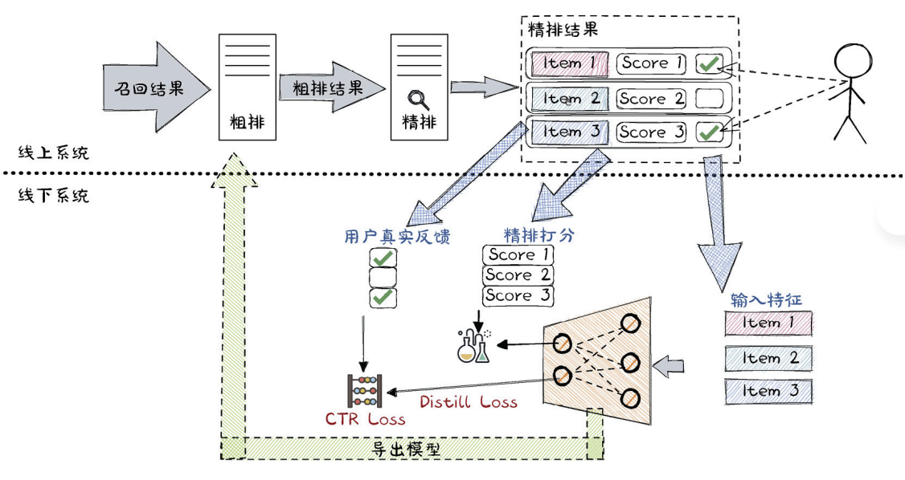


## 粗排纠正曝光

**传统的粗排模型**的**样本选择策略**与**精排**一致，用**点击过的物品当正样本**，**“曝光未点击”的物品做负样本**。这种策略下，**所有的样本都来自于曝光数据**，粗排**没有真正见识过**“**低质量**”物料，因此造成了**样本选择性偏差（SSB）**


为此，需要在**被精排排在后面，没有曝光机会的物料中选择一部分作为粗排的负样本**，步骤如下

1. 精排排序后，选择若干头部物品和尾部物品组成$S_{top}与S_{bottom}$
2. 将$S_{top}与S_{bottom}$中的物料俩俩配对，与当前用户u，组成一系列三元组\( T = \{(u_p, t_p, t_n)\}, \forall t_p \in S_{\text{top}}, \forall t_n \in S_{\text{bottom}} \)
3. 损失函数使用Pairwise，目标是\( \text{F}_{\text{pr}}(u, t_p) \gg \text{F}_{\text{pr}}(u, t_n) \)
4. 实践中，可以对$S_{top}$增加BCE loss


损失函数如下
$$
 L_{\text{pr}} = \frac{1}{|T|} \sum_{(u, t_p, t_n) \in T} L_{\text{LTR}} \left( \text{F}_{\text{pr}}(u, t_p), \text{F}_{\text{pr}}(u, t_n) \right) + \frac{\lambda}{|S_{\text{top}}|} \sum_{(u, t, y) \in S_{\text{top}}} L_{\text{CTR}} \left( \text{F}_{\text{pr}}(u, t), y \right) 
$$

+ \( \text{F}_{\text{pr}}(u, t) \) 是粗排模型对用户\( u \)和物料\( t \)之间匹配程度的打分。 
+  \( T \) 是按照上面介绍的步骤组成的三元组。 - \( L_{\text{LTR}} \left( \text{F}_{\text{pr}}(u, t_p), \text{F}_{\text{pr}}(u, t_n) \right) \) 是用Pairwise Loss建模精排结果的偏序关系。
+  \( S_{\text{top}} \) 是包含精排结果中的头部物料的那部分样本，它们得到了曝光机会，从而拥有用户真实反馈\( y \)。 
+ \( L_{\text{CTR}} \left( \text{F}_{\text{pr}}(u, t), y \right) \) 就是普通的CTR预估，让粗排打分拟合用户的真实反馈。


## 多目标排序模型

多目标排序属于**前期融合**，比后期融合准确度高，**线上做推理的代价大**，有n个物品就要做n次推理。

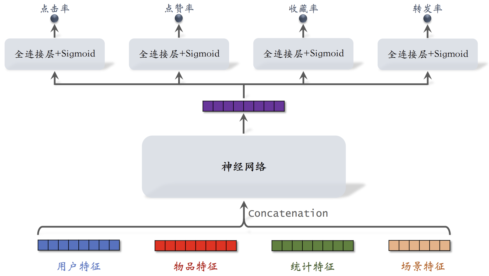


目标是点击/点赞/收藏/转发，如果有对应的行为，那么值就是1，反之为0。使用**交叉熵**计算每个指标的损失，最后汇总起来，做梯度下降。


模型中以**样本是否被点击过**来判断正负样本，系统中负样本的数量会**远远大于**正样本的数量，模型不应该把大量的时间花费到学习无用的负样本上，因此会对负样本做**降采样**——保留一小部分负样本，让两类样本数量平衡。


由于负样本减少，**预估出的点击率会大于真实点击率**，因此需要做预估值校准


**真实点击率：**
$$
p_{\text{true}} = \frac{n_+}{n_+ + n_-}
$$
**预估点击率：**
$$
p_{\text{pred}} = \frac{n_+}{n_+ + \alpha n_-}
$$
**校准公式：**
$$
p_{\text{true}} = \frac{\alpha \, p_{\text{pred}}}{(1 - p_{\text{pred}}) + \alpha \, p_{\text{pred}}}
$$

## Multi-gate Mixture-of-Experts MMoE

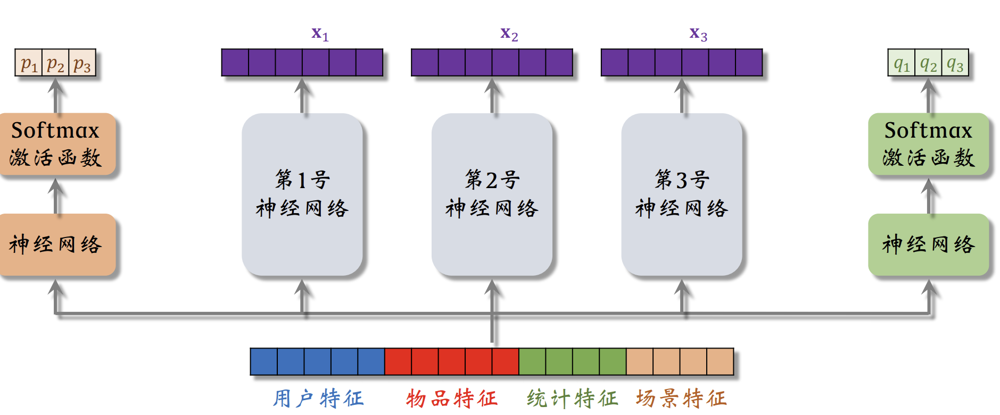

中间的神经网络被称为**专家**，它们不共享参数，专家的数量在不同的系统中不固定。


两侧的**神经网络和激活函数**用于求解一个**权重向量**，权重用于和专家的结果**加权平均**求解指标，用多少个指标就有多少个权重向量。

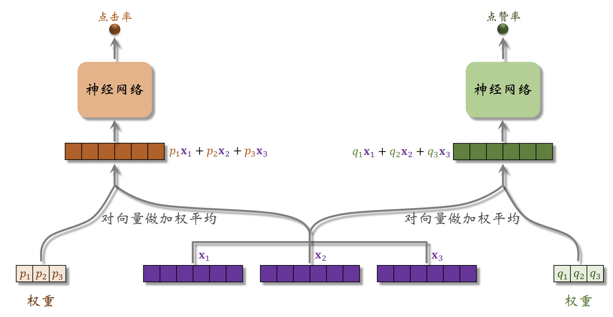


系统中的Softmax激活函数可能出现**极化现象**：**Softmax输出值中的⼀个接近1，其余接近0**。这会导致只有一个专家的推理结果被使用。


为了解决这个问题，**训练时对Softmax输出的每个向量值以10%的概率dropout**。	


## 视频播放建模

视频排序的依据额外包括**播放时长和完播率**。


实践证明，**直接用回归拟合播放时长的效果不好**，设关于播放时长的**全连接层**的输出为**z**，播放时长为**t**，定义$p = \frac{\exp(z)}{1 + \exp(z)}，y = \frac{t}{1 + t}$，**损失函数为 $CE(y, p) = y \cdot \log p + (1 - y) \cdot \log(1 - p)$。**在**预测**时输出**exp(z)**作为播放时长的指标。


完播率可以用**回归或者分类**方法求解。回归方法：如果视频长度为10mins，播放了6mins，那么完播率就是0.6，使用交叉熵函数拟合；分类，工程师**自定义**正负样本，如播放时间大于80%记为正样本。


得到**完播率后不能直接用于融分公式**，因为**长视频**的完播率显然低于**短视频**，需要做**调整**保证公平。


## 粗排三塔模型

**计算开销介于双塔模型和精排模型之间。**

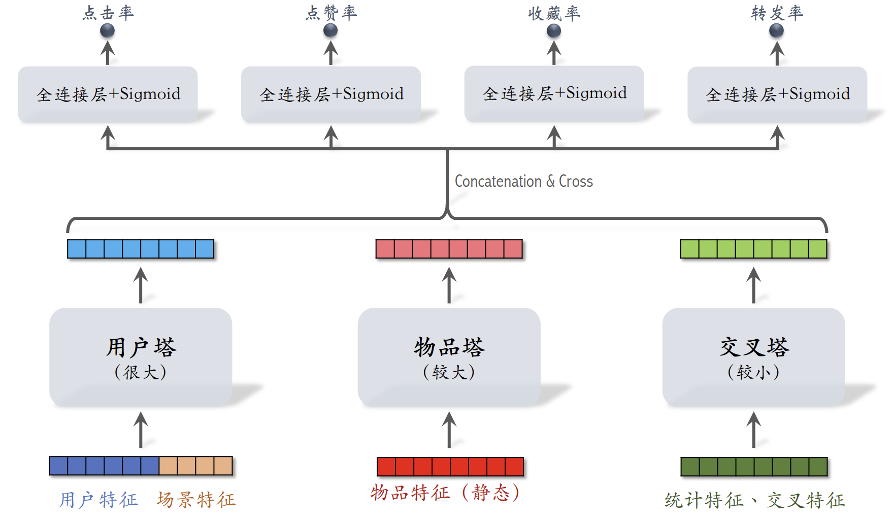

- 用户塔很大，线上只做一次计算。
- 物品塔较大，系统会**缓存**物品塔的输出，因此物品塔可以**避免大部分推理**。
- 交叉他较小，用于计算统计特征和交叉特征，有n个物品就要做n次推理。

模型的主要开销集中在**上层**


粗排阶段也考虑多样性，首先会将**兴趣分数最高**的200个物品送入精排，随后对剩下的物品计算多样性分数，取出其中**兴趣分数+多样性分数最高**的300个送入到精排。


# 交叉结构

要实现特征交叉，只依靠DNN这种**隐式交叉**是远远不够的，还应该加上**指定阶数**的显示交叉作为补充。

1. Wide & Deep就是用**一阶LR**作为Deep侧的补充。 
2. DeepFM用FM实现**二阶交叉**作为Deep侧的补充。 
3. DCN可以指定**任意阶数**的显式交叉，作为Deep侧的补充。


## Factorized Machine FM

传统的线性模型中只能表示单个特征对目标的影响


$$
\hat{y} = w_0 + \sum_i w_i x_i
$$
如果加入**特征交互项**会带来巨大的计算量和存储开销，因为交叉特征矩阵是对称矩阵，所以FM将其拆解为**两个向量的内积**：
$$
\hat{y} = w_0 + \sum_i w_i x_i + \sum_{i<j} w_{ij} x_i x_j
$$
向量的每一项对应一个特征的Embedding

$$
w_{ij} = \langle v_i, v_j \rangle = \sum_{f=1}^{k} v_{i,f} v_{j,f}
$$
公式化简

$$
\begin{align*}
&\sum_{i=1}^n \sum_{j=i+1}^n \langle v_i, v_j \rangle x_i x_j \\
=&\frac{1}{2} \sum_{i=1}^n \sum_{j=1}^n \langle v_i, v_j \rangle x_i x_j - \frac{1}{2} \sum_{i=1}^n \langle v_i, v_i \rangle x_i^2 （所有的特征和减去对角线后除二） \\
=&\frac{1}{2} \left( \sum_{i=1}^n \sum_{j=1}^n \sum_{f=1}^k v_{i,f} v_{j,f} x_i x_j - \sum_{i=1}^n \sum_{f=1}^k v_{i,f}^2 x_i^2 \right) \\
=&\frac{1}{2} \sum_{f=1}^k \left( \left( \sum_{i=1}^n v_{i,f} x_i \right) \left( \sum_{j=1}^n v_{j,f} x_j \right) - \sum_{i=1}^n v_{i,f}^2 x_i^2 \right) \\
=&\frac{1}{2}\sum_f \Big[(\sum_i v_{if}x_i)^2 - \sum_i v_{if}^2 x_i^2\Big]
\end{align*}
$$


注意$v_i和v_j$是**同一个矩阵**的转置，使用向量内积大大**减小了参数的数量**，从$O(n^2)到O(nk)，k是自定义的向量维度$。


代码实现

```python
class FM(nn.Module):
    def __init__(self,num_features,num_factors):
        super(FM, self).__init__()
        # 整个公式分为
        self.linear=nn.Linear(num_features,1)
        self.v=nn.Parameter(torch.randn(num_features,num_factors))
    def forward(self,x):
        linear_part=self.linear(x)
        interaction_part=0.5*torch.sum(torch.pow(torch.mm(x,self.v),2)-torch.mm(torch.pow(x,2),torch.pow(self.v,2)),dim=1,keepdim=True)
        return linear_part+interaction_part
```


```python
import tensorflow as tf
from tensorflow.keras import layers,Model,initializers

class FM(Model):
    def __init__(self,num_features,num_factors):
        super(FM,self).__init__()
        self.linear=layers.Dense(1,use_bias=True)

        self.v=tf.Variable(
            initial_value=initializers.GlorotNormal()(shape=(num_features,num_factors)),
            trainable=True,
            dtype=tf.float32,
        )
    def call(self,x):
        linear_part=self.linear(x)

        xv=tf.matmul(x,self.v)
        xv2=tf.square(xv)

        x_square=tf.square(x)
        v_square=tf.square(self.v)
        xv_square_sum=tf.matmul(x_square,v_square)

        interaction_part=0.5*tf.reduce_sum(xv2-xv_square_sum,axis=1,keepdims=True)
        return linear_part+interaction_part


```


## Wide & Deep

Wide & Deep 网络由**浅层网络Wide与深层网络Deep**两部分组成

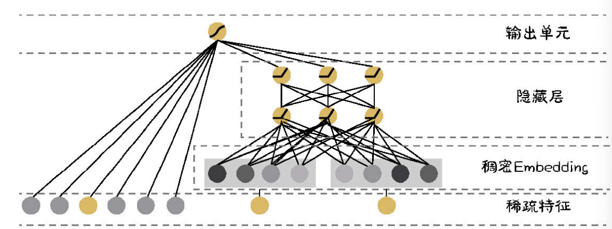


Deep侧遵循推荐模型的经典设计凡是：**Embedding+MLP**，将稀疏特征映射为稠密向量，再拼接为一个大向量输入到MLP中


**Deep侧对类别特征使用Embedding扩展它们的内涵，再加上DNN对特征进行高阶隐式求导，大大增强了模型的扩展性和推荐系统的多样性，有利于满足低频，小众，个性化的用户需求**。


Wide侧实际就是一个**LR**

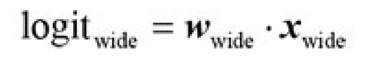

Wide侧发挥LR“**强于记忆**“的优势，把那些在训练数据中**高频大众**的模式牢牢记住，同时也用于**防止Deep 侧过度扩展而影响预测精度**，起到了类似**正则化**的作用。


Wide & Deep 中**Deep侧是主力**，Wide侧主要起到**查缺补漏**的作用，Wide侧的LR不必像单独使用时大而全，喂入其中的都是一些被先验知识认定为**非常重要的精华特征**，主要是一些人工设计的交叉，还有一些影响推荐系统的偏差特征。


模型最终的预测结果是


## DeepFM

Wide & Deep 中Wide侧主要喂入一些**手工设计的交叉特征**，**耗费精力并严重依赖工程师的经验**，为了解决这一问题，华为在**Wide侧增加了FM**，自动进行二阶特征交叉。

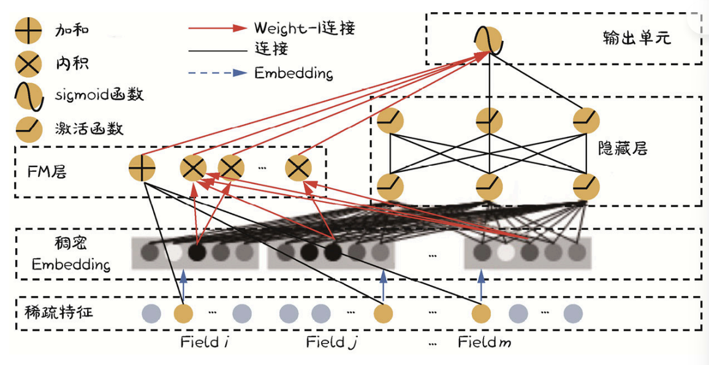

算法图比较迷惑，具体看公式，DNN层不变

$$y_{FM} = \langle w, x \rangle + \sum_{i=1}^d \sum_{j=i+1}^d \langle V_i, V_j \rangle x_i \cdot x_j$$， $$\hat{y} = sigmoid(y_{FM} + y_{DNN})$$


这里FM分解用到的V向量就是Embedding学习到的向量


## 深度交叉网络 DCN

召回和排序模型中的神经网络可以采用DCN，效果比使用全连接网络要好。**DCN是交叉神经网络和全连接网络组成的**

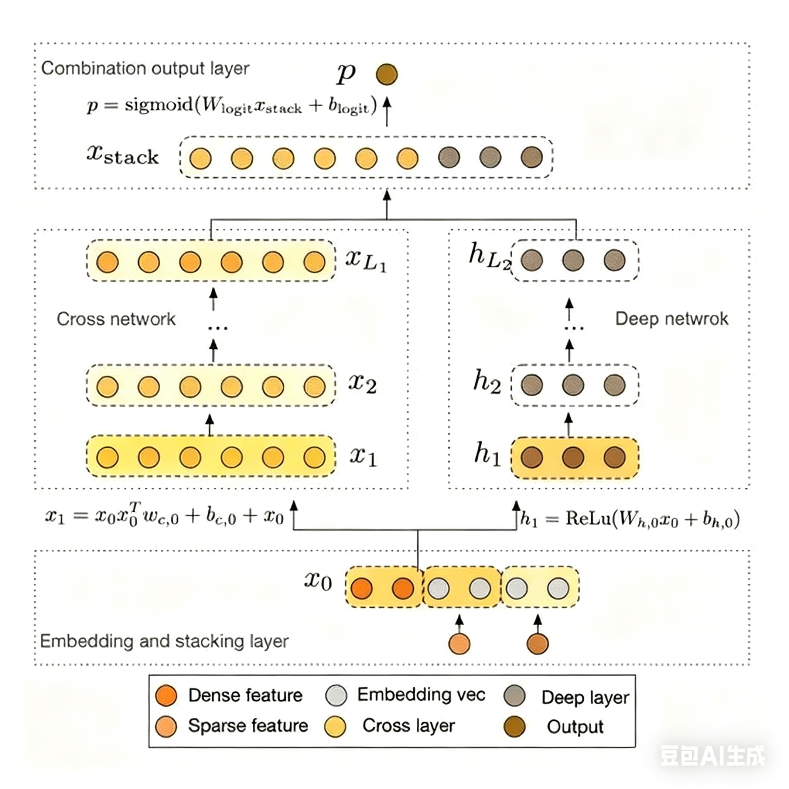


模型简化图如下


**Embedding and stacking layer**：对特征进行embedding然后拼接。


**Cross Network**：$$x_{l+1} = x_0 x_l^T w_l + b_l + x_l = f(x_l, w_l, b_l) + x_l$$，其中l是层数，$x_0$是第一层输入

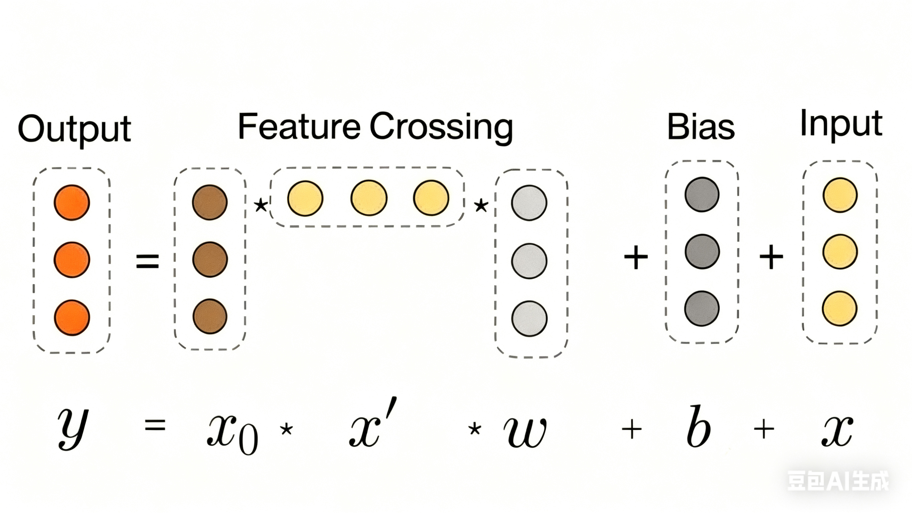


**Combination Layer**：需要先将 Cross Network 与 Deep Network 的结果进行 **Concatenation**, 输入到 LR 模型, 从而得到预测概率。

## SENet & Bilinear Cross

SENet对**特征加权**


假设有m个特征，经过**Embedding**后得到m个k维向量（**向量的大小可以不同**），经过平均池化，全连接+ReLU，全连接+Sigmoid后得到m维的**权重向量**，将权重向量的值**乘到[m,k]的输入对应行的每个元素上**得到加权后的结果。


特征交叉的方法有**内积和Hadamard乘积（逐元素相乘，不求和）**

 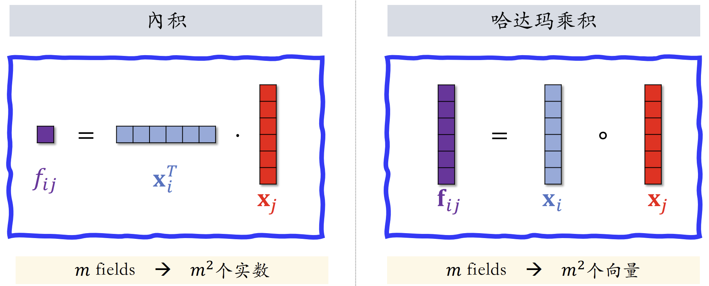


**Bilinear Cross是一种更先进的特征交叉方法，在上述两种方式上引入了额外的参数矩阵**


## FiBiNet

FiBiNet是**结合了Bilinear cross和SENet的模**

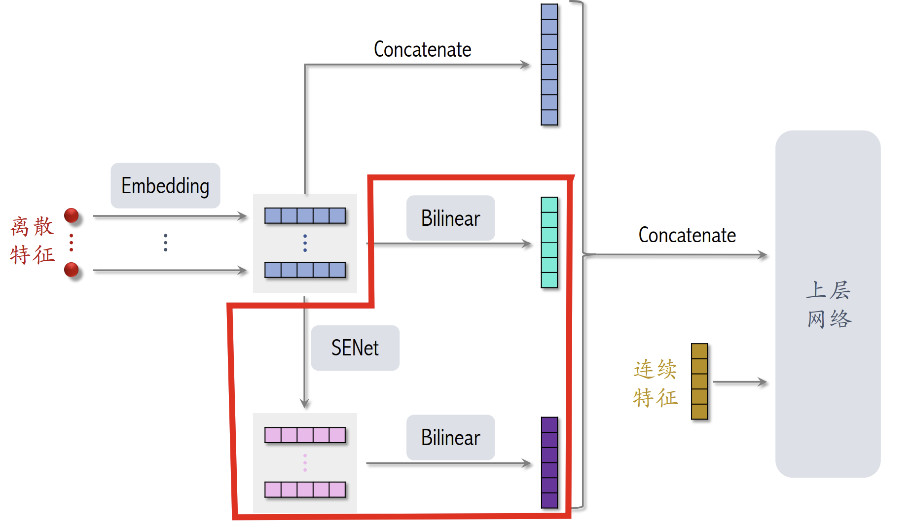


# 用户行为序列建模

## LastN特征

LastN特征是**用户特征**中的一种：**把用户最近交互过的N个物品ID做Embedding得到n个向量后取平均**。

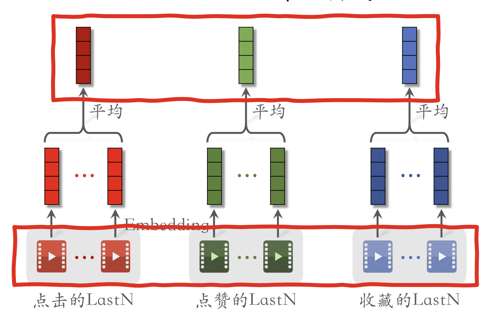

适用于**双塔模型，三塔模型，精排模型**，简单Pooling提取出的兴趣是固定的，**不能够随着候选物料的变化而变化**。

## Din模型

Din使用**加权平均**代替平均，即**注意力机制**，权重就是**候选物品与历史物料**间的**相似度**，因此从用户行为序列中提取出的兴趣向量会随当前**候选物料**的变化而**变化**。

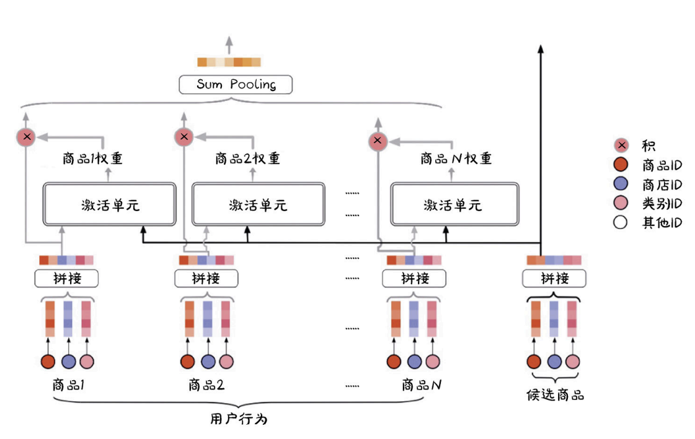


公式表述为：$$\text{UE}_{u,t} = \sum_{j=1}^N w_j h_j = \sum_{j=1}^N A(h_j, t) h_j$$

+ $\text{UE}_{u,t}$是User Embedding的缩写，下表表示拥护的兴趣向量取决于用户u对与候选物品t两方面信息
+ $$w_j = A(h_j, t)$$权重由当前候选无聊与历史物品的相似度决定


Din适用于**精排模型**，因为注意力机制需要用到**候选物品**，在**双塔和三塔模型中用户塔是看不到候选物品的**。


Din的一个缺点在于忽略了**行为序列内部各元素之间的依赖关系**，目前较为常用的对用户行为序列建模的方法是采用双层Attention。


第一层attention得到的每个新元素都**融合了原始序列中其他物料的信息**，然后进入到Din模型

## SIM模型

DIN模型的计算量与**N的大小**有关，因此只会保留最近的**几百个物品**，只会导致模型**关注短期兴趣，遗忘长期兴趣**。


SIM模型在DIN模型的基础上**保留更大的N**，计算时**快速排除**掉与**候选物品无关**的LastN物品，**降低计算量**。


SIM模型第一步做**查找**

+ **Hard Search，根据候选物品的类目，保留类目相同的即可，简单快速无需训练。**查找时不可能为每个候选物料把用户全部历史都遍历一遍，为了加速这一过程，阿里巴巴设计了了**User Behavior Tree**（UBT ）数据库，**将每个用户的长期行为序列分门别类地缓存起来**。
+ **Soft Search，物品做Embedding，把候选物品做query，使用K近邻查找。效果更好，但是实现更复杂。**


接下来**计算相似度做加权平均**。

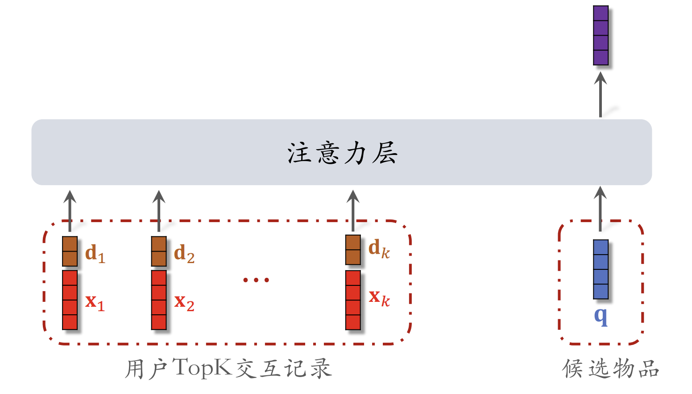


实现中，会将LastN物品与**交互时间的Embedding向量**拼接，因为SIM记录用户的**长期行为**，时间越久远重要性越低。


# 多样性

重排的主要目的不是过滤和筛选， 而是**调整精排结果的顺序**，将相似内容**打散**，以保证用户在一屏之内看到的推荐结果丰富而多样。

## 多样性的度量

基于**物品属性**标签。

- 类目、品牌、关键词……，以类目为例，计算出多级类目的**相似度后做加权和**，权重按照**经验**设置


基于物**品向量**表征。

- **用召回的双塔模型学到的物品向量（不好）**，由于物品具有**长尾特征**，**物品塔不能很好的学到物品的表征**。
- **基于内容的向量表征（好）**。使用**CV和NLP**的技术提取**物品内容**的特征与其他物品计算相似度，但是这一过程**缺少标注数据**无法训练网络。目前主要通过**CLIP**预训练方法——**对于图片和文本的二元组，预测图文是否匹配**。

​                           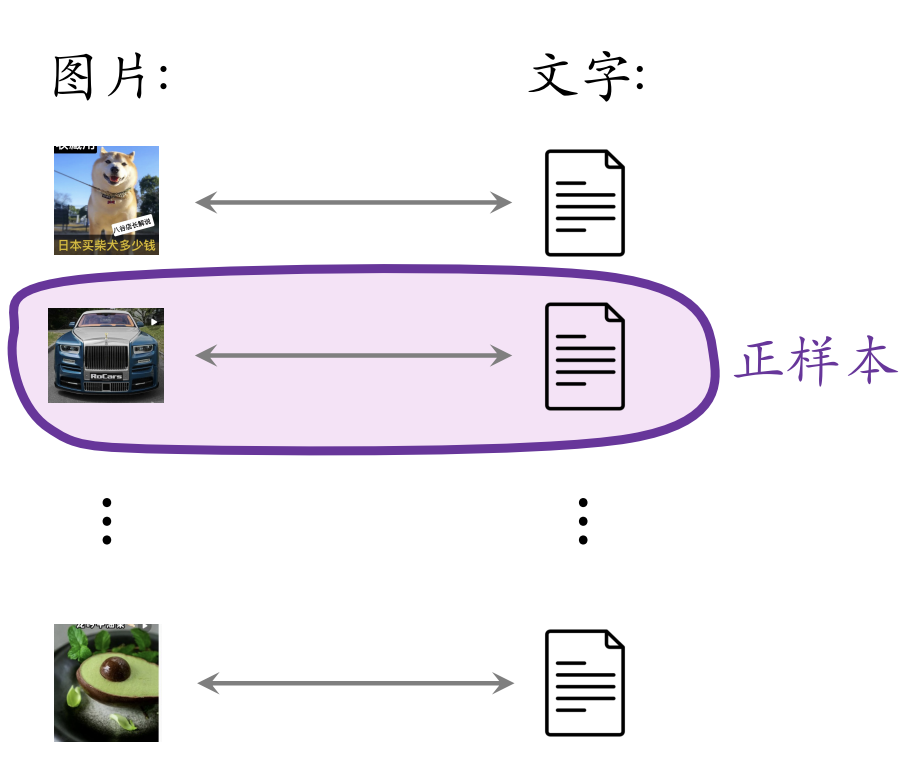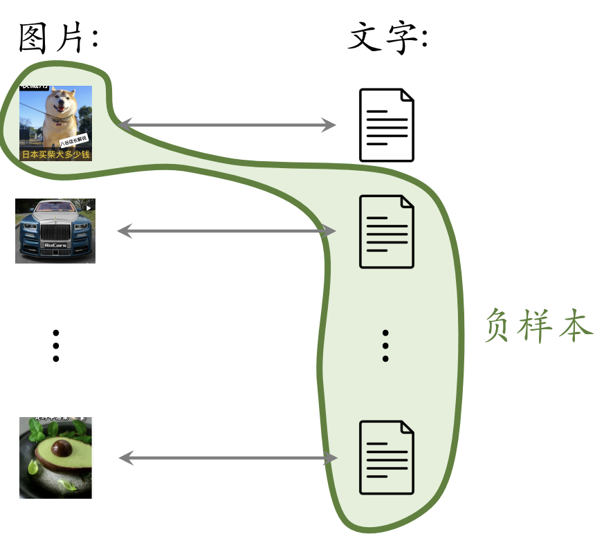


多样性算法用在**排序的后处理**中，精排的后处理称为**重排**。

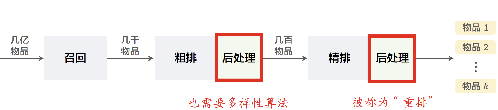


## Maximal Marginal Relevance MMR

从精排的物品中选出具有多样性的k个物品，那么既要考虑**精排分数**也要考虑**相似度分数**。


MMR定义公式


其中S是**已选中物品的集合**，每一轮在**未选中物品**中取出**MR分数最大**的物品作为已选物品。


实际应用中，随着S集合的**增大**，物品的相似度必然会**趋近1**，MMR就会失效。因此将S换为**最近选出的W个物品**，用**滑动窗口**维护，直观上理解——第30个物品没必要和第1个物品保证不相似。

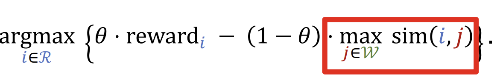


## 重排规则

+ 最多连续出现K个同类物品
+ 每K个物品最多出现1个推广的物品
+ 前t个物品最多出现k个同种物品


重排会**结合MMR与规则**，在满足规则的前提下**最大化MR分数**，每一轮会提取出满足规则的选物品，再用公式计算分数。	


## DPP

一组向量 **$\mathbf{v}_1, \cdots, \mathbf{v}_k \in \mathbb{R}^d$** 可以确定一个 **$k$ 维超平行体**（二维中是平行四边形，三位中是平行六面体）：
$$
\mathcal{P}(\mathbf{v}_1, \cdots, \mathbf{v}_k) = \{ a_1 \mathbf{v}_1 + \cdots + a_k \mathbf{v}_k \mid 0 \le a_1, \cdots, a_k \le 1 \}.
$$
要求**k<=d**，因为三维空间中可以有二维超平形体，但反过来不行。


如果向量之间**线性相关**，那么超平形体的体积为**0**。把**物品表征为向量**，它们形成的**超平形体的体积**可用于**衡量多样性**——**体积越大，多样性越好**。


将向量组成**矩阵**，那么**体积可以用矩阵的行列式**表示：$\det(V^{T}V) = \operatorname{vol}(\mathcal{P}(\mathbf{v}_1, \cdots, \mathbf{v}_k))^2.$

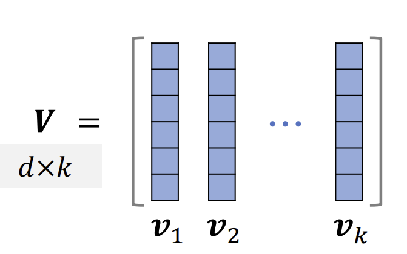


**DPP**，行列式点过程，在候选集中选出**相似度不高**的子集
\[
\underset{S: |S| = k}{\text{argmax}} \log \det(V_S^T V_S)
\]

Hulu将DPP应用到推荐系统中
\[
\underset{S: |S| = k}{\text{argmax}} \theta \cdot (\sum_{j \in S} \text{ reward}_j) + (1 - \theta) \cdot \log \det(A_S)
\]
设A为\(k \times k\)的矩阵，它的\((i,j)\)元素为\(a_{ij} = \boldsymbol{v}_i^T \boldsymbol{v}_j\)，给定k个d维的向量，计算矩阵A需要**O($k^2d$)**的时间。


想要找出**集合S**是一个**NP-hard**的问题，只能通过**贪心算法**近似求解，**每一轮从未选物品中找出一个分值最大的物品作为已选物品**，候选物品添加到矩阵A中就是**多出一行和一列**。
$$
\underset{i \in \mathcal{R}}{\text{argmax}} \ \theta \cdot \text{reward}_i + (1 - \theta) \cdot \log \det(\boldsymbol{A}_{\mathcal{S} \cup \{i\}})
$$
上述公式中，**计算行列式需要O($n^3$)**，一轮要遍历R个物品，一共要选出K个，那么时间复杂度近似
$$
O(|\mathcal{S}|^3 \cdot |\mathcal{R}| \cdot k) = O(nk^4)
$$


最后总的时间复杂度为**$$O(n^2d + nk^4)$$**


推荐系统的重排时间一般只有10ms，对于上述系统的时间复杂度显然**超出**，Hulu提出利用**Cholesky分解**加速计算，仅需 **\(O(n^{2}d + nk^{2})\)** 的时间。Cholesky分解**$\boldsymbol{A}_{\mathcal{S}} = \boldsymbol{L}\boldsymbol{L}^T$**，其中 $\boldsymbol{L}$ 是**下三角矩阵**。$\boldsymbol{A}_{\mathcal{S}}$ 的行列式为 **$\det(\boldsymbol{A}_{\mathcal{S}}) = \det(\boldsymbol{L})^2 = \prod_i l_{ii}^2$**，添加一个物品的变换可以**快速反应**在$\boldsymbol{L}$上。


DPP也使用**滑动窗口**并可以**结合规则**使用。


# 物品冷启动

## 评价指标

冷启动：**系统缺乏足够的信息，无法给用户或物品提供有效的推荐。**


冷启动是推荐系统中**比较复杂**的部分，其考察的指标比其他部分要**多**

+ 作者测指标，目标是促进发布，增大内容池
  + 发布渗透率，当日发布人数/日活人数
  + 人均发布量，当日发布笔记数/日活人数
+ 用户侧指标
  + 新物品的消费指标，点击率交互率，按照曝光数区分
  + 大盘消费指标，系统总体的消费时长和日活，月活
+ 内容侧指标
  + 高热物品占比


## 简单的召回通道

**ItemCF**不适用于物品冷启动，因为新物品**缺少用户交互**。


新物品的**ID Embedding还没学好**，导致**双塔模型**的效果不好，在实现中有两种改进方案

+ **所有新物品共享一个default Embedding**
+ 查找内容**最相似**物品，取**曝光量最高**，对这些物品的**Embedding取平均**作为新物品的Embedding


类目召回，**系统维护类目->物品列表(按时间倒序)**，用类目索引召回**最新的笔记**。与之类似的还有**关键字召回**。这两种召回方法的缺点在于：**只对刚刚发布的物品有效，弱个性化，不够精准。**


## 聚类召回

**聚类索引**：一个物品发布时，用神经网络映射到特征向量，**从聚类中心中找到最相似的cluster**，将该物品添加到**cluster->物品ID列表中(按时间倒排)**


线上召回时：给定用户ID，取回**last-n**物品作为种子笔记，每个种子笔记映射到向量并找出**最相似的cluster**，取回其中**最新的m个物品**。


模型如下

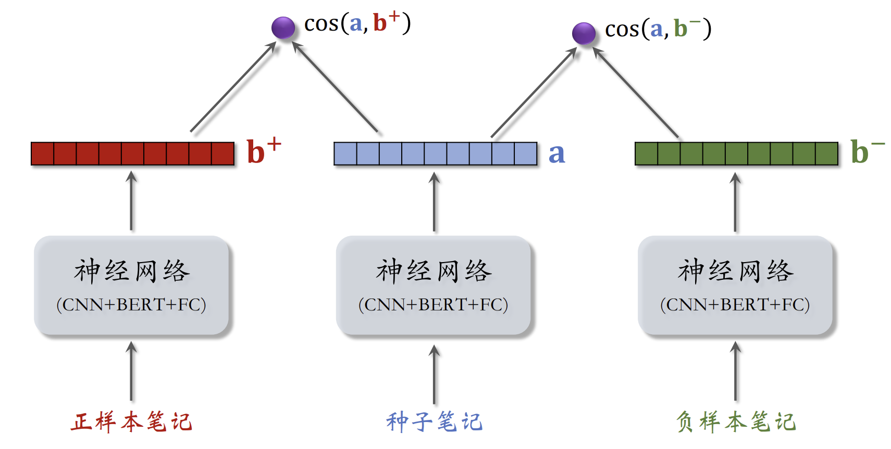


神经网络**共享参数**，接受物品的**图文**内容，要求**种子物品和正样本相似度大，和负样本相似度小**，损失函数如下

Triplet hinge loss: $$L(\mathbf{a},\mathbf{b}^+,\mathbf{b}^-) = \max\{0, \cos(\mathbf{a},\mathbf{b}^-) + m - \cos(\mathbf{a},\mathbf{b}^+)\}.$$

Triplet logistic loss: $$L(\mathbf{a},\mathbf{b}^+,\mathbf{b}^-) = \log(1 + \exp(\cos(\mathbf{a},\mathbf{b}^-) - \cos(\mathbf{a},\mathbf{b}^+))).$$


其中正样本有两种来源：

1. **人工标注相似度**
2. **筛选出高曝光且二级类目相同的物品，用ItemCF选取最相似的物品**


负样本从**全体物品中随机选择**，需要满足物品质量高，内容丰富。


## Look-Alike人群扩散

Look-Alike最初是用于广告系统中的，通过用户画像筛选出对物品感兴趣的**少量种子用户**，再将物品**扩散到和种子用户相似的用户群体**上。

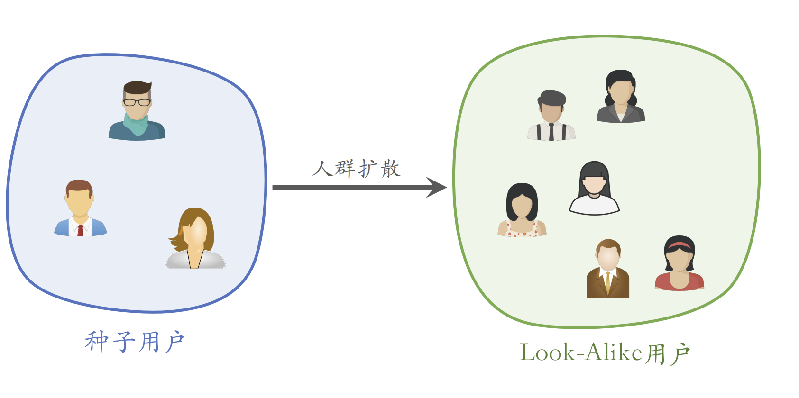


在推荐系统中，对于新物品，如果有**交互行为**则认为交互的用户属于该物品的**种子用户**，对**种子用户的ID Embedding取平均，作为物品的一个特征**。每当有用户交互，**更新**物品的特征向量。


特征会存储到**向量数据库**中，推荐时将用户的ID Embedding输入到数据库中做**最近邻查找**取回物品

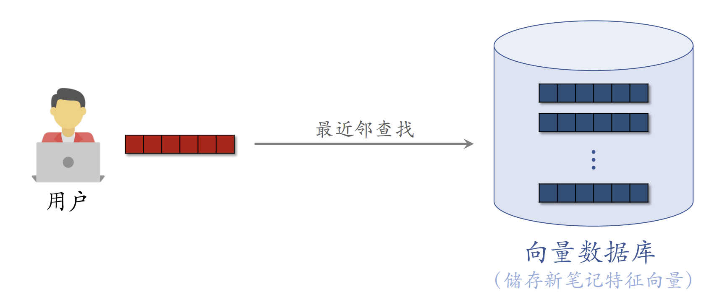


## 流量调控

对于新物品扶持可以**促进发布，增大内容池，挖掘优质物品**。


工业界中系统只会**推荐年龄<30天的物品**，对于**<=24小时**的物品**扶持使其曝光量大于1/30**。


流量调控的做法是**提权**，干涉**粗排和重排**环节，给新物品提权。这是一种**容易实现且投入产出比好**的方法，但是**提权系数不好调控**，很难控制曝光量容易造成过度曝光或不充分曝光。


**保量**：**不论笔记质量高低，都保证24小时内获得100次曝光**，在原有的提权系数上**乘以额外的系数**，该系数通过**目标时间，目标曝光量，发布时间，发布曝光量**计算，最终形式如下。达到了曝光目标后和旧物品做**公平竞争**。


**保量的提权系数也不好做**，同时线**上环境变化**会引起提权系数的**重调**。


注意，采用保量时，不能调整权重系数为**一个非常大的数**快速到达目标曝光量，这会导致物品被推荐给**不合适**的用户，使得**物品的数据(点击率，点赞率)偏低，最终物品会收到系统打压，无法称为热门物品**。


**差异化保量**：不同的物品有**不同的指标**，优质的物品获得**更高的保量指标**。可以用多模态，或作者的历史数据来判断内容的好坏。


## AB测试

冷启动的AB测试需要考虑两个指标——**作者侧指标和用户侧指标**


用户侧指标观察到的diff推全后不准确。

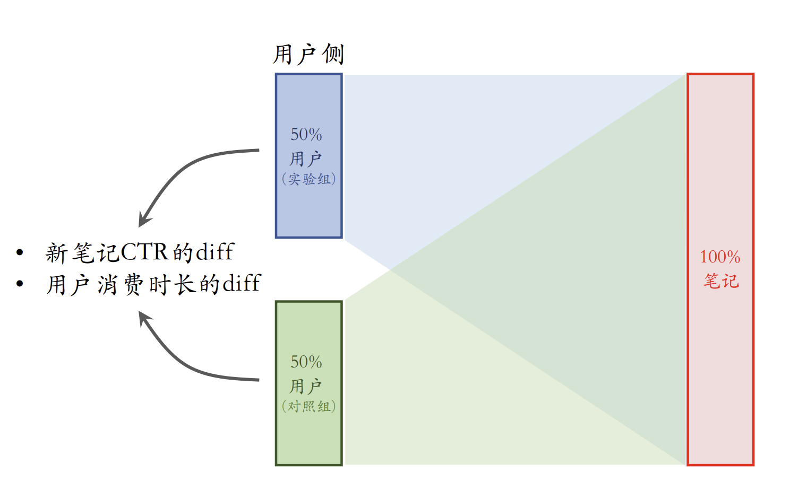


作者侧指标

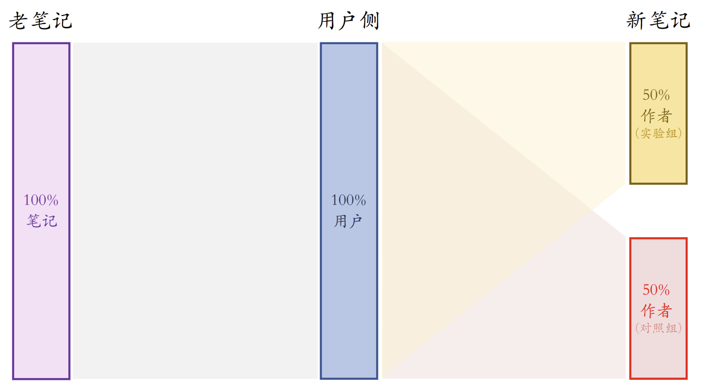

- **假设新老笔记走不同的流量通道，增大实验组权重时，会导致新老笔记间竞争流量，推全后结果不准确**
- **假设行老笔记自由竞争，不仅会出现上述问题，新老笔记间也会竞争。**


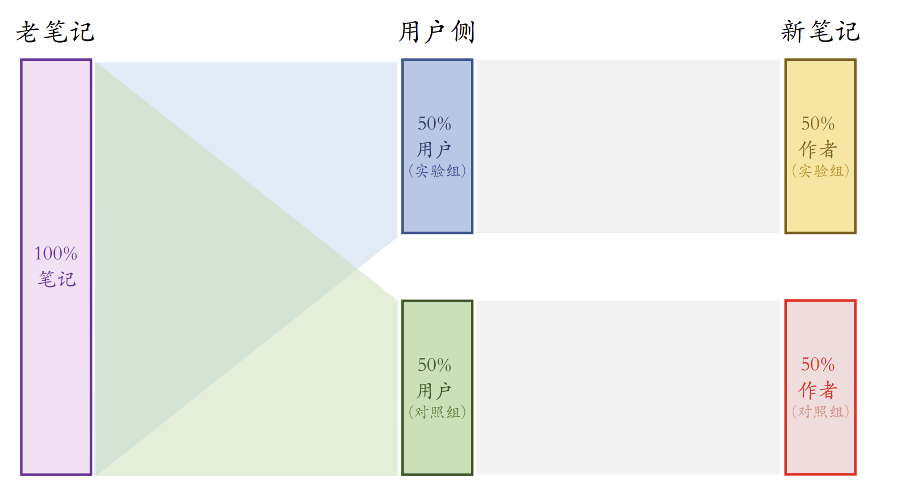

上述方案中，虽然**新物品不会抢流量**，但是**新老物品**依然会抢流量，同时**物品池小了一半**会导致用户侧指标下降。


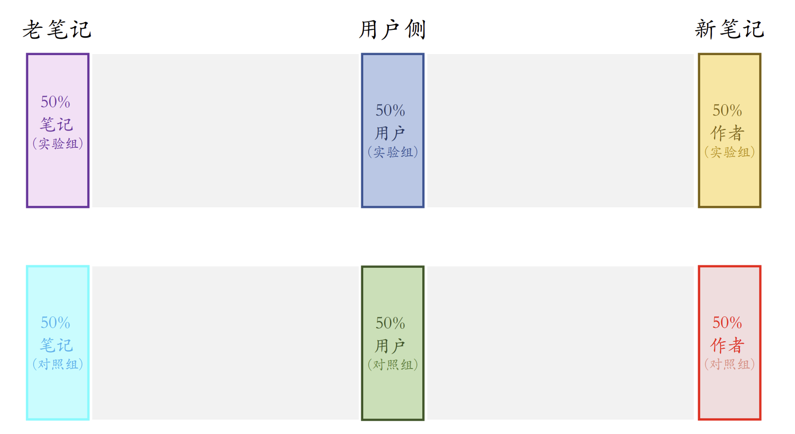

不会出现抢流量的情况，但是物品池减小的问题没有解决。


# 涨指标的方法

## 评价指标

**日活用户和留存**是最核心的指标，**UGC**的应用会将**发布量和发布渗透率**也作为核心指标。


工业界常用**LT7和LT30**衡量留存，LT7指的是用户在某一天登陆了应用，**包括这一天的未来一周内的登录次数/7**就是用户这一天的LT7值。所有**用户LT7值的平均**就是系统某一天的LT7结果。


## 召回

推荐系统有几十条召回通道，召回总量是**固定**的，总量越大，指标越好，粗排计算量越大。


在召回方面可做的改进有：

1. **双塔模型**
   1. **优化正负样本**
   2. **优化网络结构**
   3. **优化训练方法**
2. **I2I(基于相似物品做召回)，使用多种计算相似度的方法做召回**
3. **添加小众的召回模型**


## 排序模型

排序模型的改进分为：

1. 精排模型的改进
   1. 基地加宽加深，计算量更大，预测更准确
   2. 做自动的特征交叉，Bilinear和LHUC
   3. 特征工程，添加统计特征和多模态特征
   4. 增加新的预估目标，加入到融分公式中
   5. 纠正position bias
2. 粗排模型的改进
   1. 使用更复杂的模型
   2. 蒸馏精排训练粗排，让二者更一致
3. 用户行为序列建模
   1. 增加序列长度
   2. 筛选方法
   3. 使用ID以外的特征
4. 在线学习
   1. 既做全量更新也做增量更新
5. 老汤模型(老模型泡的久，新模型暂时无法超过)
   1. 随机初始化网络层和Embedding层参数，比较两个模型的效果
   2. 用老模型的结果蒸馏新模型，加快新模型训练。


## 多样性

双塔模型的多样性

1. 线上做召回时，往**用户向量**中添加**随机噪声**，**用户兴趣越窄，噪声越强**。添加噪声使得召回的物品更多样，可以提升系统核心指标。
2. 用户的**LastN**向量中保留最近的r个，对**其余的n-r个随机抽样**(均匀或非均匀)，注入多样性，**提升召回的结果，同时n可以取得比较大**。


**U2I2I**中扩大用户**最近交互过的物品的范围**，按照**类目**做**非均匀取样**，让类目平衡。一方面，**类目更平衡，多样性更好**。另⼀方面， **n可以更大， 覆盖的类目更多**。


## 特殊人群

特殊人群指的是**新用户和低活用户**


对特殊人群要构造**特殊的内容池**，因为**特殊人群的行为很少，召回效果不好**

+ 根据物品获得的交互次数，交互率选择优质物品
+ 做因果判断，判断物品对人群留存率的贡献，根据贡献率选物品

内容池**定期更新**，**排除交互率低和失去时效性的物品**。通常使用双塔模型从特殊内容池里做召回，每个新用户需要单独的训练模型，老用户共享一个模型。


排序时**避免推送新物品和广告**给新用户，保证体验。


低活用户的人均点击量很小，没有点击就不会有进一步交互，因此在**融分公式**中**提高预估点击率的权重**。另外，会**保留**几个曝光坑位给**预估点击率最高**的物品。


排序模型需要改进，**不能用全体用户模型**，否则会有严重的偏差

+ **大模型+小模型**，用全体用户行为训练大模型，大模型预估p拟合用户行为y，用特殊用户行为训练小模型，小模型的结果p拟合大模型的残差y-p。对特殊用户，**结合大模型和小模型的预估p+q**。
+ 融合多个experts，类似MMoE
+ 大模型预估后**小模型做校准**，特殊用户在使用全体数据训练的大模型推理后，在小模型上输入**大模型的结果和用户特征**，拟合真实数据。


如果对每类用户群体**单独使用一个排序模型**，可以**提升短期指标，但是维护代价大，长期有害**。


## 用户的交互行为

用户的**交互行为**可以带来很大的价值。


关注，**如果一个用户关注的作者越多，那么平台对其的吸引量就越大**。用户的留存率(r)和他关注的作者数量(f)呈正相关，如果用户的f较小，那么平台要促进该用户关注更多的作者。


+ 在**融分公式**中添加一项**w(f)\*p**，其中p是模型预估出用户对候选物品的关注率，**w(f)是一个关于f递减的函数**，该指标可以促进用户关注作者。
+ 构建关注**内容池和召回通道**，内容池中物品的关注率高，**只对f较小的用户**使用该内容池。


被关注数(粉丝数)可以提升作者发布积极性，在融分公式中添加**w(fa)\*p**，其中p是预估关注率，**w(fa)是一个关于物品发布者粉丝数递减的函数**。


此外，挖掘**隐式关注关系**(经常看但未关注)也可以提升指标。


转发， **可以给平台带来站外流量**，同样在**融分公式中添加预估转发率乘权重的分数**，促进用户转发，但是转发率的权重要根据用户是不是**KOL**（外站大V，根据用户以往转发带来的流量判断），**如果是，则权重设置较高，反之接近于0**。


评论，融分公式中添加**评论率*与已有评论数量负相关的函数**。 


