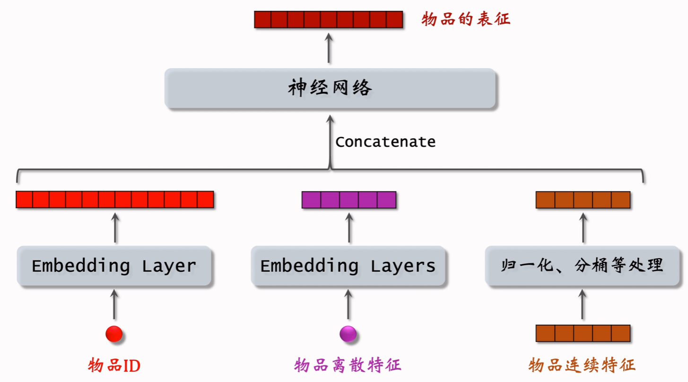
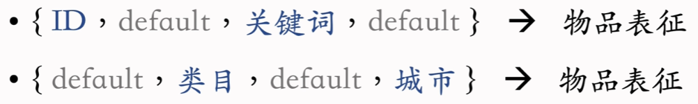
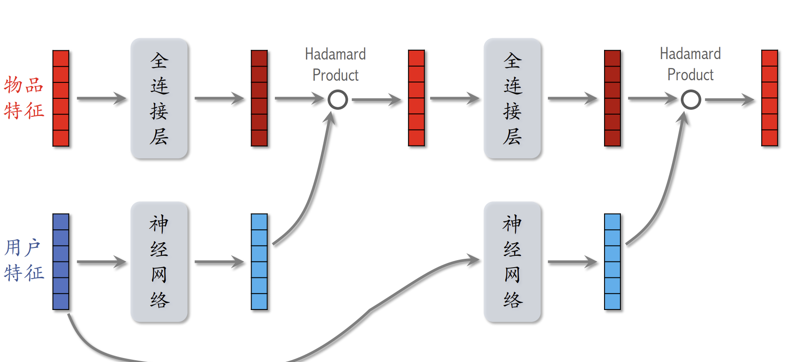

#  概要

## 推荐系统指标

**北极星指标**

- 用户规模：**日活用户数DAU**——一天内多次使用只算一次日活，**月活用户数MAU**——一月内登录多次使用只算一次月活。
- 消费：**人均使用推荐的时长，人均阅读笔记的数量**
- 发布：**发布渗透率，人均发布量**

## 实验流程

离线实验：收集**历史数据**，在历史数据上做**训练，测试**。**算法没有部署到产品中，没有跟用户交互。**

小流量AB实验：把**算法部署到实际产品**中，用户实际跟算法做**交互**。用户分为**实验组和对照组，实验组用新策略，对照组用旧策略**，比较实验组是否**优于**对照组，如果优于则可以**加大流量最终推全。**

## 推荐系统的链路

- 召回：用多条通道，取回几千篇笔记
- 粗排：用小规模神经网络给笔记打分，选出分数最高的几百篇
- 精排：用大规模神经网络，给几百篇笔记打分
- 重排：做多样性抽样，规则打散，插入广告和运营笔记

## A/B测试

AB测试考察**线上指标的影响，以及如何选取最优的参数**。

随机分桶，将用户ID用**哈希函数**映射为一个整数，分为多个桶，用户ID落在那个桶中就按照桶的策略做推荐。

一个公司中存在很多部门和团队，如果大家都需要做A/B测试，会导致**流量不够**，因此引入了**分层实验**。

分层实验：**同层互斥，不同层正交**。以召回层为例，两组召回层实验不能作用与一个用户身上，但是一个用户可以受到一个召回层和一个精排层的影响。

有的同类策略天然互斥，同类策略的效果可能会互相干扰。不同类型的策略通常不会相互干扰。

**Holdout**是一种考核**系统指标**的机制，**保留10%的用户完全不受实验影响**，可以考察整个部门对业务指标的贡献。

**实验推全**：当实验有效时，会**建立一个推全层**，与其他层正交。

反转实验：**在推全的新层中开一个旧策略的桶，长期观测实验指标**。该实验是为了解决在实验观测到**显著收益**后希望尽快**推全**新策略（为了腾出桶供其他实验使用或基于新策略做后续的开发），具有**滞后性**的指标，有**长期观测的**需求间的矛盾。

# 召回策略

## 基于物品的协同过滤 **Itemcf**

### 原理

物品之间的相似度基于物品的**重叠受众 **

如果考虑用户对物品的喜欢程度

### 流程

事先做离线计算

- **建立用户->物品的索引**
  - 记录每个用户最近点击，交互过的物品ID
  - 给定用户ID可与找出他近期感兴趣的物品
- **建立物品->物品的ID**
  - 计算物品之间的相似度
  - 对每个物品，索引其最相似的K个物品

线上做交互

1. **给定用户ID，通过用户->物品索引，找到用户最感兴趣的物品列表(last-n)。**
2. **对于last-n列表中每个物品，通过物品->物品的索引，找到top-k相似物品。**
3. **对于取回的nk个相似物品，用公式预估用户对物品的兴趣分数。**
4. **返回分数最高的100个物品，作为该召回通道的推荐结果。**

使用索引，离线计算量大，但是线上计算量小。

## Swing 召回

Swing是ItemCF的**变体**，ItemCF是基于用户重叠来计算相似度的，但是如果用户在一个**小圈子**中(微信群)，圈子中分享的物品被点击或点赞并非出于感兴趣，因此**两个不相干的物品会被错误的认为相似**。

Swing**给用户设置权重**，用户喜欢的物品重叠越多，越说明他们出于一个圈子，依次防止出现小圈子问题。

​								 

## 基于用户的协同过滤额 UserCF

### 原理

计算用户间的相似度，**越热门的物品对计算相似度帮助不大，不能反映出用户的兴趣**，因此需要对物品按照**热度**赋予一个权重。

### 流程

事先做离线计算

- **建立用户->物品的索引**
  - 记录每个用户最近点击，交互过的物品ID
  - 给定用户ID可与找出他近期感兴趣的物品
- **建立用户->用户的ID**
  - 计算用户之间的相似度
  - 对每个用户，索引其最相似的K个用户

线上做交互

1. **给定用户ID，通过用户->用户索引，找到最相似的k个用户top-k。**
2. **对于top-k列表中的用户，通过用户->物品的索引，找到last-n。**
3. **对于取回的nk个相似物品，用公式预估用户对物品的兴趣分数。**
4. **返回分数最高的100个物品，作为该召回通道的推荐结果。**

## 矩阵补充

### 原理

模型的输入为(用户ID，物品ID，兴趣分数)的集合，兴趣分数是系统记录的，如

+ 曝光但是没有点击，0分
+ 点击，点赞，收藏，转发，各算1分
+ 分数最低是0最高是4

**模型将物品ID和用户ID做embedding，映射为向量，两个向量的内积作为用户对物品的兴趣分数。**

让模型拟合观测的真实兴趣分数，**得到两个Embedding层的参数**，即一个矩阵，矩阵的**列**表示用户/物品。

数据集可以看作是给定了下述的矩阵，模型通过拟合得到其他位置的兴趣分数，最终做推荐。

矩阵补充的实践效果并不好

1. **没有利用物品和用户的属性**
2. **负样本的选取方式不对**
3. **做训练的方法不好，如损失的计算，使用内积**

### 线上召回

1. 训练得到的Embedding矩阵A和B，A中每一列是用户，B中每一列是物品。
2. 把矩阵A的列存储到**字典**中，B用**其他方式**存储。
3. 把**用户ID**作为key查找得到**用户向量a**
4. 第i号物品的embedding记作$b_i$，**返回能使内积<a,$b_i$>最大的k个物品**

最后一步中，如果枚举所有物品，**时间复杂度会正比于物品数量**，工业中一般采用**近似最近邻查找**，**最近邻的标准有欧氏距离，向量内积，余弦相似度**。

首先将物品**按照最近邻划分为多个区域**，每个区域用一个**向量**表示，同时**建立区域内点到向量的映射**。

接下来计算**用户向量与区域向量的距离**（取决于最近邻的标准），找出**最近**的向量；再计算该向量**区域内所有点与用户向量的距离**，得到最近的K个。

这些改进大大减小了枚举的次数。

## 双塔模型

### 原理

双塔模型可以看作是矩阵补充模型的**升级**版，双塔指的是**用户塔和物品塔**

输入考虑了物品和用户的属性

使用**余弦相似度**作为兴趣分数

在训练好神经网络参数后，**物品表征**事先存储在**向量数据库**中，**线上不做推理**，因为物品特征较为**稳定**。**用户特征**只需做一次**线上推理**。

推荐时按照**近似最近邻查找**，得到能与用户向量计算出距离最近的物品向量。

双塔模型属于**后期融合**——底层之前不对物品和用户特征做融合，线上计算量小。

### 训练

Pointwise：**独立看待每个正样本和负样本，做简单的二元分类**。对于正样本估计兴趣分数**接近1**，负样本则是**-1**，训练中正负样本的比例为**1:2或1:3**（经验）

Pairwise：**每次取一个正样本和负样本（两个样本共享神经网络参数）**，分别计算用户和正样本的余弦相似度和负样本的余弦相似度，**鼓励前者大于后者，且差越大越好**。

常用的损失函数有

Listwise：**每次取一个正样本和多个负样本**

计算出余弦相似度后用**Softmax**激活函数映射到0和1之间，**鼓励$S^{+}$为1，$S{-}$为0**

损失函数用交叉熵

### 正负样本

正样本的选取很简单，**使用曝光且有点击的物品**即可，需要**平衡**冷门物品和热门物品，对**前者过采样对后者降采样**。

负样本的来源有：没有被召回，被召回但是被排序截断，被曝光但是没有被点击。

简单负样本：

- 未被召回的物品大概率是用户不感兴趣的，同时**数量约等于全体物品**，，可以在**全体物品中抽样**作为负样本，每个样本**被抽取的概率与点击次数的0.75次幂成正比**，**目的是打压热门物品**。
- 按照**(用户，点击过的物品)**选取一个batch，batch中其他**n-1**个物品对于一个用户就是负样本。但是**一个物品出现在batch中的概率正比于它的点击次数**，如果按照batch的方法划分负样本，那么**物品成为负样本的概率正比于点击次数**，会导致**热门物品**成为负样本的概率**变大**。修正方法是在**训练时调整兴趣分数为**

困难负样本是**被排序淘汰的物品**	

训练时**混合两种样本，对半开**

**被曝光但是没有被点击不应该作为负样本**，它会导致模型效果下降，因为召回阶段是为了**区分不感兴趣和感兴趣的样本**，而不是**比较感兴趣的程度**，被曝光的物品已经属于比较感兴趣的物品了，甚至可以用作**正样本**，将其作为负样本不会带来效益。

### 模型更新

全量更新：在今天凌晨，用**昨天的数据在昨天的模型参数基础上做训练**，并更新**物品向量**。

增量更新：每隔**几十分钟**更新模型参数（**只更新ID Embedding参数**），需要**实时收集线上数据**。

一般系统会**结合使用**两种更新方式。

### 自监督

推荐系统的**头部效应**严重：少部分物品占据大部分点击，大部分物品的点击次数不高。**因此高点击物品的表征学的好，长尾物品的表征学得不好**。

为了更好的学习长尾物品的向量表征，对物品做**自监督学习**，训练物品塔

**同一物品**经过特征变换后从物品塔得到的特征向量应该有**高相似度**，**不同物品**的特征向量应该有**低相似度**。

特征变换的方法有：

+ Random Mask，**随机选取离散的特征置**为default，相当于丢弃
+ Dropout，对**多值离散特征**随机丢弃其中**50%**
+ Complementary，把特征随机分为**两组**，填充为 的形式
+ Mask关联的特征，**离线计算出特征间的互信息**，**随机选一个特征作为种子**，将**其和与其最相关的k/2个特征丢弃**。这种方法效果最好，但是方法复杂，实现难度大，不好维护。

训练模型时，从**全体物品中均匀抽样**，得到一个batch，做两类特征变换输出两组向量，每个物品的损失函数如下

最后做梯度下降最小化损失函数

对点击做随机抽样，对全体用户做均匀抽样得到两个batch，同时训练双塔和自监督

## Deep Retrieval

把物品表征为路径，线上查找用户最匹配的路径。

### 索引

下图中路径的深度为3，宽度为K

预先建立**物品到路径**和**路径到物品**的索引，两者都是**一对多**的关系

### 预估用户对路径的兴趣

对于路径[a,b,c]，输入用户特征x，经过神经网络和Softmax层得到p1，选择节点a；对节点a做**embedding**和用户特征**拼接**，输入到神经网络和Softmax中得到p2，选择其中的节点b...

最后的分数如下

### 线上召回

1. **给定用户特征，用beam search召回一批路径。**
2. **利用索引，召回一批物品**
3. **对物品打分和排序，选出一个子集，打分的方法不固定**

beam search是一种**贪心**思想，用于选取**最优**的路径，**但不保证最优**。

以beam size=4为例

**对第一层，选出分数最高的四个节点**

考虑从**四个节点出发**经过的**4K条路径**中**分数最大的4个**

从**上一步选择的节点出发**，找出分数最大的4条路径

### 训练

**同时学习神经网络参数和物品表征**

对于神经网络参数，只用正样本，即click(user,item)=1。将点击过的物品表述为多条路径，最大化用户对路径的分数

定义物品与路径的**相关性**

选出相关性**最大**的路径作为物品的表征

显然，要使物品表征出的**路径相关分数最大**，同时为了避免**过多的物品被一条路径表征**，引入正则项惩罚：**路径表征的物品数的4次幂**。

更新时，从未被选择的路径中，选出使损失函数和正则项和最小的最为新的路径。这一步理解不够

## 其他召回

**Geohash召回**，根据用户的**地理位置**召回，取回该地点**最新的K篇优质笔记**，**不考虑个性化**。

Geohash将**二维的经纬度坐标**转换为带有**前缀性质索引性质的一维坐标**。在一定程度上可以保证，两个Geohash的**公共前缀**越长，其所对应的区域就越近。

首先对经度纬度**二分**

- 第一轮：经度范围为 -180°~180°，可以拆分成 -180°~0° 以及 0°~180° 两部分，如果经度从属于前者，则令首个 bit 位取 0，否则令首个 bit 位取 1；
- 第二轮：-180°~0° 可以拆分为 -180°~-90° 和 -90°~0°，如果经度从属于前者，则令第二个 bit 位取 0，否则令第二个 [bit 位](https://zhida.zhihu.com/search?content_id=231481591&content_type=Article&match_order=4&q=bit+位&zhida_source=entity)取 1；0°~180° 可以拆分为 0°~90° 和 90°~180°，前者令第二个 bit 位取 0，后者令第二个 bit 位取 1
- 第 3 ~ N 轮：重复上述步骤的思路，最终递归二分，将经度表示成一个由二进制数字组成的字符串

将转换后的经纬度按照**经度字符串+纬度字符串依次交错排列**的形式组合，最后按照**5个一组划分**按**base32**规则映射，得到最后的字符编码。

**同城召回**，按照**城市**召回最新的K篇优质笔记，**不考虑个性化**。

**缓存召回**，**复用前n次推荐精排的结果**，因为缓存**有限**，需要**退场**机制。

此外还有作者召回。

### 曝光过滤&Bloom Filter

如果用户**看过**某个物品，则不再把该物品**曝光**给该用户。对于**每个用户记录曝光给他的物品(一定时间内)**，对于每个被召回的物品，判断它是否已经给该用户曝光过，**排除掉曾经曝光过**的物品。

**暴力对比**召回的物品是否在曝光记录中，会带来较大的**计算开销**。

Bloom Filter是一种**数据结构**，**判断一个物品ID是否在已曝光的物品集合中**。返回结果为**No**，那么**一定不在**；返回结果为**Yes**，该物品**可能在集合中**(有概率误判)。因此使用Bloom Filter**一定能过滤掉已曝光的物品，但是会导致未曝光的物品被剔除**。该结构的缺点在于，**不支持删除物品**。

Bloom Filter将**物品映射为m维向量**，使用**k个哈希函数**。初始化时，将**已曝光物品**使用**哈希函数**映射到m位上的k个位置，将这些位置设置为**1**，被**重复**映射的位置**忽略**。对被召回的同样使用k个哈希函数映射，如果**全部位置都为1**，说明该物品**被曝光**，反之未被曝光。

曝光物品集合大小为**n**，二进制向量维度为**m**，使用**k**个哈希函数	

人为设定可容忍的误伤概率后，有

# 排序

## 排序特征

- 用户画像：用户ID，人口统计学属性，账号信息，感兴趣的类目
- 物品画像：物品ID，发布时间，内容信息，类目，关键词
- 用户统计特征：用户不同时间段的/对不同类目的统计量
- 物品统计特征：物品不同时间段/按用户特征划分的统计量，发布者统计特征
- 场景特征：用户位置，当前时间，登录设备

物品特征**稳定**，用户特征**较为稳定**，统计特征**动态变化**。

## 多目标排序模型

多目标排序属于**前期融合**，比后期融合准确度高，**线上做推理的代价大**，有n个物品就要做n次推理。

目标是点击/点赞/收藏/转发，如果有对应的行为，那么值就是1，反之为0。使用**交叉熵**计算每个指标的损失，最后汇总起来，做梯度下降。

模型中以**样本是否被点击过**来判断正负样本，系统中负样本的数量会**远远大于**正样本的数量，模型不应该把大量的时间花费到学习无用的负样本上，因此会对负样本做**降采样**——保留一小部分负样本，让两类样本数量平衡。

由于负样本减少，**预估出的点击率会大于真实点击率**，因此需要做预估值校准

**真实点击率：**
$$
p_{\text{true}} = \frac{n_+}{n_+ + n_-}
$$
**预估点击率：**
$$
p_{\text{pred}} = \frac{n_+}{n_+ + \alpha n_-}
$$
**校准公式：**
$$
p_{\text{true}} = \frac{\alpha \, p_{\text{pred}}}{(1 - p_{\text{pred}}) + \alpha \, p_{\text{pred}}}
$$

### Multi-gate Mixture-of-Experts MMoE

中间的神经网络被称为**专家**，它们不共享参数，专家的数量在不同的系统中不固定。

两侧的**神经网络和激活函数**用于求解一个**权重向量**，权重用于和专家的结果**加权平均**求解指标，用多少个指标就有多少个权重向量。

系统中的Softmax激活函数可能出现**极化现象**：**Softmax输出值中的⼀个接近1，其余接近0**。这会导致只有一个专家的推理结果被使用。

为了解决这个问题，**训练时对Softmax输出的每个向量值以10%的概率dropout**。	

### 视频播放建模

视频排序的依据额外包括**播放时长和完播率**。

实践证明，**直接用回归拟合播放时长的效果不好**，设关于播放时长的**全连接层**的输出为**z**，播放时长为**t**，定义$p = \frac{\exp(z)}{1 + \exp(z)}，y = \frac{t}{1 + t}$，**损失函数为 $CE(y, p) = y \cdot \log p + (1 - y) \cdot \log(1 - p)$。**在**预测**时输出**exp(z)**作为播放时长的指标。

完播率可以用**回归或者分类**方法求解。回归方法：如果视频长度为10mins，播放了6mins，那么完播率就是0.6，使用交叉熵函数拟合；分类，工程师**自定义**正负样本，如播放时间大于80%记为正样本。

得到**完播率后不能直接用于融分公式**，因为**长视频**的完播率显然低于**短视频**，需要做**调整**保证公平。

### 粗排三塔模型

**计算开销介于双塔模型和精排模型之间。**

- 用户塔很大，线上只做一次计算。
- 物品塔较大，系统会**缓存**物品塔的输出，因此物品塔可以**避免大部分推理**。
- 交叉他较小，用于计算统计特征和交叉特征，有n个物品就要做n次推理。

模型的主要开销集中在**上层**。

# 交叉结构

## Factorized Machine FM

传统的线性模型中只能表示单个特征对目标的影响

$$
\hat{y} = w_0 + \sum_i w_i x_i
$$
FM在此基础上加入**特征交互项**，但用**向量内积**代替直接的交叉参数：
$$
\hat{y} = w_0 + \sum_i w_i x_i + \sum_{i<j} (v_i^\top v_j) x_i x_j
$$

使用向量内积大大**减小了参数的数量**。

## 深度交叉网络 DCN

召回和排序模型中的神经网络可以采用DCN，效果比使用全连接网络要好。**DCN是交叉神经网络和全连接网络组成的**

交叉神经网络由**交叉层**组成

Hadamard product是**逐元素相乘**

交叉神经网络结构如下

## LHUC网络结构

与DCN类似，但是只能用于**精排**，该网络结构最初是用于语音识别。

其中神经网络的结构是**多个全连接层+sigmod*2**

## SENet & Bilinear Cross

SENet对**特征加权**

假设有m个特征，经过**Embedding**后得到m个k维向量（**向量的大小可以不同**），经过平均池化，全连接+ReLU，全连接+Sigmoid后得到m维的**权重向量**，将权重向量的值**乘到[m,k]的输入对应行的每个元素上**得到加权后的结果。

特征交叉的方法有**内积和Hadamard乘积**

 

**Bilinear Cross是一种更先进的特征交叉方法，在上述两种方式上引入了额外的参数矩阵**

## FiBiNet

FiBiNet是**结合了Bilinear cross和SENet的模**

# 用户行为序列建模

## LastN特征

LastN特征是**用户特征**中的一种：**把用户最近交互过的N个物品ID做Embedding得到n个向量后取平均**。

适用于**双塔模型，三塔模型，精排模型**

## Din模型

Din使用**加权平均**代替平均，即**注意力机制**，**权重**就是候选物品与LastN物品间的**相似度**。

Din适用于**精排模型**，因为注意力机制需要用到**物品的特征**，在**双塔和三塔模型中用户塔是看不到物品的**。

## SIM模型

DIN模型的计算量与**N的大小**有关，因此只会保留最近的**几百个物品**，只会导致模型**关注短期兴趣，遗忘长期兴趣**。

SIM模型在DIN模型的基础上**保留更大的N**，计算时**快速排除**掉与**候选物品无关**的LastN物品，**降低计算量**。

SIM模型第一步做**查找**

+ **Hard Search，根据候选物品的类目，保留类目相同的即可，简单快速无需训练。**
+ **Soft Search，物品做Embedding，把候选物品做query，使用K近邻查找。效果更好，但是实现更复杂。**

接下来**计算相似度做加权平均**。

实现中，会将LastN物品与**交互时间的Embedding向量**拼接，因为SIM记录用户的**长期行为**，时间越久远重要性越低。

# 多样性

## 多样性的度量

基于**物品属性**标签。

- 类目、品牌、关键词……，以类目为例，计算出多级类目的**相似度后做加权和**，权重按照**经验**设置

基于物**品向量**表征。

- **用召回的双塔模型学到的物品向量（不好）**，由于物品具有**长尾特征**，**物品塔不能很好的学到物品的表征**。
- **基于内容的向量表征（好）**。使用**CV和NLP**的技术提取**物品内容**的特征与其他物品计算相似度，但是这一过程**缺少标注数据**无法训练网络。目前主要通过**CLIP**预训练方法——**对于图片和文本的二元组，预测图文是否匹配**。

​                           

多样性算法用在**排序的后处理**中，精排的后处理称为**重排**。

## Maximal Marginal Relevance MMR

从精排的物品中选出具有多样性的k个物品，那么既要考虑**精排分数**也要考虑**相似度分数**。

MMR定义公式

其中S是**已选中物品的集合**，每一轮在**未选中物品**中取出**MR分数最大**的物品作为已选物品。

实际应用中，随着S集合的**增大**，物品的相似度必然会**趋近1**，MMR就会失效。因此将S换为**最近选出的W个物品**，用**滑动窗口**维护，直观上理解——第30个物品没必要和第1个物品保证不相似。

## 重排规则

+ 最多连续出现K个同类物品
+ 每K个物品最多出现1个推广的物品
+ 前t个物品最多出现k个同种物品

重排会**结合MMR与规则**，在满足规则的前提下**最大化MR分数**，每一轮会提取出满足规则的选物品，再用公式计算分数。	

## DPP

一组向量 **$\mathbf{v}_1, \cdots, \mathbf{v}_k \in \mathbb{R}^d$** 可以确定一个 **$k$ 维超平行体**（二维中是平行四边形，三位中是平行六面体）：
$$
\mathcal{P}(\mathbf{v}_1, \cdots, \mathbf{v}_k) = \{ a_1 \mathbf{v}_1 + \cdots + a_k \mathbf{v}_k \mid 0 \le a_1, \cdots, a_k \le 1 \}.
$$
要求**k<=d**，因为三维空间中可以有二维超平形体，但反过来不行。

如果向量之间**线性相关**，那么超平形体的体积为**0**。把**物品表征为向量**，它们形成的**超平形体的体积**可用于**衡量多样性**——**体积越大，多样性越好**。

将向量组成**矩阵**，那么**体积可以用矩阵的行列式**表示：$\det(V^{T}V) = \operatorname{vol}(\mathcal{P}(\mathbf{v}_1, \cdots, \mathbf{v}_k))^2.$

**DPP**，行列式点过程，在候选集中选出**相似度不高**的子集
\[
\underset{S: |S| = k}{\text{argmax}} \log \det(V_S^T V_S)
\]

Hulu将DPP应用到推荐系统中
\[
\underset{S: |S| = k}{\text{argmax}} \theta \cdot (\sum_{j \in S} \text{ reward}_j) + (1 - \theta) \cdot \log \det(A_S)
\]
设A为\(k \times k\)的矩阵，它的\((i,j)\)元素为\(a_{ij} = \boldsymbol{v}_i^T \boldsymbol{v}_j\)，给定k个d维的向量，计算矩阵A需要**O($k^2d$)**的时间。

想要找出**集合S**是一个**NP-hard**的问题，只能通过**贪心算法**近似求解，**每一轮从未选物品中找出一个分值最大的物品作为已选物品**，候选物品添加到矩阵A中就是**多出一行和一列**。
$$
\underset{i \in \mathcal{R}}{\text{argmax}} \ \theta \cdot \text{reward}_i + (1 - \theta) \cdot \log \det(\boldsymbol{A}_{\mathcal{S} \cup \{i\}})
$$
上述公式中，**计算行列式需要O($n^3$)**，一轮要遍历R个物品，一共要选出K个，那么时间复杂度近似
$$
O(|\mathcal{S}|^3 \cdot |\mathcal{R}| \cdot k) = O(nk^4)
$$

最后总的时间复杂度为**$$O(n^2d + nk^4)$$**

推荐系统的重排时间一般只有10ms，对于上述系统的时间复杂度显然**超出**，Hulu提出利用**Cholesky分解**加速计算，仅需 **\(O(n^{2}d + nk^{2})\)** 的时间。Cholesky分解**$\boldsymbol{A}_{\mathcal{S}} = \boldsymbol{L}\boldsymbol{L}^T$**，其中 $\boldsymbol{L}$ 是**下三角矩阵**。$\boldsymbol{A}_{\mathcal{S}}$ 的行列式为 **$\det(\boldsymbol{A}_{\mathcal{S}}) = \det(\boldsymbol{L})^2 = \prod_i l_{ii}^2$**，添加一个物品的变换可以**快速反应**在$\boldsymbol{L}$上。

DPP也使用**滑动窗口**并可以**结合规则**使用。

# 物品冷启动

## 评价指标

冷启动：**系统缺乏足够的信息，无法给用户或物品提供有效的推荐。**

冷启动是推荐系统中**比较复杂**的部分，其考察的指标比其他部分要**多**

+ 作者测指标，目标是促进发布，增大内容池
  + 发布渗透率，当日发布人数/日活人数
  + 人均发布量，当日发布笔记数/日活人数
+ 用户侧指标
  + 新物品的消费指标，点击率交互率，按照曝光数区分
  + 大盘消费指标，系统总体的消费时长和日活，月活
+ 内容侧指标
  + 高热物品占比

## 简单的召回通道

**ItemCF**不适用于物品冷启动，因为新物品**缺少用户交互**。

新物品的**ID Embedding还没学好**，导致**双塔模型**的效果不好，在实现中有两种改进方案

+ **所有新物品共享一个default Embedding**
+ 查找内容**最相似**物品，取**曝光量最高**，对这些物品的**Embedding取平均**作为新物品的Embedding

类目召回，**系统维护类目->物品列表(按时间倒序)**，用类目索引召回**最新的笔记**。与之类似的还有**关键字召回**。这两种召回方法的缺点在于：**只对刚刚发布的物品有效，弱个性化，不够精准。**

## 聚类召回

**聚类索引**：一个物品发布时，用神经网络映射到特征向量，**从聚类中心中找到最相似的cluster**，将该物品添加到**cluster->物品ID列表中(按时间倒排)**

线上召回时：给定用户ID，取回**last-n**物品作为种子笔记，每个种子笔记映射到向量并找出**最相似的cluster**，取回其中**最新的m个物品**。

模型如下

神经网络**共享参数**，接受物品的**图文**内容，要求**种子物品和正样本相似度大，和负样本相似度小**，损失函数如下

Triplet hinge loss: $$L(\mathbf{a},\mathbf{b}^+,\mathbf{b}^-) = \max\{0, \cos(\mathbf{a},\mathbf{b}^-) + m - \cos(\mathbf{a},\mathbf{b}^+)\}.$$

Triplet logistic loss: $$L(\mathbf{a},\mathbf{b}^+,\mathbf{b}^-) = \log(1 + \exp(\cos(\mathbf{a},\mathbf{b}^-) - \cos(\mathbf{a},\mathbf{b}^+))).$$

其中正样本有两种来源：

1. **人工标注相似度**
2. **筛选出高曝光且二级类目相同的物品，用ItemCF选取最相似的物品**

负样本从**全体物品中随机选择**，需要满足物品质量高，内容丰富。

## Look-Alike人群扩散

Look-Alike最初是用于广告系统中的，通过用户画像筛选出对物品感兴趣的**少量种子用户**，再将物品**扩散到和种子用户相似的用户群体**上。

在推荐系统中，对于新物品，如果有**交互行为**则认为交互的用户属于该物品的**种子用户**，对**种子用户的ID Embedding取平均，作为物品的一个特征**。每当有用户交互，**更新**物品的特征向量。

特征会存储到**向量数据库**中，推荐时将用户的ID Embedding输入到数据库中做**最近邻查找**取回物品

## 流量调控

对于新物品扶持可以**促进发布，增大内容池，挖掘优质物品**。

工业界中系统只会**推荐年龄<30天的物品**，对于**<=24小时**的物品**扶持使其曝光量大于1/30**。

流量调控的做法是**提权**，干涉**粗排和重排**环节，给新物品提权。这是一种**容易实现且投入产出比好**的方法，但是**提权系数不好调控**，很难控制曝光量容易造成过度曝光或不充分曝光。

**保量**：**不论笔记质量高低，都保证24小时内获得100次曝光**，在原有的提权系数上**乘以额外的系数**，该系数通过**目标时间，目标曝光量，发布时间，发布曝光量**计算，最终形式如下。达到了曝光目标后和旧物品做**公平竞争**。

**保量的提权系数也不好做**，同时线**上环境变化**会引起提权系数的**重调**。

注意，采用保量时，不能调整权重系数为**一个非常大的数**快速到达目标曝光量，这会导致物品被推荐给**不合适**的用户，使得**物品的数据(点击率，点赞率)偏低，最终物品会收到系统打压，无法称为热门物品**。

**差异化保量**：不同的物品有**不同的指标**，优质的物品获得**更高的保量指标**。可以用多模态，或作者的历史数据来判断内容的好坏。

## AB测试

冷启动的AB测试需要考虑两个指标——**作者侧指标和用户侧指标**

用户侧指标观察到的diff推全后不准确。

作者侧指标

- **假设新老笔记走不同的流量通道，增大实验组权重时，会导致新老笔记间竞争流量，推全后结果不准确**
- **假设行老笔记自由竞争，不仅会出现上述问题，新老笔记间也会竞争。**

上述方案中，虽然**新物品不会抢流量**，但是**新老物品**依然会抢流量，同时**物品池小了一半**会导致用户侧指标下降。

不会出现抢流量的情况，但是物品池减小的问题没有解决。

# 张指标的方法

## 评价指标

**日活用户和留存**是最核心的指标，**UGC**的应用会将**发布量和发布渗透率**也作为核心指标。

工业界常用**LT7和LT30**衡量留存，LT7指的是用户在某一天登陆了应用，**包括这一天的未来一周内的登录次数/7**就是用户这一天的LT7值。所有**用户LT7值的平均**就是系统某一天的LT7结果。

## 召回

推荐系统有几十条召回通道，召回总量是**固定**的，总量越大，指标越好，粗排计算量越大。

在召回方面可做的改进有：

1. **双塔模型**
   1. **优化正负样本**
   2. **优化网络结构**
   3. **优化训练方法**
2. **I2I(基于相似物品做召回)，使用多种计算相似度的方法做召回**
3. **添加小众的召回模型**

