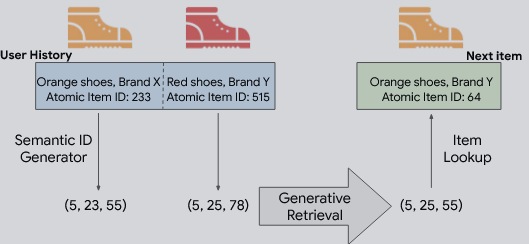

# Tiger

## 核心

Tiger中提出了**语义ID**，基于item内容信息（例如文本描述）构成的token序列。给定一个item地文本描述，使用**预训练的文本编码器**（SentenceT5）生成dense的embedding，而后应用量化方法对embedding进行处理，形成tokens的集合。

最后使用transformer模型自回归生成下一条item的语义ID，从而完成召回。

使用SID具有诸多优势：

+ **知识共享与泛化能力**：语义token让相似物品之间可以共享信息，同时减少反馈循环问题，使模型能处理新物品。
+ **缓解大规模问题**：通过token序列表示，可以用组合的方式表示大量物品，而无需为每个物品单独存储 embedding，从而节省内存。
+ **相比随机哈希的优势(降低物品表示空间)**：虽然随机哈希可以减小表示空间，但语义token提供了可解释性和更好的泛化能力，是更自然的选择。

# 结构

模型由两部分组成：一是**利用内容特征生成语义ID**——这包括将**item内容特征编码**为嵌入向量，并将该嵌入量化为语义码字元组。由此产生的码字元组被称为项目的语义ID。二是在**语义ID上训练生成式推荐系统**——使用语义ID序列，在序列推荐任务上训练Transformer模型。

## SID generation

语义ID定义为**一个长度为m的码字元组**，**元组中每个码字来自于不同的码本**，因此语义ID能唯一表示的物品数量等于各码本大小的乘积，输出的语义ID需要**满足相似的物品对应的语义ID应尽可能重叠**，例如，语义 ID 为 (10, 21, 35) 的物品，应比 ID 为 (10, 23, 32) 的物品，更接近 ID 为 (10, 21, 40) 的物品。

VQ（向量量化）的核心思想是**将一个连续的、高维的向量空间，映射到一个离散的、有限的码本空间中，即对任意一个输入向量在预设的码本字典里找到一个与之最相似的码字来代替它**。

VQ-VAE将这一思想整合进了标准的自编码器框架中，由三部分组成：

+ **编码器**：将输入数据x压缩为一个低维的连续潜在向量z
+ **量化器**：通过查找码本，将z替换为离它最近的码本向量z_q，这个查找操作时不可导的，因此引入了**编码器梯度直通（STE）**来解决反向传播梯度中断的问题
+ **解码器**：尝试将码本向量重建为原始输入x`

VQ-VAE通过优化一个**双重损失函数**来进行训练，一是最小化x和x`，二是引入量化损失让z和z_q相互靠近。

然而，VQ-VAE在处理高保真度数据时面临一个瓶颈：**若要精确表示复杂的输入，就需要一个极大的码本，这会带来巨大的计算和存储开销**。

RQ-VAE通过引入**残差量化**来解决这个问题，核心思想是**由粗到精的逐层逼近**。

+ **第一层量化**：与VQ-VAE相同，对原始潜在向量zₑ进行一次粗略的量化，得到第一个码字e_c₀。
+ **计算残差**：计算原始向量与第一次量化结果之间的残差`r₁ = zₑ - e_c₀`
+ **第二层量化**：不再对原始向量操作，而是对残差进行第二次量化，得到第二个码字e_c₁
+ **迭代**: 继续计算新的残差 `r₂ = r₁ - e_c₁`，并交给下一层处理。

这种方式极大地**提升了量化精度**，并自然地赋予了语义ID层次化的结构。

RQ-VAE的训练目标由一个统一的损失函数来定义，该函数同样由重建损失和量化损失构成：
$$
L = L_{\text{recon}} + L_{\text{vq}}
$$
其中，$L_{\text{recon}}$ 通常是输入 $x$ 与重建输出 $x_{\text{recon}}$ 的均方误差（MSE）。

而关键在于量化损失 $L_{\text{vq}}$，它由**每一层量化的损失累加而成**。对于单层量化，其损失 $L_{\text{vq\_layer}}$ 定义为： 
$$
L_{\text{vq\_layer}} = \|\text{sg}(z_e) - e\|^2 + \beta \cdot \|z_e - \text{sg}(e)\|^2
$$
 `sg`（stop-gradient，即代码中的 `.detach()`）保证梯度仅更新码本

+ **码本损失（Codebook Loss）**：用于约束编码器输出$z_e$接近对应的码本向量e
+ **承诺损失（Commitment Loss）**：防止编码器输出无限远离码本向量，促使编码器“承诺”使用码本。超参数 $\beta$（`commitment_cost`）用于调节这份“承诺”的强度。

Tiger使用RQ-VAE通过多层残差量化生成**层级化语义ID**，当**出现碰撞时追加额外的token**，例如两个物品的语义 ID 都为 (12, 24, 52)，则分别表示为 (12, 24, 52, 0) 和 (12, 24, 52, 1)。碰撞通过**维护语义ID->物品查表实现**，仅在训练完后执行一次。

## Generative Retrieval

为每个用户构建物品序列，将它们的交互按时间顺序排序。对于一个形式为$(\text{item}_1, \dots, \text{item}_n)$的序列，推荐系统的任务是预测下一个物品$\text{item}_{n+1}$

Tiger提出了一种生成式方法，直接预测下一个物品的语义ID。 

形式上，设$(c_{i,0}, \dots, c_{i,m-1})$为物品$i$的长度为$m$的语义ID，则将物品序列转换为如下 token 序列：$$(c_{1,0}, \dots, c_{1,m-1}, c_{2,0}, \dots, c_{2,m-1}, \dots, c_{n,0}, \dots, c_{n,m-1})$$ 然后用序列到序列（seq2seq）模型训练去预测$\text{item}_{n+1}$的语义ID，即$(c_{n+1,0}, \dots, c_{n+1,m-1})$。

