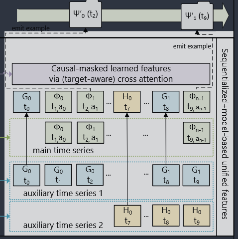

假设某用户有以下几类 **categorical / sparse 特征**：

1）**物品交互（变化快，最长）**\
这是主时间序列

```
t1: 点击 item_A
t2: 点击 item_B
t3: 点击 item_C
t4: 点击 item_D
t5: 点击 item_E
```

2）**城市（变化慢）**

```
t0–t3: 北京
t4–t5: 上海
```

3）**使用语言（几乎不变）**

```
t0–t5: 中文
```

4）**关注的创作者（偶尔变化）**

```
t1–t2: 关注 creator_X
t3–t5: 关注 creator_X, creator_Y
```

***

### Step 1：选主时间序列

选 **item 交互序列** 作为主干：

```
[item_A, item_B, item_C, item_D, item_E]
```

***

### Step 2：压缩慢变化特征

只保留**连续不变区间的最早一次出现**：

*   城市 →

<!---->

```
t0: 北京
t4: 上海
```

*   语言 →

<!---->

```
t0: 中文
```

*   创作者 →

<!---->

```
t1: creator_X
t3: creator_Y
```

***

### Step 3：合并进主序列（按时间插入）

得到统一的序列（示意）：

```
t0: 城市=北京
t0: 语言=中文
t1: item_A
t1: creator_X
t2: item_B
t3: item_C
t3: creator_Y
t4: 城市=上海
t4: item_D
t5: item_E
```

***

### 关键点你要抓住的

*   **item 序列是骨架**
*   其他稀疏特征只在“发生变化时”插入
*   不重复、不膨胀 sequence length
*   最终变成一个 Transformer 可处理的统一 token 序列




对于召回，任务是仅对$a_i$为positive的预测$P(\Phi_i|\Phi_{i-1}, \Phi_{i-1}, \dots, a_0, \Phi_0)$ 

排序，通过过往信息预测下一个action$P(a_i|\Phi_i, \Phi_{i-1}, \dots, a_0, \Phi_0)$


## 编码器

引入一种新的编码器设计：分层序列转导单元（HSTU），由多层**结构相同的层**堆叠而成，并通过**残差连接**相连。每一层包含三个子层：**逐点投影**、**空间聚合**，**逐点变换**。
$$
\begin{aligned}
U(X), V(X), Q(X), K(X) &= \text{Split}(\phi_1(f_1(X))) \\
A(X)V(X) &= \phi_2(Q(X)K(X)^\top + r_{ab}^{p,t})V(X) \\
Y(X) &= f_2(\text{Norm}(A(X)V(X))) \odot U(X)
\end{aligned}
$$
其中，$f_i(X)$ 表示一个 MLP；为了降低计算复杂度，$f_1$ 和 $f_2$ 都采用单层线性变换 $f_i(X) = W_i X + b_i$，并通过融合算子（fused kernel）同时计算查询 $Q(X)$、键 $K(X)$、值 $V(X)$ 以及门控权重 $U(X)$。 $\phi_1$ 和 $\phi_2$ 是非线性函数，这里均使用 **SiLU**。 Norm 表示 LayerNorm；$r_{ab}^{p,t}$ 是相对注意力偏置），用于编码位置信息（p）和时间信息（t）。


HSTU将DLRM的三段式结构（特征提取——找出最重要的特征，特征交互，特征变换——不同的用户走不同的计算路径MoE）合并进一个可重复堆叠的模块

$A(X) = \varphi_2(QK^\top + r_{a\beta pt})$ 本质上就是基于内容、位置、时间的注意力加权聚合，代替特征提取；$\text{Norm}(A(X)V(X)) \odot U(X)$替代传统的特征交互模块

​	
