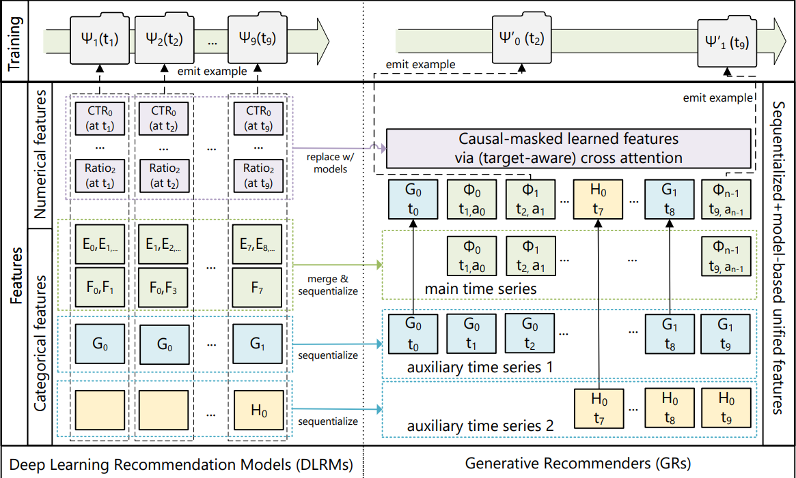
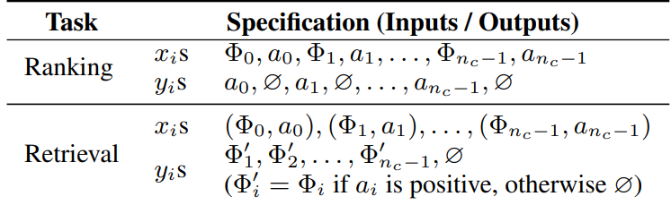
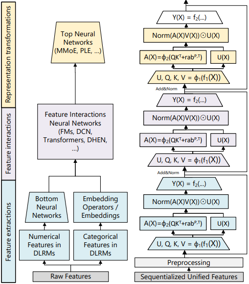
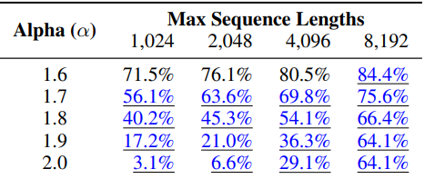
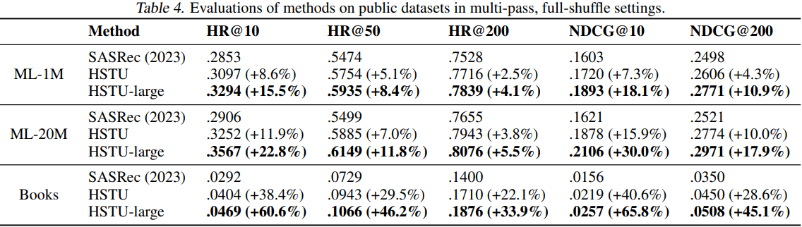
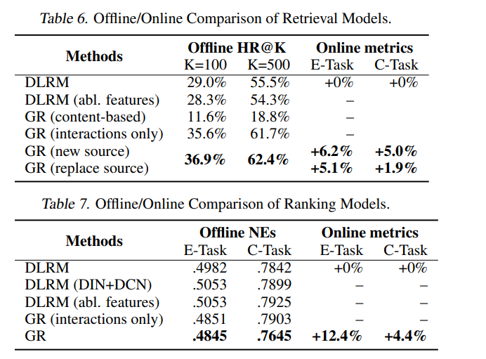

# HSTU

受Transformer在视觉和语言方面成功的启发，作者想要将这种架构用于推荐领域。

作者认为推荐系统中的找回和排序本质上都可以转化为生成任务，他将用户行为作为一种新的模态，并尝试用生成模型的方式来建模用户行为，这样的生成式推荐系统使用统一的模型，共享参数和表示空间。在此基础上修改了attention机制并提出了新的算法以解决算力开销的问题。

## 动机

DLRM不满足**缩放定律**，即使用了大量人工设计的特征及并给予海量数据训练，业界多数深度推荐抹胸的算力扩展性仍较差。


## 模型

将Transformer应用到推荐领域首先要面临三个问题：

1. 特征没有显示的结构，不像语言领域中整齐配列，推荐领域下的特征高维异构
2. 推荐领域的词表达到数十亿且动态变化带来了较高的推理成本
3. 训练成本十分昂贵

**从代码实现来看，该模型本质上仍然属于向量检索式推荐框架。模型首先将物品 id 映射为 item embedding，然后使用 HSTU 这类经过改造的 Transformer-style 序列编码器对用户历史行为序列进行上下文建模，得到每个历史位置的序列表示。验证或推理时，模型通常取用户历史序列中最后一个有效位置的输出向量作为当前用户兴趣表示，再将该用户向量与候选物料库中的 item embedding 进行点积打分，最终通过 MIPS / TopK 检索召回得分最高的物品。**

### 统一特征空间

针对第一个问题，模型将**异构的特征编码为统一的时间序列**



类别特征（稀疏）：首先选择宽度最长的序列作为主时间序列（绿色），其他特征作为辅助序列

+ main time series（主序列）：通常由**user-item交互对**组成，$(\phi_0, a_0), (\phi_1, a_1), \dots$，其中$\phi_i$代表用户交互的item，$a_i$代表交互的动作（点赞、收藏、加购等），这些交互对**严格按照时间戳排序**，组成了主序列。
+ 辅助序列：由**随时间缓慢变化的类别特征**构成，为**每个连续不变区间保留最早的一个条目**来压缩这些时间特征，然后将结果**合并到主时间序列**中，由于这些时间序列**变化非常缓慢**，**这种做法不会显著增加整体序列长度**。

数值特征：传统的深度学习模型会构造大量的统计特征，与类别特征相比，这些特征的变化频率高，从存储和计算的角度看，**这些特征不可能完全序列化**，但是**数值特征本质上就是对类别特征的统计结果，使用大规模长序列建模和目标感知的建模方式可以代替使用聚合统计特征**。

### 定义召回和排序



排序任务定义为$P(click∣history,target)$,即给定历史行为和target预测是否点击，也就是所谓的**目标感知任**务，在标准的transformer是在$P(x_{i+1}∣x_0,x_1,⋯,x_i)$，即预测下一个Token，不存在候选物品。因此模型中交替排列内容和行为来实现目标感知。


### 训练样本构造

传统推荐训练会对同一历史序列反复编码，导致复杂度达到$O(N^3)$，即

样本1：

```
A B C
→ D
```

样本2：

```
A B C D
→ E
```

样本3：

```
A B C D E
→ F
```

前三个 Token：

```
A B C
```

被重复编码很多次。

Generative Training 将整条用户行为序列作为一个样本一次性训练，使多个预测目标共享同一次 Transformer 编码，从而把训练复杂度降低到$O(N^2)$，减少了一个量级的计算开销，即

一次输入整个序列：

```
A B C D E F
```

然后同时预测：

```
B C D E F
```


### 层级序列转导单元

与Transformer类似，**HSTU由L个相同的模块堆叠而成，每个模块包含三个子模块**，用一个统一模块同时替代 DLRM 中的特征提取，特征交叉，表示变换等组件。



**Pointwise Projection**
$$
U(X), V(X), Q(X), K(X) = Split(\phi_1(f_1(X)))
$$

 **参数解释**： 

+ $X \in R^{N \times d}$：输入序列，$N$是序列长度，$d$是维度 
+ $f_1(X)$：单层线性层 
+ $\phi_1$：SiLU激活函数。 
+ $Split$：$f_1$函数输出一个$N \times (hd_q + hd_k + 2hd_v)$的tensor，Split将其拆分为$Q \in R^{h \times N \times d_q}$，$K \in R^{h \times N \times d_k}$，$V \in R^{h \times N \times d_v}$，$U \in R^{h \times N \times d_v}$。 

**核心内容**：在传统的Q、K、V的基础上，额外增加了一个门控权重U。


​	
$$
A(X)V(X)= \phi_2(Q(X)K(X)^\top + r_{ab}^{p,t})V(X)
$$
**参数解释**：

+ $rab^{p,t}$：相对注意偏差，包含位置(p)和时间(t)信息，模型可以感知到token的相对顺序和时间间隔。
+ $\phi_2$：SiLU激活函数。 

**核心内容**： 

1. 改写的attention公式
2. **Transformer中会采用softmax函数将注意力分数归一化为和为1的概率分布，即$\sum w_i = 1$，这样可能丢失用户的兴趣强度,不管有多少历史都归一化为1，将“用户看过很多类似内容”和“用户只偶尔看过”的差别严重压缩。**用户A看了100个item，90个衣服，10个电子产品。用户B看了10个item，9个衣服，1个电子产品。对于softmax来说，这两个用户的“对衣服的权重”是相同的，但明显用户A对衣服的兴趣强度要高于B。
3. **softmax的分母依赖于当前看到的所有token，一旦序列分布变化，归一化基准就会改变，训练和推理都会不稳定。**
4. **HSTU采用了pointwise聚合注意力机制（经典的DIN就是这种），更好地保留用户的兴趣强度。**


**Pointwise Transformation**
$$
Y(X) = f_2(\text{Norm}(A(X)V(X)) \odot U(X))
$$

 **参数解释**： 

+ $f_2(X)$：单层线性层。 
+ $\text{Norm}$：层归一化，用于稳定训练。
+ $U(X)$：Pointwise投影层得到的用户长期行为原始表征。
+ $Y(X)$：输出。$Y(X) \in R^{N \times d}$。 

**核心内容**：**使用类似于Moe的操作，取代了Transformer中的两个线性层和一个FFN模块**，**减少了参数量和模型计算量**。

## 代码理解笔记

以 ML-1M 数据集为例。

### 数据处理

数据首先由 `preprocessor_public_data` 下载原始数据集，再通过 `research/data/preprocessor` 对原始 `dat` 文件进行预处理，包括格式转换、交互序列构造、数据集拆分以及 item id 编码等操作。当前模型主要使用用户与物品之间的交互序列数据，不直接使用电影的文本、类别等内容特征。

在数据集构造阶段，`reco_dataset` 会根据时间顺序划分训练集、验证集和测试集。其核心思想是保留用户的历史交互序列，并将最新的若干交互从历史中截断出来，用作验证或测试目标。`DatasetV2` 作为 PyTorch Dataset，负责读取处理后的 csv 数据，并在 `load_item` 中完成序列解析、反转、截断和 padding。对于每个样本，数据会被划分为 `historical_ids` 和 `target_ids`：`historical_ids` 表示模型可见的历史行为，`target_ids` 表示需要预测的下一个物品。

数据经过 `DataLoader` 之后，会进入 `movielens_seq_features_from_row`。该函数会把 batch 中的历史序列整理成模型需要的 `seq_features`，包括 `past_ids`、`past_lengths`、时间戳等字段。同时，它会在原有历史序列后面额外预留若干空位置，用于生成式推荐或自回归预测阶段。训练时，代码会通过 `scatter_` 将 `target_id` 写入历史序列后的第一个空位，使序列从 `[a, b, c, 0]` 变成 `[a, b, c, d]`。这样后续可以通过自回归方式构造监督信号，即用位置 `t` 的输出预测位置 `t+1` 的物品。

需要注意的是，虽然训练时会把 `target_id` 临时填回序列末尾，但前面的 `historical_ids / target_ids` 划分仍然是必要的。划分的目的在于防止信息泄漏，保证验证和测试阶段模型只能看到历史行为，而不能提前看到待预测的目标物品。训练阶段的 `scatter_` 只是为了构造自回归训练序列，并不改变 target 作为监督标签的本质。

### 模型组件

`embedding_module` 使用 `LocalEmbeddingModule`，本质上是一个标准的 item embedding 层，用于将物品 id 映射为稠密向量。

`_input_features_preproc` 使用 `LearnablePositionalEmbeddingInputFeaturesPreprocessor`，用于在 item embedding 上叠加可学习的位置编码，使模型能够区分序列中不同位置的物品。该模块还会执行 dropout，并结合 padding mask 处理无效位置。

`relative_attention_bias_module` 使用 `RelativeBucketedTimeAndPositionBasedBias`，用于实现 HSTU attention 中的相对注意力偏置。它同时考虑相对位置和时间间隔，将时间差离散化到 bucket 后查表得到时间偏置，再与相对位置偏置相加，作为 attention score 的补充项。

`_hstu_attention_maybe_from_cache` 是 HSTU 中 attention 计算的核心函数。它首先将 jagged 形式的 `q/k/v` 根据 `x_offsets` 还原为 padded dense 形式，然后计算 query 和 key 的点积注意力分数，并加入相对注意力偏置。经过激活、mask 和归一化后，再使用 attention 权重对 value 进行加权聚合。聚合完成后，输出会重新从 padded dense 转回 jagged values，以便后续只在有效 token 上继续计算。

`SequentialTransductionUnitJagged` 是 HSTU 的基本层级序列转导单元。它先对输入序列进行 layer norm，然后通过一次线性投影得到 `u、v、q、k`。其中 `q/k` 用于计算 attention 权重，`v` 用于被 attention 聚合，`u` 则作为门控分支与 attention 输出逐元素相乘。最后经过输出线性层和残差连接，得到该层的序列表示。

`HSTUJagged` 用于堆叠多个 `SequentialTransductionUnitJagged`。它在输入为 `[B, N, D]` 的 dense 序列时，会先调用 `dense_to_jagged` 去掉 padding，只保留有效 token；经过多层 HSTU 计算后，再通过 `jagged_to_padded_dense` 恢复为 `[B, N, D]` 的 padded dense 输出。

`HSTU` 是完整的序列编码模型，负责将用户历史行为序列编码为上下文相关的序列表示。它内部组合了 embedding、输入预处理、HSTU 主体结构、输出后处理以及相似度计算模块。训练和验证时，模型输出的 `seq_embeddings` 表示每个历史位置经过上下文建模后的序列状态。

`similarity_module` 使用 `DotProductSimilarity`，即点积相似度。它用用户侧序列表示和 item embedding 做内积，得到用户状态对候选物品的打分。

### 训练过程

训练时，batch 数据首先经过 `LocalEmbeddingModule` 得到 item embedding，然后输入 HSTU 模型，得到 `seq_embeddings`。该张量的形状通常为 `[B, N, D]`，其中每个位置表示对应历史位置经过 HSTU 编码后的序列状态。

随后训练代码采用自回归预测方式构造 loss。具体来说，`seq_embeddings[:, :-1, :]` 作为预测输入，`supervision_ids[:, 1:]` 作为监督目标。也就是说，模型用第 `t` 个位置的输出向量预测第 `t+1` 个物品：

```python
output_embeddings = seq_embeddings[:, :-1, :]
supervision_ids = supervision_ids[:, 1:]
supervision_embeddings = input_embeddings[:, 1:, :]
```

例如序列为 `[a, b, c, d]`，则训练目标为：

```text
out(a) -> b
out(b) -> c
out(c) -> d
```

其中 `d` 就是前面通过 `scatter_` 填入的 `target_id`。因此，训练目标不是让“当前状态和下一个状态相似”，而是让“当前位置的序列输出向量”和“下一个真实 item 的 embedding”具有更高的点积相似度。

loss 使用 `SampledSoftmaxLoss`。在进入 loss 内部后，`output_embeddings`、`supervision_ids`、`supervision_embeddings` 和 `supervision_weights` 会从 padded dense 形式转换为 jagged values，只保留有效训练位置。对于每个有效位置，模型会计算正样本 logit，即当前序列状态与真实下一个 item embedding 的点积；同时通过负采样器采样若干负样本，并计算当前序列状态与这些负样本 embedding 的点积。随后将正样本 logit 放在第 0 列，负样本 logits 放在后面，使用 `log_softmax` 计算交叉熵损失。

如果负采样结果中包含了当前正样本，代码会通过 `torch.where` 将该负样本 logit 置为极小值，避免同一个 item 同时作为正样本和负样本参与 softmax。最终 loss 会乘以 `supervision_weights`，只对非 padding 的有效位置求平均。

因此，训练阶段的核心目标可以概括为：

```text
让当前用户序列状态靠近真实下一个 item embedding，
同时远离采样得到的负样本 item embedding。
```

### 验证过程

验证阶段不再把 `target_id` 填入历史序列。模型只能看到用户的历史行为，通过 HSTU 编码得到用户当前状态表示。通常会使用 `get_current_embeddings` 从 `[B, N, D]` 的序列输出中取出每个用户最后一个有效位置的向量，作为当前用户兴趣表示。

得到用户向量后，系统会使用 `CandidateIndex` 和 `TopKModule` 进行候选物品检索。以 `MIPSBruteForceTopK` 为例，它会将用户向量与候选库中所有 item embedding 做矩阵乘法：

```text
scores = user_embeddings @ item_embeddings.T
```

得到每个用户对所有候选 item 的打分，然后通过 `torch.topk` 取出分数最高的前 K 个物品。这里的分数本质上仍然是点积相似度，和训练阶段的 `DotProductSimilarity` 保持一致。

为了避免推荐用户已经交互过的物品，`CandidateIndex.get_top_k_outputs` 会根据 `invalid_ids` 对 TopK 结果进行过滤。代码会先取 `k + invalid_ids数量` 个候选，再逐行过滤掉无效 item，最后保留前 `k` 个有效推荐结果。

得到 `eval_top_k_ids` 后，验证代码会判断真实 `target_id` 在推荐列表中的排名。它将 `target_ids` 拼接到 `eval_top_k_ids` 的最后一列，保证每一行至少能找到一次 target。如果 target 出现在原始 TopK 中，则其位置就是真实排名；如果只在最后拼接的位置出现，则说明模型没有命中该 target，排名会被设置为 `MAX_K + 1`。

基于 `eval_ranks` 可以进一步计算 HR、NDCG 和 MRR 等指标。HR@K 判断目标物品是否进入前 K；NDCG@K 在命中的基础上根据排名进行对数折扣，排名越靠前分数越高；MRR 则使用 `1 / rank` 衡量目标物品首次出现位置的倒数。对于 MovieLens 这类评分数据，代码还会根据 `target_ratings` 过滤正样本，例如只对评分大于等于 4 的目标物品计算部分指标，从而更关注用户真正喜欢的 item。


## 工程优化

### fully raggified attention

作者观察到用户的历史行为非常不均匀

假设 batch 里有：

```
20
35
100
3000
8000
```

如果按普通 Transformer：

需要 Padding：

```
8000
8000
8000
8000
8000
```

大量计算浪费在 Padding 上。


因此作者实现了fully raggified attention

即：

```
20 × 20
35 × 35
100 × 100
3000 × 3000
8000 × 8000
```

分别计算。


本质上是将$QK^T$变成很多不同尺寸的小矩阵乘法。吞吐提升：2∼5X

### **SL**

**使用随机长度（SL）在算法层面增加用户历史序列的稀疏性，减少长序列带来的计算开销，推荐系统的一个重要特征是：用户行为在时间上具有重复性、多尺度性，因此可以在不损害模型效果的前提下，增加稀疏性能降低编码器的计算成本。**

将用户$j$的历史表示为序列$(x_i)_{i=0}^{n_{c,j}}$，其中$n_{c,j}$是该用户交互的内容数，令$N_c = \max_j n_{c,j}$。从原序列中构造一个长度为$L$的子序列$(x_{i_k})_{k=0}^L$。

SL的采样规则为： 

+ 若$n_{c,j} \leq N_c^{\alpha/2}$，使用完整序列；
+ 若$n_{c,j} > N_c^{\alpha/2}$，以概率$1 - N_c^\alpha / n_{c,j}^2$选取长度为$N_c^{\alpha/2}$的子序列，以概率$N_c^\alpha / n_{c,j}^2$仍使用完整序列。



经过实验，$\alpha$≈1.6–1.8 时，**算力省很多，效果几乎不掉**。

### 显存优化

+ 减少线性层的使用，从Transformer的六个线性层降低到2个
+ 做了很多Kernel Fusion
+ Embedding存储优化，使用**Rowwise AdamW**优化器缓解内存压力，原本的Adam为一行embedding存储多个m,v，而AdamW让每一行embedding共享m和v。


### M-FALCON 

推荐系统中，用户历史序列长度通常服从偏态分布，在序列很长的场景下会导致输入序列高度稀疏，**作者实现了一种高效的kernel，支持不等长序列的注意力计算（无需padding）,减少了计算量,并使用fused GEMM（融合矩阵乘）避免频繁访问显存，提高吞吐量**。


## 结果

相比于sota的序列模型，HUTS表现更加优异，并且扩大参数规模也有所提升。




与现有的DLRM进行A/B测试，



+ 召回侧new source表示将模型作为一路找回，replace表示完全替代其他的生成器。
+ DLRM(abl feature)——只使用HSTU同样的特征（content&action），性能大幅下降，说明传统DLRM依赖大量的特征与对应的特征工程。
+ 对比GR interaction only和content-based得出，GR需要两种特征联合建模。
