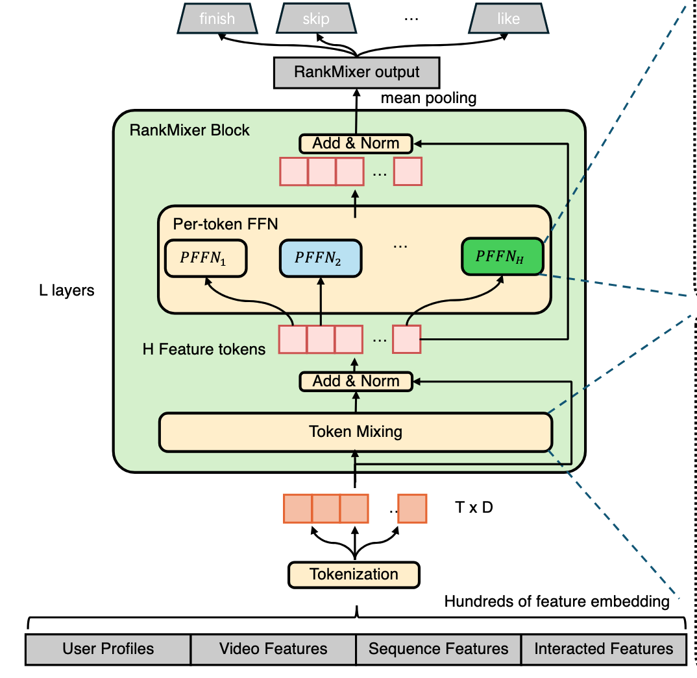
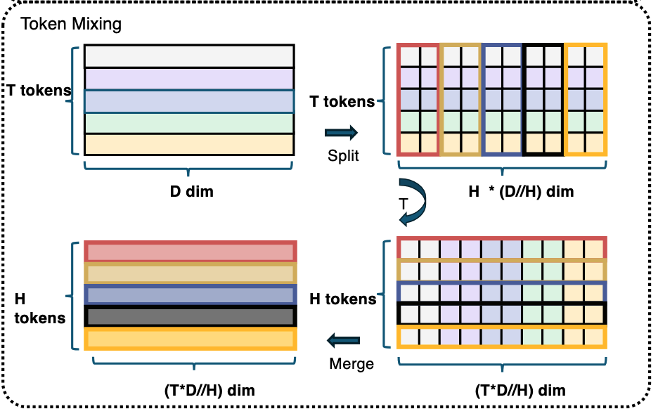

# Rankmixer

RankMixer 是一个**面向排序任务（ranking）的特征交互模型**。

Rankmixer保留了Transformer的高并行性，将二次复杂度的自注意力替换为多头token混合模块以提升效率，模型引入了Per token FFN实现对不同特征子空间的建模与跨特征子空间交互。更进一步，通过Spare-MoR变体将其参数扩展至十亿规模，一伙的更高的投入产出比。

## 动机

作者认为，以往的模型存在三点不足

+ Scaling law（缩放定律，扩大模型、计算量可以提升模型效果）不成立，早期方法尝试堆叠/加宽特征交互层，但是收益很小，甚至会下降。并且推荐场景下有着高并发查询和延迟的要求。
+ 推荐排序模型的架构受 CPU 时代设计理念影响（大量的embedding lookup，hash，拼接），其核心算子在现代GPU上多为内存密集型而非计算密集型，导致 GPU 并行性差、模型计算利用率（MFU）极低。
+ 特征交互设计有问题，依赖人工设计，不同语义空间混在一起，导致高频特征主导

## 模型结构

模型结构如下所示，将tokens送入到连续的RankMixer blocks处理，最后进行池化操作。

### Tokenization

为在后续阶段实现高效并行计算，需将不同维度的嵌入统一为维度对齐的向量。最简单的策略是为每个特征分配一个token，但在**通常存在数百个特征的场景下，每个token分配到的参数量与计算量过小（总参数量固定），使得重要特征建模不充分；如果token数量过少，又会是模型退化为简单的DNN，无法表示多样化的特征空间，存在主导特征掩盖其他特征的风险**。

为解决上述问题，文章提出一种结合领域知识、基于语义的token化方法：首先，得到各个特征的embedding，embedding维度可以不同，随后按照先验知识将特征分为语义一致的组，例如

+ 用户画像相关一组
+ 候选物料相关一组
+ 行为序列相关一组
+ 交叉特征相关一组

组内的特征先拼接，随后再组间拼接得到$e_{input}=[e_1;e_2;…;e_N]$

接下来把长向量切成多个 fixed-size token，得到T个feature tokens，然后每一段投影到统一纬度D，如下所示

### RankMixer Block

在特征经过Tokenization后，会送入多层RankMixer Block，每个block包括两部分Multi-Head Token Mixing

和Per-token FFN。

#### Multi-Head Token Mixing

输入为上一层的特征表示$$X_{n-1} \in \mathbb{R}^{T \times D}$$

首先，对每个 token 在特征维度上划分为 (H) 个子空间（head），可以看作是把每个token拆分为多个低维子空间表示：
$$
x_t = \big[ x_t^{(1)} ,|, x_t^{(2)} ,|, \cdots ,|, x_t^{(H)} \big], \quad t = 1,2,\dots,T
$$

随后，在每个 head 上进行跨 token 的重排与融合，每个新token能看到了所有原始token在某个子空间上的信息，天然带有全局交互的能力。对于第 (h) 个 head：
$$
s^{(h)} = \mathrm{Concat}\big( x_1^{(h)}, x_2^{(h)}, \dots, x_T^{(h)} \big)
$$

将所有head堆起来形成输出：

$$
\mathrm{TokenMixing}(X) = \mathrm{Merge}\big( s^{(1)}, s^{(2)}, \dots, s^{(H)} \big)
$$

然后，为了做残差连接，论文中设置 (H = T)，在保持 token 数量不变的前提下，实现充分的跨 token 信息交互。该过程仅通过张量重排与拼接完成，不引入额外参数，因此是一种**无参数的跨 token 特征交叉机制**。

最后，层归一化得到输出：
$$
S = \mathrm{LN}\big( \mathrm{TokenMixing}(X_{n-1}) + X_{n-1} \big)
$$

作者认为：**self-attention依赖的token间内积相似度对于异构特征较为牵强**，例如“用户 ID 子空间”和“商品类别子空间”直接做相似度，并且计算更重参数更多。

#### Per-token FFN

以往的推荐系统中倾向于在单个交互模块中混合来自多个差异极大的语义空间的特征，这可能会导致高频特征占据主导、淹没低频或常微信号，最终损害整体推荐效果。

作者提出了一种参数独立的前馈网络结构，每个token单独过一套 FFN，不共享参数，防止特征间相互干扰：
$$
v_t = f^{t,2}_{pffn}(Gelu(f^{t,1}_{pffn}(s_t)))
$$
最后做残差和 LayerNorm：
$$
X_n = \mathrm{LN}\big( \mathrm{TokenMixing}(S_{n-1}) + S_{n-1} \big)
$$
这里为增强表达能力，可以将线性层替换为MoE，文章中在MoE处作了改进以满足scaling law。

## 结果

模型参数扩展至10 亿规模承载全量流量，未增加推理成本，实现用户活跃天数提升 0.3%，应用内总使用时长提升 1.08%。

