> Tiger 生成式推荐一大方向，编码SID使用transformer结构做next-prediction
>
> What is GR 介绍生成式推荐
>
> HSTU  生成式推荐一大方向，改造transformer decode应用于推荐领域
>
> 


# Tiger

## 核心

Tiger中提出了**语义ID**，基于item内容信息（例如文本描述）构成的token序列。给定一个item的文本描述，使用**预训练的文本编码器**（SentenceT5）生成dense的embedding，而后应用量化方法对embedding进行处理，形成tokens的集合。

最后使用transformer模型自回归生成下一条item的语义ID，从而完成召回。


使用SID具有诸多优势：

+ **知识共享与泛化能力**：语义token让相似物品之间可以共享信息，同时减少反馈循环问题，使模型能处理新物品。
+ **缓解大规模问题**：通过token序列表示，可以用组合的方式表示大量物品，而无需为每个物品单独存储 embedding，从而节省内存。
+ **相比随机哈希的优势(降低物品表示空间)**：虽然随机哈希可以减小表示空间，但语义token提供了可解释性和更好的泛化能力，是更自然的选择。


## 结构

模型由两部分组成：一是**利用内容特征生成语义ID**——这包括将**item内容特征编码**为嵌入向量，并将该嵌入量化为语义码字元组。由此产生的码字元组被称为项目的语义ID；二是在**语义ID上训练生成式推荐系统**——使用语义ID序列，在序列推荐任务上训练Transformer模型。


### SID generation

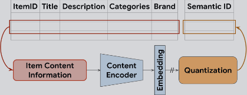


语义ID定义为**一个长度为m的码字元组**，**元组中每个码字来自于不同的码本**，因此语义ID能唯一表示的物品数量等于各码本大小的乘积，输出的语义ID需要**满足相似的物品对应的语义ID应尽可能重叠**，例如，语义 ID 为 (10, 21, 35) 的物品，应比 ID 为 (10, 23, 32) 的物品，更接近 ID 为 (10, 21, 40) 的物品。


### AE

自编码器（Autoencoder, AE）

在训练时，输入图像x会被编码成一个较短的向量z，再被解码回另一幅长得差不多的图像x_hat。网络的学习目标是让重建出来的图像和原图像尽可能相似.


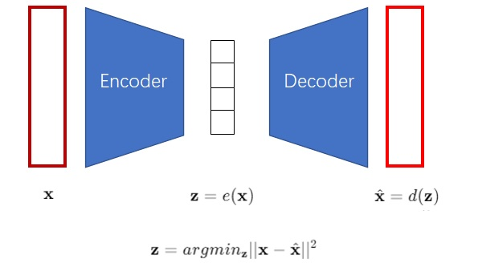

解码器可以看作是图像生成模型，因为它可以根据一个向量生成对应的图片。但是AE并不能做图像生成，因为解码器只能识别编码器输出的向量，给定一个随机向量，是无法生成有意义的图片的，因此AE只能用于压缩图片。

### VAE

VAE用一种巧妙的方法约束了编码向量z，使得z满足**标准正态分布**，解码器不仅认识编码器编出的随机向量，还能识别其他来自正态分布的向量，在训练完成后可以只保留解码器用于图像生成。

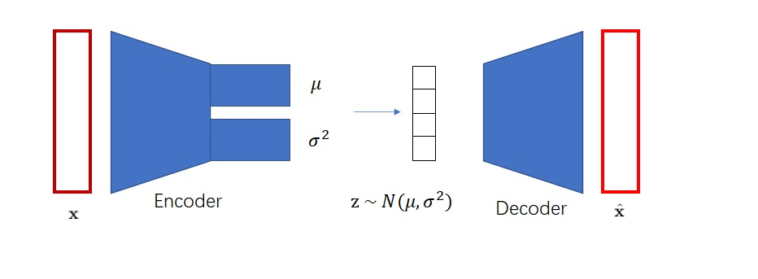

VAE编码出的向量是**连续向量**，即向量的每一维都是浮点数。

### VQ-AVE

VAE生成出来的图片质量不高，VQ-VAE的作者认为，是因为图片被编码成了连续向量。而实际上，把图片编码成**离散向量**会更加自然。

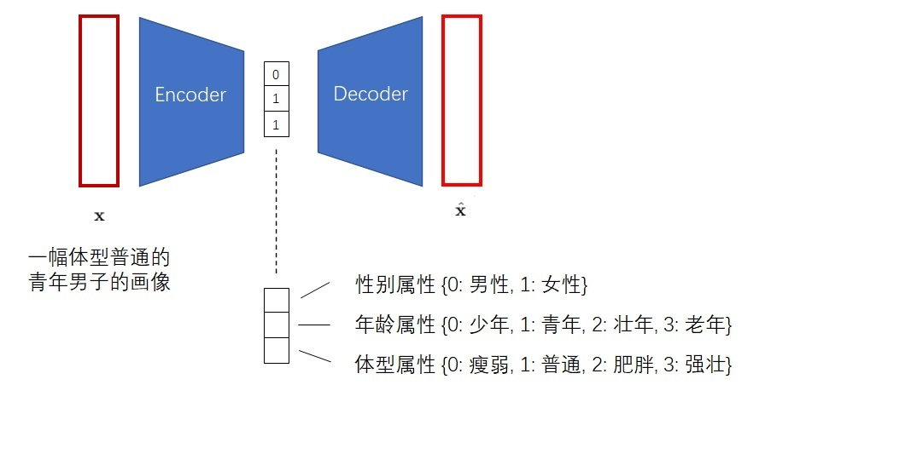

不过编码为离散向量就不能做到图像生成了，只用于图片压缩。


神经网络会默认输入满足一个连续的分布，而不善于处理离散的输入。输入0, 1, 2这些数字，神经网络会默认1是一个处于0, 2中间的一种状态。为此，参考NLP领域，在解码器之前加入一个嵌入层，被称为**码本**，每一行称为**码字**，行号是**code**。

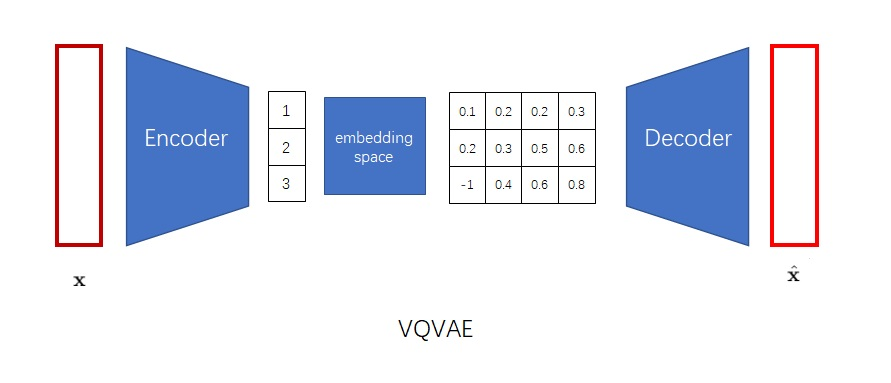

想要编码为离散整数需要输出经过softmax过的概率分布，然后从概率分布中随机采样，下一步又要根据嵌入空间把离散编码转回一个向量。为简化这一步，会对**编码器的输出向量找出嵌入空间（codebook）中的最近邻，随后替换**，codebook在这个过程中也会被学习。

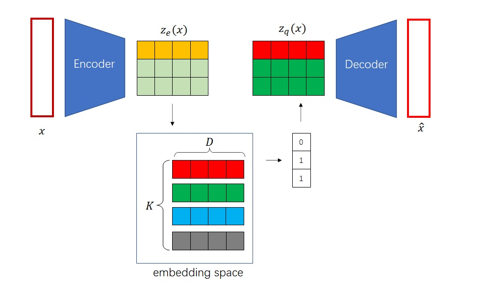

```
输入 x
  ↓
Encoder
  ↓
连续表示 z_e
  ↓
查 codebook [e_i,e_j,e_k,...]，找最近 code: argmin(z_e - e_x)
  ↓
离散表示 z_q
  ↓
Decoder
  ↓
重构 x_hat
```

VQ-VAE将这一思想整合进了标准的自编码器框架中，由三部分组成：

+ **编码器**：将输入数据x压缩为一个低维的连续潜在向量z
+ **量化器**：通过查找码本，将z替换为离它最近的码本向量$z_q$，argmin操作时不可导的，因此引入了**编码器梯度直通（STE）**来解决反向传播梯度中断的问题
+ **解码器**：尝试将码本向量重建为原始输入x`


VQ-VAE的损失训练通常由三部分组成：

1. 第一部分是`重构损失`：$L_{recon} = ||x - x_{hat}||²$，要求decoder尽可能还原输入

2. 第二部分是`codebook loss`：$||sg[z_e] - z_q||²$，它让 codebook 向量 $z_q$ 靠近 Encoder 输出的 $z_e$，只更新codebook。

3. 第三部分是`承诺损失`：$β ||z_e - sg[e_k]||²$ 它让 Encoder 输出不要到处乱跑，而是主动靠近某个 codebook 向量，只更新encoder。


然而，VQ-VAE在处理高保真度数据时面临一个瓶颈：**VQ-VAE想要用一个code表达所有的信息，但是若要精确表示复杂的输入，就需要增加码本的维度，当物品数量较大时就需要使用多个码字区分，这会带来巨大的计算和存储开销**。


### RQ-AVE

RQ-VAE通过引入**残差量化**来解决这个问题，核心思想是**由粗到精的逐层逼近**，思想是**每个码本只拟合一部分信息**。


+ **第一层量化**：与VQ-VAE相同，对原始潜在向量zₑ进行一次粗略的量化，得到第一个码字e_c₀。
+ **计算残差**：计算原始潜在向量与第一次量化结果之间的残差`r₁ = zₑ - e_c₀`
+ **第二层量化**：不再对原始向量操作，而是对残差进行第二次量化，得到第二个码字e_c₁
+ **迭代**: 继续计算新的残差 `r₂ = r₁ - e_c₁`，并交给下一层处理。

这种方式极大地**提升了量化精度**，并自然地赋予了语义ID层次化的结构。


RQ-VAE的训练目标由一个统一的损失函数来定义，该函数同样由重建损失和量化损失构成：
$$
L = L_{\text{recon}} + L_{\text{vq}}
$$
其中，$L_{\text{recon}}$ 通常是输入 $x$ 与重建输出 $x_{\text{recon}}$ 的均方误差（MSE）。

而关键在于量化损失 $L_{\text{vq}}$，它由**每一层量化的损失累加而成**。对于单层量化，其损失 $L_{\text{vq\_layer}}$ 定义为： 
$$
L_{\text{vq\_layer}} = \|\text{sg}(z_e) - e\|^2 + \beta \cdot \|z_e - \text{sg}(e)\|^2
$$
 `sg`（stop-gradient，即代码中的 `.detach()`）保证梯度仅更新码本

+ **码本损失（Codebook Loss）**：用于约束编码器输出$z_e$接近对应的码本向量e
+ **承诺损失（Commitment Loss）**：防止编码器输出无限远离码本向量，促使编码器“承诺”使用码本。超参数 $\beta$（`commitment_cost`）用于调节这份“承诺”的强度。


Tiger使用RQ-VAE通过多层残差量化生成**层级化语义ID**，映射为对应的code，当**出现碰撞时追加额外的token**，例如两个物品的语义 ID 都为 (12, 24, 52)，则分别表示为 (12, 24, 52, 0) 和 (12, 24, 52, 1)。碰撞通过**维护语义ID->物品查表实现**，仅在训练完后执行一次。

### RQ-KMEANS	

RQ-KMEANS是另一种编码方式


K-MEANS是一种经典的聚类算法，可以看作是最简单的量化器，

+ 训练：对大量的物品进行聚类得到K个聚类中心，也就是码本。
+ 量化：对任何一个新的物品向量，找到最接近的聚类中心，并用该中心的索引来表示这个物品向量

**如果K很小，量化误差就会很大，无法精确表示物品。如果K值很大，码本就会异常庞大，难以训练和存储。**


为了解决K-menas的码本爆炸问题，可以**PQ**的思路：分而治之。**将一个高维向量切分为多段，为每一段独立训练一个小的K-menas码本，一个物品向量就表示为多个码本索引的组合，可以用很小的存储表示海量的组合。**


**RQ**是PQ的变体，核心思想是逐层细化，逐步求精。

1. 首先在`所有物品向量`上训练第一个K-means模型，得到码本C1。对于向量v，在C1中找到最近的中心c1，v的第一个token就是c1的索引。计算残差`r1=v-c1`.
2. 第二层用`所有物品的第一层残差集合`训练得到第二个k-means模型，得到码本C2，对于残差r1，在C2中找到最近的中心c2，v的第二个token就是c2的索引，再次计算残差。
3. ...
4. 向量 `v` 的近似重构值为：`v = c1 + c2 + ... + cM`。


**码本坍塌**：某一层 codebook 里，大量 code 从来不用，或者样本极度集中到少数几个 code 上。它看的是**单层 codebook 的使用分布**。

**码本碰撞**：多个 item 最终被分到了同一个完整 SID。它看的是**多层 code 组合后的唯一性**。


### Generative Retrieval

为每个用户构建物品序列，将它们的交互按时间顺序排序。对于一个形式为$(\text{item}_1, \dots, \text{item}_n)$的序列，推荐系统的任务是预测下一个物品$\text{item}_{n+1}$


形式上，设$(c_{i,0}, \dots, c_{i,m-1})$为物品$i$的长度为$m$的语义ID，则将物品序列转换为如下 token 序列：$$(c_{1,0}, \dots, c_{1,m-1}, c_{2,0}, \dots, c_{2,m-1}, \dots, c_{n,0}, \dots, c_{n,m-1})$$ 然后用序列到序列（seq2seq）模型训练去预测$\text{item}_{n+1}$的语义ID，即$(c_{n+1,0}, \dots, c_{n+1,m-1})$

实际上是对Transformer模型做SFT微调


# Wukong

特征交叉模型，核心创新在于通过堆叠多层因子分解机，大幅提升了传统因子分解机的表征能力，能够有效捕捉高阶特征交互并且满足缩放定律，作者关注于特征交互层的扩容而不是嵌入表的，即便模型复杂度跨越两个数量级，在现有模型表现失效的区间内，该模型仍能保持效果优势。

## 动机

目前的推荐模型并未呈现出与大语言模型领域类似的缩放规律，当下推荐系统的扩容方式为spare scaling，即扩大嵌入表规模或维度，这种方法无法增强对海量特征间复杂交互的捕捉能力，并且嵌入表查找操作无法利用当下的GPU的算力优势。

这种使得推荐模型难以适配复杂的大型的现实数据，因此作者提出了Wukong旨在为推荐领域建立缩放定律。

## 模型结构

模型中所有的特征先经过EMbedding layer转换为稠密的向量，随后送入到堆叠的交互层，交互层由FMB和LCB组成，最终进入MLP。


### Embedding Layer

Embedding Layer并非简单的查表，对于特征中较为重要的会生成多个嵌入，次要的则会生成较少的嵌入，特征最后会拼接起来经过MLP映射到统一的维度。

文章中将Embedding Layer输出的每一个嵌入向量视为独立的整体，表示为$$\boldsymbol{X}_0 \in \mathbb{R}^{n\times d}$$，而非一维形式$$\boldsymbol{X}_0 \in \mathbb{R}^{nd}$$。

### Interaction Stack

交互层包含两个并行模块：因子分解机模块（FMB）与线性压缩模块（LCB）。因子分解机模块计算该层输入嵌入之间的特征交互，线性压缩模块则对该层输入嵌入进行线性压缩并直接传递输出。两个模块的输出随后进行拼接。


FMB的计算可以总结为以下：
$$
\text{FMB}(X_i) = \text{reshape}\left( \text{MLP}\left( \text{LN}\left( \text{flatten}\left( \text{FM}(X_i) \right) \right) \right) \right)
$$


- 输入$\boldsymbol{X}_i \in \mathbb{R}^{n\times d}$先经过$\text{FM}(\boldsymbol{X})=\boldsymbol{X}\boldsymbol{X}^\text{T}$，得到$\boldsymbol{X}_i \in \mathbb{R}^{n\times n}$即每个token之间的interaction score
- 接着展平再经过一个归一化层稳定训练，$\boldsymbol{X}_i \in \mathbb{R}^{nn}$ 
- 随后送入MLP中把信息重新编码回embedding space，也就是$\boldsymbol{X}_i \in \mathbb{R}^{n_fd}$，这里$n_f$是新生成的Embedding数量
- 最后reshape展开，$\boldsymbol{X}_i \in \mathbb{R}^{n_f\times d}$


因式分解机的计算与存储复杂度会随嵌入数量呈平方级增长，在包含数千个特征的真实数据集上开销会很快达到难以承受的程度。

为此作者利用了逐对内积矩阵的低秩特性来降低复杂度——当嵌入维度d<=嵌入数量的时候，内积交互矩阵$\boldsymbol{X}\boldsymbol{X}^\text{T}$ 为低秩矩阵，大规模数据集一般都满足这一条件。因此引入形状为$n\times k$的可学习投影矩阵Y，与$\boldsymbol{X}\boldsymbol{X}^\text{T}$相乘得到$\boldsymbol{X}\boldsymbol{X}^\text{T}Y$，可以在理论无损的前提下将输出矩阵尺寸从$n \times n$降至$n \times k$大幅降低交互矩阵的存储开销。

利用矩阵乘法结合律，先计算$\boldsymbol{X}^\text{T}Y$，可以将计算复杂度从$O(n^2d)$降至$O(nkd)$


LCB是简单的线性层
$$
 \text{LCB}(X_i) = W_L X_i 
$$
$W_j \in \mathbb{R}^{n_L \times n_i}$ 为权重矩阵，$n_L$ 是表示压缩后嵌入数量的超参数，$n_i$ 为第 $i$ 层的输入嵌入数量。

## Scaling

模型扩容的超参数如下

+ $l$：交互堆叠层的层数
+ $n_F$：FMB生成的嵌入向量数量
+ $n_L$：LCB生成的嵌入向量数量
+ k：优化因子分解机中的压缩嵌入向量数量
+ $MLP$：网络的深度和维度


## 工程优化

在大规模数据集上应用模型需要做工程上的优化

+ 进行分布式训练——多机多卡
+ 对Embedding table 进行column-wise分片，即[100000000, 128]->GPU0: [100000000, 32]，GPU1: [100000000, 32]，GPU2: [100000000, 32]，GPU3: [100000000, 32]。相比于row-wise，该方法的通信效率更高。
+ 使用FSDP策略，将模型的参数划分到多卡上，前向传播反向传递时聚合，能降低显存占用
+ 精度混合

## 结果

模型在六个公开数据集上优于以往模型

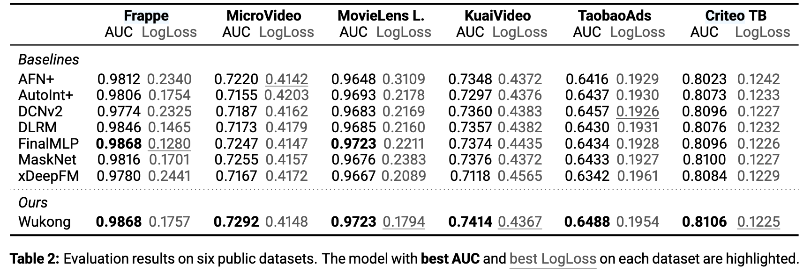

由消融实验可知，模型中各个部分


文中分析了悟空模型中各超参数单独扩容对模型效果的贡献。横坐标表示一个样本所需的计算量，纵坐标是loss相对于baseline（DLRM）的减少。

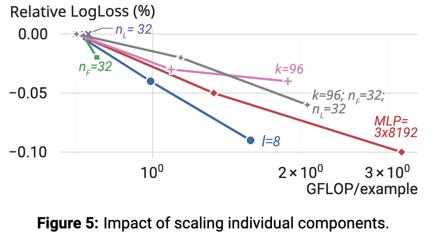

实验发现：增加悟空模型层数l可显著提升模型效果，原因是能够捕捉更高阶特征交互；扩大 MLP 规模也能带来可观性能增益；增大k与$n_F$同样有正向收益，而$n_L$在基础配置下已趋于性能饱和。值得注意的是，**联合扩容**k、$n_F$、$n_L$带来的效果提升，明显优于各参数单独扩容。

## 不足

将模型扩容至高复杂度级别会给在线实时推理带来显著挑战

由于算力开销巨大，本文对模型的理论上限还未研究彻底

尽管模型在多项测评中表现优异，但是对底层原理人缺乏万倍的理论解析


# Rankmixer

RankMixer 是一个**面向排序任务（ranking）的特征交互模型**。

Rankmixer保留了Transformer的高并行性，将二次复杂度的自注意力替换为多头token混合模块以提升效率，模型引入了Per token FFN实现对不同特征子空间的建模与跨特征子空间交互。更进一步，通过Spare-MoR变体将其参数扩展至十亿规模，一伙的更高的投入产出比。

## 动机

作者认为，以往的模型存在三点不足

+ Scaling law（缩放定律，扩大模型、计算量可以提升模型效果）不成立，早期方法尝试堆叠/加宽特征交互层，但是收益很小，甚至会下降。并且推荐场景下有着高并发查询和延迟的要求。
+ 推荐排序模型的架构受 CPU 时代设计理念影响（大量的embedding lookup，hash，拼接），其核心算子在现代GPU上多为内存密集型而非计算密集型，导致 GPU 并行性差、模型计算利用率（MFU）极低。
+ 特征交互设计有问题，依赖人工设计，不同语义空间混在一起，导致高频特征主导

## 模型结构

模型结构如下所示，将tokens送入到连续的RankMixer blocks处理，最后进行池化操作。


### Tokenization

为在后续阶段实现高效并行计算，需将不同维度的嵌入统一为维度对齐的向量。最简单的策略是为每个特征分配一个token，但在**通常存在数百个特征的场景下，每个token分配到的参数量与计算量过小（总参数量固定），使得重要特征建模不充分；如果token数量过少，又会是模型退化为简单的DNN，无法表示多样化的特征空间，存在主导特征掩盖其他特征的风险**。

为解决上述问题，文章提出一种结合领域知识、基于语义的token化方法：首先，得到各个特征的embedding，embedding维度可以不同，随后按照先验知识将特征分为语义一致的组，例如

+ 用户画像相关一组
+ 候选物料相关一组
+ 行为序列相关一组
+ 交叉特征相关一组


组内的特征先拼接，随后再组间拼接得到$e_{input}=[e_1;e_2;…;e_N]$

接下来把长向量切成多个 fixed-size token，得到T个feature tokens，然后每一段投影到统一纬度D，如下所示


### RankMixer Block

在特征经过Tokenization后，会送入多层RankMixer Block，每个block包括两部分Multi-Head Token Mixing

和Per-token FFN。

#### Multi-Head Token Mixing


输入为上一层的特征表示$$X_{n-1} \in \mathbb{R}^{T \times D}$$

首先，对每个 token 在特征维度上划分为 (H) 个子空间（head），可以看作是把每个token拆分为多个低维子空间表示：
$$
x_t = \big[ x_t^{(1)} ,|, x_t^{(2)} ,|, \cdots ,|, x_t^{(H)} \big], \quad t = 1,2,\dots,T
$$


随后，在每个 head 上进行跨 token 的重排与融合，每个新token能看到了所有原始token在某个子空间上的信息，天然带有全局交互的能力。对于第 (h) 个 head：
$$
s^{(h)} = \mathrm{Concat}\big( x_1^{(h)}, x_2^{(h)}, \dots, x_T^{(h)} \big)
$$


将所有head堆起来形成输出：

$$
\mathrm{TokenMixing}(X) = \mathrm{Merge}\big( s^{(1)}, s^{(2)}, \dots, s^{(H)} \big)
$$


然后，为了做残差连接，论文中设置 (H = T)，在保持 token 数量不变的前提下，实现充分的跨 token 信息交互。该过程仅通过张量重排与拼接完成，不引入额外参数，因此是一种**无参数的跨 token 特征交叉机制**。

最后，层归一化得到输出：
$$
S = \mathrm{LN}\big( \mathrm{TokenMixing}(X_{n-1}) + X_{n-1} \big)
$$


作者认为：**self-attention依赖的token间内积相似度对于异构特征较为牵强**，例如“用户 ID 子空间”和“商品类别子空间”直接做相似度，并且计算更重参数更多。

#### Per-token FFN

以往的推荐系统中倾向于在单个交互模块中混合来自多个差异极大的语义空间的特征，这可能会导致高频特征占据主导、淹没低频或常微信号，最终损害整体推荐效果。

作者提出了一种参数独立的前馈网络结构，每个token单独过一套 FFN，不共享参数，防止特征间相互干扰：
$$
v_t = f^{t,2}_{pffn}(Gelu(f^{t,1}_{pffn}(s_t)))
$$
最后做残差和 LayerNorm：
$$
X_n = \mathrm{LN}\big( \mathrm{TokenMixing}(S_{n-1}) + S_{n-1} \big)
$$
这里为增强表达能力，可以将线性层替换为MoE，文章中在MoE处作了改进以满足scaling law。


## 结果

模型参数扩展至10 亿规模承载全量流量，未增加推理成本，实现用户活跃天数提升 0.3%，应用内总使用时长提升 1.08%。


# HSTU

受`Transformer`在视觉和语言方面成功的启发，作者想要将这种架构用于推荐领域。

作者认为推荐系统中的召回和排序本质上都可以转化为生成任务，他将用户行为作为一种新的模态，并尝试用生成模型的方式来建模用户行为，这样的生成式推荐系统使用统一的模型，共享参数和表示空间。在此基础上修改了attention机制并提出了新的算法以解决算力开销的问题。

## 动机

DLRM不满足**缩放定律**，即使用了大量人工设计的特征及并给予海量数据训练，业界多数深度推荐模型的算力扩展性仍较差。


## 模型

将Transformer应用到推荐领域首先要面临三个问题：

1. **特征没有显示的结构，不像语言领域中整齐配列，推荐领域下的特征高维异构**
2. **推荐领域的词表达到数十亿且动态变化带来了较高的推理成本**
3. **训练成本十分昂贵**

**从代码实现来看，该模型本质上仍然属于向量检索式推荐框架。模型首先将物品 id 映射为 item embedding，然后使用 HSTU 这类经过改造的 Transformer-style 序列编码器对用户历史行为序列进行上下文建模，得到每个历史位置的序列表示。验证或推理时，模型通常取用户历史序列中最后一个有效位置的输出向量作为当前用户兴趣表示，再将该用户向量与候选物料库中的 item embedding 进行点积打分，最终通过 MIPS / TopK 检索召回得分最高的物品。**

### 统一特征空间

针对第一个问题，模型将**异构的特征编码为统一的时间序列**


类别特征（稀疏）：首先选择宽度最长的序列作为主时间序列（绿色），其他特征作为辅助序列

+ main time series（主序列）：通常由**user-item交互对**组成，$(\phi_0, a_0), (\phi_1, a_1), \dots$，其中$\phi_i$代表用户交互的item，$a_i$代表交互的动作（点赞、收藏、加购等），这些交互对**严格按照时间戳排序**，组成了主序列。
+ 辅助序列：由**随时间缓慢变化的类别特征**构成，为**每个连续不变区间保留最早的一个条目**来压缩这些时间特征，然后将结果**合并到主时间序列**中，由于这些时间序列**变化非常缓慢**，**这种做法不会显著增加整体序列长度**。

数值特征：传统的深度学习模型会构造大量的统计特征，与类别特征相比，这些特征的变化频率高，从存储和计算的角度看，**这些特征不可能完全序列化**，但是**数值特征本质上就是对类别特征的统计结果，使用大规模长序列建模和目标感知的建模方式可以代替使用聚合统计特征**。

### 定义召回和排序


排序任务定义为$P(click∣history,target)$,即给定历史行为和target预测是否点击，也就是所谓的**目标感知任**务，在标准的transformer是在$P(x_{i+1}∣x_0,x_1,⋯,x_i)$，即预测下一个Token，不存在候选物品。因此模型中交替排列内容和行为来实现目标感知。


### 训练样本构造

传统推荐训练会对同一历史序列反复编码，导致复杂度达到$O(N^3)$，即

样本1：

```
A B C
→ D
```

样本2：

```
A B C D
→ E
```

样本3：

```
A B C D E
→ F
```

前三个 Token：

```
A B C
```

被重复编码很多次。

Generative Training 将整条用户行为序列作为一个样本一次性训练，使多个预测目标共享同一次 Transformer 编码，从而把训练复杂度降低到$O(N^2)$，减少了一个量级的计算开销，即

一次输入整个序列：

```
A B C D E F
```

然后同时预测：

```
B C D E F
```


### 层级序列转导单元

与Transformer类似，**HSTU由L个相同的模块堆叠而成，每个模块包含三个子模块**，用一个统一模块同时替代 DLRM 中的特征提取，特征交叉，表示变换等组件。


**Pointwise Projection**
$$
U(X), V(X), Q(X), K(X) = Split(\phi_1(f_1(X)))
$$

 **参数解释**： 

+ $X \in R^{N \times d}$：输入序列，$N$是序列长度，$d$是维度 
+ $f_1(X)$：单层线性层 
+ $\phi_1$：SiLU激活函数。 
+ $Split$：$f_1$函数输出一个$N \times (hd_q + hd_k + 2hd_v)$的tensor，Split将其拆分为$Q \in R^{h \times N \times d_q}$，$K \in R^{h \times N \times d_k}$，$V \in R^{h \times N \times d_v}$，$U \in R^{h \times N \times d_v}$。 

**核心内容**：在传统的Q、K、V的基础上，额外增加了一个门控权重U。


**Spatial Aggregation**
$$
A(X)V(X)= \phi_2(Q(X)K(X)^\top + r_{ab}^{p,t})V(X)
$$
**参数解释**：

+ $rab^{p,t}$：相对注意偏差，包含位置(p)和时间(t)信息，模型可以感知到token的相对顺序和时间间隔。
+ $\phi_2$：SiLU激活函数。 

**核心内容**： 

1. 改写的`attention`公式
2. **Transformer中会采用softmax函数将注意力分数归一化为和为1的概率分布，即$\sum w_i = 1$，这样可能丢失用户的兴趣强度,不管有多少历史都归一化为1，将“用户看过很多类似内容”和“用户只偶尔看过”的差别严重压缩。**用户A看了100个item，90个衣服，10个电子产品。用户B看了10个item，9个衣服，1个电子产品。对于softmax来说，这两个用户的“对衣服的权重”是相同的，但明显用户A对衣服的兴趣强度要高于B。
3. **softmax的分母依赖于当前看到的所有token，一旦序列分布变化，归一化基准就会改变，训练和推理都会不稳定。**
4. **HSTU采用了pointwise聚合注意力机制（经典的DIN就是这种），更好地保留用户的兴趣强度。**


**Pointwise Transformation**
$$
Y(X) = f_2(\text{Norm}(A(X)V(X)) \odot U(X))
$$

 **参数解释**： 

+ $f_2(X)$：单层线性层。 
+ $\text{Norm}$：层归一化，用于稳定训练。
+ $U(X)$：Pointwise投影层得到的用户长期行为原始表征。
+ $Y(X)$：输出。$Y(X) \in R^{N \times d}$。 

**核心内容**：**使用类似于Moe的操作，取代了Transformer中的两个线性层和一个FFN模块**，**减少了参数量和模型计算量**。

## 代码理解笔记

以 ML-1M 数据集为例。

### 数据处理

1. 数据首先由 `preprocessor_public_data` 下载原始数据集，再通过 `research/data/preprocessor` 对原始 `dat` 文件进行预处理，包括格式转换、交互序列构造、数据集拆分（随即划分9:1）以及 item id 编码等操作。当前模型主要使用用户与物品之间的**交互序列数据**，不直接使用电影的文本、类别等内容特征。

2. 在数据集构造阶段，`reco_dataset` 会根据时间顺序划分训练集、验证集和测试集。其核心思想是保留用户的历史交互序列，并将最新的若干交互从历史中截断出来，用作验证或测试目标。`DatasetV2` 作为 PyTorch Dataset，负责读取处理后的 csv 数据，并在 `load_item` 中完成序列解析、反转、截断和 padding。对于每个样本，数据会被划分为 `historical_ids` 和 `target_ids`：`historical_ids` 表示模型可见的历史行为，`target_ids` 表示需要预测的下一个物品。


### 模型组件

- `embedding_module` 使用 `LocalEmbeddingModule`，本质上是一个标准的 item embedding 层，用于将物品 id 映射为稠密向量。

- `_input_features_preproc` 使用 `LearnablePositionalEmbeddingInputFeaturesPreprocessor`，用于在 item embedding 上叠加可学习的位置编码，使模型能够区分序列中不同位置的物品。该模块还会执行 dropout，并结合 padding mask 处理无效位置。

- `relative_attention_bias_module` 使用 `RelativeBucketedTimeAndPositionBasedBias`，用于实现 HSTU attention 中的相对注意力偏置。它同时考虑相对位置和时间间隔，将时间差离散化到 bucket 后查表得到时间偏置，再与相对位置偏置相加，作为 attention score 的补充项。

- `_hstu_attention_maybe_from_cache` 是 HSTU 中 attention 计算的核心函数。它首先将 jagged 形式的 `q/k/v` 根据 `x_offsets` 还原为 padded dense 形式，然后计算 query 和 key 的点积注意力分数，并加入相对注意力偏置。经过激活、mask 和归一化后，再使用 attention 权重对 value 进行加权聚合。聚合完成后，输出会重新从 padded dense 转回 jagged values，以便后续只在有效 token 上继续计算。

- `SequentialTransductionUnitJagged` 是 HSTU 的基本层级序列转导单元。它先对输入序列进行 layer norm，然后通过一次线性投影得到 `u、v、q、k`。其中 `q/k` 用于计算 attention 权重，`v` 用于被 attention 聚合，`u` 则作为门控分支与 attention 输出逐元素相乘。最后经过输出线性层和残差连接，得到该层的序列表示。

- `HSTUJagged` 用于堆叠多个 `SequentialTransductionUnitJagged`。它在输入为 `[B, N, D]` 的 dense 序列时，会先调用 `dense_to_jagged` 去掉 padding，只保留有效 token；经过多层 HSTU 计算后，再通过 `jagged_to_padded_dense` 恢复为 `[B, N, D]` 的 padded dense 输出。

- `HSTU` 是完整的序列编码模型，负责将用户历史行为序列编码为上下文相关的序列表示。它内部组合了 embedding、输入预处理、HSTU 主体结构、输出后处理以及相似度计算模块。训练和验证时，模型输出的 `seq_embeddings` 表示每个历史位置经过上下文建模后的序列状态。

- `similarity_module` 使用 `DotProductSimilarity`，即点积相似度。它用用户侧序列表示和 item embedding 做内积，得到用户状态对候选物品的打分。

- ### 训练过程


1.训练时，batch 数据首先经过 `LocalEmbeddingModule` 得到 item embedding，然后输入 HSTU 模型，得到 `seq_embeddings`。该张量的形状通常为 `[B, N, D]`，其中每个位置表示对应历史位置经过 HSTU 编码后的序列状态。


2.随后训练代码采用自回归预测方式构造 loss。具体来说，`seq_embeddings[:, :-1, :]` 作为预测输入，`supervision_ids[:, 1:]` 作为监督目标。也就是说，模型用第 `t` 个位置的输出向量预测第 `t+1` 个物品：

```python
output_embeddings = seq_embeddings[:, :-1, :]
supervision_ids = supervision_ids[:, 1:]
supervision_embeddings = input_embeddings[:, 1:, :]
```

例如序列为 `[a, b, c, d]`，则训练目标为：

```text
out(a) -> b
out(b) -> c
out(c) -> d
```

其中 `d` 就是前面通过 `scatter_` 填入的 `target_id`。因此，训练目标不是让“当前状态和下一个状态相似”，而是让“当前位置的序列输出向量”和“下一个真实 item 的 embedding”具有更高的点积相似度。数据经过 `DataLoader` 之后，会进入 `movielens_seq_features_from_row`。该函数会把 batch 中的历史序列整理成模型需要的 `seq_features`，包括 `past_ids`、`past_lengths`、时间戳等字段。同时，它会在原有历史序列后面额外预留若干空位置，用于生成式推荐或自回归预测阶段。训练时，代码会通过 `scatter_` 将 `target_id` 写入历史序列后的第一个空位，使序列从 `[a, b, c, 0, 0, 0]` 变成 `[a, b, c, d, 0, 0]`，在计算损失时，右移序列，实现自回归预测。


3.loss 使用 `SampledSoftmaxLoss`。在进入 loss 内部后，`output_embeddings`、`supervision_ids`、`supervision_embeddings` 和 `supervision_weights` 会从 padded dense 形式转换为 jagged values，只保留有效训练位置。对于每个有效位置，模型会计算正样本 logit，即当前序列状态与真实下一个 item embedding 的点积；同时通过负采样器采样若干负样本(movie-1m数据会使用全局负采样)，并计算当前序列状态与这些负样本 embedding 的点积。随后将正样本 logit 放在第 0 列，负样本 logits 放在后面，使用 `log_softmax` 计算交叉熵损失。

如果负采样结果中包含了当前正样本，代码会通过 `torch.where` 将该负样本 logit 置为极小值，避免同一个 item 同时作为正样本和负样本参与 softmax。最终 loss 会乘以 `supervision_weights`，只对非 padding 的有效位置求平均。


因此，训练阶段的核心目标可以概括为：

```text
让当前用户序列状态靠近真实下一个 item embedding，
同时远离采样得到的负样本 item embedding。
```

### 验证过程

验证阶段不再把 `target_id` 填入历史序列。模型只能看到用户的历史行为，通过 HSTU 编码得到用户当前状态表示。通常会使用 `get_current_embeddings` 从 `[B, N, D]` 的序列输出中取出每个用户最后一个有效位置的向量，作为当前用户兴趣表示。

得到用户向量后，系统会使用 `CandidateIndex` 和 `TopKModule` 进行候选物品检索。以 `MIPSBruteForceTopK` 为例，它会将用户向量与候选库中所有 item embedding 做矩阵乘法：

```text
scores = user_embeddings @ item_embeddings.T
```

得到每个用户对所有候选 item 的打分，然后通过 `torch.topk` 取出分数最高的前 K 个物品。这里的分数本质上仍然是点积相似度，和训练阶段的 `DotProductSimilarity` 保持一致。

为了避免推荐用户已经交互过的物品，`CandidateIndex.get_top_k_outputs` 会根据 `invalid_ids` 对 TopK 结果进行过滤。代码会先取 `k + invalid_ids数量` 个候选，再逐行过滤掉无效 item，最后保留前 `k` 个有效推荐结果。

得到 `eval_top_k_ids` 后，验证代码会判断真实 `target_id` 在推荐列表中的排名。它将 `target_ids` 拼接到 `eval_top_k_ids` 的最后一列，保证每一行至少能找到一次 target。如果 target 出现在原始 TopK 中，则其位置就是真实排名；如果只在最后拼接的位置出现，则说明模型没有命中该 target，排名会被设置为 `MAX_K + 1`。

基于 `eval_ranks` 可以进一步计算 HR、NDCG 和 MRR 等指标。HR@K 判断目标物品是否进入前 K；NDCG@K 在命中的基础上根据排名进行对数折扣，排名越靠前分数越高；MRR 则使用 `1 / rank` 衡量目标物品首次出现位置的倒数。对于 MovieLens 这类评分数据，代码还会根据 `target_ratings` 过滤正样本，例如只对评分大于等于 4 的目标物品计算部分指标，从而更关注用户真正喜欢的 item。


## 工程优化

### fully raggified attention

作者观察到用户的历史行为非常不均匀

假设 batch 里有：

```
20
35
100
3000
8000
```

如果按普通 Transformer：

需要 Padding：

```
8000
8000
8000
8000
8000
```

大量计算浪费在 Padding 上。


因此作者实现了fully raggified attention

即：

```
20 × 20
35 × 35
100 × 100
3000 × 3000
8000 × 8000
```

分别计算。


本质上是将$QK^T$变成很多不同尺寸的小矩阵乘法。吞吐提升：2∼5X

### **SL**

**使用随机长度（SL）在算法层面增加用户历史序列的稀疏性，减少长序列带来的计算开销，推荐系统的一个重要特征是：用户行为在时间上具有重复性、多尺度性，因此可以在不损害模型效果的前提下，增加稀疏性能降低编码器的计算成本。**

将用户$j$的历史表示为序列$(x_i)_{i=0}^{n_{c,j}}$，其中$n_{c,j}$是该用户交互的内容数，令$N_c = \max_j n_{c,j}$。从原序列中构造一个长度为$L$的子序列$(x_{i_k})_{k=0}^L$。

SL的采样规则为： 

+ 若$n_{c,j} \leq N_c^{\alpha/2}$，使用完整序列；
+ 若$n_{c,j} > N_c^{\alpha/2}$，以概率$1 - N_c^\alpha / n_{c,j}^2$选取长度为$N_c^{\alpha/2}$的子序列，以概率$N_c^\alpha / n_{c,j}^2$仍使用完整序列。


经过实验，$\alpha$≈1.6–1.8 时，**算力省很多，效果几乎不掉**。

### 显存优化

+ 减少线性层的使用，从Transformer的六个线性层降低到2个
+ 做了很多Kernel Fusion
+ Embedding存储优化，使用**Rowwise AdamW**优化器缓解内存压力，原本的Adam为一行embedding存储多个m,v，而AdamW让每一行embedding共享m和v。


### M-FALCON 

推荐系统中，用户历史序列长度通常服从偏态分布，在序列很长的场景下会导致输入序列高度稀疏，**作者实现了一种高效的kernel，支持不等长序列的注意力计算（无需padding）,减少了计算量,并使用fused GEMM（融合矩阵乘）避免频繁访问显存，提高吞吐量**。


## 结果

相比于sota的序列模型，HUTS表现更加优异，并且扩大参数规模也有所提升。


与现有的DLRM进行A/B测试，


+ 召回侧new source表示将模型作为一路找回，replace表示完全替代其他的生成器。
+ DLRM(abl feature)——只使用HSTU同样的特征（content&action），性能大幅下降，说明传统DLRM依赖大量的特征与对应的特征工程。
+ 对比GR interaction only和content-based得出，GR需要两种特征联合建模。

# GradNorm

梯度归一化算法（GradNorm），**自动调节多任务 loss 权重，让各任务对共享层的训练贡献（梯度）保持平衡**。不受任务数量限制，仅需少量训练迭代即可完成调优；动态调整梯度范数，使不同任务以相似的训练速度进行学习。

## 动机

相比于单任务网络，多任务网络运算速度与模型性能更具优势，但是难以训练，损失尺度较大的任务可能会主导训练；网格搜索的优化方法在增加一项任务时就是的计算量呈指数增常，调参过程繁琐。

## 过程

算法的目标是学习权重函数$w_i(t)$，使其满足以下两个目标：

1. 将不同任务的梯度范数置于一个共同尺度下，从而可以比较它们的相对大小。
2. 动态调整梯度范数，使不同任务以相似的训练速度进行学习。

首先定义相关量：

- $W $：网络权重的一个子集 ( W \subset \mathcal{W} )，我们在该子集上应用 GradNorm。通常选择为**最后一个共享层的权重**以节省计算开销。
- $G_W^{(i)}(t) = | \nabla_W , w_i(t)L_i(t) |_2 $：第 $ i $ 个任务的加权损失 $ w_i(t)L_i(t) $ 对权重 $ W $ 的梯度的 L2 范数。
- $G_W(t) = \mathbb{E}_{task}[G_W^{(i)}(t)] $：在时间 $t $ 时所有任务梯度范数的平均值，作为统一尺度，它在每个时间步 $t$ 提供一个基准。

每个任务的训练速率相关量：

- $ \tilde{L}_i(t) = L_i(t) / L_i(0) $：第 $ i $ 个任务在时间 $ t $ 的损失比例。这是任务“逆训练速度”的度量（即值越小表示训练越快）。
- $ r_i(t) = \tilde{L}_i(t) / \mathbb{E}_{task}[\tilde{L}_i(t)] $：第 $ i $ 个任务的相对逆训练速度。


用于调整梯度，使不同任务的训练速度趋于一致。具体来说：$r_i(t) $越大，说明任务 ( i ) 训练越慢，因此该任务的梯度应该更大，以加快训练。

第 $ i $ 个任务的目标梯度范数为：
$$
G_W^{(i)}(t) \rightarrow G_W(t) \times [r_i(t)]^{\alpha}
$$
其中 $ \alpha $ 是一个超参数，**当任务差异较大（学习动态不同）时，应使用较大的 $ \alpha $，可以大于1；当任务较为对称时，应使用较小的 $\alpha $；当 $\alpha = 0 $ 时，所有任务梯度将被强制相等**。

算法通过计算梯度的L1 损失函数（额外的loss，不参与网络层参数的更新）实现权重的更新：
$$
L_{grad}(t; w_i(t)) = \sum_i \left| G_W^{(i)}(t) - G_W(t)\times[r_i(t)]^{\alpha} \right|
$$
这里将将目标梯度 $ G_W(t)\times[r_i(t)]^{\alpha} $ 视为常数


最后，每一步更新后，对权重进行归一化：$\sum_i w_i(t) = T(任务数)$，以使梯度归一化过程与全局学习率解耦。

## 结果


# DIEN

相比于Din模型的只能对历史物品用目标物品加权的特点，DIEN还能建模用户的历史兴趣是如何关于目标物品演变为最终的兴趣向量。

## 动机

现有多种用于兴趣建模的点击率预测方法，但多数方法直接将行为等同于用户兴趣，缺乏对具体行为背后潜在兴趣的针对性建模，同时鲜有研究考虑兴趣的变化趋势。

## 模型结构

DIEN的结构与DIN相似，首先所有的特征过一个embeding layer，随后用户序列特征进入兴趣提取模块处理，最后将各个embedding拼接后送入到mlp中。

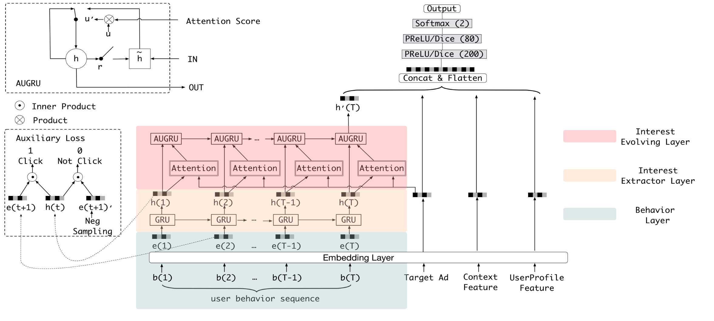

兴趣提取模块由两部分组成：Interest Extractor Layer从用户行为中提取兴趣序列；Interest Evolving Layer根据目标物品建模兴趣的进化。

### Interest Extractor Layer

作者认为历史行为不能表示兴趣，所以需要从行为中提取兴趣序列，Interest Extractor Layer使用GRU（Gated Recurrent Unit）从用户行为序列中提取一系列兴趣状态，其输入会按照时间排好序。

GRU，门控循环单元，循环神经网络RNN的一种改进结构，用于建模序列数据，能解决传统RNN在长序列中出现的梯度消失问题，且运算速度比LSTM更快。

GRU 的计算公式如下，有T个物品就会生成T个兴趣状态，每个兴趣状态都是从上一个兴趣状态与当前物品融合得到的：
$$
u_t = \sigma(W_u i_t + U_u h_{t-1} + b_u) \\
r_t = \sigma(W_r i_t + U_r h_{t-1} + b_r) \\
\tilde{h}_t = \tanh(W_h i_t + r_t \circ U_h h_{t-1} + b_h) \\
h_t = (1 - u_t) \circ h_{t-1} + u_t \circ \tilde{h}_t \\
$$
其中：

- $ \sigma $ 表示 sigmoid 激活函数
- $ i_t $ 表示 GRU 在时刻 $t $ 的输入，其中 $i_t = e_b[t] $，表示用户在第 $t $ 次的行为 embedding
- $\circ $ 表示逐元素乘
- $ W_u, W_r, W_h \in \mathbb{R}^{n_H \times n_I} $
- $ U_u, U_r, U_h \in \mathbb{R}^{n_H \times n_H} $
- $ n_H $ 为隐状态维度，$n_I $ 为输入维度

- $ h_t $ 表示第 $ t $ 个隐状态
- $u_t$ 更新门，控制保留多少旧状态，引入多少新信息
- $r_t$ 重置门，控制在计算候选状态时，是否忽略过去


作者认为仅捕捉行为依赖关系的隐藏状态 ${h}_t$ 无法有效表征用户兴趣。目标商品的点击行为由最终兴趣驱动，目标损失仅监督最终兴趣的预测真值，无法为历史时刻隐藏状态提供有效监督，考虑到每一时刻的用户兴趣会直接引导下一连续行为的产生，因此作者引入了辅助任务：利用下一时刻的行为，监督当前兴趣状态的学习。


模型将真实的下一行为作为正样本，同时从全商品集合中采样非点击商品作为负样本（排除正样本），计算
$$
L_{aux} = -\frac{1}{N} \left( \sum_{i=1}^{N} \sum_{t} \log \sigma(\mathbf{h}_t^i, \mathbf{e}_b^i[t+1]) + \log\left(1 - \sigma(\mathbf{h}_t^i, \hat{\mathbf{e}}_b^i[t+1])\right) \right)
$$

+ ${h}^i_t$为第 i 个用户在第 t 步的 GRU 隐藏状态
+ $e_b^i$是用户点击序列，$\hat{\mathbf{e}_b^i}$为负采样序列
+ $ \sigma(\mathbf{x}_1, \mathbf{x}_2) = \frac{1}{1 + \exp\left(-\left[\mathbf{x}_1, \mathbf{x}_2\right]\right)} $


点击率预测的最终损失函数为
$$
L = L_{target} + \alpha * L_{aux}
$$


拼接全部 T 个兴趣状态 $[\boldsymbol{h}_1,\boldsymbol{h}_2,\dots,\boldsymbol{h}_T]$，即可生成具备强表达能力的兴趣序列

### Interest Evolving Layer

受外部环境与内在认知的共同影响，用户各类兴趣会随时间不断演化。以服饰类兴趣为例，随着流行趋势与个人审美变化，用户的服饰偏好会持续迭代，而这一兴趣演化过程将直接决定服饰候选商品的点击率预测结果。

用户的兴趣存在两个关键特性：（1）兴趣漂移，用户的兴趣是多样的，某一阶段用户可能集中关注书籍类商品，后续又会产生服饰类消费需求；（2）不同兴趣间虽存在潜在关联，但各自拥有独立演化路径。


Interest Evolving Layer融合注意力机制的局部激活能力与门控循环单元的序列学习能力完成兴趣演化建模——在门控循环单元的每一步运算中引入局部激活，可强化相关兴趣的作用权重、削弱兴趣漂移带来的干扰。

具体表现为候选物品的向量与每一步兴趣状态计算attention激活对应的兴趣，attention score的得分在AUGRU中控制兴趣状态的转移，如果某一行为不相关，则不会更新，即$h_t=h_t-1$，最终得到的是一条和候选物品相符的路径。Din模型虽然能弱化不相关行为，但是做不到消除。

注意力权重的计算如下
$$
a_t = \frac{\exp(h_t W e_a)}{\sum_{j=1}^{T} \exp(h_j W e_a)}
$$

- $h_t$：Interest Extractor 输出
- $i'_t$：Interest Evolving 输入
- $W \in \mathbb{R}^{n_H \times n_A}$，$n_A$是目标物品的维度
- $e_a$ 目标物品的 embedding


作者提出了三种结合注意力机制与GRU的结构

首先是AIGRU，用注意力分数调控演化层的输入
$$
i'_t = h_t \cdot a_t
$$
式中，$\boldsymbol{h}_t$为兴趣抽取层 GRU 第t步隐藏状态，$\boldsymbol{i}'_t$ 为第二层演化 GRU 的输入.

该结构存在明显缺陷，即使输入置0，仍会改变GRU的隐藏状态（$h_t^`$），导致弱相关兴趣依旧干扰兴趣演化的学习过程。


随后是 AGRU，用注意力得分直接替换GRU的更新门
$$
h'_t = (1 - a_t), h'_{t-1} + a_t, \tilde{h}'_t
$$

AGRU 虽可通过注意力得分直接约束隐藏状态更新，但使用单一标量注意力得分替换向量形式的更新门，忽略了更新门不同维度间的重要性差异。


最后是AUGRU，用attention score对更新门加权
$$
\tilde{u}'_t = a_t \cdot u'_t \\
h'_t = (1 - \tilde{u}'_t) \circ h'_{t-1} + \tilde{u}'_t \circ \tilde{h}'_t
$$

- $u'_t$：GRU 原始 update gate

AUGRU 完整保留更新门的维度特征，并利用注意力得分对更新门全局维度进行缩放。


## 结果

在公开数据集上测试，其中，BaseModel使用与DIEN一致的embedding layer和MLR，但是对行为的建模只用了sum pooling。

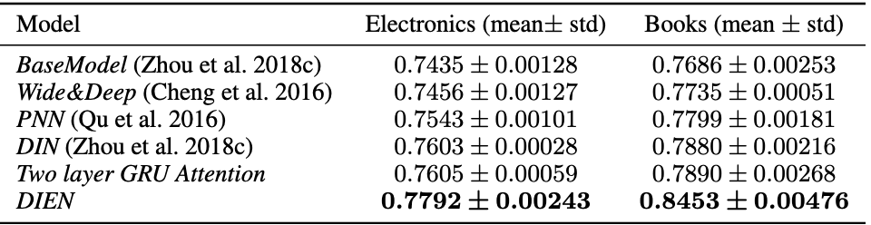


可以观察到，DIEN有不错的提升，且第二层的注意力门控循环单元选择AUGRU效果更优。


在真实数据集上进行A/B测试，该模型带来了巨大的提升

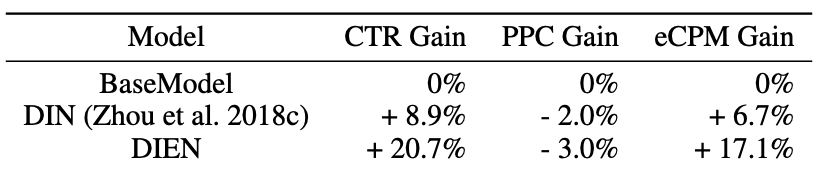


# DeepFM

特征交叉的CTR模型

## 动机

现有方法往往对低阶或高阶交互存在严重偏向，而非兼顾二者；特征交叉依赖专业的特征工程，而不能通过常理推断，甚至于只能通过机器学习挖掘出。

文章证明了可以构建一种端到端学习模型，该模型同时兼顾低阶与高阶特征交互，且除原始特征外无需任何特征工程。

## 模型结构

模型由两部分组成FM侧和Deep侧，二者共享底层Embedding.


FM侧如下


图的表达比较迷惑，可以认为就是普通的FM结构——$$y_{FM} = \langle w, x \rangle + \sum_{i=1}^d \sum_{j=i+1}^d \langle V_i, V_j \rangle x_i \cdot x_j$$


DeeP侧如下，

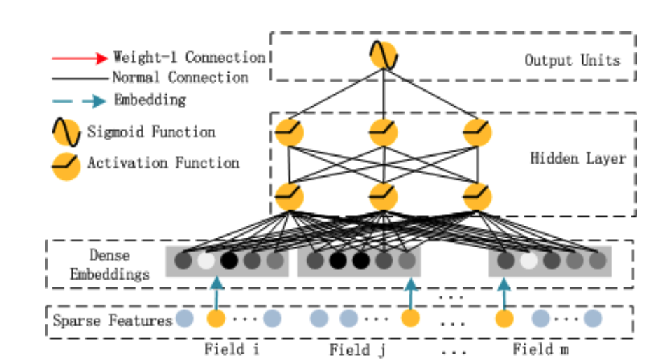

可以认为是MLP


最后两部分的结果相加—— $$\hat{y} = sigmoid(y_{FM} + y_{DNN})$$


## 结果


FM&DNN是wide&Deep中将wide替换为FM，但是没有共享底层Embedding，结果证明共享嵌入层对指标有所提升。

# AutoInt

提出了一种高效实用的算法——自动学习输入特征的高阶特征交互，显式地建模不同阶数的特征组合，通用性强，同时适用于数值型与类别型输入特征，可解释性强。

## 动机

推荐场景下，输入特征通常稀疏且高纬，精准的预测依赖于告诫特征组合，这类特征由人工构建耗时严重，且无法穷举。因此，研究者一直致力于为稀疏高维的原始特征及其有效组合构建低维表征。

FM在各类任务中被验证具备有效性，但是受限于多项式拟合的时间复杂度，该方法仅适用于低阶特征交互建模。

大量基于MLP的模型在学习乘法类特征交互时效率较低，这些模型隐式地学习特征交互，可解释性弱。

## 模型结构

本文基于多头自注意力机制提出了这样一种方法。该方法能够学习稀疏高维输入特征的有效低维表示，同时兼容类别型与数值型输入特征。具体而言，首先将类别型特征与数值型特征嵌入至低维空间，以此降低输入特征维度，并使不同类型的特征可通过向量运算（如求和、内积）实现交互。随后，本文设计一种全新的交互层，用以强化不同特征间的关联。在每一层交互层中，各特征能够与其余所有特征进行交互，并借助多头注意力机制 [36] 自动筛选关联特征，生成具有实际意义的高阶特征。此外，多头机制可将单个特征映射至多个子空间，从而在不同子空间中捕获多样化的特征交互模式。单层交互层仅能建模特征间的一阶关联，通过堆叠多层交互层，即可实现不同阶数特征交互的建模。实际应用中，本文为交互层引入残差连接 ，以融合多阶特征组合信息。

模型结构如下所示

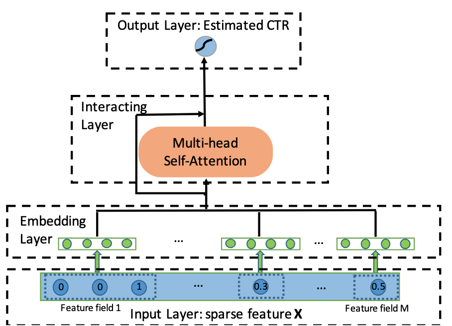

模型首先经过嵌入层，转换为统一维度的嵌入表示。

### 嵌入层

输入特征分为三类：单值类别特征，多值类别特征，数值特征。

单值类别特征就是简单的映射，多值类别特征映射后取平均，数值特征做$e_m=v_m\times_m$，其中$v_m$是一个可学习的向量。

最后嵌入层的输出为各个类别的拼接。

### 交互层

作者使用注意力机制捕捉具备有效意义的特征组合。

以第$m$个特征为例，定义注意力头$h$下，特征$m$与特征$k$的关联度： 
$$
\alpha_{m,k}^{(h)} &= \frac{\exp\left(\psi^{(h)}(\boldsymbol{e}_m,\boldsymbol{e}_k)\right)}{\sum_{l=1}^{M}\exp\left(\psi^{(h)}(\boldsymbol{e}_m,\boldsymbol{e}_l)\right)},\\ \psi^{(h)}(\boldsymbol{e}_m,\boldsymbol{e}_k) &= \left\langle \boldsymbol{W}_{\text{Query}}^{(h)}\boldsymbol{e}_m,\boldsymbol{W}_{\text{Key}}^{(h)}\boldsymbol{e}_k\right\rangle
$$
其中，$\psi^{(h)}(\cdot,\cdot)$为注意力函数，用于度量特征$m$与特征$k$的相似度，可采用神经网络或内积$\langle\cdot,\cdot\rangle$实现。文中选用内积运算，$\boldsymbol{W}_{\text{Query}}^{(h)}$、$\boldsymbol{W}_{\text{Key}}^{(h)} \in \mathbb{R}^{d'\times d}$为变换矩阵，用于将原始嵌入空间$\mathbb{R}^d$映射至新的特征空间$\mathbb{R}^{d'}$。

得到的注意力分数可用于解释特征之间的交互。

随后，结合注意力系数$\alpha_{m,k}^{(h)}$聚合所有相关特征，对子空间$h$中特征$m$的表征进行更新：
$$
\tilde{\boldsymbol{e}}_m^{(h)}=\sum_{k=1}^{M}\alpha_{m,k}^{(h)}\left(\boldsymbol{W}_{\text{Value}}^{(h)}\boldsymbol{e}_k\right) 
$$
其中$\boldsymbol{W}_{\text{Value}}^{(h)} \in \mathbb{R}^{d'\times d}$。 $\tilde{\boldsymbol{e}}_m^{(h)}$融合了当前注意力头$h$下特征$m$及其关联特征，代表模型学习得到的全新组合特征。单一特征可参与多种特征组合，多头机制可构建不同子空间，独立学习差异化的特征交互模式，以此实现多类型组合特征的挖掘。

整合所有子空间学习到的组合特征，公式如下： 
$$
\tilde{\boldsymbol{e}}_m = \tilde{\boldsymbol{e}}_m^{(1)} \oplus \tilde{\boldsymbol{e}}_m^{(2)} \oplus \dots \oplus \tilde{\boldsymbol{e}}_m^{(H)} \tag{7}
$$
 其中$\oplus$为拼接操作，$H$为注意力头总数。为保留已学习的组合特征（包括原始一阶独立特征），网络引入标准残差连接。定义如下：
$$
 \boldsymbol{e}_m^{\text{Res}} = \text{ReLU}\big(\tilde{\boldsymbol{e}}_m + \boldsymbol{W}_{\text{Res}}\boldsymbol{e}_m\big)  
$$
$e_m$是交叉层的输入，$\boldsymbol{W}_{\text{Res}} \in \mathbb{R}^{d'H\times d}$ 为维度匹配投影矩阵。 通过该交互层，每个特征$\boldsymbol{e}_m$会被更新为高阶特征表征$\boldsymbol{e}_m^{\text{Res}}$。堆叠多层交互层，将上一层输出作为下一层输入，即可实现任意阶数组合特征的建模。

### 输出层

交互层的输出为一组特征向量 $\{\boldsymbol{e}_m^{\text{Res}}\}_{m=1}^M$，m是层数，将所有特征向量拼接后进行非线性映射： $$ \hat y = \sigma\Big(\boldsymbol{w}^\text{T}\big(\boldsymbol{e}_1^{\text{Res}} \oplus \boldsymbol{e}_2^{\text{Res}} \oplus \dots \oplus \boldsymbol{e}_M^{\text{Res}}\big) + b\Big) \tag{9} $$ 其中，$\boldsymbol{w} \in \mathbb{R}^{d'HM}$ 为投影列向量，$\sigma(x)$ 为sigmoid，输出得到最终的预测点击率。

## 结果

在四个真实数据集中，AutoInt 于三个数据集上取得最优性能。在 Avazu 数据集上，CIN 的 AUC 指标略高，但本文的模型对数损失更低。


与竞争力最强的基线模型 CIN 相比，本文的模型参数量更少，在线推理阶段的运行效率更高。


去除残差连接后，模型在所有数据集上的性能均出现下降

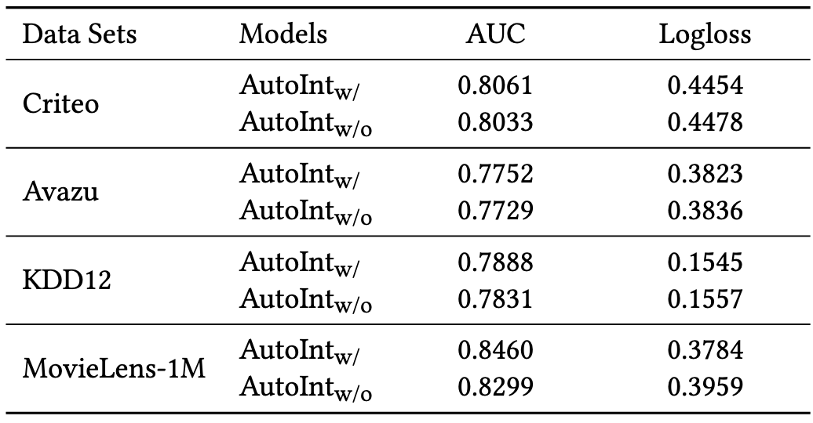

随着交互层数继续增加，模型可捕获更高阶的特征组合，性能持续优化；当层数达到三层后，性能趋于稳定，表明过度高阶的特征组合对预测增益有限。

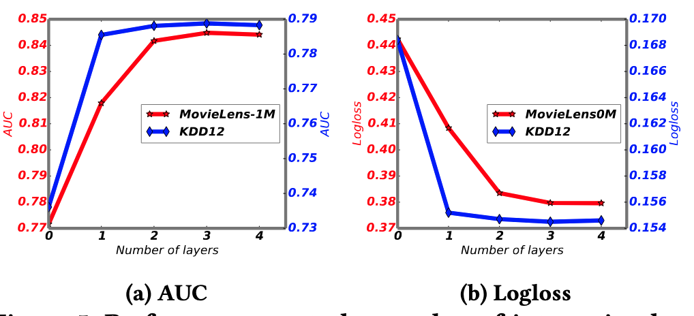

文中将两层前馈神经网络与原模型并行训练，输出融合，探索隐式特征对模型性能的提升，经过对比（其他模型也同时联合训练），证明引入隐式特征交互能够增强模型预测能力。但从后两列数据可以看出，相比其他模型，本文模型的性能提升幅度较小，这也说明原生 AutoInt 模型本身已具备极强的特征建模能力。


# What is GR


作者指出LLM的生成能力有潜力将推荐系统**范式**从`多阶段`转变为`单阶段`，**让LLM本身成为完整的、单一的推荐流程，直接生成推荐物品，而不需要对每个候选物品逐一计算排序分数**

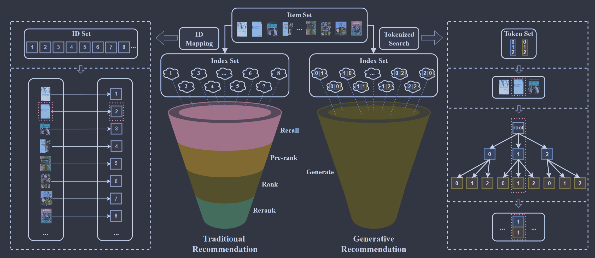


## 为什么需要生成式推荐


1. 对于传统的判别式推荐系统，由于物料太大，对物料计算排序分数的计算量会很大，因此工业界设计了**多阶段**来缩减候选物品。这种多阶段推荐架构导致了`学术研究与工业实际应用之间存在差距`，因为学术研究通常优化的是“完整推荐模型的效果”，但工业系统真正使用时，模型只能处于多阶段流程中的某一部分，受到前面阶段的限制。虽然近年来推荐模型越来越复杂、越来越先进，但真正被工业系统实际采用的模型却很少。
2. LLM推荐的过程中**，隐式地枚举了所有的物料**，而DLRM只能从前一步过滤后的候选集和选取
3. **LLM用有限数量的token表示几乎无限数量的物品**
4. 通过**beam search**可以直接从整个物品空间生成推荐结果，而在**计算**上仍然可行
5. 预训练好的模型有助于解决**冷启动**(非序列推荐)


## ID构建

使用LLM实现生成式推荐时，输入内容需要被转换为适合的LLM格式。

**因为LLM天生理解自然语言**，所以最初人们使用物品和用户的`元数据`作为ID，例如，一部电影表示为"The Lord of the Rings"，用户表示为

```python
age: 25
country: Singapore
favorite genre: science fiction
watched movies:
  Interstellar
  Inception
```

然而

+ **ID过长**，生成过程中会产生较高的计算成本，同时在数据库中匹配也会非常困难
+ **自然语言存在模糊性**，很多情况下，**两个完全无关的物品可能具有相同的名称**；另外，**两个高度相关的物品也可能拥有不同的标题**


传统DLRM中ID与**embedding**关联，这种做法会消耗**大量存储**；最重要的是这些ID是**随机**的，把这些ID输入给LLM，LLM是无法利用给item之间的相似性和语义信息的。


因此GR中使用一种新的ID表示方法——**使用token序列表示ID，相似的用户或物品可以在ID序列中共享更多的token，尽可能将user-user协同信息，item-item协同信息，user-item协同信息编码到ID中**。常用的ID构建方法有：奇异值分解（Singular Value Decomposition），协同索引（Collaborative Indexing），RQVAE

## GR的任务种类

1. **Rating Prediction**，构造提示词"how would user_1234 rate item_5678"，让大模型**打分**。该方法实用性较低，因为用户很少为交互过的物品留下显示的评分
2. **Top-N 推荐**，对于给定用户 $u$，选择 N 个物品作为推荐结果，由于LLM存在上下文限制，所以不可能将所有物品输入模型。目前社区探索了两种方法来解决这个问题
   1. **直接推荐**，只使用包含用户信息的 prompt，要求LLM为该用户生成推荐结果
   2. **选择性推荐**，同时提供用户信息和候选物品，要求LLM从候选集合中选择结果，但这种方法属于判别式
3. **序列推荐**，通过用户交互过的物品要求LLM推荐下一个可能点击的物品
4. **对话式推荐**，通过多轮对话向用户推荐物品，尚未形成统一的标准

## LLM缺陷

GR推荐会受到LLM的影响，首先LLM会产生**幻觉**，即推荐不存在的物品，可以通过检索增强和前缀树来缓解幻觉；其次，使用人类真实的行为数据训练而来LLM本身存在**偏差**，这些数据中的偏差会被LLM学习，并且LLM可能会**加强**这种偏差，虽然有时这种偏差可以被视为个性化，但是二者的边界仍然模糊；
